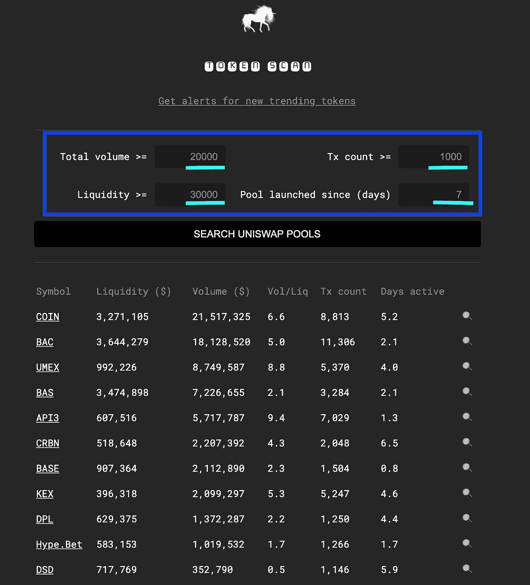

# 如何扫描 Uniswap 添加的最新对？

> 原文：<https://medium.com/coinmonks/how-to-scan-the-latest-pairs-added-to-uniswap-31c4400cc2a6?source=collection_archive---------2----------------------->

[https://uniswap.org/](https://uniswap.org/)

[**NEW July->Telegram bot**](https://t.me/UniswapNewPools)for:过去 15 分钟内创建的池&$成交量>$ 3000&$流动性>$ 10000&Nb 交易> 30

**更新 2021:增加 SUSHISWAP & PANCAKESWAP 到模板表**

# 什么是 Uniswap？

U[**NIS WAP**](https://academy.binance.com/en/articles/what-is-uniswap-and-how-does-it-work)**是建立在[以太坊](https://academy.binance.com/en/articles/what-is-ethereum)之上的去中心化交换协议。更准确地说，这是一个自动流动性协议。没有[指令书](https://academy.binance.com/en/glossary/order-book)或任何需要进行交易的集中方。Uniswap 允许用户在没有中介的情况下进行交易，具有高度的去中心化和对审查的抵抗力。**

**[**交易者**](https://academy.binance.com/en/articles/what-is-uniswap-and-how-does-it-work) 可以在 Uniswap 上兑换以太币代币(ERC20)，而不必将资金托付给任何人。与此同时，任何人都可以将其密码借给被称为流动性池的特殊储备。作为向这些资金池提供资金的交换，他们赚取费用。**

**Uniswap 的分散式交换看起来是这样的:**

********

**[https://app.uniswap.org/#/swap](https://app.uniswap.org/#/swap)**

**一些 [CryptoTools 数据分析](https://medium.com/the-cryptocurious)用户一直有兴趣找到一种方法，让**最新的代币在 Uniswap 上交易，很可能是作为一种交易分析工具**。**

**因此，我创建了一个谷歌表单模板，帮助你过滤新的可交易硬币。**

> **[在此访问实时模板表](https://docs.google.com/spreadsheets/d/1jKEhOi9gIcM9bKdn7rgJEK0RKpzbE1k6bPy_kJW75Aw/edit?usp=sharing)**

****该表返回 Uniswap 上所有新的可交易对，给出对该对活跃的天数、交易量($)、流动性($)和交易数量的限制。****

****

**[https://thegraph.com/explorer/subgraph/uniswap/uniswap-v2](https://thegraph.com/explorer/subgraph/uniswap/uniswap-v2)**

**为了获得 Uniswap 的分析，我使用了 [**图**](https://thegraph.com/) ，这是一个用于查询以太坊和 IPFS 等网络的索引协议。任何人都可以使用、构建和发布开放的 API，称为子图，使数据易于访问。**

****

**[https://info.uniswap.org/home](https://info.uniswap.org/home)**

**[**GOOGLE SHEETS 中的 UNISWAP 函数**](https://docs.google.com/spreadsheets/d/1jKEhOi9gIcM9bKdn7rgJEK0RKpzbE1k6bPy_kJW75Aw/edit?usp=sharing) **:**
返回 Uniswap 上新的可交易对，对币活跃天数、成交量($)、流动性($)和交易次数进行约束。**

****

**In Google Sheets =UNISWAP(7, 20'000, 30'000, 1'000)**

**例如，如果我想获得新的 Uniswap 对，其中:**

*   **该池是在过去 7 天内启动的**
*   **每日交易量超过 20，000 美元**
*   **流动性超过 30，000 美元**
*   **自推出以来，已经有超过 1000 笔交易**

****公式变为:
=UNISWAP(7，20000，30000，1000)**

[@ param](http://twitter.com/param){ Days }该对处于活动状态的天数
[@param](http://twitter.com/param) {volume}最小量($)
[@ param](http://twitter.com/param){ Liquidity }最小流动性($)
[@param](http://twitter.com/param) uni swap 上所有新的可交易对及其自活跃以来的天数、成交量($)、流动性($)、交易数量，与下面的[令牌扫描](https://tokenscan.xyz/)视图完全一样:**

****

**[https://tokenscan.xyz/](https://tokenscan.xyz/)**

# **扫描的指标更多？**

**通过 **TheGraph API 可以添加更多的功能。**不要犹豫，看看所有可用的端点，例如:**

****

**[https://thegraph.com/explorer/subgraph/uniswap/uniswap-v2](https://thegraph.com/explorer/subgraph/uniswap/uniswap-v2)**

*   ****总供给****
*   ****未跟踪卷 D****
*   ****liquidityProviderCount****

**如果你有兴趣在整合更多个性化指标方面获得一些帮助， [DM me](https://t.me/TheCryptoCurious) 。**

# **结论**

**使用[**Google Sheets**](https://docs.google.com/spreadsheets/d/1jKEhOi9gIcM9bKdn7rgJEK0RKpzbE1k6bPy_kJW75Aw/edit?usp=sharing)**在 Uniswap 上获取最新货币对的简单方法，可用于数据分析，并作为筛选新市场参与者的交易工具。****

****这是正在进行的工作。如果你发现错误，请不要犹豫让我知道。非常欢迎反馈。一个 [*电报聊天*](https://t.me/TheCryptoCurious) *也可供支持。如果这个项目为你增加了任何价值，或者正在你的谷歌表单上寻找个性化编码，请不要犹豫，留下你的信息。*****

****非常感谢您花时间阅读本文。****

****在这个充满挑战的时代，照顾好你自己和你的家人！****

> ****加入 Coinmonks [电报频道](https://t.me/coincodecap)和 [Youtube 频道](https://www.youtube.com/c/coinmonks/videos)获取每日[加密新闻](http://coincodecap.com/)****

## ****另外，阅读****

*   ****[复制交易](/coinmonks/top-10-crypto-copy-trading-platforms-for-beginners-d0c37c7d698c) | [加密税务软件](/coinmonks/crypto-tax-software-ed4b4810e338)****
*   ****[网格交易](https://coincodecap.com/grid-trading) | [加密硬件钱包](/coinmonks/the-best-cryptocurrency-hardware-wallets-of-2020-e28b1c124069)****
*   ****[密码电报信号](/coinmonks/top-3-telegram-channels-for-crypto-traders-in-2021-8385f4411ff4) | [密码交易机器人](/coinmonks/crypto-trading-bot-c2ffce8acb2a)****
*   ****[购买比特币印度](/coinmonks/buy-bitcoin-in-india-feb50ddfef94) | [Pionex 评论](/coinmonks/pionex-review-exchange-with-crypto-trading-bot-1e459d0191ea) | [加密交易机器人](/coinmonks/crypto-trading-bot-c2ffce8acb2a)****
*   ****[印度的加密交易所](/coinmonks/bitcoin-exchange-in-india-7f1fe79715c9) | [比特币储蓄账户](/coinmonks/bitcoin-savings-account-e65b13f92451)****
*   ****[Cloudbet 赌场评论](https://coincodecap.com/cloudbet-casino-review) | [点火赌场评论](https://coincodecap.com/ignition-casino-review)****
*   ****[币安费](/coinmonks/binance-fees-8588ec17965) | [Botcrypto 评论](/coinmonks/botcrypto-review-2021-build-your-own-trading-bot-coincodecap-6b8332d736c7) | [Hotbit 评论](/coinmonks/hotbit-review-cd5bec41dafb)****
*   ****[my constant Review](https://coincodecap.com/myconstant-review)|[8 款最佳摇摆交易机器人](https://coincodecap.com/best-swing-trading-bots)****
*   ****[最佳加密交易所](/coinmonks/crypto-exchange-dd2f9d6f3769) | [印度最佳加密交易所](/coinmonks/bitcoin-exchange-in-india-7f1fe79715c9)****
*   ****[开发人员的最佳加密 API](/coinmonks/best-crypto-apis-for-developers-5efe3a597a9f)****
*   ****最佳[密码借贷平台](/coinmonks/top-5-crypto-lending-platforms-in-2020-that-you-need-to-know-a1b675cec3fa)****
*   ****杠杆代币的终极指南****