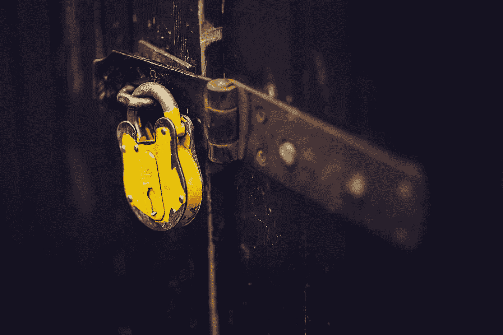

# 如何保护您的智能合同

> 原文：<https://medium.com/coinmonks/how-to-secure-your-smart-contracts-dc500f2c8fca?source=collection_archive---------2----------------------->

## 可重入性和所有者盗窃攻击

Photo by [chris panas](https://unsplash.com/@chrispanas?utm_source=unsplash&utm_medium=referral&utm_content=creditCopyText) on [Unsplash](https://unsplash.com/s/photos/security?utm_source=unsplash&utm_medium=referral&utm_content=creditCopyText)

*先决条件:对以太坊区块链和智能合约有基本的了解。*

# 介绍

隧道视野，每个开发人员都经历过的陷阱。在为特定目的开发新代码时，我们很容易过于专注于解决某个特定的问题，而忽略了…