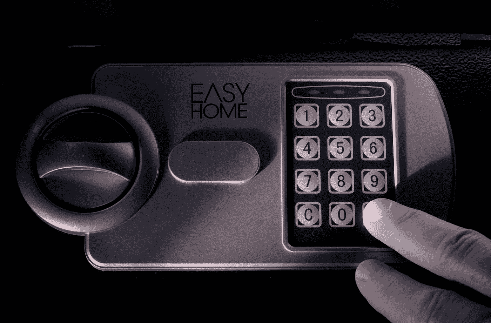
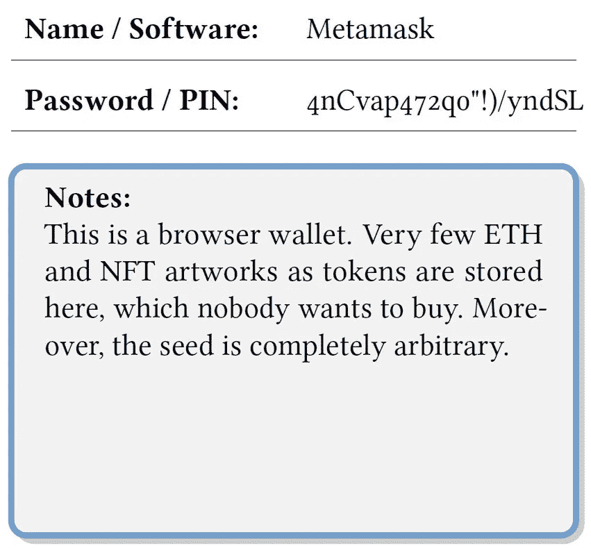
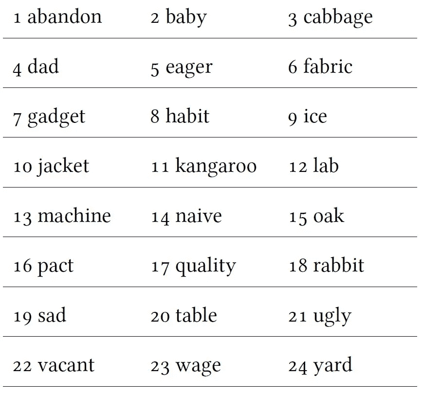

# 如何安全地备份您的比特币和替代币软件钱包

> 原文：<https://medium.com/coinmonks/how-to-securely-backup-your-software-wallet-for-bitcoin-and-altcoins-4944aa911b79?source=collection_archive---------9----------------------->

## “不是你的钥匙，不是你的比特币”——每一个真正的比特币持有者

Photo by [Immo Wegmann](https://unsplash.com/@macroman?utm_source=medium&utm_medium=referral) on [Unsplash](https://unsplash.com?utm_source=medium&utm_medium=referral)

把你的硬币留在交易所里意味着你无法得到私人钥匙，因此，你不是硬币的“真正”主人。交易所是你的钱币经理。这很像你的银行账户里有你的钱。假设极端的情况，你永远不知道他们是否能在你希望偿还的时候还你钱。

因此，正如一句名言所说，你应该“做自己的银行”。

因此，我们可以在软件和硬件钱包之间进行选择。硬件钱包是最受推荐的，然而与投资比特币和替代币相比，它们可能相当昂贵。

## 软件钱包

如果您信任自己的设备(例如，PC 或笔记本电脑，也许是手机),并且觉得使用它很安全，那么您应该考虑使用软件钱包。

每个著名的软件钱包都提供备份功能，如果需要的话，可以恢复你的私人密钥。万一您因为设备损坏、丢失甚至被盗而无法访问您的手机或 PC，这是最重要的。

这种备份通常由 12 到 24 个特定顺序的单词组成。这种备份最常见的术语是“备份阶段”、“恢复阶段”、“种子阶段”或简称为“种子”。所有这些都是在另一台电脑或新手机上恢复钱包的可能性的同义词，从而重新获得硬币。

一旦您调用了软件钱包中的备份功能，您将看到单词的正确顺序。不要截图，也不要以任何其他方式将文字电子保存，而是拿出一张准备好的纸，用手写下所有的文字。之后，确认您已经在钱包软件中保存了种子。

**重要提示:**一旦您在设备上输入了用于恢复目的的种子，您应该将存储在钱包中的硬币与未使用的种子一起发送到由您控制的新地址。这是唯一可以确保在您输入种子时没有人记录您的种子的方法。

## 通过以下关键步骤提高存储安全性:

*   写下这些话时，确保附近没有打开的手机或笔记本相机。
*   用铅笔写下单词，这样文件会比用圆珠笔或墨水更耐用。
*   将钱包密码和种子分别放在两张不同的纸上。
*   通过层压钞票来防水，您可以获得进一步的安全性。
*   为你的备份笔记找一个安全的“藏身之处”。

> *如果你懒得准备床单，请看看这本小册子* [*。*](https://www.amazon.com/dp/B08SFZD41M)

图片显示了一个详细记录的密码和备份短语示例，应按照前面提到的步骤创建:

The first sheet of paper

The second sheet of paper

## 适合你的硬币的软件钱包

下面你会发现一些关于软件钱包的建议，它们与 BIP39 种子短语兼容。有一些硬币，可能需要一个单独的钱包，由于他们自己的区块链技术。因此，你很可能需要保留几个这样的种子。

当然，钱包清单并不自称完整。由于加密技术的发展从来没有停止过，你最好自己找出哪种钱包最适合你的硬币或代币。然而，真正好的钱包项目有望保持更长的时间。这些钱包分别是:

*   **比特币:**银金矿、出埃及记、原子钱包、比特币基地钱包
*   **以太坊(-基础代币):** MyEtherWallet (MEW)、Exodus、Metamask、原子钱包、比特币基地钱包
*   **Polkadot:** Polkawallet，原子钱包
*   代达罗斯，出埃及记
*   **Iota:** 三一钱包

你可能已经注意到一些软件钱包被多次提到。这些是所谓的“多硬币钱包”，即它们可以同时访问许多不同的硬币。这将为您节省大量的管理工作，而安全性只会稍有损失。

**但要谨慎:**只在原提供商的原网站下载钱包软件！特别推荐开源项目，因为社区增强可以避免后门。因此，如果可能的话，您应该在已安装的钱包软件或原始网站上执行更新，但绝不要从其他网站进行更新！

## BIP-39 单词表

如果你不能完全辨认你的笔迹，BIP-39 单词表可以帮助你找出你纸上的潦草字迹。然而，字迹清楚是很重要的。难以辨认的笔迹不是安全特征！

> 加入 coin monks[Telegram group](https://t.me/joinchat/EPmjKpNYwRMsBI4p)学习加密交易和投资

## 另外，阅读

*   [什么是融资融券交易](https://blog.coincodecap.com/margin-trading)
*   最好的[密码交易机器人](/coinmonks/crypto-trading-bot-c2ffce8acb2a) | [网格交易](https://blog.coincodecap.com/grid-trading)
*   [3 商业评论](/coinmonks/3commas-review-an-excellent-crypto-trading-bot-2020-1313a58bec92) | [Pionex 评论](/coinmonks/pionex-review-exchange-with-crypto-trading-bot-1e459d0191ea) | [Coinrule 评论](/coinmonks/coinrule-review-2021-a-beginner-friendly-crypto-trading-bot-daf0504848ba)
*   [AAX 交易所评论](/coinmonks/aax-exchange-review-2021-67c5ea09330c) | [德里比特评论](/coinmonks/deribit-review-options-fees-apis-and-testnet-2ca16c4bbdb2) | [FTX 交易所评论](/coinmonks/ftx-crypto-exchange-review-53664ac1198f)
*   [n 平均零点评审](/coinmonks/ngrave-zero-review-c465cf8307fc) | [Phemex 评审](/coinmonks/phemex-review-4cfba0b49e28) | [PrimeXBT 评审](/coinmonks/primexbt-review-88e0815be858)
*   [by bit Exchange Review](/coinmonks/bybit-exchange-review-dbd570019b71)|[bit yard Review](/coinmonks/bityard-review-7d104239be35)|[coin spot Review](https://blog.coincodecap.com/coinspot-review)
*   [3 commas vs crypto hopper](/coinmonks/3commas-vs-pionex-vs-cryptohopper-best-crypto-bot-6a98d2baa203)|[赚取秘密利息](/coinmonks/earn-crypto-interest-b10b810fdda3)
*   最好的比特币[硬件钱包](/coinmonks/the-best-cryptocurrency-hardware-wallets-of-2020-e28b1c124069?source=friends_link&sk=324dd9ff8556ab578d71e7ad7658ad7c) | [BitBox02 回顾](/coinmonks/bitbox02-review-your-swiss-bitcoin-hardware-wallet-c36c88fff29)
*   [莱杰 vs n rave](/coinmonks/ledger-vs-ngrave-zero-7e40f0c1d694)|[莱杰 nano s vs x](/coinmonks/ledger-nano-s-vs-x-battery-hardware-price-storage-59a6663fe3b0)
*   [密码本交易平台](/coinmonks/top-10-crypto-copy-trading-platforms-for-beginners-d0c37c7d698c)
*   [CoinLoan 评论](/coinmonks/coinloan-review-18128b9badc4) | [YouHodler 评论](/coinmonks/youhodler-4-easy-ways-to-make-money-98969b9689f2) | [BlockFi 评论](/coinmonks/blockfi-review-53096053c097)
*   最好的[加密税务软件](/coinmonks/best-crypto-tax-tool-for-my-money-72d4b430816b) | [硬币追踪评论](/coinmonks/cointracking-review-a-reliable-cryptocurrency-tax-software-5114e3eb5737)
*   最佳[加密借贷平台](/coinmonks/top-5-crypto-lending-platforms-in-2020-that-you-need-to-know-a1b675cec3fa) | [杠杆令牌](/coinmonks/leveraged-token-3f5257808b22)
*   [BlockFi vs 摄氏](/coinmonks/blockfi-vs-celsius-vs-hodlnaut-8a1cc8c26630) | [Hodlnaut 回顾](/coinmonks/hodlnaut-review-best-way-to-hodl-is-to-earn-interest-on-your-bitcoin-6658a8c19edf)
*   [Bitsgap 审查](/coinmonks/bitsgap-review-a-crypto-trading-bot-that-makes-easy-money-a5d88a336df2) | [Quadency 审查](/coinmonks/quadency-review-a-crypto-trading-automation-platform-3068eaa374e1) | [Bitbns 审查](/coinmonks/bitbns-review-38256a07e161)
*   [埃利帕尔泰坦评论](/coinmonks/ellipal-titan-review-85e9071dd029) | [赛克斯斯通评论](/coinmonks/secux-stone-hardware-wallet-review-15-discount-coupon-2020-7577032faa6e)
*   [本地比特币评论](/coinmonks/localbitcoins-review-6cc001c6ed56) | [加密货币储蓄账户](https://blog.coincodecap.com/cryptocurrency-savings-accounts)
*   最佳[区块链分析](https://bitquery.io/blog/best-blockchain-analysis-tools-and-software)工具| [赚比特币](/coinmonks/earn-bitcoin-6e8bd3c592d9)
*   [加密套利](/coinmonks/crypto-arbitrage-guide-how-to-make-money-as-a-beginner-62bfe5c868f6)指南| [如何做空比特币](/coinmonks/how-to-short-bitcoin-568a2d0b4ae5)
*   最佳[加密制图工具](/coinmonks/what-are-the-best-charting-platforms-for-cryptocurrency-trading-85aade584d80) | [最佳加密交易所](/coinmonks/crypto-exchange-dd2f9d6f3769)
*   [如何在印度购买比特币？](/coinmonks/buy-bitcoin-in-india-feb50ddfef94) | [瓦济克斯审查](/coinmonks/wazirx-review-5c811b074f5b)
*   [印度比特币交易所](/coinmonks/bitcoin-exchange-in-india-7f1fe79715c9) | [比特币储蓄账户](/coinmonks/bitcoin-savings-account-e65b13f92451)
*   [CoinDCX 评论](/coinmonks/coindcx-review-8444db3621a2) | [加密保证金交易交易所](https://blog.coincodecap.com/crypto-margin-trading-exchanges)

> [在您的收件箱中直接获得最佳软件交易](/coinmonks/newsletters/coinmonks)

