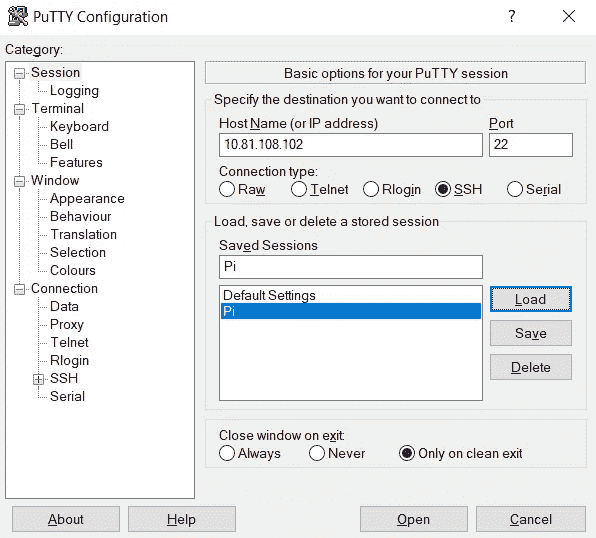

# 如何设置比特币全节点(2/4)

> 原文：<https://medium.com/coinmonks/how-to-set-up-a-bitcoin-full-node-3-4-52d108e48822?source=collection_archive---------2----------------------->


My Huobi Australia “branded” Bitcoin Full Node

# 硬件和软件要求

> ***硬件***

*   树莓派 2/3
*   微型 SD 卡:8 GB 或更多，包括一个普通电脑的适配器
*   USB 电源适配器:5V/1.2v+微型 USB 电缆
*   外置硬盘:500 GB 或更大
*   对窗口的访问
*   未计量的稳定网络连接

> ***软件(需要下载以下项目)***

*   Ubuntu Mate 16.04.2 LTS，从 [*这里*](https://ubuntu-mate.org/download/) *下载。*
*   Win32 磁盘成像仪，从 [*这里*](https://sourceforge.net/projects/win32diskimager/) *下载。*
*   油灰，从[T21 这里下载](https://www.putty.org/)。

**树莓 Pi 初始设置**

***准备 Pi 系统***

*   插入您的微型 SD 卡并启动 Win32 磁盘成像仪。
*   从文件中提取 Ubuntu Mate。
*   选择您提取的 Ubuntu Mate IMG 文件，并将设备更改为您的 micro SD 卡的驱动器号。
*   单击写入开始该过程，写入映像大约需要 7-10 分钟。
*   在 windows 中安全弹出设备，将其插入 Raspberry Pi 3 并开机。

***开机 Pi***

*   开机后，选择英语作为语言，然后单击继续。
*   选择连接到此网络，选择您想要连接的 wifi 连接并输入密码，单击连接。
*   在地图上选择适当的位置来设置时区和系统区域设置，然后单击继续。
*   选择适当的键盘布局，然后点按“继续”。
*   输入适当的名称、用户名和电脑名称，然后输入密码，选择“自动登录”并点按“继续”。
*   安装程序现在将开始配置系统。
*   配置完成后，系统将自动启动。

> ***接入 Pi 端子***

1.  您需要在启动时启用 SSH 访问

通过选择屏幕左上角的应用程序，在应用程序选项卡中选择系统工具，访问您的 Mate 终端。


要启用 SSH，

```
sudo systemctl enable ssh
```

2.打开窗户上的油灰


3.通过内部 ip 地址(如 192.168.0.2)远程连接到您的 Pi。在主机名(或 IP 地址)处输入您的内部 IP 地址

在本例中，我的内部 IP 地址是 10.81.108.102



4.在终端中输入您的用户名和密码，现在您已经通过 putty 成功连接到您的 Pi。

出于安全原因，我隐藏了我的用户名。


# 安装比特币核心

在您的 Putty 终端上，键入以下行以将比特币个人包存档(PPA)添加到您的系统中:

```
sudo apt-add-repository ppa:bitcoin/bitcoin
```

系统将提示您输入用户密码。提供它以继续。之后，将显示以下文本:

```
Stable Channel of bitcoin-qt and bitcoind for Ubuntu, and their
dependencies

Note that you should prefer to use the official binaries, where possible, to
limit trust in Launchpad/the PPA owner.

No longer supports precise, due to its ancient gcc and Boost versions.
More info: https://launchpad.net/~bitcoin/+archive/ubuntu/bitcoin
Press [ENTER] to continue or ctrl-c to cancel adding it
```

按回车键继续。将显示以下文本(有一些变化),您将返回到命令行提示符:

```
gpg: keyring `/tmp/tmpixuqu73x/secring.gpg' created
gpg: keyring `/tmp/tmpixuqu73x/pubring.gpg' created
gpg: requesting key 8842CE5E from hkp server keyserver.ubuntu.com
gpg: /tmp/tmpixuqu73x/trustdb.gpg: trustdb created
gpg: key 8842CE5E: public key "Launchpad PPA for Bitcoin" imported
gpg: no ultimately trusted keys found
gpg: Total number processed: 1
gpg:               imported: 1  (RSA: 1)
OK
```

键入以下行以获取最新的软件包列表:

```
sudo apt-get update
```

当下载不同的更新文件时，将会显示大量的行。在慢速互联网连接上，此步骤可能需要几分钟。

要安装 GUI 和守护程序，请键入下面一行并阅读 [GUI 指令](https://bitcoin.org/en/full-node#ubuntu-gui)和[守护程序指令](https://bitcoin.org/en/full-node#ubuntu-daemon)。请注意，您不能使用同一个配置目录同时运行 GUI 和守护程序。

```
sudo apt-get install bitcoin-qt bitcoind
```

您现在已经成功安装了比特币核心。

# 在您的 Windows 上与比特币网络同步

比特币区块链消耗大约 200GB 的空间，从头同步完整的区块链非常消耗资源，树莓 Pi 可能需要很长时间来处理数据。

我决定用我的 windows 电脑按照这里的[步骤](https://bitcoin.org/en/full-node#windows-instructions)从头开始同步比特币区块链。

该过程可能需要 12-24 小时，甚至更长时间，这取决于您的网络连接和硬件。


大约 12 个小时后，我的比特币核心完成了与比特币网络的同步。

我需要找到要传输到外部硬盘的块数据目录。

默认目录是存储比特币数据文件的位置，包括钱包数据文件。为了访问目录:

转到开始->运行(或按 WinKey+R ),运行这个:

```
%APPDATA%\Bitcoin
```


将比特币下名为的文件夹复制到你的外置硬盘。

# 设置您的比特币完整节点

将外部硬盘连接到您的 Pi。

```
nano ~/.bitcoin/bitcoin.conf
```

会弹出比特币配置文件。您需要将以下数据写入文件。

```
server=1
rpcuser=UNIQUE_RPC_USER_NAME
rpcpassword=UNIQUE_RPC_PASSWORD
rpcport=8332
txindex=1
daemon=1
datadir= /media/<Your_User_Name_here>/lightning/Bitcoin
```

Ctrl+O 和 enter，Ctrl+X 退出文件编辑器。

以防你需要知道你的外部硬盘的目录在哪里。


我的外置硬盘叫闪电，双击图标。


# 将您的路由器配置为允许端口 8333

*   登录到您的路由器，端口转发部分通常在 NAT 部分下面。
*   在服务器 IP 地址字段中输入您的 Pi 内部 IP 地址。
*   在外部端口 start 和内部端口 Start 上键入 8333，并选择 TCP/UDP 作为协议。
*   单击应用/保存


# 启动你的比特币满节点

```
bitcoind -daemon
```

如果您决定要在 testnet 上运行比特币全节点，请运行

```
bitcoind -daemon testnet
```

它将打印一条消息，说明比特币服务器正在启动。

你可以在几分钟内与比特币核心互动，

```
bitcoin-cli getblockchaininfo
```

终端将打印出以下内容，如果块和头中显示的数字相等，这意味着您与比特币网络完全同步。


# 验证您的比特币节点是否可以访问

你可以使用 EARN.COM 开发的便捷工具。

[](https://bitnodes.earn.com/) [## 全球比特币节点分布

### Bitnodes 目前正在开发中，通过查找所有可到达的节点来估计比特币网络的规模…

bitnodes.earn.com](https://bitnodes.earn.com/) 

该网站提供了全球比特币节点分布的概况。

您可以确认您的比特币客户端当前是否正在接受来自另一个节点的传入连接。


Green means your Bitcoin Node can be reached

您还可以点击，进一步探索您的比特币节点

```
122.110.177.40:8333 /Satoshi:0.17.0.1/
```

这将带您进入如下所示的屏幕。它为您提供了关于您的比特币节点的详细概述；包括正常运行时间、等待时间、网络速度、位置等。


您可以通过查看比特币区块链顶部的闪电网络来进一步探索比特币网络。我也写过一篇[闪电网入门(3/4)](/@minionDownUnder/introduction-to-lightning-network-3-4-f92bf2d0ffde) 的文章。

> 参考资料:

[](http://www.hospitableit.com/howto/installing-ubuntu-mate-16-04-2-lts-on-a-raspberry-pi-3/) [## 在树莓 Pi 3 上安装 Ubuntu MATE 16.04.2 LTS

### 我参与过各种项目，在这些项目中，Raspberry Pi 是托管各种服务的完美硬件平台…

www.hospitableit.com](http://www.hospitableit.com/howto/installing-ubuntu-mate-16-04-2-lts-on-a-raspberry-pi-3/) [](https://fossbytes.com/install-ubuntu-mate-on-raspberry-pi-2-3/) [## 如何在树莓 Pi 2 和 3 上安装 Ubuntu Mate？

### 短字节:Ubuntu MATE 是一款优秀的电脑操作系统，尤其是那些硬件有限的电脑…

fossbytes.com](https://fossbytes.com/install-ubuntu-mate-on-raspberry-pi-2-3/) 

> [在您的收件箱中直接获得最佳软件交易](https://coincodecap.com/?utm_source=coinmonks)

[](https://coincodecap.com/?utm_source=coinmonks)