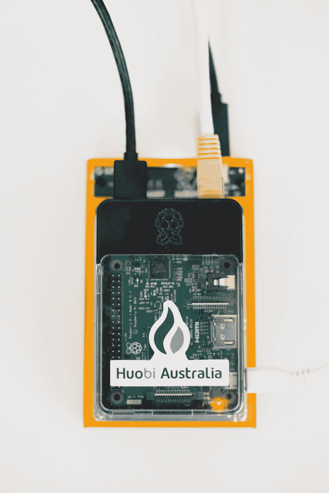
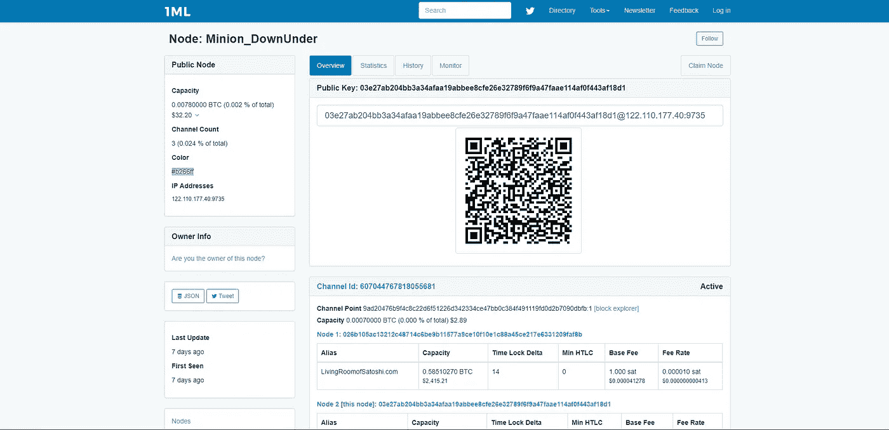

# 如何设置一个闪电节点，连接到一个对等点并打开一个通道(4/4)

> 原文：<https://medium.com/coinmonks/how-to-set-up-a-lightning-node-connect-to-a-node-and-open-a-channel-4-4-efd627d7ff32?source=collection_archive---------1----------------------->

> **在您决定运行自己的 Lightning Node 之前，请注意，当前的 Lightning 网络还处于试验阶段，可能会包含导致资金损失的严重缺陷。**

本文将介绍使用 Raspberry Pi 在比特币 mainnet 上设置闪电网络(LN)节点的必要步骤。我将使用 C- Lightning 实现。您也可以在此访问完整的文档[。还有一些其他的实现，包括](https://github.com/ElementsProject/lightning) [LND](https://github.com/lightningnetwork/lnd) 、[艾克蕾尔](https://github.com/ACINQ/eclair)。

我使用了 grubles 的教程作为基础，并在它的基础上进行构建。你可以在这里访问教程[。](https://hackernoon.com/harnessing-lightning-for-instant-bitcoin-transacting-a-tutorial-3b9dcdc00552)

> 如果你不想运行 mainnet Lightning network，你可以随时在 testnet 上玩。


Lightning Network mainnet status @30/11/2018

# 安装 C 型闪电

为了安装 C-Lightning 软件包，您需要获得依赖项:

```
sudo apt-get update
sudo apt-get install -y \
  autoconf automake build-essential git libtool libgmp-dev \
  libsqlite3-dev python python3 net-tools zlib1g-dev
```

从 Github 克隆闪电:

```
git clone https://github.com/ElementsProject/lightning.git
cd lightning
```

制造闪电:

```
./configure
make
```

# 配置你的闪电节点

```
nano ~/.lightning/config
```

将以下数据写入您的 lightning 配置文件。

```
network=bitcoin
alias= YOUR_ALIAS
rgb=YOUR_RGB_COLOUR_CODE
bitcoin-rpcuser= YOUR_BITCOIN_RPCUSER
bitcoin-rpcpassword= YOUR_BITCOIN_RPCPASSWORD
bitcoin-rpcconnect=127.0.0.1
bitcoin-rpcport=8332
announce-addr=YOUR_PUBLIC_IP_ADDR:9735
```

如果你想在测试网上配置你的闪电节点

```
network=testnet
alias= YOUR_ALIAS
rgb=YOUR_RGB_COLOUR_CODE
bitcoin-rpcuser= YOUR_BITCOIN_RPCUSER
bitcoin-rpcpassword= YOUR_BITCOIN_RPCPASSWORD
bitcoin-rpcconnect=127.0.0.1
bitcoin-rpcport=8332
announce-addr=YOUR_PUBLIC_IP_ADDR:9735
```

# 启动闪电节点

为了启动 mainnet `lightningd`，您需要在 mainnet 中运行一个本地`bitcoind`节点。

```
bitcoind -daemon
```

如果你只对在 testnet 中运行一个本地`bitcoind`感兴趣。为了启动 testnet `lightning`。您需要在 testnet 中运行一个本地`bitcoind`节点。

```
bitcoind -daemon -testnet
```

等到`bitcoind`与 mainnet/testnet 网络同步。

您可以使用以下命令启动`lightningd` mainnet:

```
lightningd/lightningd --network=bitcoin --log-level=debug
```

如果你想在测试网上运行`lightningd`

```
lightningd/lightningd --network=testnet --log-level=debug
```

# 连接到远程 Lightning 对等机

成功启动 Lightning 节点后，您需要连接到一个对等机并同步通道图。

使用的对等机是我的:(我使节点脱机，一旦我的节点重新联机，就会更新)

```
cli/lightning-cli connect   03e27ab204bb3a34afaa19abbee8cfe26e32789f6f9a47faae114af0f443af18d1 122.110.177.40 9735
```

您也可以连接到 Blockstream 的对等方

```
cli/lightning-cli connect 02f6725f9c1c40333b67faea92fd211c183050f28df32cac3f9d69685fe9665432 104.198.32.198 9735
```

图形会自动同步。

# 创建一个地址来提供资金，以便打开一个渠道

开通闪电支付通道需要有资金支持的 UTXO。用`lightning-cli`生成一个比特币地址，向其发送一些比特币。

```
cli/lightning-cli newaddr
```

但是因为某些原因我的比特币钱包不支持转账到 Bech32 地址格式。

我需要用`lightning-cli`生成一个 Segwit 比特币地址

```
cli/lightning-cli newaddr p2sh-segwit
```

向那个地址*发送一些比特币，但要注意这是实验性软件*。

# 确认我们已经收到了 BTC

使用`lightning-cli`检查我们的地址是否有资金支持:

```
cli/lightning-cli listfunds
```

输出将显示如下，当交易在区块链中至少有 6 个确认时，状态将显示为已确认。

```
"outputs": [
    {
      "txid": "xxxxxxxxxxxxxxxxxxxxxxxxxxxxxxxxxxxxxxxxxxxxxxxxxxxxxxxxxxxx",
      "output": 0,
      "value": 5820,
      "address": "xxxxxxxxxxxxxxxxxxxxxxxxxxxxxxxxxxxxx",
      "status": "confirmed"
    },
```

# 打开与我们之前连接的对等体的通道

要打开一个支付通道，找到节点的公钥或 id(在本例中是我的),然后使用`lightning-cli`开始打开通道:

*复制 id 并用一些 satoshis 资助通道:*

将`amount_in_satoshi`替换为您愿意为此渠道提供资金的金额，例如，如果您想为 0.001 BTC 提供资金，您需要将`amount_in_satoshi`替换为 100000 (1 BTC= 100，000，000 聪)

```
cli/lightning-cli fundchannel 03e27ab204bb3a34afaa19abbee8cfe26e32789f6f9a47faae114af0f443af18d1 amount_in_satoshi
```

你也可以投资一个频道来阻止流

```
cli/lightning-cli fundchannel 02f6725f9c1c40333b67faea92fd211c183050f28df32cac3f9d69685fe9665432
amount_in_satoshi
```

# 确认我们已经打开了一个频道

开通通道需要三次确认。一旦资金交易有三个确认，使用`lightning-cli`列出我们的新支付渠道。

```
cli/lightning-cli listchannels
```

> ***欢迎来到 fam！你现在已经成功地在 mainnet 上设置了一个比特币闪电节点。***



My Huobi Australia “branded” Bitcoin Full Node and Lightning Network on Mainnet

# 探索比特币闪电网

我使用下面的资源管理器和资源来识别要连接的节点的地址。

 [## #雷克斯蒂勒

### 闪电网络浏览器

rompert.com](https://rompert.com/recksplorer/) 

A screenshot of the status of my Lightning Node on recksplorer @30/11/2018

[](https://1ml.com/) [## 1ML -闪电网络搜索和分析引擎- mainnet

### 闪电网络搜索和分析引擎

- mainnet 闪电网络搜索和分析 Engine1ml.com](https://1ml.com/) 

A screenshot of the status of my Lightning Node on 1ML explorer @30/11/2018

 [## Mainnet 闪电网络商店

### 编辑描述

lightningnetworkstores.com](http://lightningnetworkstores.com/) 

比特币闪电网络 Testnet Explorer

 [## 闪电网络浏览器(测试网)

### 在地图上显示闪电网络节点和通道。

explorer.acinq.co](https://explorer.acinq.co/) 

> **更多资源**

> 加入 Coinmonks [电报频道](https://t.me/coincodecap)和 [Youtube 频道](https://www.youtube.com/c/coinmonks/videos)获取每日[加密新闻](http://coincodecap.com/)

## 另外，阅读

*   [复制交易](/coinmonks/top-10-crypto-copy-trading-platforms-for-beginners-d0c37c7d698c) | [加密税务软件](/coinmonks/crypto-tax-software-ed4b4810e338)
*   [电网交易](https://coincodecap.com/grid-trading) | [加密硬件钱包](/coinmonks/the-best-cryptocurrency-hardware-wallets-of-2020-e28b1c124069)
*   [密码电报信号](http://Top 4 Telegram Channels for Crypto Traders) | [密码交易机器人](/coinmonks/crypto-trading-bot-c2ffce8acb2a)
*   [最佳加密交易所](/coinmonks/crypto-exchange-dd2f9d6f3769) | [印度最佳加密交易所](/coinmonks/bitcoin-exchange-in-india-7f1fe79715c9)
*   [面向开发人员的最佳加密 API](/coinmonks/best-crypto-apis-for-developers-5efe3a597a9f)
*   最佳[密码借贷平台](/coinmonks/top-5-crypto-lending-platforms-in-2020-that-you-need-to-know-a1b675cec3fa)
*   [免费加密信号](/coinmonks/free-crypto-signals-48b25e61a8da) | [加密交易机器人](/coinmonks/crypto-trading-bot-c2ffce8acb2a)
*   杠杆代币的终极指南