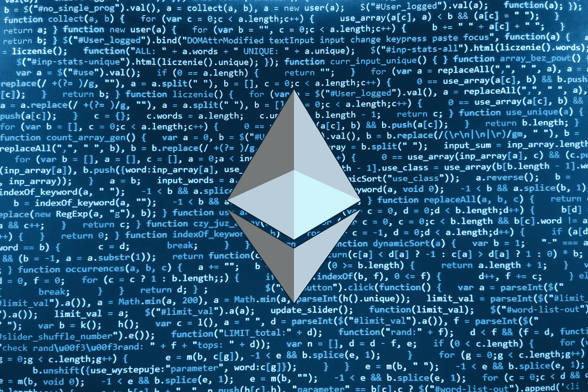
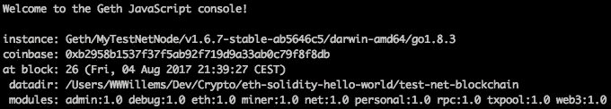
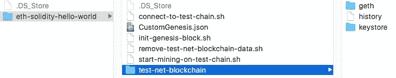

# 如何使用 Geth 和 Homebrew 建立一个私人以太坊测试网区块链

> 原文：<https://medium.com/coinmonks/how-to-set-up-a-private-ethereum-testnet-blockchain-using-geth-and-homebrew-1106a27e8e1e?source=collection_archive---------1----------------------->

## 开始你的 Solidity 编程雄心的入门教程！



Image from [https://themerkle.com](https://themerkle.com)

## 关于我

嗨！我叫兰德。我是一名来自比利时的自由软件工程师和产品设计师。当我不涉足 Solidity 的时候，我会开发一个 SaaS，帮助自由职业者和数字团队组织分享他们的数字内容。

# 关于本教程

本教程是对帮助我使用 Geth 和 Homebrew 建立我的第一个**私人以太坊测试网区块链**的不同资源的解释。它既是我自己未来的参考，也是对其他密码爱好者的帮助。我试图在这篇文章的底部列出我的大部分资源。如果你觉得少了什么，请告诉我。

## 区块链私人以太坊试验网

[以太坊](https://www.ethereum.org/)软件使用户能够建立一个独立于主以太坊链的“私有”或“测试网”以太坊链。这对于测试构建在以太坊上的分布式应用程序非常有用，而不必使用真实的以太将您的应用程序暴露给真实的以太坊网络。你可以在你的私人以太坊链上预先生成或开采你自己的以太，所以这是一种更划算的尝试以太坊的方式。我说以太坊说够了吗？

> 让我们开始狂欢吧

# 这个教程需要什么？

## 一些假设

*   你用的是 MacOS
*   你是一个密码和/或软件开发爱好者，想要迈出编写智能合同的第一步。
*   你知道[以太坊](http://ethereum.org)是什么，了解它的基本用法。
*   你对 MacOS 终端的使用有了基本的了解。

> *尝试*[*Quiknode*](https://quiknode.io/?tap_a=67226-09396e&tap_s=996309-882188)*并获得自己的 Etheruem 节点或 API*

# 你会取得什么成就？

成功完成本教程后，您将拥有一个运行在本地计算机上的全功能私人以太坊测试网区块链。

这个私有的测试网将允许你开发和测试你当前的 **Dapps** *(分散式应用)* 与真正的以太坊区块链隔离开来。

# 词典

## 什么是自制？

家酿安装 [**你需要的东西**](https://github.com/Homebrew/homebrew-core/tree/master/Formula) 苹果没有。我没开玩笑，他们网站就是这么说的[。去&看看吧，太牛逼了。](https://brew.sh/)

## **以太坊是什么？**

以太坊是一个尖端的[基于区块链的](https://en.wikipedia.org/wiki/Blockchain)分布式计算平台，具有智能合约功能。它提供了一个去中心化的虚拟机，以太坊虚拟机(EVM)，可以使用一种叫做*以太*的加密燃料来执行点对点合同。

*在这里阅读* [*白皮书*](https://github.com/ethereum/wiki/wiki/White-Paper) *。*

## 什么是 Geth？

`geth`是在 [Go](https://github.com/golang/go) 中实现的运行**全以太坊节点**的命令行接口。这是[前沿版本](https://github.com/ethereum/go-ethereum/wiki/Frontier)的主要交付成果。

通过[安装并运行](https://github.com/ethereum/go-ethereum/wiki/Geth) `[geth](https://github.com/ethereum/go-ethereum/wiki/Geth)`，你可以参加以太坊直播网络，在区块链上开采以太，在地址间转移资金，创建合约，发送交易。

> ***警告*** *在您使用* `*geth*` *或与以太坊前沿直播网互动之前，请务必阅读文档并完全理解* [*注意事项和风险*](https://github.com/ethereum/go-ethereum/wiki/Disclaimer) *。*

# **教程**

## 如何安装自制软件

如果你还没有这样做，启动你的终端，开始安装[自制软件](https://brew.sh/):

```
/usr/bin/ruby -e "$(curl -fsSL https://raw.githubusercontent.com/Homebrew/install/master/install)"
```

如果您之前已经安装了 Homebrew，请确保它是最新的:

```
brew update
brew upgrade
```

## 如何安装 Geth

安装 [Geth](https://github.com/ethereum/go-ethereum/wiki/geth) (go-ethereum)最简单的方法是使用自制水龙头

```
brew tap ethereum/ethereum 
brew install ethereum
```

通过运行以下命令测试安装是否成功

```
geth version
```

这将显示您当前安装的 Geth 版本:

```
Geth
Version: 1.6.7-stable
Git Commit: ab5646c532292b51e319f290afccf6a44f874372
Architecture: amd64
Protocol Versions: [63 62]
Network Id: 1
Go Version: go1.8.3
Operating System: darwin
GOPATH=
GOROOT=/usr/local/Cellar/go/1.8.3/libexec
```

如您所见，我们目前运行的是 Geth 版本 1.6.7。
确保用`geth --help`检查不同的选项和命令！

# 让我们变得危险


Lets’s Get Dangerous — [https://giphy.com/gifs/oadZJB3hwMFjy](https://giphy.com/gifs/oadZJB3hwMFjy)

## 连接到测试网络

让我们从为你的私人测试网区块链创建一个**创世纪模块**开始。genesis 块是区块链的开始——第一个块，块 0，以及不指向前一个块的唯一的**块。该协议确保没有其他节点会同意你的区块链版本，除非他们有相同的起源块，所以你可以尽可能多的私人测试网区块链你想要的！(参见[文档](http://ethdocs.org/en/latest/network/test-networks.html))**

创建并保存一个 **。json* 文件调用 *CustomGenesis.json* 并将这些内容放入其中:

> **旁注**
> 正如[这篇博文](https://blog.ethereum.org/2015/07/27/final-steps/)中提到的，有一个 [Python 工具可以](https://raw.githubusercontent.com/ethereum/genesis_block_generator/master/mk_genesis_block.py)生成你自己的定制 Genesis 文件。为了简单起见，你可以复制粘贴这个例子:

```
{
    "config": {
        "chainId": 15,
        "homesteadBlock": 0,
        "eip155Block": 0,
        "eip158Block": 0
    },
    "difficulty": "0x400",
    "gasLimit": "0x2100000",
    "alloc": {
        "**93f932b3b87e08cdaf0877994e44feb4c93e81aa**": 
         { "balance": "0x1337000000000000000000" }     
    }
}
```

该文件充当你的私有测试网的“种子”。

> 旁注
> 我们已经把难度降低到 400，所以开采新的区块会更快。

请注意，我们将我们的帐户地址**93f 932 B3 b 87 e 08 cdaf 0877994 e 44 Fe B4 c 93 e 81 aa**添加到了`"alloc"`对象中，并且我们给了它一个余额***133700000000000000***[魏](https://theethereum.wiki/w/index.php/Natural_Units) ( *1337* ETH):

```
"alloc": {
        "**93f932b3b87e08cdaf0877994e44feb4c93e81aa**": 
         { "balance": "0x**1337000000000000000000**" }     
    }
```

你可以使用这种方法来预先为你的账户注入资金。您可以定义要包含在种子中的多个帐户。请注意，这一步是可选的，因为你可以轻松地自己开采乙醚，因为你可以控制(低)难度！

当使用以下命令初始化您的 Genesis 块时，您将引用这个文件( *CustomGenesis.json* ):

```
geth --identity "MyTestNetNode" --nodiscover --networkid 1999 **--**datadir /path/to/test-net-blockchain  init /path/to/CustomGenesis.json
```

> 我正在使用一个自定义的“datadir”标志来区分测试网区块链和真实的测试网。我建议你也这样做。这可以是您想要的任何文件夹。
> 
> 要了解更多关于使用的其他标志的信息，请[浏览文档](http://ethdocs.org/en/latest/network/test-networks.html)。

## 在专用 tesnet 上创建帐户

创建或找到一个目录，你想存储你的本地私有 testnet 数据。在这个例子中，我们将使用

```
/path/to/test-net-blockchain
```

在前面的`geth --version`命令成功运行后，运行

```
geth account new --datadir /path/to/test-net-blockchain
```

该命令将要求您输入密码短语(=密码)。不要忘记这一点。

> **专业提示**
> 我正在使用一个自定义的‘datadir’标志来表示我想使用我个人的本地测试网。这使它与真正的测试网分开。
> 
> 默认情况下，geth 将为网络相关文件使用与公共 mainnet 相同的目录。因此，建议您设置一个自定义的`*--datadir*`来防止公共网络的 chaindata 被重置。
> 
> 要了解更多信息，请参见[文档](http://ethdocs.org/en/latest/network/test-networks.html)。

这将在您的新 testnet 节点上创建一个帐户，并将返回私有 testnet 地址，如下所示:

```
Address: {**93f932b3b87e08cdaf0877994e44feb4c93e81aa**}
```

保存此地址**和您的密码**以备后用。

## 预先为您的帐户注资

这是一个可选步骤。由于难度如此之低，你只需要几分钟就可以开采出足够的乙醚来供你使用。

首先删除之前创建的区块链数据库:

```
geth removedb --datadir /path/to/test-net-blockchain
```

更新您的' *CustomGenesis.json'* 文件:

```
{
    "config": {
        "chainId": 15,
        "homesteadBlock": 0,
        "eip155Block": 0,
        "eip158Block": 0
    },
    "difficulty": "0x400",
    "gasLimit": "0x2100000",
    "alloc": {
        **"93f932b3b87e08cdaf0877994e44feb4c93e81aa": 
         { "balance": "0x1337000000000000000000" }** 
    }
}
```

请注意，我们将我们的帐户地址**93f 932 B3 b 87 e 08 cdaf 0877994 e 44 Fe B4 c 93 e 81 aa**添加到了`"alloc"`对象中，并且我们给了它一个余额***133700000000000000***[魏](https://theethereum.wiki/w/index.php/Natural_Units) ( *1337* ETH):

您可以定义多个要包含在种子中的帐户。

再次运行创世块初始化命令

```
geth --identity "MyTestNetNode" --nodiscover --networkid 1999 **--**datadir /path/to/test-net-blockchain  init /path/to/CustomGenesis.json
```

## 如果你还没有做前期准备

启动 JavaScript 控制台后使用此命令(参见下一步:*‘与 Geth 控制台交互’*):

```
geth --identity "MyTestNetNode" --datadir /path/to/test-net-blockchain --nodiscover --networkid 1999 **console**
```

## 与 Geth 控制台交互

要通过控制台与 Geth 交互，称为 **Geth JavaScript 控制台**使用:

```
geth --identity "MyTestNetNode" --datadir /path/to/test-net-blockchain --nodiscover --networkid 1999 **console**
```

如果运行成功，您应该会看到一条确认消息:



如果您看到这条消息，您可以开始运行 Geth JavaScript 命令。试着用这个来查看你主要账户的余额

```
web3.fromWei(eth.getBalance(eth.accounts[0]), "ether")
```

> **Pro Tip** 将这些长 Geth 命令存储在单独的*中。sh 文件，以便您可以在以后重用该配置(及其自定义标志)。每次你想使用你的(定制的)私有测试网的时候，你都需要这个。

## 文件夹结构

纯信息性的，这是我的文件夹结构的样子:



My folder structure

如你所见，我创建了一些 **。sh* 脚本，以便以后重用。

***UPDATE***
我已经创建了一个存储库，其中包含了我在本文中用作参考的内容:[https://github . com/WWWillems/medium-attachments/tree/master/01-private-ether eum-testnet](https://github.com/WWWillems/medium-attachments/tree/master/01-private-ethereum-testnet)


Image from [https://giphy.com/gifs/hoppip-charlie-chaplin-film-hoppip-S7i2sED2yfDGg](https://giphy.com/gifs/hoppip-charlie-chaplin-film-hoppip-S7i2sED2yfDGg)

# 恭喜你！

现在你有了一个运行正常的私人以太网区块链测试网和一个运行在你个人电脑上的账户/钱包。你现在可以开始挖掘，发送交易等。在不久的将来，我会写一些关于这些话题的新文章。

# 有用的命令/提示

1.  `geth removedb` 删除/移除您在**公共**测试网本地同步的区块链数据。
2.  `geth removedb --datadir /path/to/test-net-blockchain` 删除/移除您的**私人**区块链测试网数据。
3.  `geth --fast --cache=1024` 更快地同步区块链。如果您选择使用— fast 标志来执行以太坊快速同步，您将不会保留过去的事务数据。
4.  当使用`geth attach`运行私有测试网络时，
    确保包含 IPC 端点。
    当启动 Geth JavaScript 控制台
    时，IPC 端点显示如下:`IPC endpoint opened: /path/to/endpoint/**geth.ipc**` 将路径附加到您的命令，因此它变成:
    `geth attach /path/to/endpoint/**geth.ipc**`

## Geth JavaScript 控制台命令

登录 Geth 控制台后，使用这些命令。

1.  如果您收到一条错误消息，称*‘错误:需要认证:密码或解锁’*，请使用此命令在 **Geth JavaScript 控制台** :
    `personal.unlockAccount(eth.coinbase, 'your account password in quotes', 0)`中解锁您的主帐户
2.  要查看您主要账户的余额

```
web3.fromWei(eth.getBalance(eth.accounts[0]), "ether")
```

3.要查看待定事务的列表

```
eth.pendingTransactions
```

# 有用的链接

*   [以太坊文档](http://ethdocs.org/)
*   [Geth JavaScript 控制台 Wiki](https://github.com/ethereum/go-ethereum/wiki/JavaScript-Console)
*   [以太扫描](https://etherscan.io) —以太坊块浏览器和分析平台
*   [以太坊网络统计监视器](https://stats.ethdev.com/)
*   [https://github . com/WWWillems/medium-attachments/tree/master/01-private-ether eum-testnet](https://github.com/WWWillems/medium-attachments/tree/master/01-private-ethereum-testnet)

# 由于

## 人

*   [维塔利科·布特林](https://twitter.com/VitalikButerin)
*   [约瑟夫·卢宾](https://twitter.com/ethereumjoseph)

## 资源

*   [以太坊文档](http://ethdocs.org/)
*   [https://github . com/ether eum/go-ether eum/wiki/Installation-Instructions-for-Mac](https://github.com/ethereum/go-ethereum/wiki/Installation-Instructions-for-Mac)

# 感谢阅读！

我很想收到你的来信，知道你的想法。如果你觉得丢了什么东西，请告诉我。如果你想保持联系，请回复下面的帖子， [**在 Twitter 上关注我**](https://twitter.com/WWWillems) 或者使用下面的表格注册我的时事通讯。

> 加入 Coinmonks [电报频道](https://t.me/coincodecap)和 [Youtube 频道](https://www.youtube.com/c/coinmonks/videos)获取每日[加密新闻](http://coincodecap.com/)

## 另外，阅读

*   [复制交易](/coinmonks/top-10-crypto-copy-trading-platforms-for-beginners-d0c37c7d698c) | [加密税务软件](/coinmonks/crypto-tax-software-ed4b4810e338)
*   [网格交易](https://coincodecap.com/grid-trading) | [加密硬件钱包](/coinmonks/the-best-cryptocurrency-hardware-wallets-of-2020-e28b1c124069)
*   最佳[区块链分析](https://bitquery.io/blog/best-blockchain-analysis-tools-and-software)工具| [赚比特币](/coinmonks/earn-bitcoin-6e8bd3c592d9)
*   [Cloudbet 赌场评论](https://coincodecap.com/cloudbet-casino-review) | [点火赌场评论](https://coincodecap.com/ignition-casino-review)
*   [加密套利](/coinmonks/crypto-arbitrage-guide-how-to-make-money-as-a-beginner-62bfe5c868f6)指南| [如何做空比特币](/coinmonks/how-to-short-bitcoin-568a2d0b4ae5)
*   [如何在加拿大购买加密货币？](https://coincodecap.com/how-to-buy-cryptocurrency-in-canada)
*   [密码电报信号](http://Top 4 Telegram Channels for Crypto Traders) | [密码交易机器人](/coinmonks/crypto-trading-bot-c2ffce8acb2a)
*   [最佳加密交易所](/coinmonks/crypto-exchange-dd2f9d6f3769) | [印度最佳加密交易所](/coinmonks/bitcoin-exchange-in-india-7f1fe79715c9)
*   [面向开发人员的最佳加密 API](/coinmonks/best-crypto-apis-for-developers-5efe3a597a9f)
*   最佳[密码借贷平台](/coinmonks/top-5-crypto-lending-platforms-in-2020-that-you-need-to-know-a1b675cec3fa)
*   杠杆代币的终极指南