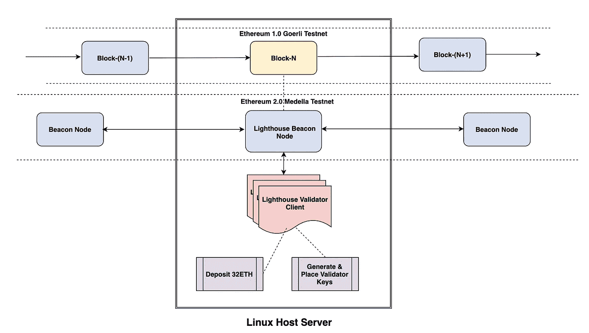
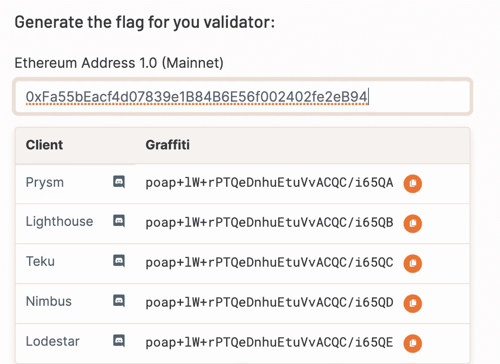
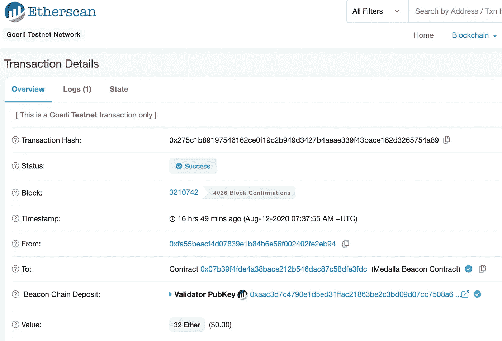
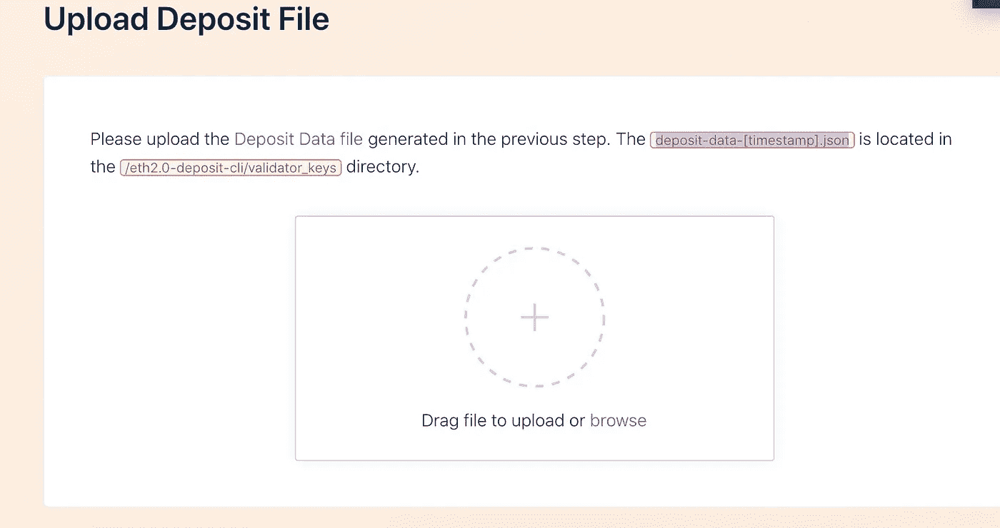
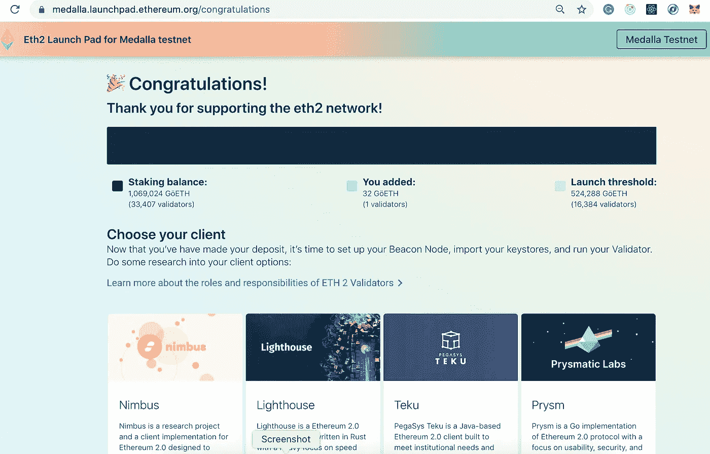
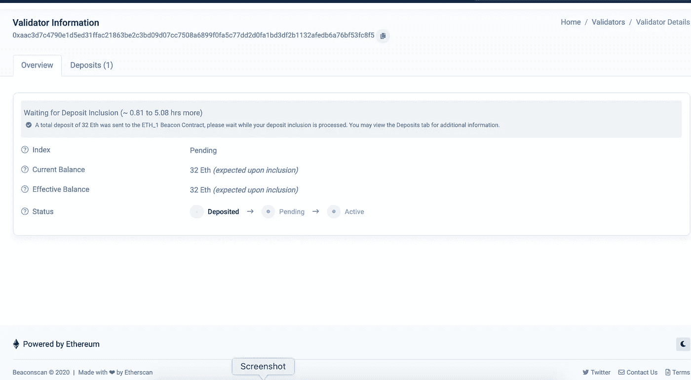
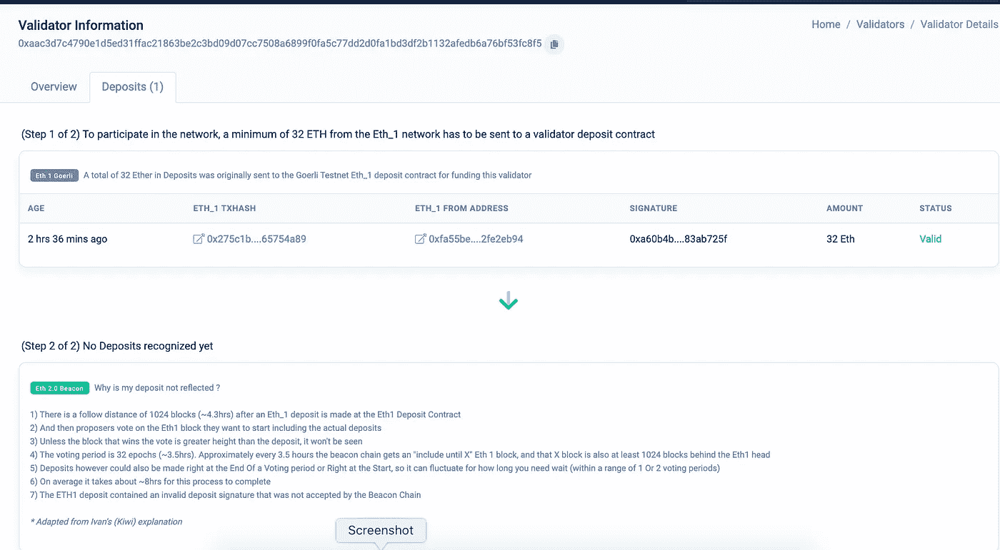
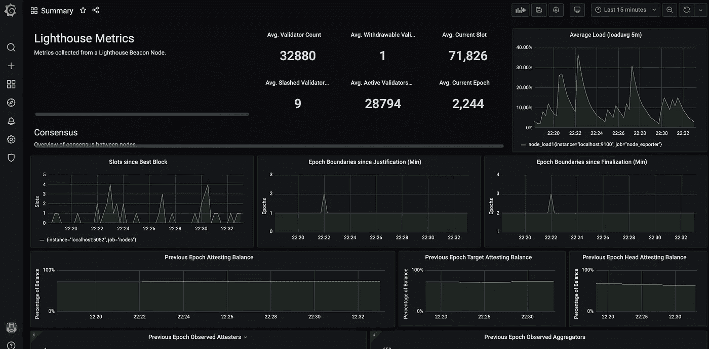

# 设置以太坊 2.0 验证器节点，带有 goer Li Meddala 上的灯塔

> 原文：<https://medium.com/coinmonks/how-to-setup-ethereum-2-0-validator-node-lighthouse-meddala-goerli-4f0b85d5c8f?source=collection_archive---------0----------------------->

最近几天，由于对 Defi 的兴趣增加，加密货币价格出现了大幅上涨。以太坊也在引领这一潮流。以太坊最近推出了它的第 0 阶段，在 eth1 testnet [Goerli](https://github.com/goerli/testnet) 的支持下，它的第一个 eth2.0 多客户端 medella testnet 开始运行[](https://www.crypto-news-flash.com/ethereum-2-0-live-final-testnet-before-mainnet-launch/)*。要了解更多以太坊 2.0 路线图，[在这里阅读](https://docs.ethhub.io/ethereum-roadmap/ethereum-2.0/eth2.0-teams/teams-building-eth2.0/)。*

*本文的目的是介绍使用适马 Prime Lighthouse 客户端在以太坊 2.0 [Medalla](https://github.com/goerli/medalla) 多客户端测试网上设置以太坊 2.0 信标节点和验证器的详细步骤。它基于以下系统:*

*   *Ubuntu 18.04.3 (LTS) x64 x64 服务器*
*   *[围棋以太坊](https://geth.ethereum.org/docs/)节点([代码分支](https://github.com/ethereum/go-ethereum))*
*   *Goerli Testnet，运行在 PoA consensus 上，代表以太坊-1。*
*   *以太坊 2.0 客户端，灯塔([代码分支](https://github.com/sigp/lighthouse))*
*   *官方多客户端 testnet 公网， [Medalla](https://github.com/goerli/medalla)*
*   *[元掩码](https://metamask.io/)加密钱包浏览器扩展*

# *什么是灯塔？*

*得到信息安全和软件工程公司适马 Prime 的支持，灯塔是 9 个被选中的构建 Eth2.0 客户端的团队之一。它是用 Rust 编写的，重点关注速度和安全性，并得到了以太坊基金会、ConsenSys 和 Vitalik Buterin 的资助。*

# *清注意*

*   *这个设置当然不容易，您需要对高级 Linux 操作系统有相当的了解，比如防火墙、SSH、用户帐户、配置 Linux 服务。*
*   *您还应该知道如何设置以太坊 1.0 全节点，并了解区块链和以太坊的核心原则，例如助记符、私钥/公钥、账户地址、元掩码钱包、可靠性合同和交易。*
*   *完成整个设置需要几个小时，所以请耐心等待。*

**

# *步伐*

*   *在我们的服务器上设置一个 Goerli testnet 的 Ethereum1.0 测试节点，并让它与 testnet 最新块同步*
*   *安装和配置灯塔信标节点*
*   *存款合同*
*   *生成并激活验证器密钥*
*   *配置灯塔验证器客户端*

# *步骤 0 —准备*

*我使用过一个托管在数字海洋上的商用服务器。从技术上讲，这个设置也可以在 Raspberry pi 4 上完成。如果机器受 AWS 上 VPC 的专用/公共子网支持，则需要使用以下端口设置服务器安全组。然而，对于这个设置，你需要使用 Linux 防火墙服务 *ufw* 来完成。*

***更新升级系统***

```
*> sudo apt-get update -y && sudo apt-get upgrade -y*
```

***安全***

*默认情况下，ufw 是禁用的，因此在启用它之前，您需要打开*

*   *SSH 连接的端口 22，*
*   *端口 30303 TCP/UDP 用于 Geth 节点与其对等节点交互，*
*   *端口 9000/TCP 和 9000/UDP 允许灯塔与对等方进行 P2P 连接，以便在信标节点上执行操作*

*运行以下 *ufw* 命令*

```
*> ufw allow 22/tcp
> ufw allow 30303/tcp
> ufw allow 30303/udp
> ufw allow 9000/tcp
> ufw allow 9000/udp
> ufw enable
> ufw status numbered*
```

*输出应该是这样的。*

```
*> ufw status numbered
Status: activeTo                         Action      From
     --                         ------      ----
[ 1] 22/tcp                     ALLOW IN    Anywhere                  
[ 2] 30303/tcp                  ALLOW IN    Anywhere                  
[ 3] 30303/udp                  ALLOW IN    Anywhere                  
[ 4] 9000/tcp                   ALLOW IN    Anywhere                  
[ 5] 9000/udp                   ALLOW IN    Anywhere                  
[ 6] 22/tcp (v6)                ALLOW IN    Anywhere (v6)             
[ 7] 30303/tcp (v6)             ALLOW IN    Anywhere (v6)             
[ 8] 30303/udp (v6)             ALLOW IN    Anywhere (v6)             
[ 9] 9000/tcp (v6)              ALLOW IN    Anywhere (v6)             
[10] 9000/udp (v6)              ALLOW IN    Anywhere (v6)*
```

# *步骤 1 —安装并运行 Go 以太坊节点*

## *安装 Go 以太坊*

```
*> sudo add-apt-repository -y ppa:ethereum/ethereum
> sudo apt-get update
> sudo apt-get install ethereum*
```

*因为您有多个系统要在这个服务器上运行，并且所有系统都应该中断运行，所以您需要将这些系统设置为 Linux 服务。任何干扰都可能导致惩罚和砍木桩。[看这里](https://docs.ethhub.io/ethereum-roadmap/ethereum-2.0/proof-of-stake/#why-would-i-want-to-stake-my-eth)。*

## *运行 Go 以太坊作为后台服务*

*   *创建一个 ***无归属*** 帐户 *goerli* 用于运行服务。您不能使用此帐户登录服务器*
*   *为 Goerli 链创建数据目录。这是存储 Goerli 节点块数据所必需的*
*   *设置目录权限。goerli 账户需要修改数据目录的权限*
*   *创建一个 systemd 服务文件来存储服务配置。您将使用配置文件告诉 systemd 运行`geth`进程*

```
*> sudo useradd --no-create-home --shell /bin/false goerli
> sudo mkdir -p /var/lib/goethereum
> sudo chown -R goerli:goerli /var/lib/goethereum
> sudo nano /etc/systemd/system/geth.service*
```

*使用以下代码更新 geth 服务配置。或者，你可以从[这里](https://gist.github.com/golashr/6cf1fc525b4f3e721c5fc958aca4937b)选择命令。*

```
*[Unit]
Description=Ethereum go client
After=network.target 
Wants=network.target

[Service]
User=goeth 
Group=goeth
Type=simple
Restart=always
RestartSec=5
ExecStart=/usr/bin/geth --goerli --http --datadir /var/lib/goethereum --bootnodes "enode://d67359082562e4a599d0572c5a04909ca6e8650228c98f0a3a6844514f3a1ae0a8b0b6fe635a2e2f0e0e6be9f08d80f1994f4399e154134bc07080f0b0b64e42@68.183.59.172:30303,enode://95f5d03a95e7c5d0eb655b2fe3b5495b86d424b4681a200d402c30f233e1edc1846f2837b0dfe7df691fe007236ed1998d178774c9b8bc049be75a2c21038978@95.217.215.48:30303,enode://79e5d36f90ee0314293f4c1b1a4cd9ea13f1acd3d79b5a506870c70b6dbac6f9652ca86455886be854c9a1cfcc00d82cf0fa5d256bf7c40ae1fae0c21b437c7d@13.66.153.22:37912,enode://a9f7bb623c007d2b28038978dac6ebbe945c74f07cc91820c88cc95633b29468ca4708781fc99346a74ee43024b5e7cbb8b0803a988b57841b757cf975efa333@104.211.30.135:30303,enode://02200a7b5253969458e2addf6838b3f064c9c6b22288e92848a7ac5a367553d8d8c871b1af0603ac6ac2118bc15795b5aefe2d29b4729ae1e61e51a14201c8e9@18.194.247.237:30303,enode://553b679e4f84048f4340de271025fdd047869b39d419352d30cfd48dc97868263c8dc1481337946a41ef2836d2b5afece993012af982d8097de4cc062f50cda1@52.87.240.248:48584,enode://4531d2559d9707406f5132d9e9490b9ab6b1fa62ba9b10486d3f0eb7d8f6643b25f679c28ba4d4e0ac8e218d424aed8bd3a0a4ba9dd7bdec4823047adb8d0145@24.74.186.77:36804,enode://aaf930ed9bd450fe48b2f953da22393d6a0d0fdb2810ed16885d382d67fd89108d5777161c3b7401b922f34d8c416c74770f901147faf79c190de5bbbf0e3cc8@192.241.134.195:30303,enode://00e496ab9153d4dd8b88275352831fd3c75fdc255e57fdf9fe5875164672fb722889b0732f8df9aab3e16e82bef9b979840800e740bca1914252c598378ec52e@24.4.149.245:30304,enode://d26b54f391088fa3868811c643a72f42ea23be850670695c52bdd5ef6421e227c376d476e94e32de09793eec38cacaf69bd6f79f71a34e8662cc9ed0b35e7976@185.228.47.193:30303,enode://15032b1dcc97ebcbb9e060c27b775b81472653d19f932f75d0fd96a2ec1184698c7064401a01b08533783d8039c837a1dce3d69c23ef22289f02bb53a1dd70f7@202.187.155.60:30303,enode://4d03cdfa08658d6737fd18507b54e6653a236d41039d0dd8a3f9d0a3b06dff98c2af903daf99fe4cd2c6bfbb36f47554151336f42b971698c8bccf970f28c98a@51.210.9.77:40404,enode://3d4d8863396c39fa0710504dbe8803b776bef9d7fe3f732967fb8681552fd6d2dbe0c6f4642b45528060f5b168820ae93eb14d260617d29d815ffadc5c7db6f2@95.216.206.118:30303,enode://9a3f770e82a128ea27d1b73ca9819b05cf6f16275b7d9ee6151efe751966c771f7a82425447be97119743680c3bd421f024eccf24066aa46020d061aac5128dc@64.120.90.247:33656,enode://f7d7aa996c18e45efbe9b8a532f9f32bbdef027dc60a6999b6a06b97b3bd933995280b0a1390a4281edc2556ddfc46521814feb0e5839f82010dcaba1afec445@51.77.211.174:30303,enode://bfe4ae8c9638e56dc6c252d5fdf8fd7251b2ad82cbb89c56923c2e6ece2f5f71888d1fa6849a2f6aee901835876d6001bfce8aa29fa27aa4715fc2420596e399@155.93.136.72:56792,enode://10e545ef1ede27c90ef69863d50328f66de1ac806c67cf60d1bb4c72cc644fe11b6597ebd30d9e100d7ccdd05ae6b5d133d93122d81139baab03c2dd9e10c758@95.217.12.192:30303,enode://ca77b80280e607104f3997e92f1e9ea14e009cd51a471960f43c2a5c0f95405e6f669ac15a46db4f3dbdc77411551926dca0da0db32680a21b65cef80273bf5a@150.214.106.123:47524,enode://00b77e6c1f44719d48b305da24965e6c7b8af5ec614e883efb0c80617670585c4a949fe4a3fbacf6454afce7d074ecaac40213a893425522f1e941de71c007ed@155.93.196.78:58992,enode://6781b3fa91a8e5b2a89682f9307d2b66e21a4ae595d1b2dfe2662e5fbf7326f5db7a9acdcc64e8402b31a1e8fbefc6ba13fa0af4015a373a42a4de14fd6a306b@164.90.236.249:30303,enode://1d63c062e215caa90ab8348ab25bc38546d7112bf829d5e9a272e88fab0869bbef206e848acb4290448c6b6e077f312efef6075116a9bbeb0b069a95dbd7f103@86.88.214.39:30303,enode://6b5ee2f457fc091b762f9a058d35f7fc73f1c8116a1853b3db2279eba56dbd990c309084c002476a9cb1b8584ac3ee58e91184376ad22af337088ea357f0ef2e@86.154.249.228:30303,enode://c40e962b9bb3433303ea77a9d785faa4a6c43d67d813f3cbe42006412df64a74aab206c7138b90a74e4152bde99f5f94a310fe673e9c5b5b899c5c61e5c28de5@82.233.188.75:30303"

[Install]
WantedBy=default.target*
```

*`--goerli`标志用于运行李二测试网络，而`--http`标志用于公开信标链将连接到的端点(http://localhost:8545)。`--bootnodes`标记静态链接选择的对等节点到我们的 geth 节点。这是为了避免对其对等体的任何正在进行的发现。列表取自[此处](https://gist.github.com/rfikki/77081600ddc8432520d3bb3a9f80a493)。请注意，它会定期更新。*

*重新加载 systemd 以反映更改，并启动服务，检查以确保它运行正确。*

```
*> sudo systemctl daemon-reload
> sudo systemctl start geth
> sudo systemctl status geth
geth.service - Ethereum go client
   Loaded: loaded (/etc/systemd/system/geth.service; enabled; vendor preset: enabled)
Aug 13 12:04:00 ubuntu-s-2vcpu-4gb-sgp1-eth geth[852]: INFO [08–13|12:04:00.654] Imported new chain segment blocks=1 txs=0 mgas=0.000 elapsed=”223.343µs” mgasps=0.0
Aug 13 12:04:13 ubuntu-s-2vcpu-4gb-sgp1-eth geth[852]: INFO [08–13|12:04:13.095] Chain reorg detected number=3217563 hash=”d20e45…488182" drop=1 dropfrom=”6882
Aug 13 12:04:13 ubuntu-s-2vcpu-4gb-sgp1-eth geth[852]: INFO [08–13|12:04:13.095] Imported new chain segment blocks=1 txs=3 mgas=0.796 elapsed=13.377ms mgasps=59.*
```

**这表明节点已经启动。与格利·区块链完全同步需要几个小时甚至几天。对我来说，它必须同步超过 300 万个数据块。**

# *步骤 2——建造灯塔*

## *安装依赖项*

*灯塔建在铁锈上。按照提示进行安装。*

```
*$ curl --proto '=https' --tlsv1.2 -sSf [https://sh.rustup.rs](https://sh.rustup.rs/) | sh*
```

*由于 Rust 修改了 PATH 变量，您将需要注销并再次登录，否则在尝试编译时您可能会得到一个`command not found`错误。*

```
*To get started you need Cargo’s bin directory ($HOME/.cargo/bin) in your PATH environment variable. Next time you log in this will be done automatically.*
```

*一些包(git，gcc，g++，make，cmake 等。)也是必需的。*

```
*$ sudo apt install -y git gcc g++ make cmake pkg-config libssl-dev
$ sudo apt update*
```

## *建造灯塔*

*现在已经安装了依赖项，现在应该构建 Lighthouse 客户端了。灯塔构建产生一个`lighthouse`二进制。相同的二进制文件用于运行信标节点和验证器客户端。*

*克隆 Lighthouse 核心库，使用“make”编译 Lighthouse 二进制文件，并将二进制文件移动到 bin 文件夹。*

```
*> git clone [https://github.com/sigp/lighthouse.git](https://github.com/sigp/lighthouse.git)
> cd lighthouse
> make
> sudo cp /$HOME/.cargo/bin/lighthouse /usr/local/bin*
```

*建造它需要一段时间。所以保持耐心。*

# *步骤 3-配置信标节点*

*您将把信标节点作为服务运行，因此如果系统重新启动，该过程将自动再次启动备份。*

## *将信标节点作为后台服务运行*

*   *创建一个 ***无归属*** 帐户*灯塔信标*用于运行服务*
*   *为灯塔信标节点创建数据目录，以存储信标节点数据*
*   *设置目录权限。 *lighthousebeacon* 账户需要修改数据目录的权限*
*   *使用您最喜爱的浏览器扩展上的 Metamask wallet 创建/使用新的 Ethereum1.0 地址，并通过按左侧的灯塔橙色图标复制涂鸦字符串。在我们的例子中，地址是“0x fa 55 beacf 4d 07839 E1 b 84 b 6 e 56 f 002402 Fe 2 EB 94”*
*   *从[这里](https://beaconcha.in/poap)获取您的信标节点客户端的 POAP(出席协议证明)徽章。这是一个涂鸦，可以贴在你的探险家版块上，作为你参与这个测试阶段的证明。*

**

*Graffiti for POAP*

*   *创建一个 systemd 服务文件来存储服务配置。您将使用配置文件告诉 systemd 运行`lighthousebeacon`进程*

```
*> sudo useradd --no-create-home --shell /bin/false lighthousebeacon
> sudo mkdir -p /var/lib/lighthouse/beacon-node
> sudo chown -R lighthousebeacon:lighthousebeacon /var/lib/lighthouse/beacon-node
> sudo nano /etc/systemd/system/lighthousebeacon.service*
```

*使用以下代码更新 lighthousebeacon 服务配置*

```
*[Unit]
Description=Lighthouse Beacon Node
After=network.target 
Wants=network.target

[Service]
User=lighthousebeacon
Group=lighthousebeacon
Type=simple
Restart=always
RestartSec=5
ExecStart=/usr/local/bin/lighthouse beacon_node --datadir /var/lib/lighthouse/beacon-node --testnet medalla --http --eth1-endpoint http://127.0.0.1:8545 --graffiti <abcdefg12345saf>

[Install]
WantedBy=default.target*
```

*替换“— graffiti <abcdefg12345saf>”处复制的涂鸦字符串并保存文件。或者，你可以从[这里的](https://gist.github.com/golashr/8a050ebb120036d8289f331af38fe743)选择命令。</abcdefg12345saf>*

*重新加载 systemd 以反映更改，并启动服务，检查以确保它运行正确。*

```
*> sudo systemctl daemon-reload
> sudo systemctl start lighthousebeacon
> sudo journalctl -f -u lighthousebeacon.serviceAug 12 08:09:50 ubuntu-s-2vcpu-4gb-sgp1-eth lighthouse[7237]: Aug 12 08:09:50.000 INFO Syncing                                 est_time: 40 mins, speed: 5.33 slots/sec, distance: 12820 slots (1 days 18 hrs), peers: 51, service: slot_notifier
Aug 12 08:10:02 ubuntu-s-2vcpu-4gb-sgp1-eth lighthouse[7237]: Aug 12 08:10:02.001 INFO Syncing                                 est_time: 39 mins, speed: 5.33 slots/sec, distance: 12693 slots (1 days 18 hrs), peers: 51, service: slot_notifier
Aug 12 08:10:14 ubuntu-s-2vcpu-4gb-sgp1-eth lighthouse[7237]: Aug 12 08:10:14.001 INFO Syncing                                 est_time: 31 mins, speed: 6.67 slots/sec, distance: 12630 slots (1 days 18 hrs), peers: 53, service: slot_notifier
Aug 12 08:10:26 ubuntu-s-2vcpu-4gb-sgp1-eth lighthouse[7237]: Aug 12 08:10:26.001 INFO Syncing                                 est_time: 31 mins, speed: 6.67 slots/sec, distance: 12567 slots (1 days 17 hrs), peers: 52, service: slot_notifier*
```

*让信标节点与其最新状态同步。“东部时间”显示预计到达时间。以下状态显示信标节点已完全同步。*

```
*> sudo journalctl -f -u lighthousebeacon.service
Aug 12 10:28:20 ubuntu-s-2vcpu-4gb-sgp1-eth lighthouse[7237]: Aug 12 10:28:20.893 INFO New block received                      hash: 0x7d84…95d2, slot: 56841, service: router
Aug 12 10:28:26 ubuntu-s-2vcpu-4gb-sgp1-eth lighthouse[7237]: Aug 12 10:28:26.000 INFO Synced                                  slot: 56841, block: 0x7d84…95d2, epoch: 1776, finalized_epoch: 1774, finalized_root: 0x9bf1…f0db, peers: 55, service: slot_notifier
Aug 12 10:28:33 ubuntu-s-2vcpu-4gb-sgp1-eth lighthouse[7237]: Aug 12 10:28:33.846 INFO New block received                      hash: 0xcb1f…05bc, slot: 56842, service: router
Aug 12 10:28:38 ubuntu-s-2vcpu-4gb-sgp1-eth lighthouse[7237]: Aug 12 10:28:38.000 INFO Synced                                  slot: 56842, block: 0xcb1f…05bc, epoch: 1776, finalized_epoch: 1774, finalized_root: 0x9bf1…f0db, peers: 52, service: slot_notifier*
```

# *步骤 4-将验证器桩放在 Medalla 上*

## *让戈利去做赌注*

1.  *问格利测试网[水龙头](https://faucet.goerli.mudit.blog/)要 32 ETH*
2.  *如果你计划运行多个验证器，你可以要求 32 ETH x 数量的验证器。*

*一旦 Goerli ETH 出现在您的 MetaMask 钱包中，请继续下一步。*

## *标桩 Goerli ETH*

*按照下面给出的步骤安装“eth2deposit”脚本，并使用给定的命令运行它*

```
*> cd ~
> curl -LO https://github.com/ethereum/eth2.0-deposit-cli/releases/download/v0.2.1/eth2deposit-cli-v0.2.1-linux-amd64.tar.gz
eth2deposit-cli-v0.2.1-linux-amd64.tar.gz   100%[========================================================================================>]  14.56M  5.47MB/s    in 2.7s    
2020-08-12 07:19:25 (5.47 MB/s) - 'eth2deposit-cli-v0.2.1-linux-amd64.tar.gz' saved [15271039/15271039]
-rw-r--r--  1 root root  15M Jul 28 07:10 eth2deposit-cli-v0.2.1-linux-amd64.tar.gz

> tar -xzf eth2deposit-cli-v0.2.1-linux-amd64.tar.gz
> cd eth2deposit-cli-de03fe3-linux-amd64
-rwxr-xr-x  1 goerli lighthousebeacon  15M Jul 28 07:00 deposit

> ./deposit --num_validators 1 --chain medalla

Please choose your mnemonic language (italian, korean, spanish, chinese_traditional, chinese_simplified, english, czech) [english]: <Enter>
Type the password that secures your validator keystore(s): <Enter the password>
Repeat for confirmation: <Enter the password>

This is your seed phrase. Write it down and store it safely, it is the ONLY way to retrieve your deposit.
<Enter your mnemonics>

Press any key when you have written down your mnemonic.

Creating your keys.
Saving your keystore(s).
Creating your deposit(s).
Verifying your keystore(s).
Verifying your deposit(s).

Success!
Your keys can be found at: /root/eth2deposit-cli-de03fe3-linux-amd64/validator_keys

➜  validator_keys l
total 16K
drwxr-xr-x 2 root  root             4.0K Aug 12 07:25 .
drwxrwxr-x 3 goerli lighthousebeacon 4.0K Aug 12 07:25 ..
-rw-r--r-- 1 root  root              647 Aug 12 07:25 deposit_data-1597217105.json
-rw-r--r-- 1 root  root              710 Aug 12 07:25 keystore-m_12381_3600_0_0_0-1597217104.json

> sudo chown -R root:root /var/lib/lighthouse/validator
> lighthouse account validator import - directory ~/eth2deposit-cli-de03fe3-linux-amd64/validator_keys - validator-dir /var/lib/lighthouse/validator
Successfully moved keystore.
Successfully updated validator_definitions.yml.
Successfully imported 1 validators.*
```

*或者，您可以从这里的[选择命令](https://gist.github.com/golashr/77410e7665134f5f6d5511330f8de44a)。*

*您可以在 goerli testnet 上查看赌注[交易](https://goerli.etherscan.io/address/0xFa55bEacf4d07839e1B84B6E56f002402fe2eB94)。无论是谁，只要来自以太网 1.0 的背景，都可以很容易地理解，这就是可靠性契约 [Medella BeaconContractor](https://goerli.etherscan.io/address/0x07b39F4fDE4A38bACe212b546dAc87C58DfE3fDC) ，它需要在成为信标链的验证器之前被发送 32 个“goer Li”ETH。这 32 个小时是赌注金额，可能无法收回？*

**

## *生成验证器数据*

*进入[官方 Eth2 发射台](https://medalla.launchpad.ethereum.org/)并按照说明进行操作。如果一切正常，将会生成验证器密钥文件(keystore-m JSON 文件)——为每个请求的验证器生成一次。**备份它们！***

**

*Drop the generated deposit-data-[timestamp].json*

*最终，您应该会看到这样的屏幕。*

***[](https://beaconscan.com/validator/0xaac3d7c4790e1d5ed31ffac21863be2c3bd09d07cc7508a6899f0fa5c77dd2d0fa1bd3df2b1132afedb6a76bf53fc8f5#deposits) [## 验证器信息| Medalla 信标链(阶段 0)以太坊 2.0 浏览器

### 等待存款(最多 4.09 小时以上)总计 32 个 Eth 的存款被发送到 ETH_1 信标合同…

beaconscan.com](https://beaconscan.com/validator/0xaac3d7c4790e1d5ed31ffac21863be2c3bd09d07cc7508a6899f0fa5c77dd2d0fa1bd3df2b1132afedb6a76bf53fc8f5#deposits) 

现在你已经到了一个非常有趣的阶段。下图显示了已经沉积的 32 个 ETHs 但是，即使您现在启动了验证器客户端进程，您也可能不会立即成为验证器。图片显示，它可能需要 5.08 小时最大；然而，这完全取决于验证器队列的长度。每个时期都有四个验证器被激活。因此，如果有超过 5000 人在排队，可能需要大约 5 天左右。



Meddala Validator



Meddala Validator

从[这里](https://notes.ethereum.org/@vbuterin/rkhCgQteN?type=view#Depositing)阅读这个节选来理解它的技术细节。

*验证者通过发送调用 eth1 链上的存款合同上的函数的交易进行存款。定金注明:*

*   *与将用于签署消息的私钥相对应的公钥*
*   *取款凭证(一旦验证器完成验证，将用于取款的公钥散列)*
*   *存款金额*

*这些值都由签名密钥签名。具有单独的签名和撤销密钥的目的是允许更危险的撤销密钥被更安全地保存(离线，不与任何赌注池共享等)，同时签名密钥被用于在每个时期主动地签名消息。*

# 步骤 5 —配置灯塔验证器客户端

您将把 validator 客户机作为一个服务来运行，因此如果系统重新启动，这个过程将自动再次启动备份。

## 将验证程序客户端作为后台服务运行

*   创建一个 ***无主*** 帐户 *lighthousevalidator* 用于运行服务
*   为灯塔验证器客户机创建数据目录，以存储信标节点数据
*   设置目录权限。lighthousevalidator 帐户需要修改数据目录的权限
*   创建一个 systemd 服务文件来存储服务配置。您将使用配置文件告诉 systemd 运行`lighthousevalidator`进程

```
> sudo useradd --no-create-home --shell /bin/false lighthousevalidator
> sudo mkdir -p /var/lib/lighthouse/validator
> sudo chown -R lighthousevalidator:lighthousevalidator /var/lib/lighthouse/validator
> sudo nano /etc/systemd/system/lighthousevalidator.service
```

使用以下代码更新 lighthousevalidator 服务配置

```
[Unit]
Description=Lighthouse Validator
After=network.target 
Wants=network.target

[Service]
User=lighthousevalidator
Group=lighthousevalidator
Type=simple
Restart=always
RestartSec=5
ExecStart=/usr/local/bin/lighthouse validator_client --datadir /var/lib/lighthouse/validator

[Install]
WantedBy=default.target
```

或者，你可以从[这里](https://gist.github.com/golashr/1aefa32fad54ebb817a80e2582713fd7)选择文本。

重新加载 systemd 以反映更改，并启动服务，检查以确保它运行正确。对我来说，它显示以下信息。这意味着，我的信标节点服务还没有同步。所以我不得不等待。

```
> sudo systemctl daemon-reload
> sudo systemctl start lighthousevalidator
> sudo journalctl -f -u lighthousevalidator.serviceAug 12 08:02:14 ubuntu-s-2vcpu-4gb-sgp1-eth lighthouse[10221]: Aug 12 08:02:14.001 ERRO Beacon node is syncing                  current_slot: 40800, target_slot: 56032, msg: not receiving new duties, service: notifier
Aug 12 08:02:26 ubuntu-s-2vcpu-4gb-sgp1-eth lighthouse[10221]: Aug 12 08:02:26.001 ERRO Beacon node is syncing                  current_slot: 40990, target_slot: 56032, msg: not receiving new duties, service: notifier
Aug 12 08:02:38 ubuntu-s-2vcpu-4gb-sgp1-eth lighthouse[10221]: Aug 12 08:02:38.002 ERRO Beacon node is syncing                  current_slot: 41055, target_slot: 56032, msg: not receiving new duties, service: notifier
```

后来，我看到了这些留言。在写这篇文章的时候，我还在接收这条消息。这意味着我还在排队。

```
Aug 12 10:16:38 ubuntu-s-2vcpu-4gb-sgp1-eth lighthouse[10221]: Aug 12 10:16:38.002 INFO Awaiting activation                     slot: 56782, epoch: 1774, validators: 1, service: notifier
Aug 12 10:16:50 ubuntu-s-2vcpu-4gb-sgp1-eth lighthouse[10221]: Aug 12 10:16:50.001 INFO Awaiting activation                     slot: 56783, epoch: 1774, validators: 1, service: notifier
Aug 12 10:17:02 ubuntu-s-2vcpu-4gb-sgp1-eth lighthouse[10221]: Aug 12 10:17:02.001 INFO Awaiting activation                     slot: 56784, epoch: 1774, validators: 1, service: notifier
Aug 12 10:17:14 ubuntu-s-2vcpu-4gb-sgp1-eth lighthouse[10221]: Aug 12 10:17:14.002 INFO Awaiting activation                     slot: 56785, epoch: 1774, validators: 1, service: notifier
```

## 要理解激活的逻辑，请阅读下面的[和](https://notes.ethereum.org/@vbuterin/rkhCgQteN?type=view#Activation)

验证器立即加入验证器注册中心，但最初是不活动的。验证器在𝑁≥4N≥4 纪元后激活；最小值为 4 是为了确保 RANDAO 不可操作，如果太多的验证器试图同时加入，𝑁N 可能会超过 4。如果活动验证器集的大小为|𝑉||V|，则每个时期最多可以加入𝑚𝑎𝑥(4,|𝑉|65536)max(4,|V|65536 个验证器；如果有更多的验证器试图加入，它们会被放入一个队列，并被尽快处理。

# 承认

虽然我了解以太坊 1.0 技术的本质，但这是我在以太坊 2.0 技术栈上的第一次实验。

这个指南是基于我从各种在线资源和一些媒体文章中收集的信息，下面会提到。根据我的经验，我改进了那篇文章。谢谢你，到目前为止所做的一切！！

## 此外，

以太坊团队推荐了一组[特定的指标](https://github.com/ethereum/eth2.0-metrics/blob/master/metrics.md)，每个信标节点客户端都应该公开这些指标。接下来， [Prometheus](https://prometheus.io/) metrics 和 [Grafana](https://grafana.com/) dashboard 工具可以被配置为更好地监控机器状态以及 lighthouse validator 状态。

Lighthouse 给出了一个关于如何使用这些工具的知识库。你可以点击查看仪表盘组[。我已经配置了](https://github.com/sigp/lighthouse-metrics/tree/master/dashboards) [Summary](https://github.com/sigp/lighthouse-metrics/blob/master/dashboards/Summary.json) 来查看 Graffana 的指标。



我将在下一篇文章中介绍它。到那时再见！！快乐学习！！:-)

# 参考资料:

*   [https://medalla.launchpad.ethereum.org/lighthouse](https://medalla.launchpad.ethereum.org/lighthouse)
*   [https://docs . eth hub . io/以太坊-路线图/以太坊-2.0/eth 2.0-teams/teams-building-eth 2.0/](https://docs.ethhub.io/ethereum-roadmap/ethereum-2.0/eth2.0-teams/teams-building-eth2.0/)
*   [https://medium . com/@ SomerEsat/guide-to-staking-on-ether eum-2-0-Ubuntu-me dalla-light house-c6f3c 34597 A8](/@SomerEsat/guide-to-staking-on-ethereum-2-0-ubuntu-medalla-lighthouse-c6f3c34597a8)

对于技术问题和错误，您可以联系[灯塔不和谐服务器](https://discord.com/channels/605577013327167508/605577013331361793)。

## 另外，阅读

*   最好的[密码交易机器人](/coinmonks/crypto-trading-bot-c2ffce8acb2a)
*   [密码本交易平台](/coinmonks/top-10-crypto-copy-trading-platforms-for-beginners-d0c37c7d698c)
*   最好的[加密税务软件](/coinmonks/best-crypto-tax-tool-for-my-money-72d4b430816b)
*   [最佳加密交易平台](/coinmonks/the-best-crypto-trading-platforms-in-2020-the-definitive-guide-updated-c72f8b874555)
*   最佳[加密贷款平台](/coinmonks/top-5-crypto-lending-platforms-in-2020-that-you-need-to-know-a1b675cec3fa)
*   [最佳区块链分析工具](https://bitquery.io/blog/best-blockchain-analysis-tools-and-software)
*   [加密套利](/coinmonks/crypto-arbitrage-guide-how-to-make-money-as-a-beginner-62bfe5c868f6)指南:新手如何赚钱
*   最佳[加密制图工具](/coinmonks/what-are-the-best-charting-platforms-for-cryptocurrency-trading-85aade584d80)
*   [莱杰 vs 特雷佐](/coinmonks/ledger-vs-trezor-best-hardware-wallet-to-secure-cryptocurrency-22c7a3fd391e)
*   了解比特币最好的[书籍有哪些？](/coinmonks/what-are-the-best-books-to-learn-bitcoin-409aeb9aff4b)
*   [3 商业评论](/coinmonks/3commas-review-an-excellent-crypto-trading-bot-2020-1313a58bec92)
*   [AAX 交易所评论](/coinmonks/aax-exchange-review-2021-67c5ea09330c) |推荐代码、交易费用、利弊
*   [Deribit 审查](/coinmonks/deribit-review-options-fees-apis-and-testnet-2ca16c4bbdb2) |选项、费用、API 和 Testnet
*   [FTX 密码交易所评论](/coinmonks/ftx-crypto-exchange-review-53664ac1198f)
*   [n 零审核](/coinmonks/ngrave-zero-review-c465cf8307fc)
*   [Bybit 交换审查](/coinmonks/bybit-exchange-review-dbd570019b71)
*   [3Commas vs Cryptohopper](/coinmonks/cryptohopper-vs-3commas-vs-shrimpy-a2c16095b8fe)
*   最好的比特币[硬件钱包](/coinmonks/the-best-cryptocurrency-hardware-wallets-of-2020-e28b1c124069?source=friends_link&sk=324dd9ff8556ab578d71e7ad7658ad7c)
*   最佳 [monero 钱包](https://blog.coincodecap.com/best-monero-wallets)
*   [莱杰 nano s vs x](https://blog.coincodecap.com/ledger-nano-s-vs-x)
*   [bits gap vs 3 commas vs quad ency](https://blog.coincodecap.com/bitsgap-3commas-quadency)
*   [莱杰纳米 S vs 特雷佐 1 vs 特雷佐 T vs 莱杰纳米 X](https://blog.coincodecap.com/ledger-nano-s-vs-trezor-one-ledger-nano-x-trezor-t)
*   [block fi vs Celsius](/coinmonks/blockfi-vs-celsius-vs-hodlnaut-8a1cc8c26630)vs Hodlnaut
*   Bitsgap 评论——一个轻松赚钱的加密交易机器人
*   为专业人士设计的加密交易机器人
*   [PrimeXBT 审查](/coinmonks/primexbt-review-88e0815be858) |杠杆交易、费用和交易
*   [埃利帕尔泰坦评论](/coinmonks/ellipal-titan-review-85e9071dd029)
*   [SecuX Stone 评论](https://blog.coincodecap.com/secux-stone-hardware-wallet-review)
*   [BlockFi 评论](/coinmonks/blockfi-review-53096053c097) |从您的密码中赚取高达 8.6%的利息*