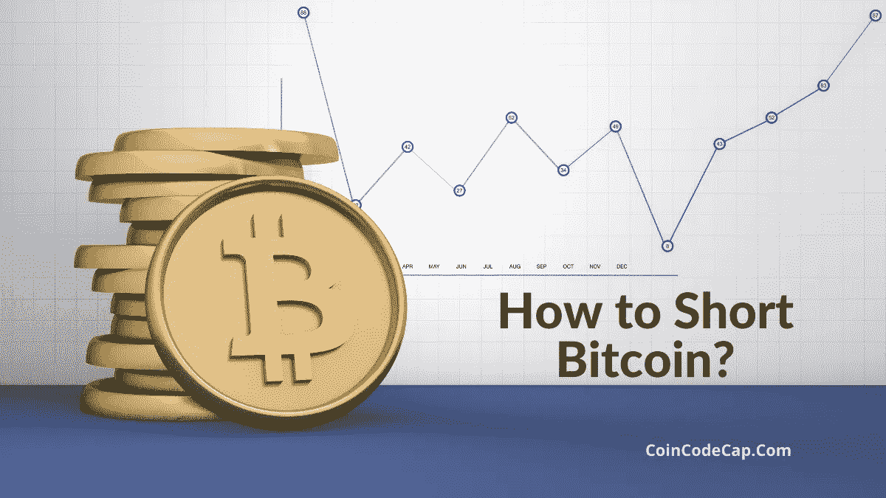
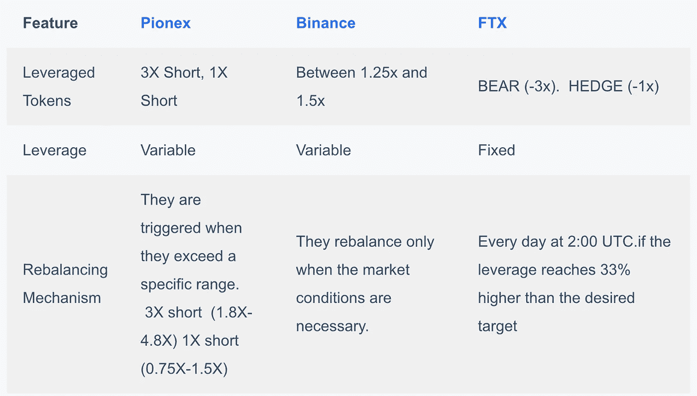
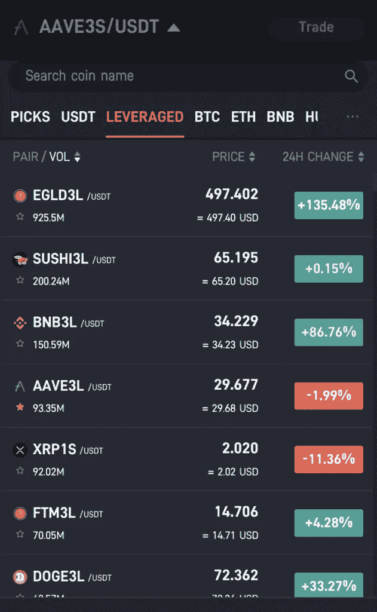
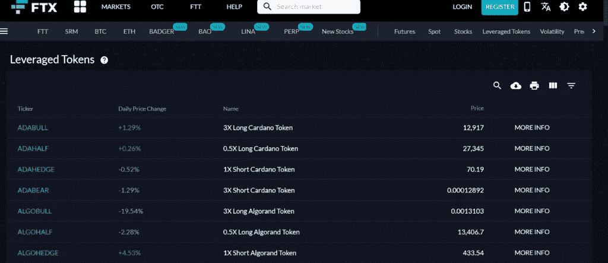

# 如何利用杠杆代币做空比特币？

> 原文：<https://medium.com/coinmonks/how-to-short-bitcoin-568a2d0b4ae5?source=collection_archive---------4----------------------->

## 如何做空币安、FTX 和 Pionex 的比特币？什么是做空加密货币及其风险和收益？

做空允许你借入加密货币，并以当前价格卖出。后来，你必须偿还相同数量的加密货币。如果价格较低，你将获得差价报酬；否则，您必须向您的交易所/经纪人付款。它允许你通过高卖低买来获利。

我们举个例子。你以 10，000 美元的价格借了 10 个 BTC，然后卖掉了它们。后来，你以每支 9000 美元的价格买下了 BTC。当你归还他们十个 BTC 时，你将在一个 BTC 上每个人获利 1000 美元，这样你的总利润是 10，000 美元。

但是如果 BTC 的价格涨到 11，000 美元，到了偿还 BTC 的时候了，你必须支付额外的 10，000 美元。

所以，完全看你对市场方向的预测是正确的还是现在的。

# 如何利用杠杆代币做空比特币？

做空比特币有几种方法，然而，做空比特币最简单的方法是杠杆代币。

[**杠杆代币**](https://blog.coincodecap.com/leveraged-token) 提供杠杆敞口，不考虑要求、保证金、清算风险和管理。代币具有固定或可变的杠杆作用。重新平衡技术因交易所而异。我们来讨论一下提供杠杆代币的前三家交易所——[**【Pionex】**](https://blog.coincodecap.com/go/pionex)[**币安**](https://blog.coincodecap.com/go/binance)[**FTX**](https://blog.coincodecap.com/go/ftx)。

> 此处查表**。**

****

**[**Pionex**](https://blog.coincodecap.com/go/pionex) **vs** [**Binance**](https://blog.coincodecap.com/go/binance) **vs** [**FTX**](https://blog.coincodecap.com/go/ftx)**

## **皮奥克斯**

**[**Pionex**](https://www.pionex.com/) 杠杆代币提供目标杠杆可变的高杠杆敞口。他们使用一种优化的再平衡机制，如果杠杆率超过特定范围，就会触发这种机制。**

**代币使用“硬币+杠杆+多头/空头”命名例如，ETH3S 表示 ETH 短 3x。**

**做空比特币，可以使用以下代币——**

1.  ****3x 空头 Pionex 杠杆代币:**杠杆在 1.8x-4.8x 范围内变动，若超出此范围，Pionex 会将其重新平衡至 3x。**
2.  ****1x 做空 Pionex 杠杆代币**:杠杆在 0.75x-1.5x 范围内变动，若超出此范围，Pionex 会将其重新平衡至 3 倍。**

**此外，您还可以使用内置的[交易机器人](/coinmonks/crypto-trading-bot-c2ffce8acb2a)和杠杆代币。可以根据情况选择使用尾随获利 bot、 [**电网交易**](https://blog.coincodecap.com/grid-trading) Bot，或者 Infinity 电网 Bot。**

****

**资助费每天 0.03%。pionex 杠杆代币的价格取决于现货价格、融资费和再平衡。**

## **币安**

**[**币安**](https://blog.coincodecap.com/go/binance) 提供**币安杠杆代币(BLVT)** ，提供 1.25 倍至 1.5 倍之间的可变杠杆。它们仅在[币安](https://blog.coincodecap.com/go/binance)列出，并且只能存储在您的[币安](https://blog.coincodecap.com/go/binance)账户中。**

**确切的杠杆率是不公开可见的，以防止交易者预期再平衡事件。**

**代币只有在市场条件需要时才会重新平衡。**

**你可以通过在现货市场出售代币或者在 USDT 赎回代币来退出市场。后一种选择成本较高，仅在特殊情况下使用。**

****

# **FTX**

**[**FTX**](https://blog.coincodecap.com/go/ftx) 是第一个引进杠杆代币的 [**密码交易所**](https://blog.coincodecap.com/go/crypto-exchange) 。他们通过交易 FTX 永久期货来获得价格。**

**做空比特币，可以使用**熊(-3x)** 和**对冲(-1x)** 杠杆代币。您可以使用 [FTX](https://blog.coincodecap.com/go/ftx) 通过现货市场买卖杠杆代币，兑换硬币，以及创建/赎回杠杆代币。建议使用现货市场买卖杠杆代币**

**这些令牌每天在世界协调时 2:00 重新平衡。每个代币再投资每天的利润，如果有的话。如果亏损，它会抛售一些头寸，以重获杠杆并避免清算风险。此外，如果杠杆率比预期目标高出 33%，它就会重新平衡。**

**FTX 使用以下三个公式来实现再平衡-**

1.  **期望头寸(DP):[目标杠杆]* NAV/[标的价格]**
2.  **当前头寸(CP):每股标的当前持有量**
3.  **重新平衡大小:(DP—CP)*[未完成的 LT 令牌]**

****

# **使用杠杆代币的风险**

1.  **杠杆代币是高风险产品，如果你对市场没有适当的了解，可能会导致亏损。因此，不建议初学者使用。**
2.  **每个令牌提供的透明度根据[加密交换](https://blog.coincodecap.com/go/crypto-exchange)而变化。**

# **做空比特币的其他方法**

## **1.差价卖空合约( [CFD](https://blog.coincodecap.com/what-is-bitcoin-cfd-trading)**

**在这里，你不必经历购买比特币再出售的麻烦。你开仓和平仓。差价会被计算出来，如果你赚了，你会得到报酬，否则你要支付差价。不过，你必须先付一笔小额的订金。**

## **2.比特币交易所**

**[**加密货币交易所**](https://blog.coincodecap.com/go/crypto-exchange) 允许做空比特币。此外，你也可以使用杠杆做空。杠杆做空风险很大，因为它会放大你的收益和损失。如果你猜对了，利润会很高。一些流行的做空比特币的交易所有北海巨妖、 [Bitfinex](https://blog.coincodecap.com/go/bitfinex) 、Poloniex 等等。**

## **3.比特币期权**

**比特币[期权交易允许](https://blog.coincodecap.com/an-overview-of-binary-options-trading)你在规定的日期范围和价格内买卖比特币。这些合约很复杂，经常使用杠杆，因此推荐给有交易经验的用户。**

## **4.比特币期货**

**比特币期货允许你在特定的日期和价格[买卖比特币](https://blog.coincodecap.com/buy-bitcoin-app-india)。它们是法律合同，你承诺以商定的价格购买一定数量的股票。如果比特币价格按照你的预测在指定日期上涨，你就处于盈利状态。**

## **5.预测市场**

**预测市场是一个允许你对未来事件的结果下注的平台。如果你的预测在特定范围内是正确的，你就会获利；否则，你将失去下注金额。这是一种赌博。一些著名的预测平台是**

*   **[预兆](https://www.augur.net/)**
*   **斯托克**
*   **[灵识](https://gnosis.io/)**
*   **德尔菲**

# **做空比特币:利弊**

**如果你是一个简单的投资者，千万不要尝试做空比特币。**

## **赞成的意见**

1.  **它帮助你在更短的时间内赚取利润。**

## **骗局**

1.  **你要跟着行业的变化来预测加密货币价格的变化。**
2.  **比特币做空风险很大，如果你预测错了市场方向，最终可能会亏损。**

# **如何做空比特币:结论**

**做空比特币可以让你通过低买高卖来获利。你要了解比特币市场才能推测其走向。时机至关重要。如果你是对的，你获利；否则，你必须弥补损失。比特币可以通过比特币交易所、期权、期货、CFD、价差交易、预测市场和杠杆代币来做空。它们是高风险交易，只推荐给高级交易者。**

# **常见问题(FAQ)**

****在哪里做空比特币？****

**你可以利用杠杆代币、期权、期货、差价合约、价差交易和预测市场做空比特币。**

****能不能在** [**【比特币基地】**](https://blog.coincodecap.com/go/coinbase) **上短 BTC？****

**在[比特币基地](https://blog.coincodecap.com/go/coinbase)做空 BTC 是不可能的。**

> **加入 coin monks[Telegram group](https://t.me/joinchat/EPmjKpNYwRMsBI4p)并了解加密交易和投资**

## **另外，阅读**

*   **什么是[闪贷](https://blog.coincodecap.com/what-are-flash-loans-on-ethereum)？**
*   **最好的[密码交易机器人](/coinmonks/crypto-trading-bot-c2ffce8acb2a) | [网格交易](https://blog.coincodecap.com/grid-trading)**
*   **[3 商业评论](/coinmonks/3commas-review-an-excellent-crypto-trading-bot-2020-1313a58bec92) | [Pionex 评论](/coinmonks/pionex-review-exchange-with-crypto-trading-bot-1e459d0191ea) | [Coinrule 评论](https://blog.coincodecap.com/coinrule-review-a-perfect-trading-bot)**
*   **[AAX 交易所评论](/coinmonks/aax-exchange-review-2021-67c5ea09330c) | [德里比特评论](/coinmonks/deribit-review-options-fees-apis-and-testnet-2ca16c4bbdb2) | [FTX 交易所评论](/coinmonks/ftx-crypto-exchange-review-53664ac1198f)**
*   **[n rave 零点回顾](/coinmonks/ngrave-zero-review-c465cf8307fc) | [Phemex 回顾](/coinmonks/phemex-review-4cfba0b49e28) | [PrimeXBT 回顾](/coinmonks/primexbt-review-88e0815be858)**
*   **[Bybit Exchange 审查](/coinmonks/bybit-exchange-review-dbd570019b71) | [Bityard 审查](https://blog.coincodecap.com/bityard-reivew) | [CoinSpot 审查](https://blog.coincodecap.com/coinspot-review)**
*   **[3 commas vs crypto hopper](/coinmonks/3commas-vs-pionex-vs-cryptohopper-best-crypto-bot-6a98d2baa203)|[赚取加密利息](/coinmonks/earn-crypto-interest-b10b810fdda3)**
*   **最好的比特币[硬件钱包](/coinmonks/the-best-cryptocurrency-hardware-wallets-of-2020-e28b1c124069?source=friends_link&sk=324dd9ff8556ab578d71e7ad7658ad7c) | [BitBox02 回顾](/coinmonks/bitbox02-review-your-swiss-bitcoin-hardware-wallet-c36c88fff29)**
*   **[莱杰 vs n 格拉夫](https://blog.coincodecap.com/ngrave-vs-ledger) | [莱杰纳米 s vs x](https://blog.coincodecap.com/ledger-nano-s-vs-x)**
*   **[加密副本交易平台](/coinmonks/top-10-crypto-copy-trading-platforms-for-beginners-d0c37c7d698c) | [比特码副本交易](https://blog.coincodecap.com/bityard-copy-trading)**
*   **[Vauld Review](https://blog.coincodecap.com/vauld-review)|[you hodler Review](/coinmonks/youhodler-4-easy-ways-to-make-money-98969b9689f2)|[BlockFi Review](/coinmonks/blockfi-review-53096053c097)**
*   **最好的[加密税务软件](/coinmonks/best-crypto-tax-tool-for-my-money-72d4b430816b) | [硬币追踪评论](/coinmonks/cointracking-review-a-reliable-cryptocurrency-tax-software-5114e3eb5737)**
*   **最佳[密码借贷平台](/coinmonks/top-5-crypto-lending-platforms-in-2020-that-you-need-to-know-a1b675cec3fa) | [杠杆令牌](/coinmonks/leveraged-token-3f5257808b22)**
*   **[莱杰纳米 S vs 特雷佐 one vs 特雷佐 T vs 莱杰纳米 X](https://blog.coincodecap.com/ledger-nano-s-vs-trezor-one-ledger-nano-x-trezor-t)**
*   **[BlockFi vs Celsius](/coinmonks/blockfi-vs-celsius-vs-hodlnaut-8a1cc8c26630)|[Hodlnaut 回顾](https://blog.coincodecap.com/hodlnaut-review)**
*   **[Bitsgap 审核](https://blog.coincodecap.com/bitsgap-review) | [Quadency 审核](/coinmonks/quadency-review-a-crypto-trading-automation-platform-3068eaa374e1) | [Bitbns 审核](https://blog.coincodecap.com/bitbns-review)**
*   **[埃利帕尔泰坦评论](/coinmonks/ellipal-titan-review-85e9071dd029) | [赛克斯斯通评论](https://blog.coincodecap.com/secux-stone-hardware-wallet-review)**
*   **[DEX Explorer](https://explorer.bitquery.io/ethereum/dex)|[w](https://explorer.bitquery.io/graphql)|[local bitcoins 评论](https://blog.coincodecap.com/localbitcoins-review)**
*   **最佳[区块链分析](https://bitquery.io/blog/best-blockchain-analysis-tools-and-software)工具| [赚比特币](https://blog.coincodecap.com/earn-bitcoin)**
*   **[加密套利](/coinmonks/crypto-arbitrage-guide-how-to-make-money-as-a-beginner-62bfe5c868f6)指南:新手如何赚钱**
*   **最佳[加密制图工具](/coinmonks/what-are-the-best-charting-platforms-for-cryptocurrency-trading-85aade584d80) | [最佳加密交易所](/coinmonks/crypto-exchange-dd2f9d6f3769)**
*   **[如何在印度购买比特币](https://blog.coincodecap.com/buy-bitcoin-app-india)？**
*   **[印度比特币交易所](/coinmonks/bitcoin-exchange-in-india-7f1fe79715c9) | [比特币储蓄账户](https://blog.coincodecap.com/bitcoin-savings-account)**
*   **了解比特币最好的[书籍有哪些？](/coinmonks/what-are-the-best-books-to-learn-bitcoin-409aeb9aff4b)**

> **[直接在您的收件箱中获得最佳软件交易](/coinmonks/newsletters/coinmonks)**

****

***最初发表于 2021 年 3 月 1 日 https://blog.coincodecap.com***。****