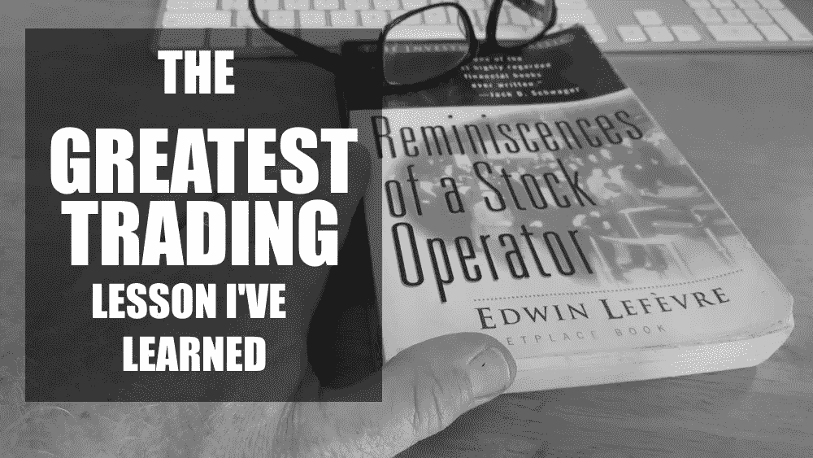
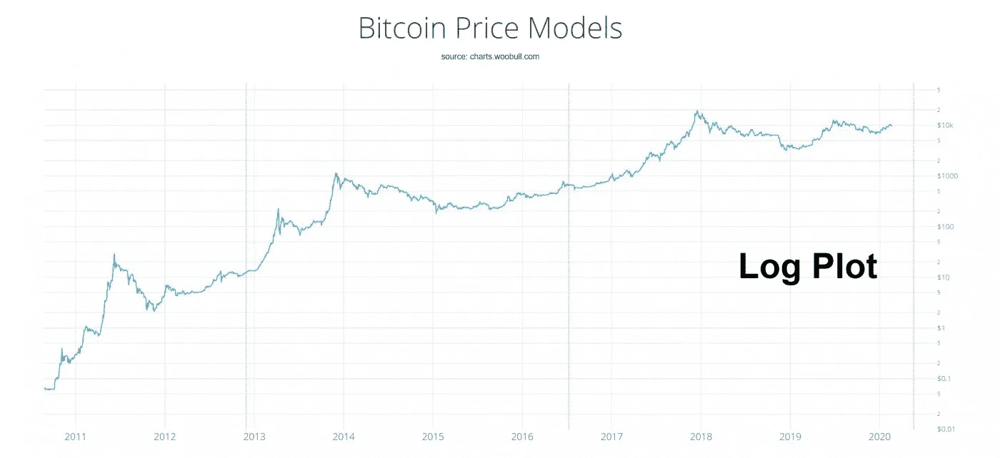
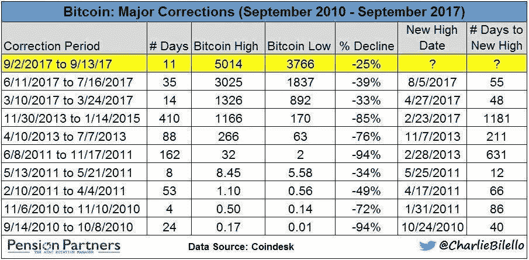

# 如何在加密/区块链中暴涨你的交易利润

> 原文：<https://medium.com/coinmonks/how-to-skyrocket-your-trading-profits-in-crypto-blockchain-e92a184bbe51?source=collection_archive---------5----------------------->

## **(R)演进不会集中**

**杰西·利弗莫尔**

传奇交易员杰西·利弗莫尔(Jesse Livermore)因其在交易时对股市的评论而闻名。他写了经典的投资经典，一个股票操作者的回忆。他最著名的名言之一是，

> “从来不是我的想法让我赚了大钱。总是我坐着。明白了吗？我的坐稳了！在市场上保持正确一点也不困难。你总是会在牛市中发现许多早期的多头，在熊市中发现许多早期的空头。我认识许多人，他们在正确的时间做了正确的事，并在价格处于应该产生最大利润的水平时开始买卖股票。他们的经历总是与我的相符——也就是说，他们没有从中赚到真正的钱。既能正确又能静观其变的人并不多见。”

**站在市场的右边**

这句话的关键在于，你必须处于牛市周期。在熊市期间，股票市场和加密市场可能会大幅下跌。从 2000 年到 2002 年互联网泡沫破裂后，纳斯达克综合指数下跌了 78%。比特币本身自 2010 年以来有过两次-94%的修正。在比特币熊市周期中，比特币 80%左右的修正是正常的。然而，由于其指数价格增长，它仍然是投机史上任何工具价格升值的领导者，即使人们要检查数百年的市场历史。

加密市场仍然相当干净，因此我的指标迄今为止成功预测了 2011 年以来比特币的每一个主要顶部和底部，以及 2013 年以来的实时价格，预测了主要顶部或底部的几周内的价格。这意味着有时从最高点下跌 50%,但在典型的 10 倍或更高的上涨后，你仍然会有巨大的收益。如果你在峰值[比特币](https://blog.coincodecap.com/a-candid-explanation-of-bitcoin/)飙升 10 倍的时候卖出，价格下跌 50%,你仍然会有 5 倍的收益。

*(加上上一次修正了-84%的比特币熊市，从 2017 年 12 月(高点 19666)运行到 2018 年 12 月(低点 3122)。*

比特币的[价格历史显示，在每一个牛市周期中，比特币都比之前的峰值价格上涨了至少 10 倍。50%的修正比 90%的修正好几个数量级。50%的修正需要 100%的收益才能达到收支平衡，而 90%的修正需要 900%的收益才能达到收支平衡。因此，当涉及到价格指数上升的工具时，对数价格图比线性价格图更直观。它使图表眼看到可能超出正常范围的修正。当然，尽管在预测比特币的主要顶部和底部方面有着良好的记录，但过去的结果并不能保证未来的结果，因为市场唯一不变的就是变化。虽然胜算仍在我们这边，但随着更多机构对冲基金加入他们的交易算法，加密市场将变得更加喧闹。但这往往是更短期的，通常在几天内，如果不是几分钟内，所以它应该会在较小程度上影响我自己的股票和 etn 交易头寸，如跟踪比特币价格的 GBTC。](https://blog.coincodecap.com/how-to-get-bitcoin-historical-price)

传奇的仓位交易者 William O'Neil 通常使用 50 和 200 天均线来指导他的交易，这意味着他不受产生大量交易量的短期交易风格的影响。虽然大多数交易者喜欢使用 10 天和 20 天均线，因为它们是短期的，奥尼尔的 50 天和 200 天均线卖出原则让他远离了所有的短期噪音。他还管理着一大笔资金，因此进出股票推动了价格。所以保持一个长期的视野使他能够在仓位上坐得更久，从而交易得更少。

这使他能够在股票上获得很大的收益，因为他经常连续几个月坐在赚钱的股票上。从 1958 年开始，他在少数几只股票上的巨大收益是他长期记录的原因。质量重于数量。在牛市中，他可能会从几只股票开始，然后将名单缩减到表现最好的 3 或 4 只，这样他就可以将所有注意力放在少数几只股票上。由于他的持有时间更长，这意味着有时要忍受股票 200 天移动平均线以下的深度调整。他持有的一只股票在找到主要低点之前，可能会轻易损失 1/3 的价值。价格俱乐部、安进、沃尔玛和好市多是许多这样的例子中的几个。

在当前流动性近乎无限的市场中，我们有许多股票受益于长期卖出规则。我的 7 周原则使用 50 天作为主要的卖出指导，尽管它也可以使用 10 天移动平均线提前获利，这取决于股票的交易情况。使用我的规则，人们可以捕捉到科技巨头如 AMZN、AAPL、MSFT、TSLA 和 NVDA 的大部分收益，正如我在[之前的报告](https://www.virtueofselfishinvesting.com/reports/view/market-lab-report-the-digital-misinformation-age)中所讨论的那样，AMZN 具有最佳的风险/回报特征。更年轻、规模更小的竞争者利用 7 周规则(其特点是更宽松的止损点)表现良好，包括 Zoom Video Communications (ZM)、Docusign (DOCU)、Crowdstrike (CRWD)、Datadog (DDOG)和 Fastly (FSLY)。这些股票极大地利用了 COVID 的情况，这种情况总体上推动了视频会议、在家工作的股票、云平台和在线合作。ZM 为视频会议提供了最无缝的平台之一，其 50-dma 全年都得到支持，甚至在 3 月份的崩盘期间也是如此。DOCU 提供电子签名解决方案，使企业能够创建数字法律文件，避免其 20-马德持有的湿签名的麻烦。为安全解决方案开发软件的 CRWD 也保住了它的第 20 个马德。为客户应用运营边缘云平台的 FSLY 也保持了其 20 马德。DDOG 为企业使用的云应用提供基于 SAAS 的监控，尚未违反其 10-dma。对于这些名字中的任何一个，人们可能会把回调添加到逻辑支持的区域。这可能是由于隔夜的负面消息导致主要平均指数在第二天开盘时下跌。如果股票需要消化大幅上涨，这种情况也可能出现。我们在无数报告中阐述的各种切入点策略会有所帮助。

但谈到股票和 ETF/ETN 市场，我仍然倾向于在 GBTC 增持，一旦发现一个小底部，就在建设性的修正中买入，因为我们正处于比特币的牛市周期，所以它的潜在上涨空间大于大多数股票。当然，如果我们转向加密市场，那么就要找到表现优于比特币的加密货币。但风险水平呈指数级上升，所以如果有人希望更容易接触比特币，这种蓝筹股的波动性远低于许多其他加密技术，并且在整个牛市和熊市周期中仍然是战胜比特币的货币，那么 GBTC 是在主要交易所购买比特币的一种方便而安全的方式。

# **为什么一万是比特币的壁垒？**

有人问为什么比特币难以突破 10000 点。这有四个原因:

1)每当比特币价格升至 10，000 点以上时，现在就有短期卖家在那里，可能正在倒卖一些利润。由于价格减半，矿商也在出售他们的储备。其中一些矿商实力较弱，因此将会倒闭，剩下实力较强的矿商。一旦实力较弱的矿商被淘汰出局，这种出售形式将会终结。这可能是比特币在这次主要牛市中找到一个小低点，并开始回到旧高点的地方。
3)还有一些交易所不断向市场出售他们的比特币利润。由于交易所的交易量不断增长，交易所向市场出售的比特币流量也在增加。

4)最后，比特币市场目前相对平静，因此来自矿商和交易所的抛售压力更容易推高或压低比特币的价格。

最终，我们应该会看到比特币突破 1 万美元大关。就像不断测试主要均线的股票一样，通常敲几下门后，门就会打开。随着无限的流动性至少持续到 2022 年，比特币不应只达到 20，000 美元左右的旧高点，而是开始一轮大牛市，正如它在之前的牛市周期中达到新高后一直做的那样。

由[的克利斯·凯驰博士，汉斯数字接入](https://hansedigitalaccess.com/)，KJA 数字资产投资和[资本上自私投资的美德](http://www.selfishinvesting.com/)。

> [直接在您的收件箱中获得最佳软件交易](https://coincodecap.com/?utm_source=coinmonks)

