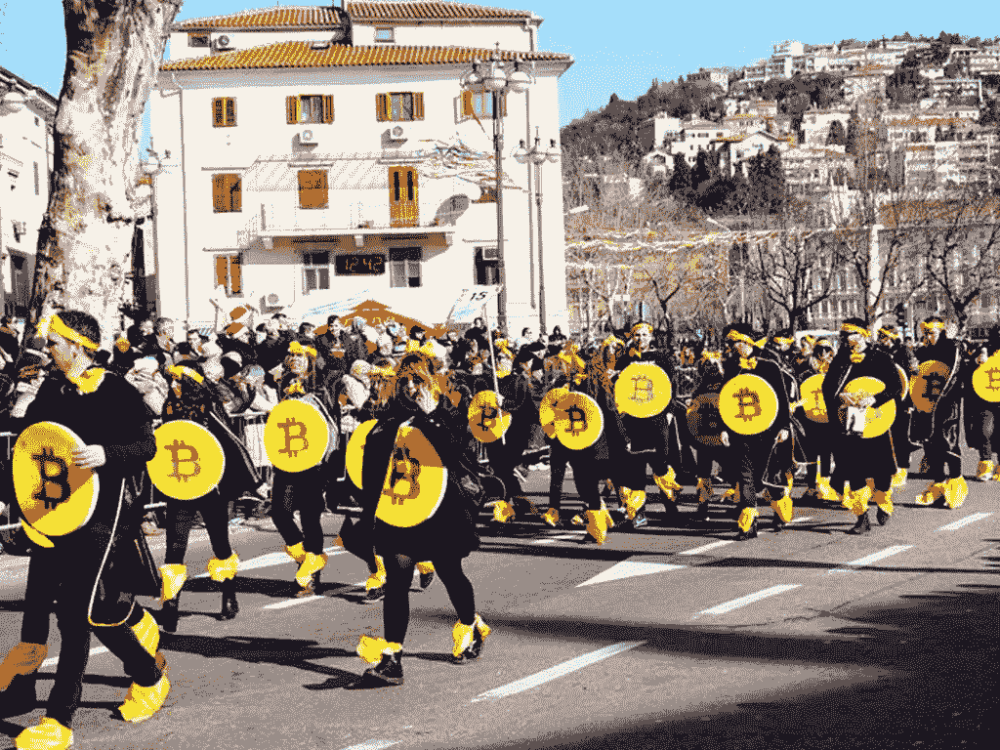

# 如何发现下一次加密货币浪潮

> 原文：<https://medium.com/coinmonks/how-to-spot-the-next-cryptocurrency-wave-c39e01946dfc?source=collection_archive---------0----------------------->

The march to progress was never as smooth as this.

在那个让全球金融体系陷入瘫痪的周末过去十年后，最重要的教训不在于发生了什么变化(几乎没有什么不是装饰性的)，而在于没有发生什么变化。上一次金融危机的主要原因——自欺欺人和非理性繁荣——很可能也是下一次危机的原因。同样的经济条件和政策驱使中本聪写下了…