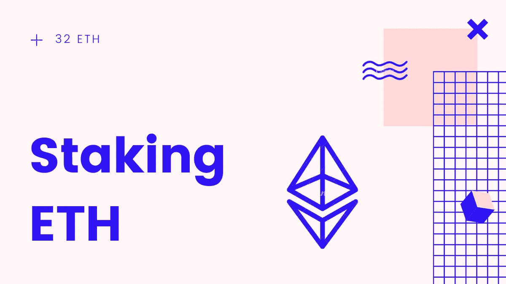

# 如何入股 32 ETH？—最佳实践(ETH2 打桩)

> 原文：<https://medium.com/coinmonks/how-to-stake-32-eth-the-best-practices-eth2-staking-e35dd0de1ff2?source=collection_archive---------3----------------------->

Stake 32 ETH

## 密钥生成/存放流程/ ETH2 设置和标记

**注:**本文是菲尔的[转载作品](https://docs.google.com/document/d/1WZuP-K0S4RKlwH4GQVcGpgzVYPdpZF0WiHsawnmOKxM/edit)，你可以在 Twitter 上联系到他@phil_eth。

***免责声明*** *:请注意，虽然本文中的所有信息都是我所知道的，但有些信息可能不准确、不完整或有误导性。请自行做好尽职调查，使用风险自担。*

我愿意分享我的最佳实践列表，它涉及到存放您的第 32 个 ETH 股份和 ETH2 赌注。这份清单并不完整，很可能不是每个人都同意所有这些观点或认为它们适用于他们，所以当你有疑问时，请做自己的研究或询问你信任的人或有信誉的来源。

我将从一般的基本最佳实践开始，继续讨论更具体的实践，并在最后分享一些关于安全性的先进思想，这些思想可能不适用于每个利益相关者。

# **一般最佳实践:**

**1** 。熟悉在 me dalla testnet(medalla.launchpad.ethereum.org)等 ETH2 测试网或即将建立的测试网上进行存放和打桩的流程和工具。当涉及到真正的利害关系时，这降低了遇到问题的风险。不要急于求成，让自己处于舒适区。

**2** 。确保您从声誉良好的来源获得所需的所有信息，如官方以太坊博客(blog.ethereum.org)、以太坊启动板(launchpad.ethereum.org)，或者从您高度信任并使用官方和审计工具(如启动板和 eth-deposit cli 工具)来生成您的公钥/私钥对的人那里获得。

**3** 。如果你有不明白的地方，不要害怕问。以太坊有一个很大的支持社区。你肯定会在 r/eth taker 或 ethstaker Discord 服务器上得到帮助。但是不要忘记第二点。不要分享任何秘密，时刻警惕骗子或冒名顶替者。

> 试试[QuikNode](https://blog.coincodecap.com/quiknode-review-ethereum-node-and-bitcoin-node):in fura 的替代品

# **关键一代——最佳实践:**

既然我们已经讨论了一般要点，那么让我们回顾一下关于密钥对生成的最佳实践。

**4** 。我建议您在运行实时(linux)发行版/非持久性系统(例如 Ubuntu 或 Tails)的机器上生成您的 staking keypairs，并且在生成过程中，只要您使用非持久性操作系统或硬件打开，该机器就完全脱机并断开连接。

**5** 。使用官方工具来生成密钥，就像以太坊启动面板上概述的那样。如果您使用二进制文件，请检查校验和是否与发行说明中的校验和相匹配。在 linux 上使用 sha256sum NameOfBinary 来查看它们是否匹配。如果你在技术上很成熟，克隆回购协议并从源代码编译/构建。

**6** 。要么写下助记符/种子短语，要么将其加密保存在 u 盘上。确保不能让第三方知道。确保摄像机离线/被覆盖，麦克风关闭。

**7** 。如果您有用于硬件钱包的助记符，您也可以使用相同的助记符。这样，你只需要保持这一个助记安全。将助记符存放在安全的地方。

**8** 。不要在热设备上输入种子短语或存储助记符，这样的设备与外界有连接(或将有连接)。不要在有自动更正功能的字段中键入助记键。不要打印助记符，因为你的打印机可能有永久存储器。

**9** 。尝试从您写下的助记符重新生成您的存款文件和密钥库文件。例如，如果您使用官方的 eth-deposit-cli 工具，请使用命令 existing-mnemonic。查看结果文件是否与原始文件匹配。时间戳和 salts 可能不同，因此检查密钥库文件中的公钥是否匹配。这确保了万一您在存款后丢失了签名密钥，您可以在稍后阶段重新生成它并生成相应的取款密钥。

**10** 。将存放文件和签名密钥/密钥库文件保存在干净的拇指驱动器上。如果您使用正式的 eth2-deposit cli 工具，密钥库将使用您在生成过程中选择的密码进行加密。一定要记住。高级:将存款文件和密钥存储在单独的拇指驱动器上。这样，密钥库只需要连接到实际的标桩机，以便稍后传输签名密钥。

**11** 。安全地销毁你可能已经创建并且不再需要的任何额外的助记符副本。高级:只有在助记符处于安全位置时，才能继续存款过程。在存款过程中你不需要它。

> 同时检查[eth 2 graph QL API](https://bitquery.io/blog/eth2-explorer-api-widgets)

# **存款流程—最佳实践:**

现在您已经安全地生成了您的密钥，让我们回顾一下存款过程的最佳实践。

**12** 。先做一些准备，免得自己不小心 doxx 了。请记住，存款发生在公共区块链。所以所有的短信都是可追踪的。如果你不想让每个人都知道你在运行多少个验证器，确保不要从一个可以(容易地)与你的身份联系起来的地址存款。

这可能包括不从与 ens 名称关联的地址或与您过去使用的地址关联的地址存款。你可能会考虑使用混合器或者把你的资金从交易所转移到一个干净的地址。高级:例如，您可以使用 tornado.cash 和 relayer 选项将资金发送到“干净”的地址。

**13** 。高级:如果你计划存入一个以上的验证器，考虑将你的资金发送到不同的地址，每个地址 32ETH +一点 tx 费用或可变大小的块的倍数。在进行融资和存款交易时，考虑在不同的时间进行。有了所有这些步骤，你就很难将不同的验证器链接到运行/存放它的实体。现在我们已经安全地生成了密钥，资金也准备好了，让我们来谈谈存款过程本身。

**14** 。如果你有一个硬件钱包，从那里发送你的存款。在上述准备步骤中为地址提供资金的过程中，请考虑这一点。

**15** 。使用以太坊存款启动板等官方工具进行存款。

**16** 。确保你了解存款过程的风险和后果。如有疑问，请参见第 3 条。

**17** 。确保您的存款地址是正确的。将你要存入的地址与你从官方和有信誉的来源找到的地址进行三次核对，见第 2 条。存款合同地址应以八个 0 开头，后跟 219，并以 5fa 结尾。但是不要相信我的话，和其他来源核对一下。

**18** 。如果您计划存放许多验证器，请确保使用合适的审计工具，如 ethdo。Esp。如果你想成批存放，比如今天存放 10 个，以后存放 5 个，注意不要意外地存放同一个验证器两次。考虑为每个块生成单独的存放文件，例如在密钥对生成过程中。

**19** 。除了存放工具(如 launchpad)之外，还可以使用 beaconcha.in 或 beaconscan.com 和 eth1 block explorers 等工具来监控存放状态。

# **ETH2 设置&打桩—最佳实践:**

现在，您已经成功地存入了您的赌注，让我们来谈谈赌注本身的最佳实践。

**20** 。考虑运行非多数 ETH1 节点和非多数 ETH2 信标节点，以促进健康的客户端多样性。特别是，运行非主流 ETH2 客户端还降低了与网络其余部分同时发生故障的风险，这在 ETH2 中通常会受到更严重的影响。

**21** 。在 genesis 启动之前，让您的整个设置包括 ETH1 节点、beacon 节点和 validator 客户端都提前设置好，以防出现问题或者您需要重新设置。

**22** 。当在家下注时，考虑一下你是否需要对隐藏你的 ip 采取预防措施。网络分析允许攻击者识别哪些验证器属于哪个机器/信标节点/ ip。有了 ip 地理定位，你甚至可以很容易地找到你下注的位置。使用 vpn 服务或其他方式隐藏您的 ip。

**23** 。更高级(针对“高攻击者”):考虑发送签名的 msg，它可以通过网络分析将验证器链接到 ip /机器，通过一个独立系统上的轻量级 ETH2 网络客户端。您可能希望使用多个这样的轻量级网络客户端来发送签名的 msg(旋转)和/或让它们位于具有旋转 IP 的不同 VPN 上。这降低了目标攻击的风险。

**24** 。当从家里打桩考虑(特别是。常见或高成本)故障情况，如断电或互联网断开。如果您正在运行许多验证器，请考虑建立一个故障转移互联网连接，并考虑安装一个电池 UPS。后者不仅有助于您在断电时保持在线，并且经常保护您的硬件免受电源尖峰的影响，而且还降低了您的 validator db 在断电时被破坏的风险。

**25** 。为了练习，在 testnet 上测试从一个客户机实现到另一个客户机实现的迁移。

**26** 。高级:考虑一下 validator db 的备份过程/进程。如果 validator 数据库中断，一个实时同步备份系统可能会让您头痛。

**27** 。想想你能想到的所有可能影响你的赌注的失败，至少为最常见的失败和失败成本高的失败制定协议。这可能包括准备好冗余/备用硬件，拥有故障转移互联网连接。如果你碰巧住在一个不太可能发生自然灾害的地方，手头要有适当的计划来应对可能发生的破坏。

28 。考虑保护操作系统。设置防火墙并适当设置流量和端口规则。将公开端口的数量减少到最低限度。定期检查系统/软件更新。这尤其意味着你要确保自己了解与 ETH2 相关的问题，如客户端更新、分叉等。

**29** 。当在家下注时，要保持网络硬件的固件是最新的。只打开需要的端口。

**20** 。考虑建立一个监控系统，这样您就可以监控您的验证器和系统健康。建立一个符合您需求的故障事件通知系统。

**31** 。不要只考虑阶段 0，还要教育自己路线图是什么样子的，以及你需要如何调整你的设置。

**32** 。找到满足您需求的最佳定位解决方案。如果你认为自己下注太复杂，不方便，或者你没有足够的资金来下注，那就去了解一下现有的下注服务。

就是这样。这些是我为您提供的 ETH2 定位最佳实践。如果你有一些我没有提到的，请随意评论，我会补充的

荣誉奖:@Hudson:存款过程中不要弄坏账本。:)

## 另外，阅读

*   最好的[加密交易机器人](/coinmonks/crypto-trading-bot-c2ffce8acb2a)
*   [Deribit 审查](/coinmonks/deribit-review-options-fees-apis-and-testnet-2ca16c4bbdb2) |选项、费用、API 和 Testnet
*   [FTX 密码交易所评论](/coinmonks/ftx-crypto-exchange-review-53664ac1198f)
*   最好的比特币[硬件钱包](/coinmonks/the-best-cryptocurrency-hardware-wallets-of-2020-e28b1c124069?source=friends_link&sk=324dd9ff8556ab578d71e7ad7658ad7c)
*   [密码本交易平台](/coinmonks/top-10-crypto-copy-trading-platforms-for-beginners-d0c37c7d698c)
*   最好的[加密税务软件](/coinmonks/best-crypto-tax-tool-for-my-money-72d4b430816b)
*   [最佳加密交易平台](/coinmonks/the-best-crypto-trading-platforms-in-2020-the-definitive-guide-updated-c72f8b874555)
*   最佳[加密贷款平台](/coinmonks/top-5-crypto-lending-platforms-in-2020-that-you-need-to-know-a1b675cec3fa)
*   [block fi vs Celsius](/coinmonks/blockfi-vs-celsius-vs-hodlnaut-8a1cc8c26630)vs Hodlnaut
*   [莱杰 vs 特雷佐](/coinmonks/ledger-vs-trezor-best-hardware-wallet-to-secure-cryptocurrency-22c7a3fd391e)
*   [PrimeXBT 审查](/coinmonks/primexbt-review-88e0815be858) |杠杆交易、费用和交易
*   Bitmex 保证金交易的白痴指南
*   [加密摇摆交易的权威指南](/coinmonks/the-definitive-guide-to-crypto-swing-trading-7e4af6496d4d?source=friends_link&sk=70448050bd9323b42f63bfc0bb1e60d1)
*   [Bitmex 高级保证金交易指南](/coinmonks/bitmex-advanced-margin-trading-guide-2270c195ce25?source=friends_link&sk=1d986cca731f5084b9a2db4a4bc4a7ad)
*   开发人员的最佳加密 API
*   [加密套利](/coinmonks/crypto-arbitrage-guide-how-to-make-money-as-a-beginner-62bfe5c868f6)指南:新手如何赚钱
*   顶级[比特币节点](https://blog.coincodecap.com/bitcoin-node-solutions)提供商
*   最佳[加密制图工具](/coinmonks/what-are-the-best-charting-platforms-for-cryptocurrency-trading-85aade584d80)
*   了解比特币最好的[书籍有哪些？](/coinmonks/what-are-the-best-books-to-learn-bitcoin-409aeb9aff4b)

> [直接在您的收件箱中获得最佳软件交易](https://coincodecap.com?utm_source=coinmonks)

