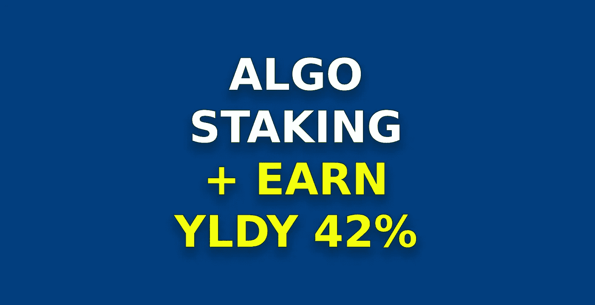

# 如何在 Yieldly 上下注 Algorand 并以 42%的 APY 赢得 YLDY 代币

> 原文：<https://medium.com/coinmonks/how-to-stake-algorand-onyieldly-and-earn-yldy-tokens-at-42-apy-8492de3658d4?source=collection_archive---------0----------------------->

每当我看到人们在网上谈论“赌注加密”，大多数人都喜欢把“赌注”和“牛排”互换。现在，不要误解我的意思，调味好的一餐是美味的 ，尽管我更喜欢吃植物性食物。

不说牛排，就说加密货币跑马圈地吧。