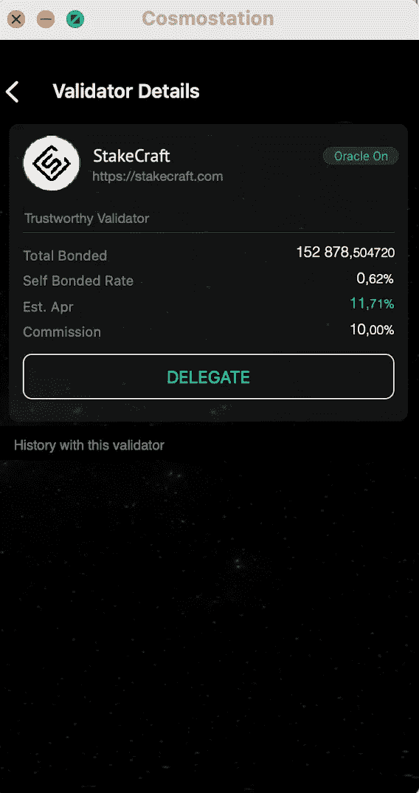

# 如何在 Cosmostation 钱包中绑定 Band 协议[BAND]

> 原文：<https://medium.com/coinmonks/how-to-stake-band-protocol-band-in-cosmostation-wallet-bfd5a2f664bf?source=collection_archive---------3----------------------->

Band 协议[BAND] Band 协议是一个跨链的数据 oracle 平台，它将真实世界的数据和 API 聚合并连接到智能合约。您可以将[BAND]令牌与 BAND 协议区块链绑定，这意味着每个用户可以部署他们的节点(验证器)或将令牌委托给其他验证器，并获得高达 17%的 APY。

我们将解释使用 Cosmostation Wallet 浏览器钱包为您的[BAND]下注的过程有多简单。

# 如何创建一个钱包

## **Cosmostation 钱包是一款非常人性化且易于使用的钱包。它构建在 Cosmos SDK 之上，支持诸如 Cosmos (ATOM)、Band Protocol (BAND)等区块链。**

## 您可以在此下载适用于苹果或安卓设备的钱包:

[***App Store***](https://itunes.apple.com/app/cosmostation/id1459830339?mt=8)

[***Google Play***](https://play.google.com/store%20/apps/details?id=wannabit.io.cosmostaion)

还有一个浏览器版本，但是你不能在网站上创建钱包。您只能通过分类帐或 KeyStation 导入现有的加密 wallet。

我们开始吧。

点击“ ***创建*** ”添加新的钱包，或者如果您已经有一个钱包，点击“**导入**”。如果您添加了现有的钱包，请直接向下滚动到“ ***如何下注【*** 】”部分。

然后选择波段网络。每个网络使用不同的地址格式。如果你选择了错误的区块链，你将无法使用你需要的代币。一些区块链可以支持多个令牌，但是在使用特定的区块链之前需要澄清这一点。

**注意！将助记密码保存在安全的地方！**

助记密码由 12-24 个随机单词组成，如果您需要在存储钱包的设备丢失或出现故障的情况下恢复对钱包的访问，该密码是必需的。

***如果您丢失了您的种子短语，您将无法恢复访问您的钱包，并且您将失去您的资金！***

当你准备好写下你的种子短语时，按“显示助记符”,并按照屏幕上显示的顺序仔细写下单词。在显示种子之前，您可以选择使用由 4 个数字和一个字母组成的 PIN 码来保护钱包。为了保护用户，Cosmostation 钱包不允许在您保存时复制助记密码和截图。

写下种子短语后，点击 ***创建钱包*** ，你的钱包就准备好了。现在发送一些[乐队]令牌到您的钱包。要获取地址，请单击钱包地址旁边的字段并复制它。

当您用一些[BAND]充值后，点击“ ***委托*** ”来兑换[BAND]代币。

验证器列表将会打开。“ ***我的*** ”选项卡将显示您已经委托了令牌的验证器。“***Top”***选项卡显示最大的验证器列表，而“***Other”***选项卡显示不活动的验证器。

转到“**顶部**选项卡，选择您要委托硬币的 StakeCraft 验证器。然后点击验证器继续。

**我们的验证器地址:**

**bandvaloper 1 unfg 2 zhnssl 07t QL 8d 85 ZC 6 rx 7 zsfs 5 qh 206 av**

钱包将显示基本的赌注信息:年盈利能力和验证者收取的佣金。如果您准备好继续，请单击 ***【委托】*** 。

输入要转账的所需[波段]金额。然后点击 ***下一步*** 。

如果需要，输入备忘录。在我们的例子中，这是不必要的，所以我们跳过这一步。

指定佣金费用，我们建议您保留默认设置。

检查交易细节，确认细节是否正确。Cosmostation 钱包提醒您注意，如果您将代币委托给已经向其转移代币的验证者，全部奖励将自动转移到您的钱包中。

恭喜你！我们已经成功地支定了代币。点击 ***完成*** 返回钱包首页。下注的硬币现在将显示在“ ***委托*** ”行中。赢得的代币将显示在“**奖励**行中。

*你诚挚的，*

*桩工队。*

您可以找到我们:

*   [推特](https://twitter.com/stakecraft)
*   [不和谐](https://discord.gg/xkYnNYV4qH)
*   [电报](https://t.me/stakecraft)
*   给我们发电子邮件[Support@stakecraft.com](mailto:Support@stakecraft.com)

 [## 可信验证器

### StakeCraft 是一个在编程、开发和管理数字资产方面拥有丰富经验的极客团队。我们使用顶级…

stakecraft.com\](https://stakecraft.com) 

> 加入 [Coinmonks 电报频道](https://t.me/coincodecap)，了解加密交易和投资

## 另外，阅读

*   [尤霍德勒 vs 科恩洛安 vs 霍德诺特](/coinmonks/youhodler-vs-coinloan-vs-hodlnaut-b1050acde55a) | [隐蝠 vs 哈斯博特](https://blog.coincodecap.com/cryptohopper-vs-haasbot)
*   [币安 vs 北海巨妖](https://blog.coincodecap.com/binance-vs-kraken) | [美元成本平均交易机器人](https://blog.coincodecap.com/pionex-dca-bot)
*   [如何在印度购买比特币？](/coinmonks/buy-bitcoin-in-india-feb50ddfef94) | [WazirX 审核](/coinmonks/wazirx-review-5c811b074f5b) | [BitMEX 审核](https://blog.coincodecap.com/bitmex-review)
*   [比特币主根](https://blog.coincodecap.com/bitcoin-taproot) | [Bitso 评论](https://blog.coincodecap.com/bitso-review) | [排名前 6 的比特币信用卡](/coinmonks/bitcoin-credit-card-bc8ab6f377c6)
*   [双子座 vs 比特币基地](https://blog.coincodecap.com/gemini-vs-coinbase) | [比特币基地 vs 北海巨妖](https://blog.coincodecap.com/kraken-vs-coinbase) | [硬币罐 vs 硬币点](https://blog.coincodecap.com/coinspot-vs-coinjar)
*   [印度密码交易所](/coinmonks/bitcoin-exchange-in-india-7f1fe79715c9) | [比特币储蓄账户](/coinmonks/bitcoin-savings-account-e65b13f92451) | [Paxful 审核](/coinmonks/paxful-review-4daf2354ab70)
*   [杠杆令牌](/coinmonks/leveraged-token-3f5257808b22) | [最佳加密交易所](/coinmonks/crypto-exchange-dd2f9d6f3769) | [AscendEX 评论](/coinmonks/ascendex-review-53e829cf75fa)
*   [Godex.io 评审](/coinmonks/godex-io-review-7366086519fb) | [邀请评审](/coinmonks/invity-review-70f3030c0502) | [BitForex 评审](https://blog.coincodecap.com/bitforex-review) | [HitBTC 评审](/coinmonks/hitbtc-review-c5143c5d53c2)
*   [Crypto.com 费用](/coinmonks/binance-fees-8588ec17965) | [Botcrypto 审查](/coinmonks/botcrypto-review-2021-build-your-own-trading-bot-coincodecap-6b8332d736c7) | [替代方案](https://blog.coincodecap.com/crypto-com-alternatives)
*   [有哪些交易信号？](https://blog.coincodecap.com/trading-signal) | [Bitstamp vs 比特币基地](https://blog.coincodecap.com/bitstamp-coinbase)
*   [ProfitFarmers 回顾](https://blog.coincodecap.com/profitfarmers-review) | [如何使用 Cornix Trading Bot](https://blog.coincodecap.com/cornix-trading-bot)
*   [如何在势不可挡的域名上购买域名？](https://blog.coincodecap.com/buy-domain-on-unstoppable-domains)
*   [印度的秘密税](https://blog.coincodecap.com/crypto-tax-india) | [altFINS 审查](https://blog.coincodecap.com/altfins-review) | [Prokey 审查](/coinmonks/prokey-review-26611173c13c)
*   [布洛克菲 vs 比特币基地](https://blog.coincodecap.com/blockfi-vs-coinbase) | [比特坎评论](https://blog.coincodecap.com/bitkan-review) | [币安评论](/coinmonks/binance-review-ee10d3bf3b6e)