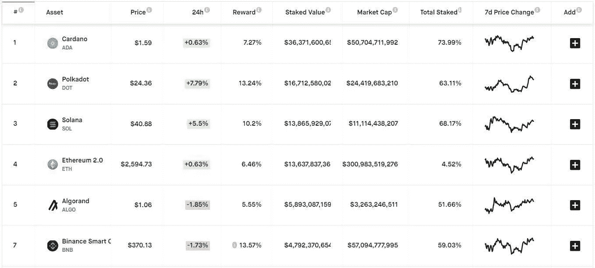
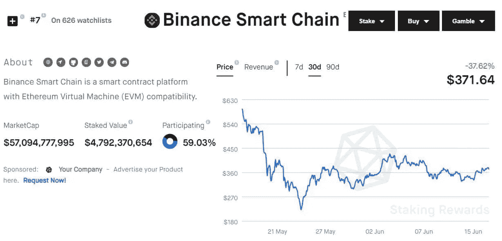
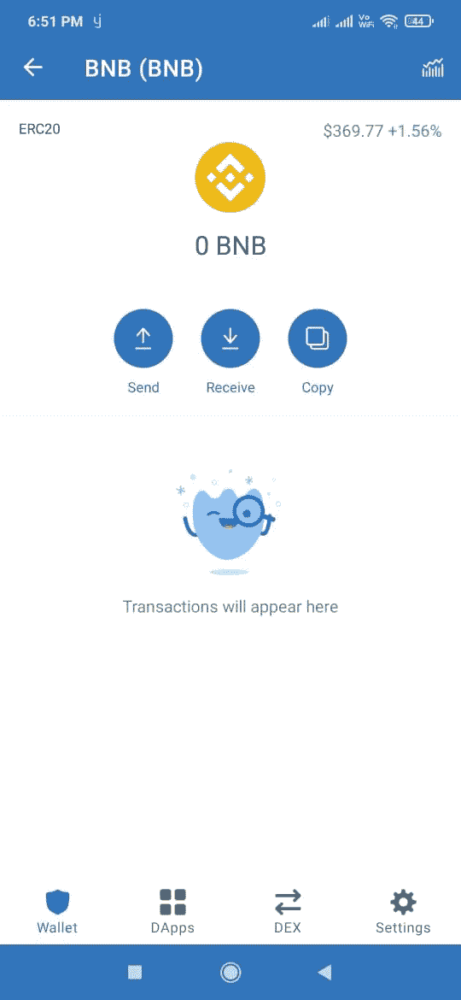
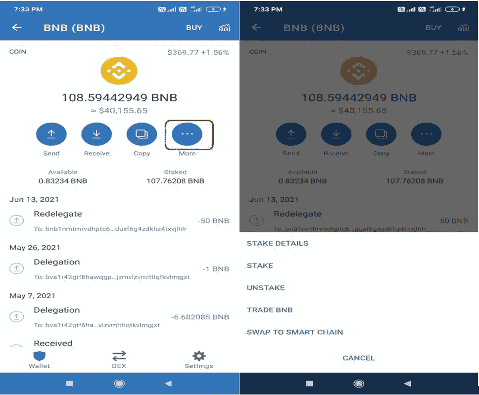
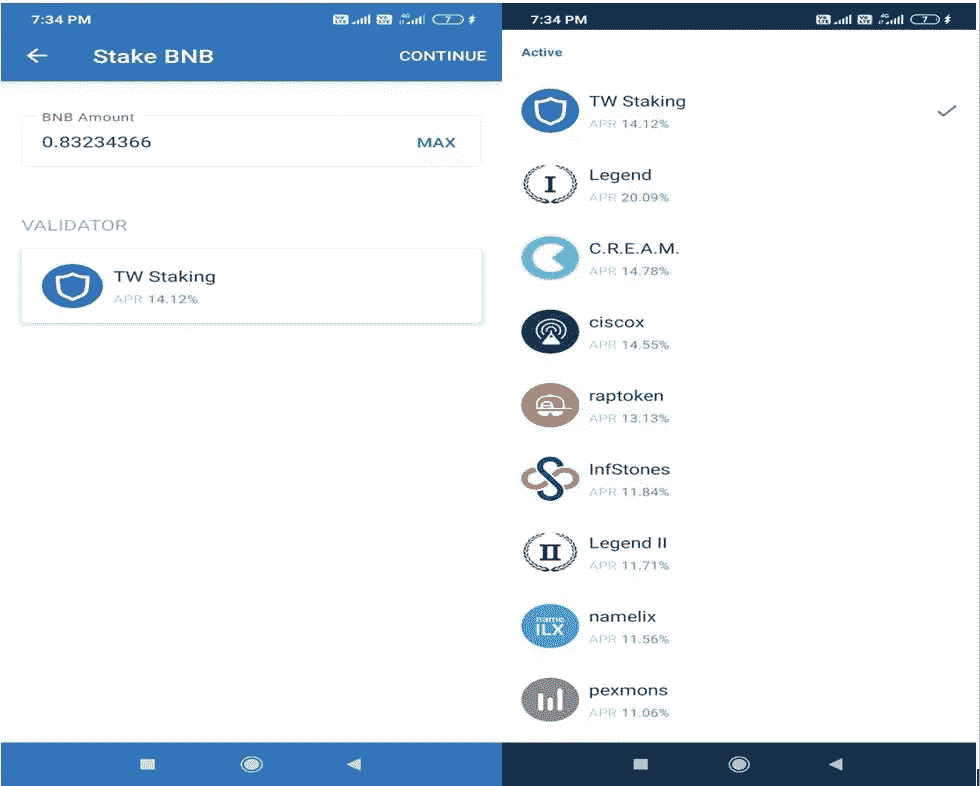
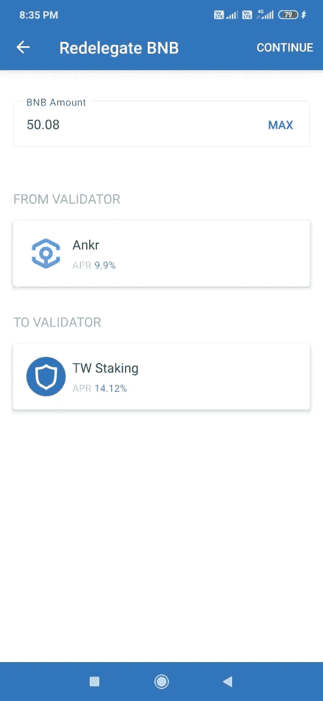
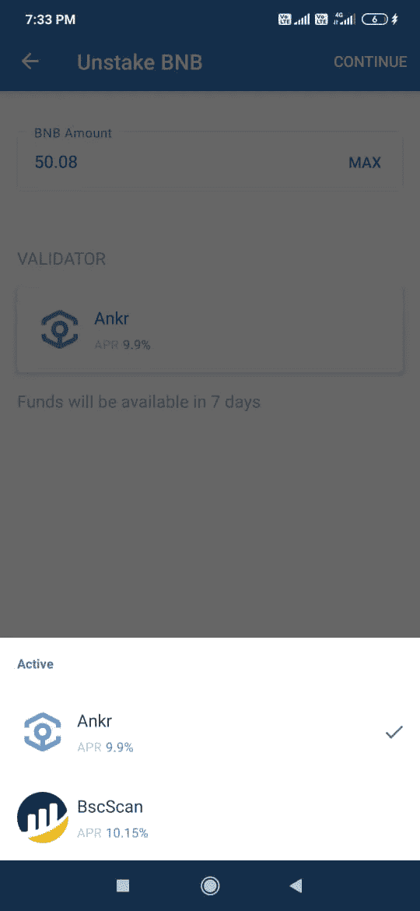

# 如何入股币安硬币(BNB)

> 原文：<https://medium.com/coinmonks/how-to-stake-binance-coin-bnb-a5c322dfdc54?source=collection_archive---------0----------------------->

## 本指南包含如何下注 BNB 代币并赢取奖励的详细步骤。

赌博是赚取额外收入的流行方法之一。你可以把代币押上，每年从中赚取诱人的奖励，而不只是把代币放在钱包里。在这篇文章中，我们将涵盖如何你可以赌注你的 BNB 代币。

我们正在撰写一系列关于如何下注不同代币并赢取奖励的文章。在我以前的文章中，我已经解释了你如何[入股泰佐斯(XTZ](/coinmonks/how-to-stake-tezos-xtz-token-b8f9c5e7c66a) )。在这篇文章中，我们将带你了解在 BNB 下注的详细步骤。

## **关键信息**

建议用户查看 Staking Rewards 网站，确定您一年中在不同代币上可以获得的大致奖励。

您需要选择一个特定的令牌来获得更多关于其标记的详细信息。

例如，如果你想入股 BNB，选择它，你可以看到完整的细节，如市值，和总的赌注价值。

您可以向下滚动页面，找到可用验证器的列表，以及它们的余额、委托地址和它们向用户提供的奖励。

你也可以查看来自 [bscscan](https://bscscan.com/validators) 的验证者列表，并轻松选择领先的验证者，并提供良好的、持续的赌注奖励。

因此，从以上两条信息可以清楚地看出，具有 TW Staking (Trust wallet)的验证器处于领先地位，因此在本指南中，我们将解释如何使用 Trust wallet 移动应用程序对 BNB 进行下注。

**重要提示:**请注意，TW 赌注功能在币安链上可用，因此用户需要在该网络中持有其 BNB 代币。此赌注设施不适用于 ERC-20 标准的 BNB 代币。

对于本指南，我们希望用户正在使用 Trust wallet 移动应用程序。如果你是新用户，你可以阅读我们的指南[如何安装使用信任钱包应用程序](https://www.altcoinbuzz.io/bitcoin-and-crypto-guide/how-to-use-trust-wallet-part-i/)。

正如我们之前提到的，赌注设施仅在币安链上可用，因此在安装信任钱包应用程序时，运行**多硬币**钱包的钱包设置过程，否则该功能将不可见。

例如，对于 ERC-20 BNB，您将不会在您的信托钱包中找到赌注选项。

## **锁定选项**

一旦您设置了多硬币信任钱包应用程序，当您点击 BNB 令牌时，您会发现下面突出显示的按钮。请注意，突出显示的按钮在 ERC-20 标准的 BNB 令牌上不可用。

单击它，它将为您提供执行以下活动的选项:

*   木桩详情
*   桩
*   拆垛

## **股权/授权**

Trust wallet 用户可以使用移动应用程序轻松获得他们的 BNB 令牌。

要下注，只需点击**赌注**选项，并输入您希望下注的金额。接下来，您可以选择您希望将令牌委托给谁的验证器。我们已经解释了如何选择性能最好的验证器。

请注意，用户需要持有 1 BNB 的最小余额用于 TW 锁定。

**股份详情**

您可以在此选项卡中查看您的 BNB 代币的以下详细信息:

*   可用数量
*   总赌注金额
*   最低赌注金额
*   四月(年化利率)
*   锁定期
*   您选择的验证者，以及对该验证者下注的金额

## **重新授权**

如果现有的验证者不执行或者一些其他验证者提供高回报，用户可以重新授权他们的令牌。

要重新委托，只需点击**重新委托**选项(见上面的截图)，将您当前的委托人更改为您想要的委托人。然而，它不允许你在不同的验证者之间划分你的赌注金额。当前验证器中的所有令牌都将移动到新选择的验证器中。

## **拆垛**

用户可以随时取消他们的 BNB 令牌，但该平台规定了 7 天的锁定期。锁定期结束后，您将收到钱包中的代币。

要取消堆叠，单击**取消堆叠**选项，并填写您希望取消堆叠的代币数量。如果您已经将令牌添加到多个验证器，那么您必须选择您希望取消添加的验证器。

## **结论**

赌注为用户提供了一种额外的收入模式。如果你有日常交易活动中不用的代币，那么你可以用这些代币下注。大多数标记没有任何最小的锁定标准，然而，在 BNB-TW 锁定的情况下，几乎没有约束。用户需要在币安链上至少持有 1 个 BNB。平台也有 7 天的锁定期。因此，如果你持有一些 BNB，你可以通过你的 Trust wallet 应用程序享受这种赌注设施，并获得额外的收入。

**资源:** [信任钱包](https://trustwallet.com/)

**阅读更多:** [什么是 Web 3 经济](https://ruma-das.medium.com/what-is-web-3-economy-116eb2b73cf)

***注:*** *本帖首发* [*此处*](https://www.altcoinbuzz.io/passive-income/staking/how-to-stake-binance-coin-bnb/) *同*[*ltcoinBuzz*](https://www.altcoinbuzz.io/)**。**

***通过我的推荐加入***

*[Crypto.com](https://binance.com/en/register?ref=E8PCD3AF)——[币安](https://platinum.crypto.com/r/sut3pd9bzn)*

*跟我来*

***👉** [推特](https://twitter.com/rumadas123)*

***👉**[**Linkedin**](https://www.linkedin.com/in/ruma-das-a1439320/)*

*   *****附属链接包括*****

> ***加入 Coinmonks [电报频道](https://t.me/coincodecap)和 [Youtube 频道](https://www.youtube.com/c/coinmonks/videos)获取每日[加密新闻](http://coincodecap.com/)***

## ***另外，阅读***

*   ***[复制交易](/coinmonks/top-10-crypto-copy-trading-platforms-for-beginners-d0c37c7d698c) | [加密税务软件](/coinmonks/crypto-tax-software-ed4b4810e338)***
*   ***[网格交易](https://coincodecap.com/grid-trading) | [加密硬件钱包](/coinmonks/the-best-cryptocurrency-hardware-wallets-of-2020-e28b1c124069)***
*   ***[密码电报信号](http://Top 4 Telegram Channels for Crypto Traders) | [密码交易机器人](/coinmonks/crypto-trading-bot-c2ffce8acb2a)***
*   ***[最佳加密交易所](/coinmonks/crypto-exchange-dd2f9d6f3769) | [印度最佳加密交易所](/coinmonks/bitcoin-exchange-in-india-7f1fe79715c9)***
*   ***[开发人员最佳加密 API](/coinmonks/best-crypto-apis-for-developers-5efe3a597a9f)***
*   ***最佳[密码借贷平台](/coinmonks/top-5-crypto-lending-platforms-in-2020-that-you-need-to-know-a1b675cec3fa)***
*   ***[免费加密信号](/coinmonks/free-crypto-signals-48b25e61a8da) | [加密交易机器人](/coinmonks/crypto-trading-bot-c2ffce8acb2a)***
*   ***[杠杆代币的终极指南](/coinmonks/leveraged-token-3f5257808b22)***
*   ***[Bookmap 评论](https://coincodecap.com/bookmap-review-2021-best-trading-software) | [美国 5 大最佳加密交易所](https://coincodecap.com/crypto-exchange-usa)***
*   ***最佳加密[硬件钱包](/coinmonks/hardware-wallets-dfa1211730c6) | [Bitbns 评论](/coinmonks/bitbns-review-38256a07e161)***
*   ***[新加坡十大最佳加密交易所](https://coincodecap.com/crypto-exchange-in-singapore) | [购买 AXS](https://coincodecap.com/buy-axs-token)***
*   ***[红狗赌场评论](https://coincodecap.com/red-dog-casino-review) | [Swyftx 评论](https://coincodecap.com/swyftx-review) | [CoinGate 评论](https://coincodecap.com/coingate-review)***
*   ***[投资印度的最佳密码](https://coincodecap.com/best-crypto-to-invest-in-india-in-2021)|[WazirX P2P](https://coincodecap.com/wazirx-p2p)|[Hi Dollar Review](https://coincodecap.com/hi-dollar-review)***