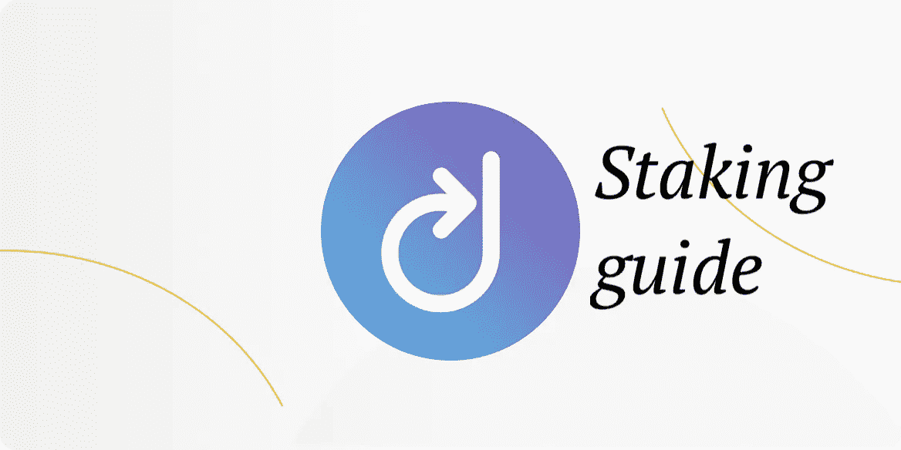
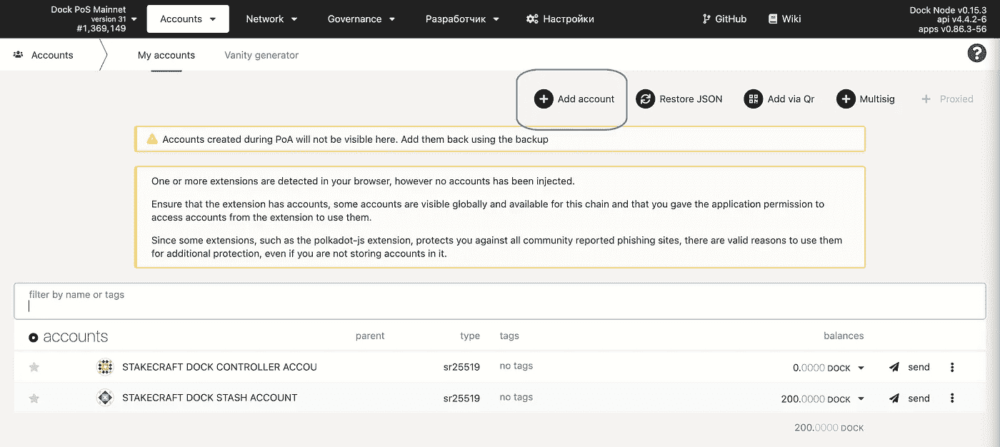
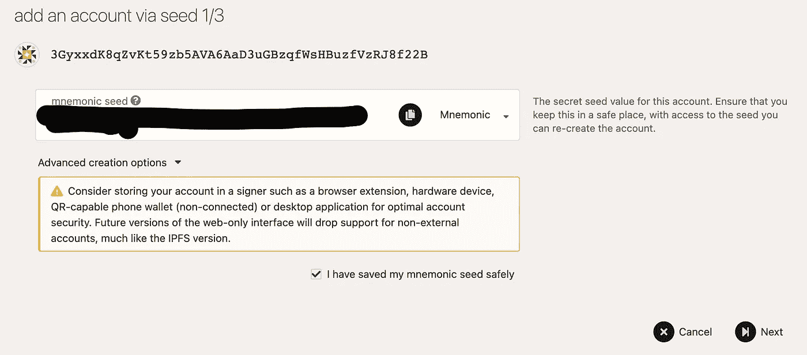
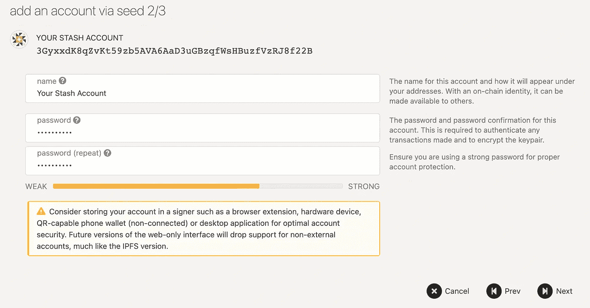
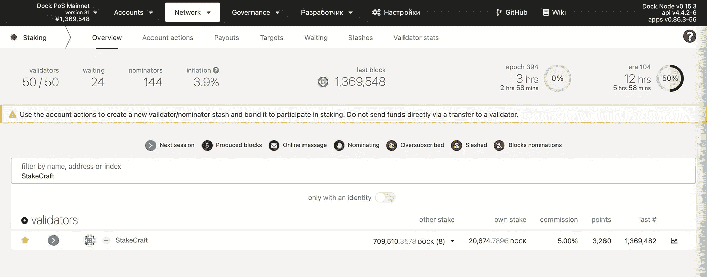
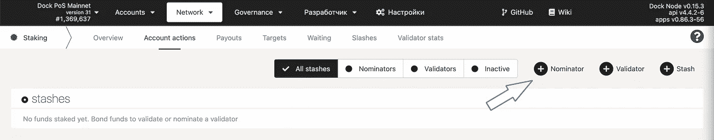
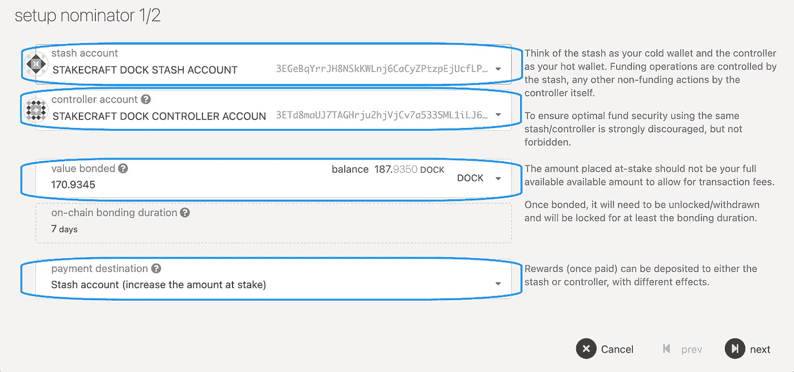
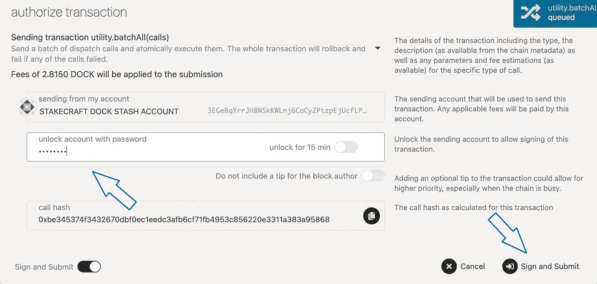
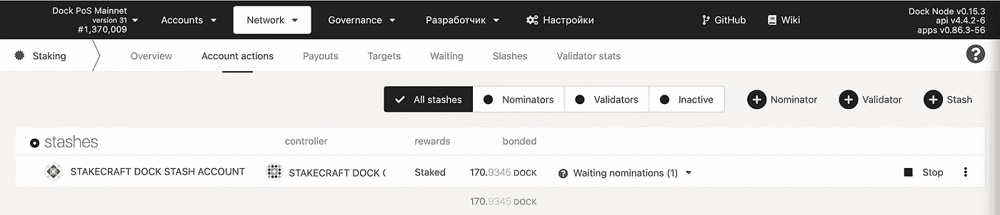
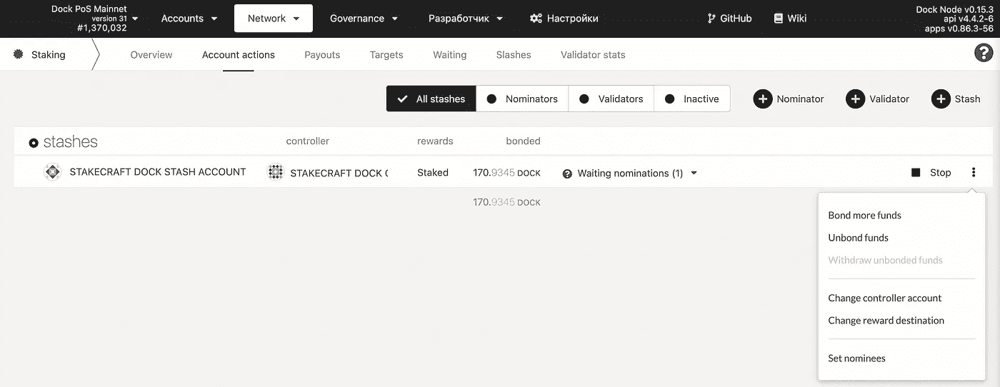

# 如何与 Polkadot JS 进行对接

> 原文：<https://medium.com/coinmonks/how-to-stake-dock-with-polkadot-js-52a99737d956?source=collection_archive---------9----------------------->

这一步一步的指南将向你解释如何简单的过程中，你可以如何桩你的码头。

**创建一个码头藏匿账户**

首先，打开[波尔卡多特 JS 网页](https://fe.dock.io/#/accounts)。如果您没有帐户，那么您必须创建一个。我们需要两个账户——控制者账户和隐藏账户。

点击“添加账户”，仔细记下你的助记种子短语。

***记住了！写下你的助记种子短语并安全保存。* ***谁能获得助记符种子，谁就能获得你的资金！*****

点击“下一步”。命名您的隐藏帐户，设置一个 ***强密码*** 。点击“下一步”

下一步，您将被要求保存钱包的*。json-file。把它保存在安全的地方。如果您需要恢复对钱包的访问，您可能需要它。

**创建码头控制器账户**

请重复您创建 Stash 帐户时的相同步骤。

赌上你的码头令牌

在开始提名过程之前，从你的账户中取出一些资金到你的控制账户，以支付交易费用。

要开始锁定过程，请单击网络下拉菜单中的锁定。然后，访问帐户操作选项卡，并单击+提名者-按钮。

您可以在“锁定”菜单中的“帐户操作”选项卡下执行所有锁定操作

相应地选择 Stash & Controller 帐户，选择一个少于您拥有的 DOCK 总金额的金额，这样您就有一些余额来支付交易费用。交易费目前约为 2.045 码头，但它们是基于各种因素的动态变化，包括最近的区块负载。

所以一定要在你的账户里留些钱。邦德 a max。95%的代币，以便您仍然能够支付交易费用。

在付款目的地下选择您的奖励目的地帐户。

然后单击“下一步”绑定您的令牌。

Do not forget to leave some unbonded tokens for transaction fees

您最多可以提名 16 位验证者。只需通过点击左侧框中的验证器来选择您所选择的验证器。您可以通过再次单击它们，从右边的框中取消选择它们。或者，您也可以使用顶部的搜索栏，通过名称或地址来查找特定的验证器。

***我们的验证器地址:***

***3c ssqkyzdlsumnghuzcnyryw 7 z8v 4 Q1 kku 91 uivvjplkkb***

请注意，您不能指定委托给特定验证者的金额。您的保税码头将根据 NPoS 算法分布在您选择的验证器中。

**选择 StakeCraft 验证器。**

在以下窗口中，输入您的密码，然后点击签署交易以结束您的提名。

最后，你现在是 Dock.io 网络上的提名人了！

您的提名将在下一个纪元生效(最多 6 小时)。

**管理您的码头打桩作业**

您可以使用 Polkadot JS 管理您的标桩操作。在赌注菜单中，单击帐户操作，然后单击最右边的三个点来执行以下操作:

债券更多的资金

解开束缚

更改控制器帐户

更改奖励目的地

设置被提名者

在帐户操作选项卡下管理您帐户的赌注操作

请注意，如果您已经绑定了代币，需要 7 天时间才能解除绑定。一旦您的代币解除绑定，您需要进行另一次交易，即取消绑定，以便能够转移您的资金。

什么是有效提名、无效提名或等待提名？

有效提名&无效提名是当前有效验证程序集中您的提名的验证程序。一般来说，只有一个验证器会显示为活动的。这是因为用来分配你的赌注的算法被优化了，所以集合中的每个验证者都有大致相同数量的赌注支持他/她。因此，你的股份通常只支持你提名的验证者之一。

等待提名是当前不在活动集中的验证器。

*你诚挚的，*

*桩工队。*

您可以找到我们:

*   [推特](https://twitter.com/stakecraft)
*   [不和](https://discord.gg/xkYnNYV4qH)
*   [电报](https://t.me/stakecraft)
*   给我们发电子邮件[Support@stakecraft.com](mailto:Support@stakecraft.com)

 [## 可信验证器

### StakeCraft 是一个在编程、开发和管理数字资产方面拥有丰富经验的极客团队。我们使用顶级…

stakecraft.com](https://stakecraft.com) 

> 加入 [Coinmonks 电报频道](https://t.me/coincodecap)，了解加密交易和投资

## 也阅读

 [## 最佳加密交易所| 2021 年十大加密货币交易所

### 加密货币交易所的加密交易需要了解市场，这可以帮助你获得利润…

blog.coincodecap.com](https://blog.coincodecap.com/crypto-exchange)  [## 2021 年 9 大最佳加密借贷平台

### 当谈到加密货币贷款时，大量因素等同于良好的收入状况。此外，借款的一部分…

blog.coincodecap.com](https://blog.coincodecap.com/crypto-lending)  [## 2021 年最佳加密交易机器人(免费和付费)

### 2021 年币安、比特币基地、库币和其他密码交易所的最佳密码交易机器人。四进制，位间隙…

medium.com](/coinmonks/crypto-trading-bot-c2ffce8acb2a)