# 如何用波尔卡多特 JS 入股 FIS

> 原文：<https://medium.com/coinmonks/how-to-stake-fis-with-polkadot-js-1b663c4760cd?source=collection_archive---------3----------------------->

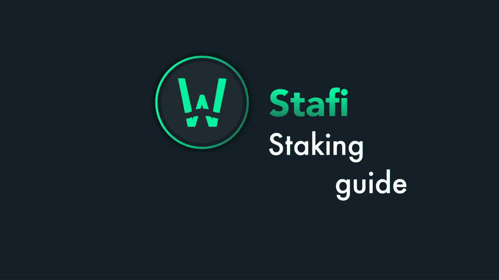

这一步一步的指南将向你解释如何简单的过程中，你可以把你的 FISs。

**创建一个 FIS 藏匿账户**

首先，打开[波尔卡多特 JS 网页](https://apps.stafi.io/#/accounts)。如果您没有帐户，那么您必须创建它。我们需要两个账户——控制者账户和隐藏账户。

点击“添加账户”，仔细记下你的助记种子短语。

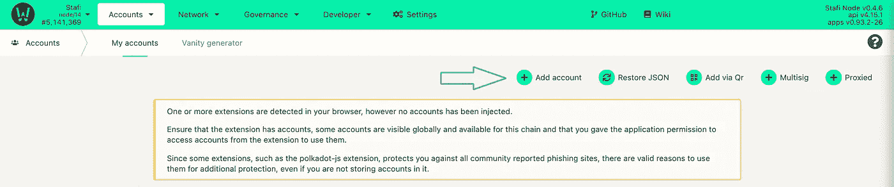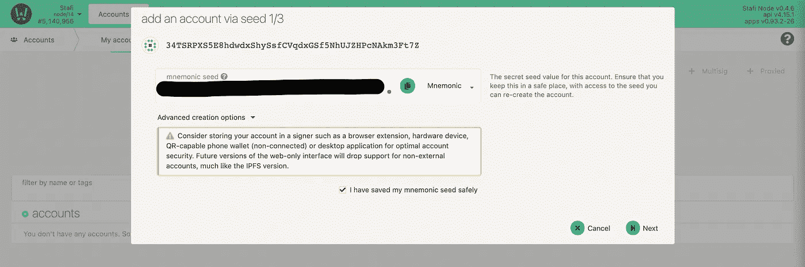

***记住了！写下你的助记种子短语，并妥善保存。谁能接触到助记种子，谁就能接触到你的资金！***

点击“下一步”。给你的账户命名，设置一个强密码。点击“下一步”

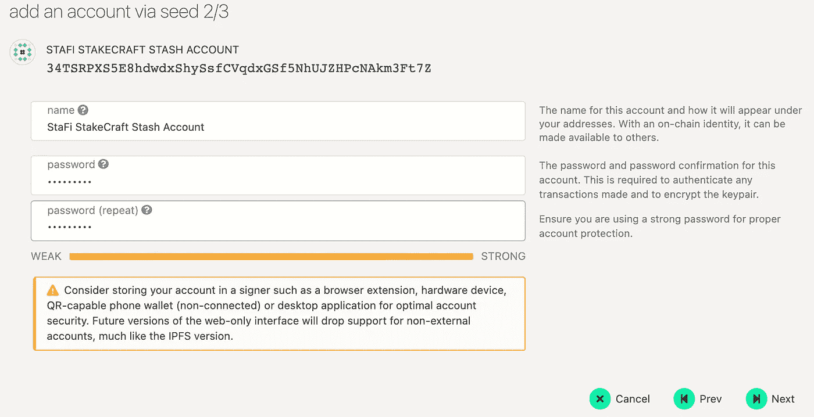

下一步，您将被要求保存钱包的*。json-file。把它保存在安全的地方。如果您需要恢复对钱包的访问，您可能需要它。

**创建 FIS 控制人账户**

请重复您创建 Stash 帐户时的相同步骤。

**用你的 FIS 代币下注**

在开始提名过程之前，从你的账户中取出一些资金到你的控制账户，以支付交易费用。

要开始锁定过程，请单击网络下拉菜单中的锁定。然后，访问帐户操作选项卡，并单击+提名者-按钮。

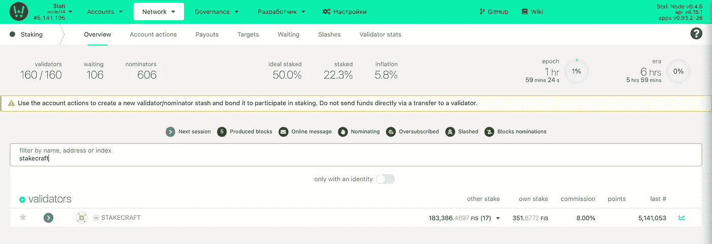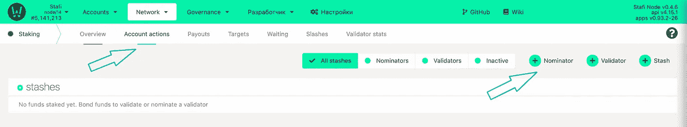

您可以在“锁定”菜单中的“帐户操作”选项卡下执行所有锁定操作。

相应地选择 Stash & Controller 账户，选择一个少于你拥有的 FIS 总额的金额，这样你就有一些剩余来支付交易费用。

邦德 a max。95%的代币，以便您仍然能够支付交易费用。

在付款目的地下选择您的奖励目的地帐户。

然后单击“下一步”绑定您的令牌。

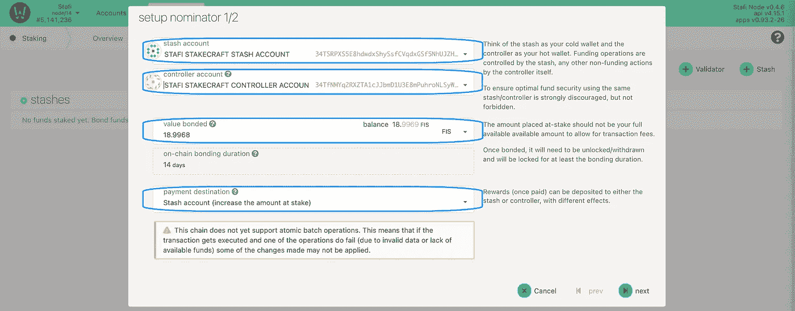

Do not forget to leave some unbonded tokens for transaction fees

您最多可以提名 16 位验证者。只需通过点击左侧框中的验证器来选择您所选择的验证器。您可以通过再次单击它们，从右边的框中取消选择它们。或者，您也可以使用顶部的搜索栏，通过名称或地址来查找特定的验证器。

***我方验证器地址:***

***34 yzcbsy 6 ujkmcma 1 cjvueengywswnqfqcejaamf 16 V7 seuk***

请注意，您不能指定委托给特定验证者的金额。根据 NPoS 算法，您的保税货物将在您选择的验证器中进行分配。

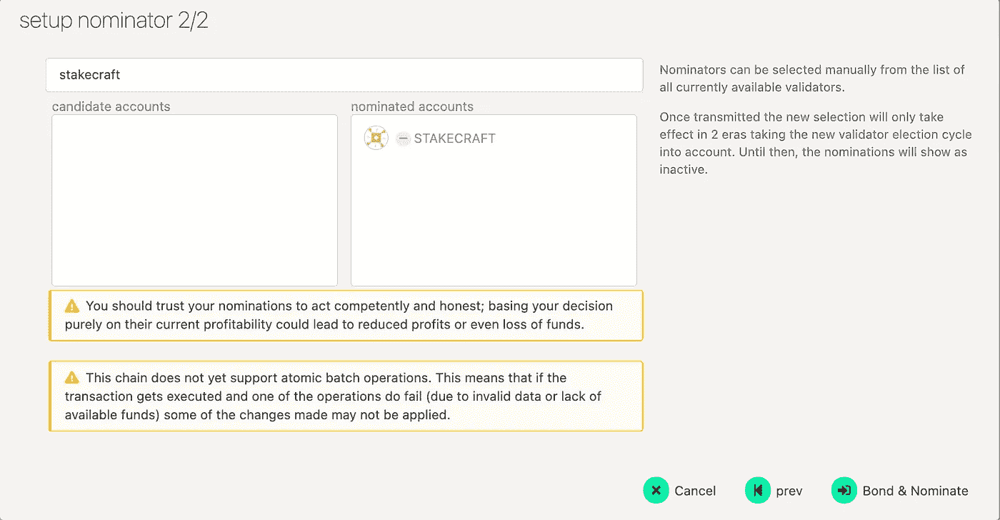

**选择 StakeCraft 验证器。**

在以下窗口中，输入您的密码，然后点击签署交易以结束您的提名。

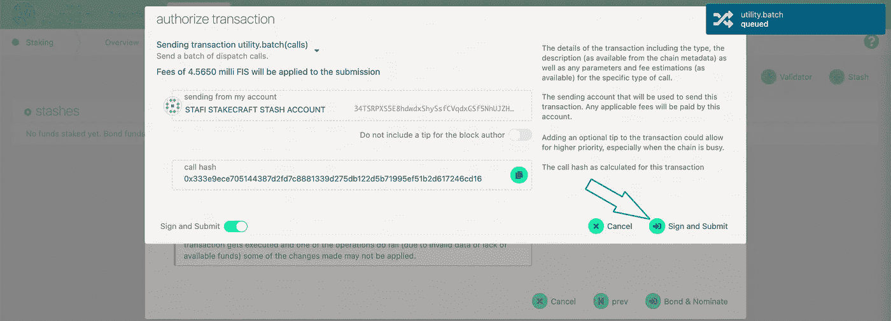

最后，你现在是 StaFi 网络的提名人了！

您的提名将在下一个纪元生效(最多 6 小时)。

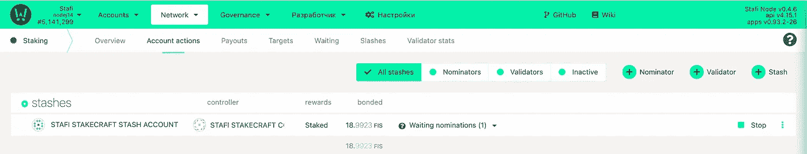

**管理您的 FIS 标桩业务**

您可以使用 Polkadot JS 管理您的标桩操作。在赌注菜单中，单击帐户操作，然后单击最右侧的三个点以执行以下操作:

债券更多的资金

解开束缚

更改控制器帐户

更改奖励目的地

设置被提名者

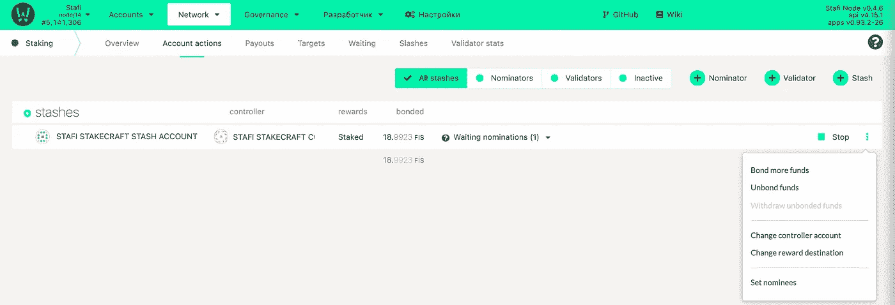

在帐户操作选项卡下管理您帐户的赌注操作

请注意，如果您已经绑定了代币，需要 7 天时间才能解除绑定。一旦您的代币解除绑定，您需要进行另一次交易，即取消绑定，以便能够转移您的资金。

什么是有效提名、无效提名或等待提名？

有效提名&无效提名是当前有效验证程序集中您的提名的验证程序。一般来说，只有一个验证器会显示为活动的。这是因为用来分配你的赌注的算法被优化了，所以集合中的每个验证者都有大致相同数量的赌注支持他/她。因此，你的股份通常只支持你提名的验证者之一。

等待提名是当前不在活动集中的验证器。

你真诚的，

木桩小组。

您可以找到我们:

[推特](https://twitter.com/stakecraft)

[不和](https://discord.gg/xkYnNYV4qH)

[电报](https://t.me/stakecraft)

给我们发电子邮件[Support@stakecraft.com](mailto:Support@stakecraft.com)

 [## 可信验证器

### StakeCraft Validator 提供服务，让用户从他们的数字资产中获利，提供高…

stakecraft.com](https://stakecraft.com) 

> 加入 [Coinmonks 电报频道](https://t.me/coincodecap)，了解加密交易和投资

## 也阅读

 [## 最佳加密交易所| 2021 年十大加密货币交易所

### 加密货币交易所的加密交易需要了解市场，这可以帮助你获得利润…

blog.coincodecap.com](https://blog.coincodecap.com/crypto-exchange)  [## 2021 年 9 大最佳加密借贷平台

### 当谈到加密货币贷款时，大量因素等同于良好的收入状况。此外，借款的一部分…

blog.coincodecap.com](https://blog.coincodecap.com/crypto-lending)  [## 2021 年最佳加密交易机器人(免费和付费)

### 2021 年币安、比特币基地、库币和其他密码交易所的最佳密码交易机器人。四进制，位间隙…

medium.com](/coinmonks/crypto-trading-bot-c2ffce8acb2a)