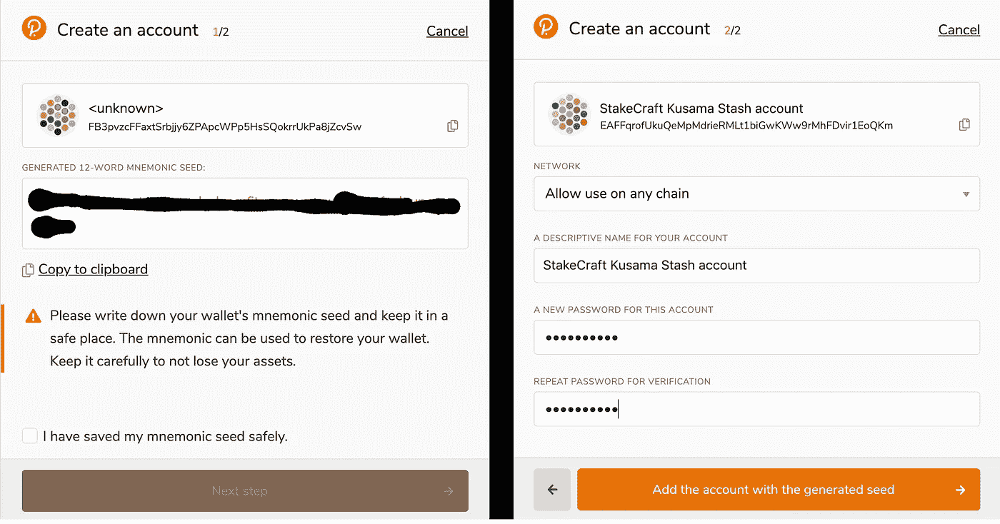

# 如何用 Polkadot JS & Polkadot 浏览器扩展来支持草间弥生

> 原文：<https://medium.com/coinmonks/how-to-stake-kusama-with-polkadot-js-the-polkadot-browser-extension-befbf9ee6db0?source=collection_archive---------4----------------------->

## 这份循序渐进的指南将向您解释如何投资 KSM 的过程有多简单。

KSM(草间弥生令牌)是草间弥生区块链的本地令牌，使用 Polkadot JS 和 Polkadot 浏览器扩展。

***记住了！*** *写下你的助记种子短语并安全地储存起来。* ***谁能获得助记种子，谁就能获得你的资金！***

由于 Polkadot / Kusama 建议大多数用户使用 Polkadot.js 浏览器扩展来创建他们的地址，所以我们将重点放在这种方法上。如果你想探索其他选择，请看这里。

在开始之前，请确保安装 Polkadot.js 浏览器扩展。可以下载 [Chrome/Brave](https://chrome.google.com/webstore/detail/polkadot%7Bjs%7D-extension/mopnmbcafieddcagagdcbnhejhlodfdd?hl=en) 和 [FireFox](https://addons.mozilla.org/en-US/firefox/addon/polkadot-js-extension/) 的扩展。

如果你参加了波尔卡多特 ICO，你可以要求等量的 KSM，草间弥生网络的本地令牌。在这里了解如何。

**创建草间弥生藏匿账户**

成功安装扩展后，点击浏览器栏中橙色的小 P 按钮打开界面。单击右上角的小齿轮图标，然后在显示地址格式下选择草间弥生(金丝雀)。之后，点击加号图标，然后点击创建新帐户。

写下你的助记种子短语，并妥善保存。谁能得到助记种子，谁就能得到你的资金！选中底部的框，然后单击下一步。为您的 Stash 帐户选择一个描述性名称。然后单击添加带有生成种子的帐户。

Never share your Mnemonic Seed Phrase!

现在你可以看到你的草间弥生帐户已经成功创建。现在，您还可以在 Accounts 下的 Polkadot JS 中找到地址——如果不是这样，请重新加载页面。您现在可以向该帐户注资。

**创建一个草间弥生控制者账户**

为了成功地绑定您的资金并指定您的验证器集，您需要一个单独的帐户，即您的控制器帐户。您将使用此帐户执行日常的赌注操作，如更换验证机或申领奖励。

要创建您的控制器帐户，请使用 Polkadot 浏览器扩展。单击右上角的加号图标。然后单击创建新帐户(根帐户或派生帐户)。

现在你有两个选择:

1.从您的现有帐户派生新帐户:它将使用派生帐户的相同种子(助记短语)来访问。

2.用新种子创建一个新帐户:新帐户将独立于旧帐户，并有一个单独的种子(助记短语)

我们建议您选择第二个选项，因为我们希望有独立的键，这就是为什么我们必须取消选中顶部的框。然后，单击从新种子创建帐户。

写下你的助记种子短语并妥善保存。谁能得到助记种子，谁就能得到你的资金！勾选底部的复选框，然后点击下一步。在下一个窗口中，为您的控制器帐户选择一个描述性名称以及一个强密码。然后单击添加带有生成种子的帐户。

How to create a Kusama Controller Account. Again, never share your Mnemonic Seed Phrase!

现在你可以看到你的草间弥生控制器帐户已经成功创建。现在，您还可以在 Accounts 下的 Polkadot JS 中找到地址——如果不是这样，请重新加载页面。

**下注你的 KSM 代币**

在[波尔卡多特 JS 网站](https://polkadot.js.org/apps/#/explorer)上，确保你已经连接到草间弥生主网。您可以通过单击屏幕左上角的网络符号来更改网络。

Make sure to choose Kusama network

在开始提名过程之前，从你的账户中取出一些资金到你的控制账户，以支付交易费用。

要开始锁定过程，请单击网络下拉菜单中的锁定。然后，访问帐户操作选项卡，并单击+提名者-按钮。

您可以在“锁定”菜单中的“帐户操作”选项卡下执行所有锁定操作

相应地选择储存和控制账户，选择您想要用于价值抵押下的赌注的 KSM 数量。确保在你的账户里留一些钱。邦德 a max。95%的代币，以便您仍然能够支付交易费用。

在付款目的地下选择您的奖励目的地帐户。

然后单击“下一步”绑定您的令牌。

Do not forget to leave some unbonded tokens for transaction fees

您最多可以提名 16 位验证者。只需通过点击左侧框中的验证器来选择您所选择的验证器。您可以通过再次单击它们，从右边的框中取消选择它们。或者，您也可以使用顶部的搜索栏，通过名称或地址来查找特定的验证器。

**我们的验证器地址:**

验证器#1

cs 7 ufcnbsbv 4y 65 GSM 3 bdzpfinmkfqzyt 6 x 9 trhvhc 8 PS 4 e

验证器#2

dmowrpg 58 ndyqquerype 9 vpz 4g LH 9 wsm 12 lbr 6 gwjdab 6 twc

然后点击债券和提名。

请注意，您不能指定委托给特定验证者的金额。您的绑定 KSM 将根据 NPoS 算法分布在您选择的验证器中。

Choose StakeCraft Validator

选择一个我们的验证器。

在以下窗口中，单击签名并提交。之后，输入您的密码并点击签署交易以结束您的提名。

最后，你现在是草间弥生网络的提名人了！

您的提名将在下一个纪元生效(最多 6 小时)。

**管理您的草间弥生赌注操作**

您可以使用 Polkadot JS 管理您的标桩操作。在赌注菜单中，单击帐户操作，然后单击最右侧的三个点以执行以下操作:

债券更多的资金

解开束缚

更改控制器帐户

更改奖励目的地

设置被提名者

在帐户操作选项卡下管理您帐户的赌注操作

请注意，如果您已经绑定了代币，需要 7 天时间才能解除绑定。一旦您的代币解除绑定，您需要进行另一次交易，即取消绑定，以便能够转移您的资金。

什么是有效提名、无效提名或等待提名？

有效提名&无效提名是当前有效验证程序集中您的提名的验证程序。一般来说，只有一个验证器会显示为活动的。这是因为用来分配你的赌注的算法被优化了，所以集合中的每个验证者都有大致相同数量的赌注支持他/她。因此，你的股份通常只支持你提名的验证者之一。

等待提名是当前不在活动集中的验证器。

*你诚挚的，*

*桩工队。*

您可以找到我们:

*   [推特](https://twitter.com/stakecraft)
*   [不和](https://discord.gg/xkYnNYV4qH)
*   [电报](https://t.me/stakecraft)
*   给我们发电子邮件[Support@stakecraft.com](mailto:Support@stakecraft.com)

 [## 可信验证器

### StakeCraft 是一个在编程、开发和管理数字资产方面拥有丰富经验的极客团队。我们使用顶级…

stakecraft.com](https://stakecraft.com) 

> 加入 [Coinmonks 电报频道](https://t.me/coincodecap)，了解加密交易和投资

## 另外，阅读

*   [尤霍德勒 vs 科恩洛 vs 霍德诺特](/coinmonks/youhodler-vs-coinloan-vs-hodlnaut-b1050acde55a) | [Cryptohopper vs 哈斯博特](https://blog.coincodecap.com/cryptohopper-vs-haasbot)
*   [币安 vs 北海巨妖](https://blog.coincodecap.com/binance-vs-kraken) | [美元成本平均交易机器人](https://blog.coincodecap.com/pionex-dca-bot)
*   [如何在印度购买比特币？](/coinmonks/buy-bitcoin-in-india-feb50ddfef94) | [WazirX 审核](/coinmonks/wazirx-review-5c811b074f5b) | [BitMEX 审核](https://blog.coincodecap.com/bitmex-review)
*   [比特币主根](https://blog.coincodecap.com/bitcoin-taproot) | [Bitso 回顾](https://blog.coincodecap.com/bitso-review) | [排名前 6 的比特币信用卡](/coinmonks/bitcoin-credit-card-bc8ab6f377c6)
*   [双子座 vs 比特币基地](https://blog.coincodecap.com/gemini-vs-coinbase) | [比特币基地 vs 北海巨妖](https://blog.coincodecap.com/kraken-vs-coinbase) | [硬币罐 vs 硬币点](https://blog.coincodecap.com/coinspot-vs-coinjar)
*   [印度加密交易所](/coinmonks/bitcoin-exchange-in-india-7f1fe79715c9) | [比特币储蓄账户](/coinmonks/bitcoin-savings-account-e65b13f92451) | [Paxful 审核](/coinmonks/paxful-review-4daf2354ab70)
*   [杠杆令牌](/coinmonks/leveraged-token-3f5257808b22) | [最佳加密交易所](/coinmonks/crypto-exchange-dd2f9d6f3769) | [AscendEX 评论](/coinmonks/ascendex-review-53e829cf75fa)
*   [Godex.io 审核](/coinmonks/godex-io-review-7366086519fb) | [邀请审核](/coinmonks/invity-review-70f3030c0502) | [BitForex 审核](https://blog.coincodecap.com/bitforex-review) | [HitBTC 审核](/coinmonks/hitbtc-review-c5143c5d53c2)
*   【Crypto.com 费用】 | [僵尸密码审查](/coinmonks/botcrypto-review-2021-build-your-own-trading-bot-coincodecap-6b8332d736c7) | [币安替代品](https://blog.coincodecap.com/crypto-com-alternatives)
*   [有哪些交易信号？](https://blog.coincodecap.com/trading-signal) | [Bitstamp vs 比特币基地](https://blog.coincodecap.com/bitstamp-coinbase)
*   [ProfitFarmers 回顾](https://blog.coincodecap.com/profitfarmers-review) | [如何使用 Cornix 交易机器人](https://blog.coincodecap.com/cornix-trading-bot)
*   [在美国如何使用 BitMEX？](https://blog.coincodecap.com/use-bitmex-in-usa) | [BitMEX 评论](https://blog.coincodecap.com/bitmex-review)
*   [最佳免费加密信号](https://blog.coincodecap.com/free-crypto-signals) | [YoBit 评论](/coinmonks/yobit-review-175464162c62) | [Bitbns 评论](/coinmonks/bitbns-review-38256a07e161)
*   [OKEx 评论](/coinmonks/okex-review-6b369304110f) | [Kucoin 交易机器人](/coinmonks/kucoin-trading-bot-automate-your-trades-8cf0ca2138e0) | [期货交易机器人](/coinmonks/futures-trading-bots-5a282ccee3f5)
*   [AscendEx Staking](https://blog.coincodecap.com/ascendex-staking)|[Bot Ocean Review](https://blog.coincodecap.com/bot-ocean-review)|[最佳比特币钱包](https://blog.coincodecap.com/bitcoin-wallets-india)
*   [非洲最佳加密交易所](https://blog.coincodecap.com/crypto-exchange-africa) | [胡交易所评论](https://blog.coincodecap.com/hoo-exchange-review)
*   [eToro vs robin hood](https://blog.coincodecap.com/etoro-robinhood)|[MoonXBT vs by bit vs Bityard](https://blog.coincodecap.com/bybit-bityard-moonxbt)
*   [Stormgain 回顾](https://blog.coincodecap.com/stormgain-review) | [Bexplus 回顾](https://blog.coincodecap.com/bexplus-review) | [币安 vs Bittrex](https://blog.coincodecap.com/binance-vs-bittrex)
*   [Bookmap 点评](https://blog.coincodecap.com/bookmap-review-2021-best-trading-software) | [美国 5 大最佳加密交易所](https://blog.coincodecap.com/crypto-exchange-usa)
*   [如何在 FTX 交易所交易期货](https://blog.coincodecap.com/ftx-futures-trading) | [OKEx vs 币安](https://blog.coincodecap.com/okex-vs-binance)
*   [如何在势不可挡的域名上购买域名？](https://blog.coincodecap.com/buy-domain-on-unstoppable-domains)
*   [印度的加密税](https://blog.coincodecap.com/crypto-tax-india) | [altFINS 审查](https://blog.coincodecap.com/altfins-review) | [Prokey 审查](/coinmonks/prokey-review-26611173c13c)
*   [布洛克菲 vs 比特币基地](https://blog.coincodecap.com/blockfi-vs-coinbase) | [比特坎评论](https://blog.coincodecap.com/bitkan-review) | [币安评论](/coinmonks/binance-review-ee10d3bf3b6e)