# 如何用 Polkadot.js 浏览器扩展来入股$PDEX (Polkadex)

> 原文：<https://medium.com/coinmonks/how-to-stake-pdex-polkadex-with-polkadot-js-browser-extension-912578f81e9d?source=collection_archive---------0----------------------->

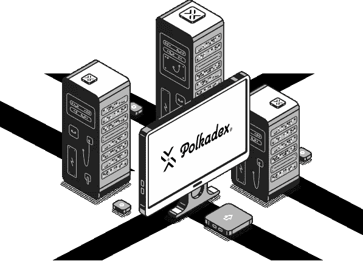

亲爱的朋友，这一步一步的指南解释了如何简单的过程是你的 PDEX 股份。

我们的指南将由以下部分组成:

1)购买代币；

2)创建库存和控制账户；

3)将 PDEX 令牌从 ERC-20 迁移到本地 Polkadex 网络；

4)提名本身。

# **1)购买代币**

截至本文发表之日，Polkadex 代币已在多家交易所上市:

- [登机口](https://www.gate.io/trade/PDEX_USDT)

- [库币](https://www.kucoin.com/trade/PDEX-USDT)

- [Uniswap](https://app.uniswap.org/#/swap?inputCurrency=ETH&outputCurrency=0xf59ae934f6fe444afc309586cc60a84a0f89aaea)

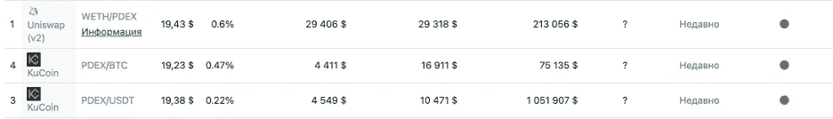

> 订阅 [**Coinmonks Youtube 频道**](https://www.youtube.com/c/coinmonks/videos) 获取每日加密新闻。

# **2)创建库存和控制账户**

由于 Polkadot / Polkadex 建议大多数用户使用 Polkadot.js 浏览器扩展来创建他们的地址，所以我们将重点放在这种方法上。

在开始之前，请确保安装 Polkadot.js 浏览器扩展。可以下载 [Chrome/Brave](https://chrome.google.com/webstore/detail/polkadot%7Bjs%7D-extension/mopnmbcafieddcagagdcbnhejhlodfdd?hl=en) 和 [FireFox](https://addons.mozilla.org/en-US/firefox/addon/polkadot-js-extension/) 的扩展。

**创建一个 Polkadex 隐藏账户**

成功安装扩展后，点击浏览器栏中橙色的小 P 按钮打开界面。之后，点击加号图标，然后点击创建新帐户。

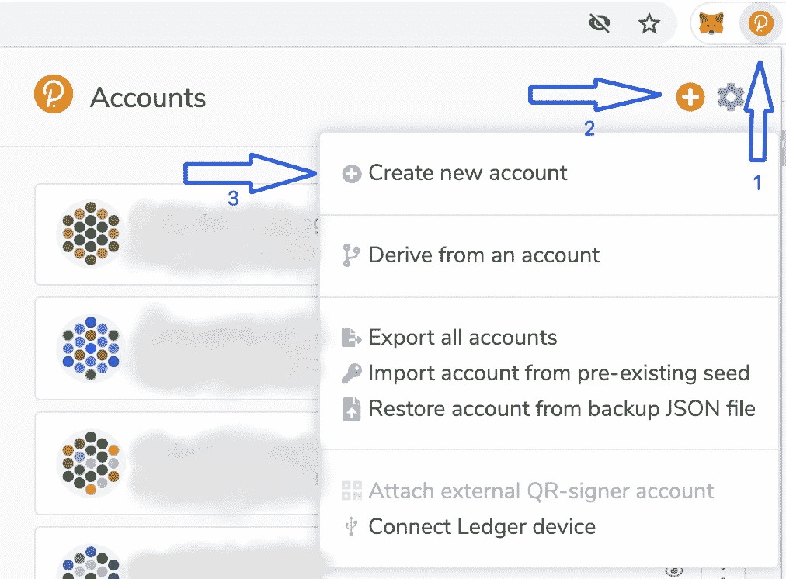

写下你的助记种子短语，并安全地储存起来。谁能接触到助记种子，谁就能接触到你的资金！

选中底部的框，然后单击下一步。为您的 Stash 帐户选择一个描述性名称。然后单击添加带有生成种子的帐户。

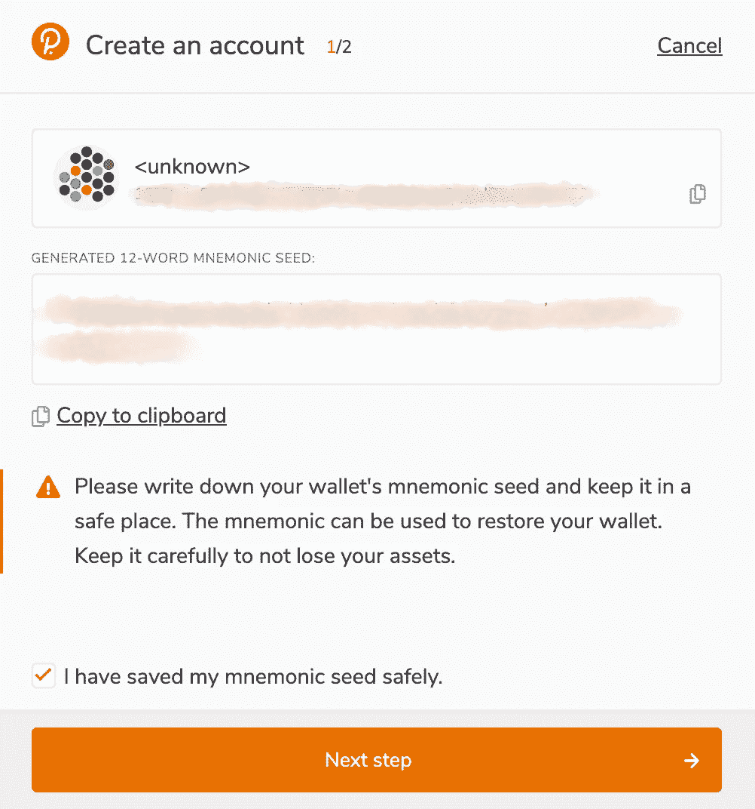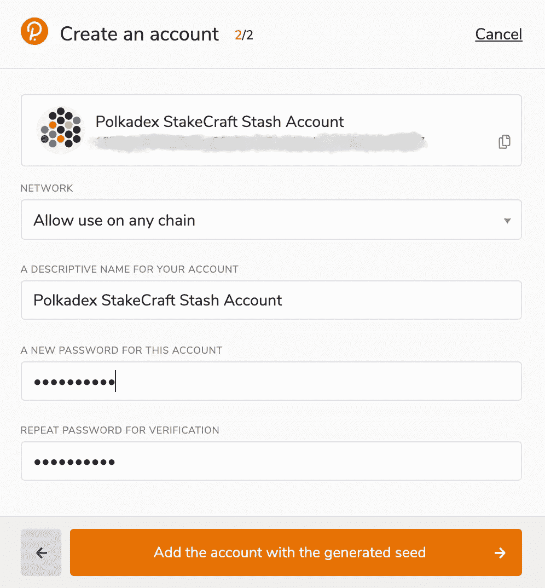

现在您可以看到您的 Polkadex Stash 帐户已经成功创建。现在，您还可以在 Accounts 下的 Polkadot JS 中找到地址——如果不是这样，请重新加载页面。您现在可以向该帐户注资。

**创建一个 Polkadex 控制器账户**

为了成功地绑定您的资金并指定您的验证器集，您需要一个单独的帐户，即您的控制器帐户。您将使用此帐户执行日常的赌注操作，如更换验证机或申领奖励。

要创建您的控制器帐户，请重复与 Polkadex Stash 帐户相同的步骤。

在此之后，您将能够在 Polkadot 浏览器扩展启动屏幕中看到 Stash 和 Controller 帐户

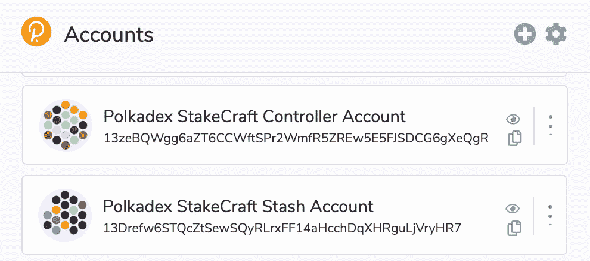

# **3)PDEX 令牌从 ERC-20 迁移到本地 Polkadex 网络**

为了能够参与 Mainnet 并开始下注、提名或验证，你将需要一些 PDEX 本地人**。**

重要的是要记住 [PDEX 目前是 ERC-20 的代币。从 2021 年 9 月 29 日开始，PDEX 通过单向跨链网桥迁移到 Polkadex 网络。](https://polkadex.medium.com/pdex-token-journey-from-erc-20-to-substrate-29a8cdcee276)一旦有了一些 PDEX，就可以迁移到 Polkadex 开始跑马圈地；从而保护网络，并从中获得更多回报。

# 迁移是如何进行的？

为了将您的 ERC-20 PDEX 迁移到 Polkadex 网络，并将其转换为原生 PDEX，您需要三样东西:

> [一个 MetaMask 浏览器扩展](https://metamask.io/download),您的以太坊钱包中至少有 30 美元用于支付汽油费。根据迁移时的油价，您可能需要更多的 ETH。
> 
> 你可以用 [Polkadot JS 浏览器扩展](https://polkadot.js.org/extension/)创建一个 Stash & Controller 帐户。
> 
> 一些 ERC 20 PDEX 在你的以太坊钱包里。

***注意。就目前而言，PDEX 代币的迁移是单向的，无法逆转。当 Gate.io 和其他交易所开始支持原生 PDEX 时，情况将会改变。这个过程可能需要几个月的时间。***

首先，您需要将 PDEX 代币添加到元掩码钱包中。为此，转到此[链接](https://www.coingecko.com/en/coins/polkadex)并点击“添加到元掩码”。

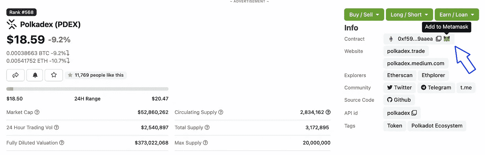

在这之后，从交换中提取你的 PDEX 到你的 Metamask 钱包中。

**请记住，在迁移后的 28 天内，无法在账户间转账。如果你把你所有的 PDEX 转移到隐藏账户，由于这个 28 天的锁定，你不能把 PDEX 转移到控制账户。如果您不想等待 28 天，直到您的 PDEX 代币解锁，您必须拆分您想要提取的代币。**

例如，你在库币上有 10 个 PDEX。首先，提取 6 个代币到你的隐藏账户(不要忘记库币的佣金 1.5 PDEX)。然后将你的 ERC-20 PDEX 迁移到 PDEX 本土。

## PS 记住你在 Kucoin 上留了 2.5 PDEX。

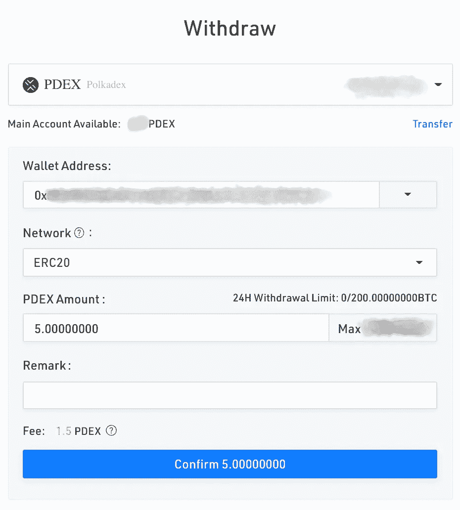

**Withdrawing PDEX from Kucoin to Metamask wallet**

**现在是时候通过 Polkadex 迁移应用程序将您的 ERC-20 PDEX 迁移到 PDEX 本土了。**

1.转到 [Polkadex 迁移应用](https://www.polkadex.trade/migrate)。

2.点击步骤 1 中的“连接到钱包”以连接到您的 Polkadex 隐藏钱包。这是您接收迁移 PDEX 的地方。您可能需要使用 Polkadot.js 浏览器扩展来批准连接。如果您有多个 Polkadot 帐户，请在钱包连接后点击以选择不同的帐户。

3.点击步骤 2 中的“连接到钱包”来连接到您的以太坊钱包。这是您的 PDEX 当前所在的位置，也是它将被迁移的位置。确保你有足够的钱来支付以太坊的煤气费。您可能还需要使用元掩码浏览器扩展来批准连接。

4.连接到两个网络后，点击“立即迁移”按钮，批准 Metamask 钱包上的交易金额。

**继电器上的处理通常需要大约 15 个确认模块。**

5.你还记得我们让你记住你在库考恩还剩多少 PDEX 吗？现在是时候对 Kucoin 上的 PDEX 其余部分重复为控制器帐户留下的相同步骤了。第一次取款后，你还剩 2.5 PDEX，取出你剩下的硬币(简单地重复所有步骤)。

***不用担心，1 个 PDEX 存到控制者账户里绰绰有余。***

# **4)赌上你的 PDEX 代币**

在 [Polkadot JS 网站](https://polkadot.js.org/apps/?rpc=wss%3A%2F%2Fmainnet.polkadex.trade#/accounts)上，确保您已连接到 Polkadex mainnet。您可以通过单击屏幕左上角的网络符号来更改网络。

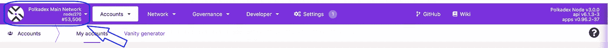

Make sure to choose Polkadex network

要开始锁定过程，请单击网络下拉菜单中的锁定。然后，访问帐户操作选项卡，并单击+提名者-按钮。

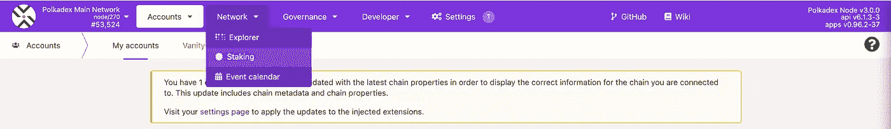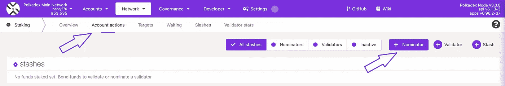

您可以在“锁定”菜单中的“帐户操作”选项卡下执行所有锁定操作

相应地选择 Stash & Controller 帐户，在 value bonded 下选择您想要用于赌注的 PDEXs 数量。确保在你的账户里留一些钱。邦德 a max。95%的代币，以便您仍然能够支付交易费用。

在付款目的地下选择您的奖励目的地帐户。

然后单击“下一步”绑定您的令牌。

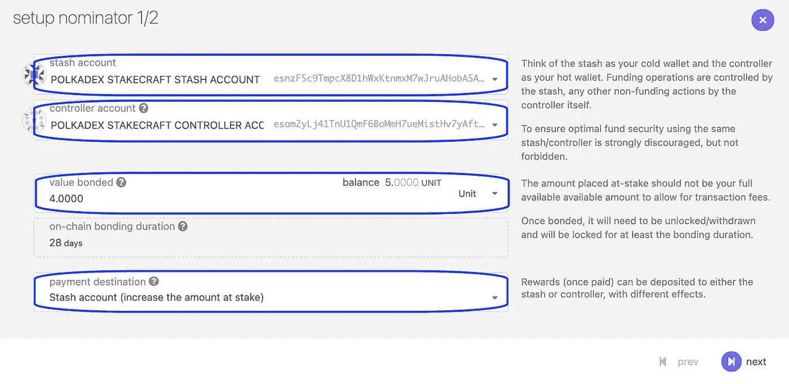

Do not forget to leave some unbonded tokens for transaction fees

您最多可以提名 16 位验证者。只需通过点击左侧框中的验证器来选择您所选择的验证器。您可以通过再次单击它们，从右边的框中取消选择它们。或者，您也可以使用顶部的搜索栏，通过名称或地址来查找特定的验证器。

***我方验证器地址:***

***esogfbbilxjbhgik 8 pbhrutmhp 6 wydrcfctfolnkrywwsmmiv***

请注意，您不能指定委托给特定验证者的金额。根据 NPoS 算法，您的保税货物将在您选择的验证器中进行分配。

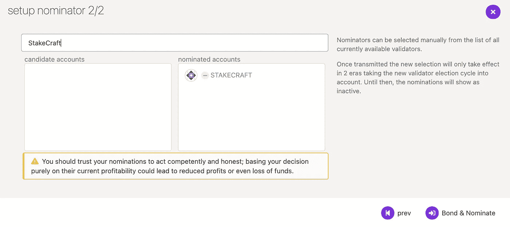

**选择 StakeCraft 验证器。**

在以下窗口中，输入您的密码，然后点击签署交易以结束您的提名。

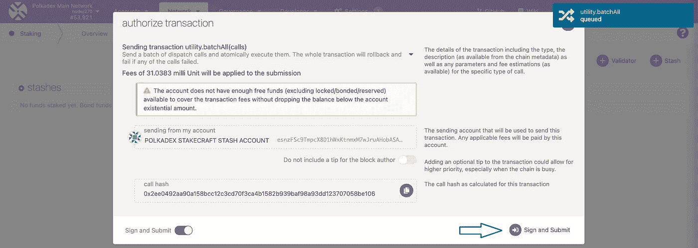

最后，你现在是 Polkadex 网络的提名者了！

你的提名将在几个小时内生效。

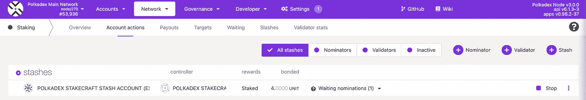

**管理您的 PDEX 跑马圈地业务**

您可以使用 Polkadot JS 管理您的标桩操作。在赌注菜单中，单击帐户操作，然后单击最右侧的三个点以执行以下操作:

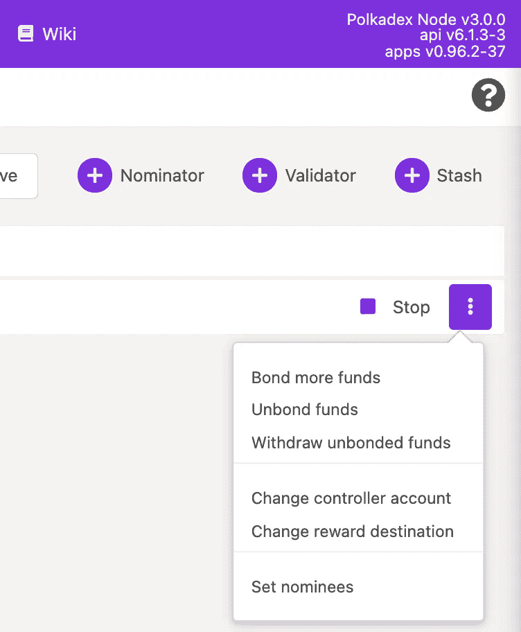

债券更多的资金

解开束缚

更改控制器帐户

更改奖励目的地

设置被提名者

**什么是有效提名、无效提名或等待提名？**

有效提名&无效提名是当前有效验证程序集中您的提名的验证程序。一般来说，只有一个验证器会显示为活动的。这是因为用来分配你的赌注的算法被优化了，所以集合中的每个验证者都有大致相同数量的赌注支持他/她。因此，你的股份通常只支持你提名的验证者之一。

等待提名是当前不在活动集中的验证器。

你真诚的，

木桩小组。

您可以找到我们:

[推特](https://twitter.com/stakecraft)

[不和](https://discord.gg/xkYnNYV4qH)

[电报](https://t.me/stakecraft)

给我们发电子邮件[Support@stakecraft.com](mailto:Support@stakecraft.com)

 [## 可信验证器

### StakeCraft Validator 提供服务，让用户从他们的数字资产中获利，提供高…

stakecraft.com](https://stakecraft.com) 

> 加入 Coinmonks [电报频道](https://t.me/coincodecap)和 [Youtube 频道](https://www.youtube.com/c/coinmonks/videos)了解加密交易和投资

## 另外，阅读

*   [德国最佳加密交易所](https://blog.coincodecap.com/crypto-exchanges-in-germany) | [Arbitrum:第二层解决方案](https://blog.coincodecap.com/arbitrum)
*   [币安交易机器人](/coinmonks/binance-trading-bots-d0d57bb62c4c) | [OKEx 审查](/coinmonks/okex-review-6b369304110f) | [阿塔尼审查](https://blog.coincodecap.com/atani-review)
*   [最佳加密交易信号电报](/coinmonks/best-crypto-signals-telegram-5785cdbc4b2b) | [MoonXBT 评论](/coinmonks/moonxbt-review-6e4ab26d037)
*   [Godex.io 审核](/coinmonks/godex-io-review-7366086519fb) | [邀请审核](/coinmonks/invity-review-70f3030c0502) | [BitForex 审核](https://blog.coincodecap.com/bitforex-review)
*   [MoonXBT vs Bybit vs 币安](https://blog.coincodecap.com/bybit-binance-moonxbt) | [硬件钱包](/coinmonks/hardware-wallets-dfa1211730c6)
*   [火币交易机器人](https://blog.coincodecap.com/huobi-trading-bot) | [如何收购 ADA](https://blog.coincodecap.com/buy-ada-cardano) | [Geco。一次审查](https://blog.coincodecap.com/geco-one-review)
*   [币安 vs 比特邮票](https://blog.coincodecap.com/binance-vs-bitstamp) | [比特熊猫 vs 比特币基地 vs Coinsbit](https://blog.coincodecap.com/bitpanda-coinbase-coinsbit)
*   [如何购买 Ripple (XRP)](https://blog.coincodecap.com/buy-ripple-india) | [非洲最好的加密交易所](https://blog.coincodecap.com/crypto-exchange-africa)
*   [非洲最佳加密交易所](https://blog.coincodecap.com/crypto-exchange-africa) | [胡交易所评论](https://blog.coincodecap.com/hoo-exchange-review)
*   [eToro vs robin hood](https://blog.coincodecap.com/etoro-robinhood)|[MoonXBT vs by bit vs Bityard](https://blog.coincodecap.com/bybit-bityard-moonxbt)
*   [有哪些交易信号？](https://blog.coincodecap.com/trading-signal) | [Bitstamp vs 比特币基地](https://blog.coincodecap.com/bitstamp-coinbase)
*   [ProfitFarmers 回顾](https://blog.coincodecap.com/profitfarmers-review) | [如何使用 Cornix 交易机器人](https://blog.coincodecap.com/cornix-trading-bot)