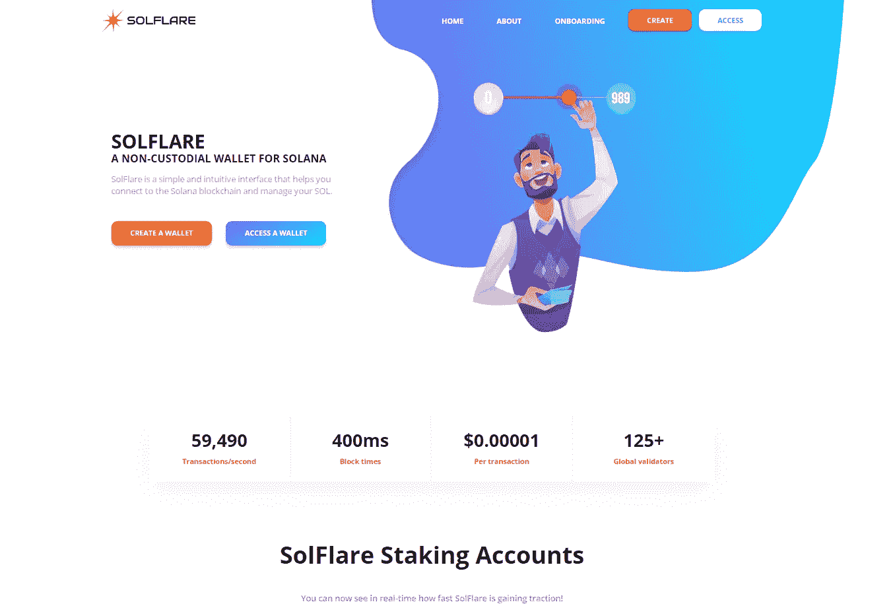
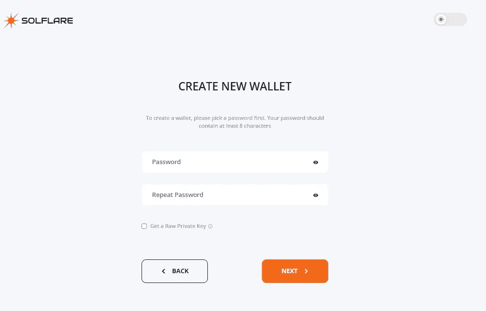
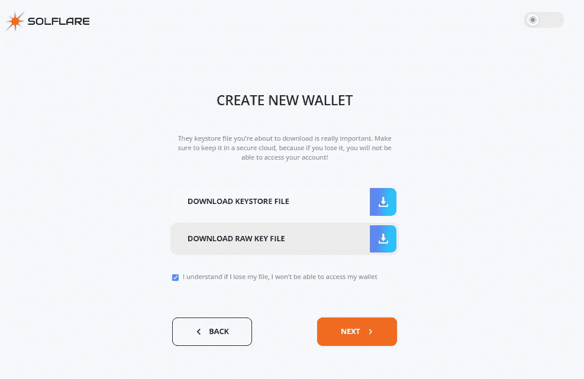
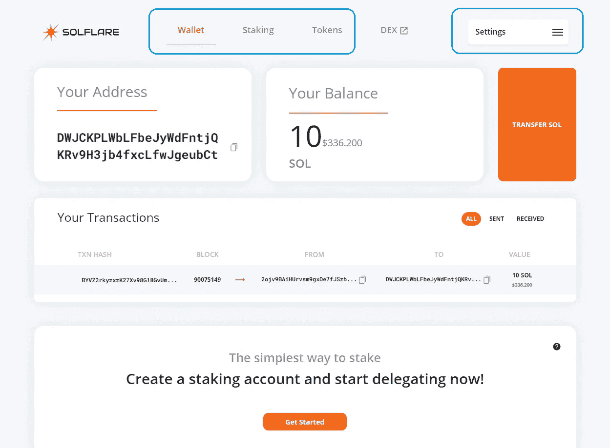
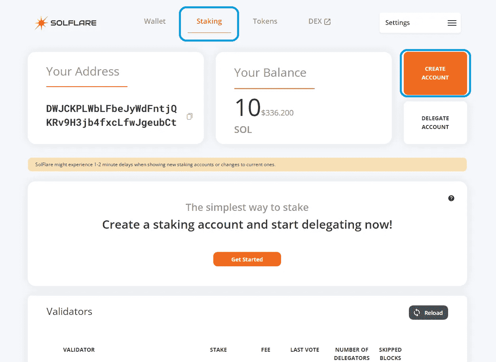
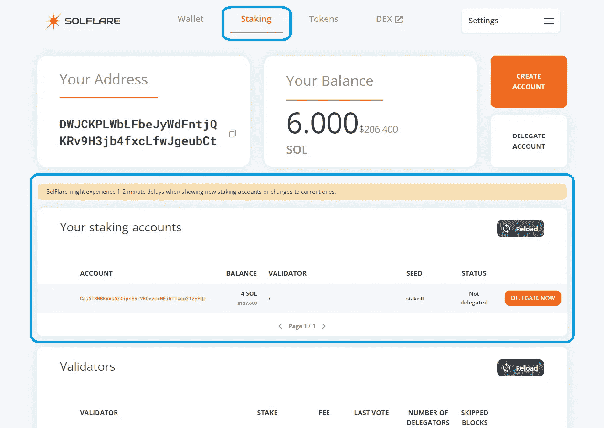
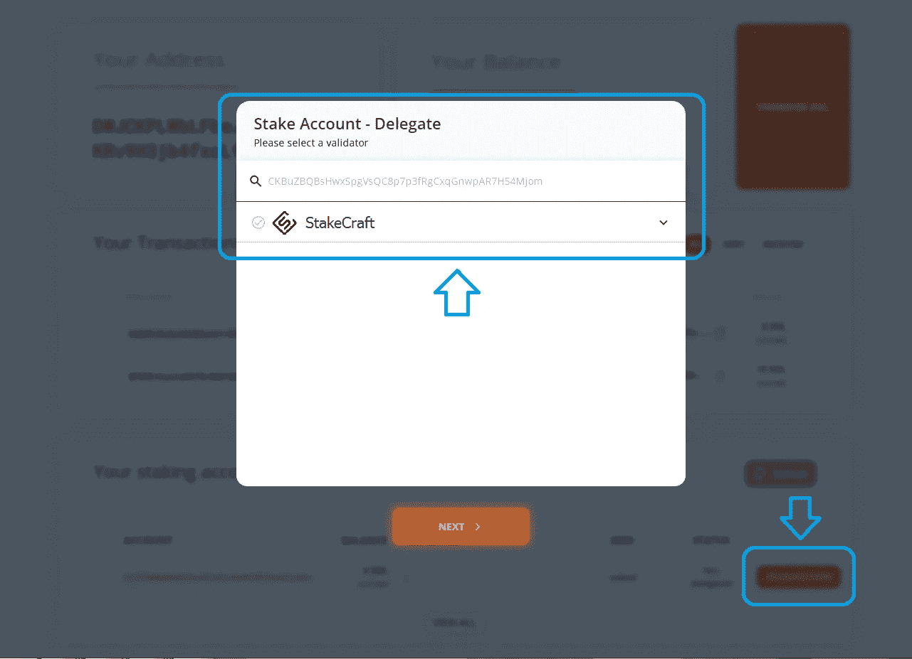
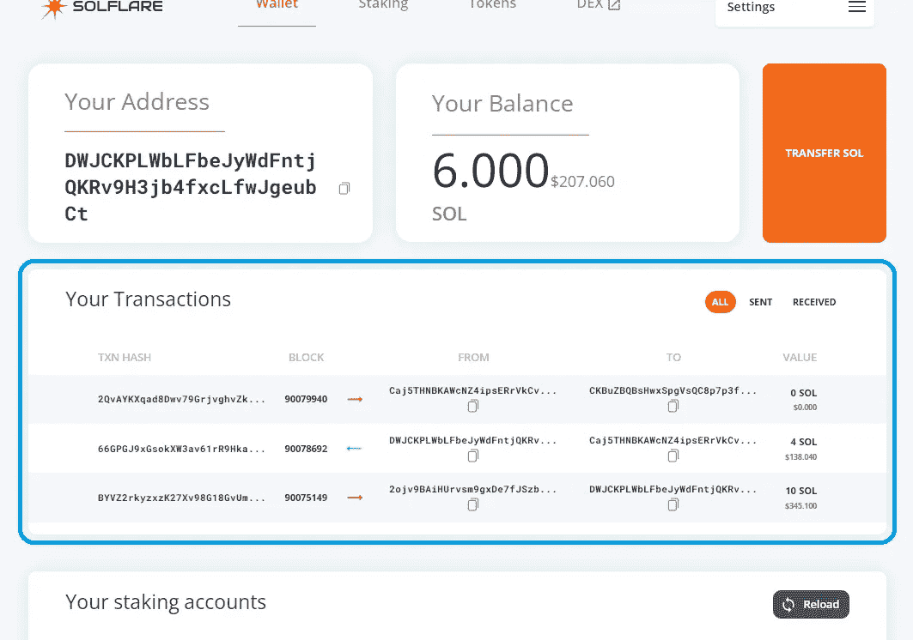

# 如何用 Solflare 钱包下注$SOL

> 原文：<https://medium.com/coinmonks/how-to-stake-sol-with-solflare-wallet-f2b844e8c379?source=collection_archive---------0----------------------->

## SOLFLARE 是 SOLANA 的非保管钱包。

我们编写了这个分步指南，向您展示如何使用 Solflare 钱包和密钥库文件将您的$SOL 令牌押在 Solana 区块链上的过程是多么简单。

**记住！** *一个密钥库文件保存着你的私钥的加密版本。创建密钥库文件时选择的密码用于加密您的私钥。这就是为什么在设置密码时应该选择非常强的密码。每当对您的帐户执行操作时，您都需要提供密钥库文件和密码。*

Solflare 是由 Dokia Capital 创建的非托管钱包。这是第一个让代币持有者无需接触一行代码就能发送、接收和下注$SOL 的钱包。

**访问您的 Solflare 钱包**

如果您想创建新钱包，请点击此链接[https://solflare.com/create-wallet](https://solflare.com/create-wallet)

Solflare wallet webpage

单击下一步，然后设置您的密码。 ***记得使用强密码。不要忘记使用特殊字符来增加钱包的安全性。***

Setting a password

选中获取原始私钥旁边的框，以保存除密钥库文件之外的另一个文件。在丢失密码或密钥库文件的情况下，您可以使用原始私钥文件通过命令行界面(CLI)来管理同一个帐户。之后，单击下一步。

Downloading *.json files

保存这两个文件。然后单击下一步。上传您的密钥库文件，以确保您可以访问它。点击“完成”以结束该过程。

设置好钱包后，您可以在 Solflare 的主菜单中看到关于您的钱包帐户的关键信息，如您的钱包帐户地址、余额或您最近的交易。

The main interface of Solflare wallet

向您的钱包帐户发送一些 SOL 令牌，以执行任何操作，如下注。你可以从购买你的 SOL 的交易所汇款到你的账户地址，你可以在主菜单的左上角找到。

**创建股份账户**

在您成功地为您的钱包帐户注资后，是时候创建一个股份帐户了。提示。作为令牌持有者，您有能力通过授权给多个验证者来增强去中心化，从而提高整体安全性，进而提高网络的整体价值。为了成功做到这一点，你需要创建一个以上的股份帐户。将你钱包账户中的资金分散到不同的股份账户中，但要确保在你的钱包账户中留一些索尔，以支付交易费用。由于这些在索拉纳很低，所以在你的钱包账户里留 1 索尔应该绰绰有余。

访问顶部菜单中的赌注选项卡，然后单击创建帐户。在弹出式菜单中选择要从您的 Wallet 帐户转入您的 Stake 帐户的金额，然后单击“下一步”。输入你的密码并点击提交。对您想要创建的每个股份帐户重复此过程。

The staking section of of Solflare wallet

您会发现您所有的股份帐户都显示在 Solflare 中，现在可以开始下注了！

Your stake acounts

**委托你的股份**

在 Solflare 的 Staking 选项卡(顶部菜单)中，单击相应股份帐户旁边的 Delegate Now，在下拉菜单中选择您选择的验证器，然后单击 next。输入您的密码，然后单击提交。对你的每一个股票账户重复这个过程。为了促进去中心化并最终提高 Solana 网络的安全性和价值，最好选择 Halt Power 之外的验证器。停止权由 [Solanabeach](https://solanabeach.io/validators) 上的一个条表示:上面的累积股份可以停止网络——改善分散化，并委托给下面的验证者。

Choose a Validator to delegate your Stake to

就是这样！你现在是索拉纳区块链号的代表了，祝贺你！请注意，热身期结束后(约 2-3 天)，您的委托 SOL 将开始获得奖励。在这种情况下，你会看到你的股份帐户被激活。

您可以在 Solflare 上的 Staking 选项卡下找到您的股份帐户及其委托的验证者。您可以随时通过单击 Solflare 主页上的访问来访问您的钱包帐户和相应的股份帐户。

Your Solana Staking Operations

**管理您的标桩操作**

***索拉纳赌注奖励***

自从 2021 年 2 月在 Solana Mainnet Beta 上激活通货膨胀以来，授权者因下注而获得奖励。在每个后续时期开始时，赌注奖励会自动累积到您的赌注帐户上，并自动重新分配。

要查看您的赌注奖励，请访问赌注菜单并点击您的赌注帐户。在弹出窗口中，选择“奖励”选项卡以查看您每个纪元的奖励。

您还可以在 [solanabeach.io](http://solanabeach.io/) 上追踪您的赌注奖励。只需查找您的股份帐户，并访问您的股份帐户详情页面底部方框中的股份奖励选项卡。

***如何停止委托或减少委托金额***

如果您想要取消全部授权，只需单击您想要停止授权的股份帐户旁边的取消授权。在随后的窗口中确认这一点。

一旦冷却期结束(约 2-3 天)，您可以将未授权的资金从您的股份帐户提取到您的钱包帐户。点击相应的账户，在随后的弹出窗口中点击取款，然后选择您希望提取的金额。

在冷却期间，你会看到你的股份帐户状态为停用。可能需要几分钟时间才能在 SolFlare UI 中成功显示该流程。

***索拉纳的热身和冷却期是多少？***

热身期和冷却期分别指您的赌注账户的状态。

热身期描述了从您发出委托交易到您的股份账户完全委托并开始获得奖励之间的时间。在此期间，您的股份帐户被认为是激活。

冷却期描述了从您发出取消授权交易到您的股份帐户完全取消授权之间的时间。在此期间，您的股票账户被认为是停用的，不再获得奖励，并且是不流动的。

只有在一个时期开始时，协议才会考虑对您的股份帐户的状态进行更改。因此，如果你改变你的股份帐户的状态，你将不得不等到新的纪元改变生效。由于一个时期持续约 2-3 天，您必须等待当前时期的剩余时间，以便您的状态更改生效-等待时间的确切持续时间取决于您何时启动对您帐户状态的更改。

在一个时期内可以改变状态的整个网络的总股份的 25%是有一定的阈值的。如果超过这个阈值，你将不得不等待一个额外的纪元，直到你的股份超过部分已成功改变状态。

***StakeCraft 投票账号地址***[ckbuzbqbshwxspgvsqc 8 p 7 p 3 frgcxqgnwpar 7h 54 mjom](https://www.validators.app/vote_accounts/mainnet/CKBuZBQBsHwxSpgVsQC8p7p3fRgCxqGnwpAR7H54Mjom?locale=en)

***StakeCraft 身份账号地址***[7 gjec4 idbtxlvvynsrbzrrhdtylbyzddj 1 C5 bmcmmbks](https://www.validators.app/validators/mainnet/7Gjec4iDbTxLvVYNsRbZrrHdtyLByzdDJ1C5BmcMMBks?locale=en)

*你诚挚的，*

*桩工队。*

您可以找到我们:

*   [推特](https://twitter.com/stakecraft)
*   [不和](https://discord.gg/xkYnNYV4qH)
*   [电报](https://t.me/stakecraft)
*   给我们发电子邮件[Support@stakecraft.com](mailto:Support@stakecraft.com)

 [## 可信验证器

### StakeCraft 是一个在编程、开发和管理数字资产方面拥有丰富经验的极客团队。我们使用顶级…

stakecraft.com](https://stakecraft.com) 

> 加入 [Coinmonks 电报频道](https://t.me/coincodecap)，了解加密交易和投资

## 另外，阅读

*   [尤霍德勒 vs 科恩洛安 vs 霍德诺特](/coinmonks/youhodler-vs-coinloan-vs-hodlnaut-b1050acde55a) | [Cryptohopper vs 哈斯博特](https://blog.coincodecap.com/cryptohopper-vs-haasbot)
*   [币安 vs 北海巨妖](https://blog.coincodecap.com/binance-vs-kraken) | [美元成本平均交易机器人](https://blog.coincodecap.com/pionex-dca-bot)
*   [非洲最佳加密交易所](https://blog.coincodecap.com/crypto-exchange-africa) | [Hoo 交易所评论](https://blog.coincodecap.com/hoo-exchange-review)
*   [eToro vs robin hood](https://blog.coincodecap.com/etoro-robinhood)|[MoonXBT vs by bit vs Bityard](https://blog.coincodecap.com/bybit-bityard-moonxbt)
*   [Stormgain 回顾](https://blog.coincodecap.com/stormgain-review) | [Bexplus 回顾](https://blog.coincodecap.com/bexplus-review) | [币安 vs Bittrex](https://blog.coincodecap.com/binance-vs-bittrex)
*   [Bookmap 评论](https://blog.coincodecap.com/bookmap-review-2021-best-trading-software) | [美国 5 大最佳加密交易所](https://blog.coincodecap.com/crypto-exchange-usa)
*   [如何在 FTX 交易所交易期货](https://blog.coincodecap.com/ftx-futures-trading) | [OKEx vs 币安](https://blog.coincodecap.com/okex-vs-binance)
*   [如何在势不可挡的域名上购买域名？](https://blog.coincodecap.com/buy-domain-on-unstoppable-domains)
*   [印度的秘密税](https://blog.coincodecap.com/crypto-tax-india) | [altFINS 审查](https://blog.coincodecap.com/altfins-review) | [Prokey 审查](/coinmonks/prokey-review-26611173c13c)
*   [区块链 vs 比特币基地](https://blog.coincodecap.com/blockfi-vs-coinbase) | [比特坎评论](https://blog.coincodecap.com/bitkan-review) | [币安评论](/coinmonks/binance-review-ee10d3bf3b6e)