# 如何持有特佐斯(XTZ)令牌

> 原文：<https://medium.com/coinmonks/how-to-stake-tezos-xtz-token-b8f9c5e7c66a?source=collection_archive---------3----------------------->

## *这篇文章包含了详细的步骤，告诉你如何下注/委托你的 Tezos (XTZ)代币，赚取额外收入。*

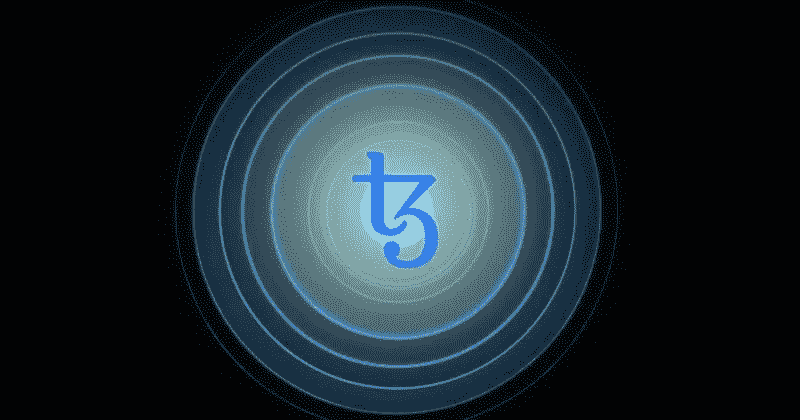

## [Tezos](https://tezos.com/) 是一个基于股权证明的开源区块链网络，允许资产和应用程序自我升级。

这种通用的和自修正的密码分类帐协议支持元升级，即该协议可以通过修正其代码来发展。与 Tezos 有利害关系的用户可以参与协议治理，包括对核心协议和修订过程本身的升级。

该平台允许创建智能合同和抗审查的分散应用程序。它还提供了一种称为形式验证的工具，这是一种通过使用数学属性来提高智能合约安全性的技术。

**烘焙和委派**

在 Tezos 网络中验证和发布块的过程称为烘焙。而负责检查网络交易正确性的人/服务提供者叫做面包师。

Tezos 网络由一组 bakers 支持，确保网络的安全性和功能性。为了烘烤砖块，面包师需要参与协议，为一个面包卷至少下 8000[XTZ](https://coinmarketcap.com/currencies/tezos/)。

如果你没有 8，000 XTZ 或者只是不想处理烘焙砖块的技术复杂性，那么你可以将你的 XTZ 代币委托给一个面包师。作为回报，你将从面包师那里获得一定比例的奖励。

在本指南中，我们将解释如何将您的 XTZ 代币委托给面包师并获得奖励。

**支持钱包**

用户可以使用以下任何钱包来存储他们的 Tezos 令牌。

*   [AirGap](https://airgap.it/) (iOS、Android、Web、macOS、Windows、Linux)
*   [Atomex](https://atomex.me/) (iOS、Android、Windows、macOS、Web、Ubuntu)
*   [Galleon 钱包](https://cryptonomic.tech/galleon.html) (macOS、Windows、Linux、iOS)
*   [Guarda](https://www.altcoinbuzz.io/bitcoin-and-crypto-guide/how-to-use-the-guarda-wallet-part-i/) (macOS，Windows，iOS，Android)
*   [酷开](https://wallet.kukai.app/)(网页)
*   [岩浆](https://magmawallet.io/) (iOS，Android)
*   [神殿](https://templewallet.com/)(网页)
*   [ZenGo](https://www.zengo.com/) (iOS、Android)
*   [总账](https://www.ledger.com/)(硬件钱包)
*   [Trezor](https://trezor.io/) (五金钱包)

我们将根据 Temple wallet 制作这个指南。

**钱包安装**

Temple Wallet 是一个用户友好的浏览器扩展钱包，可以用来与 Tezos 生态系统合作。

要安装钱包，请访问 [Temple Wallet 网站](https://templewallet.com/)。

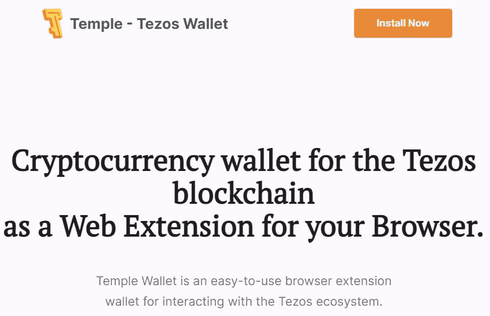

点击**立即安装**。

钱包目前支持三种不同的浏览器:

*   谷歌浏览器
*   Mozilla Firefox
*   勇敢的

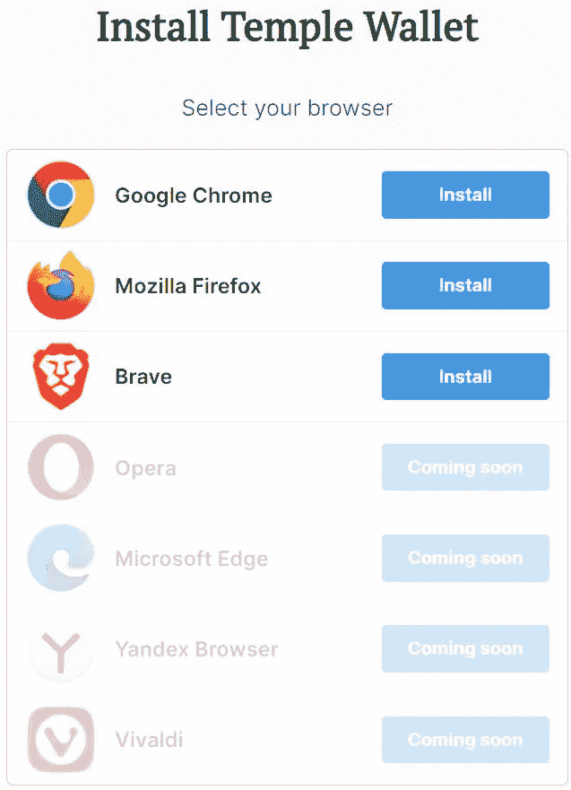

您可以选择任何浏览器类型，并安装扩展。我们将把它安装在谷歌浏览器上。

点击**安装**，会将你重定向到[页面](https://chrome.google.com/webstore/detail/temple-tezos-wallet-ex-th/ookjlbkiijinhpmnjffcofjonbfbgaoc)

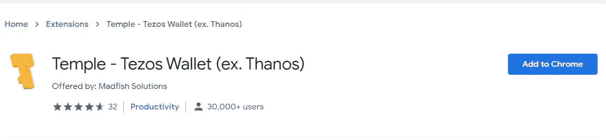

点击**添加到 Chrome** ，钱包应用图标将被添加到您的浏览器扩展中。您将能够在您的扩展中看到下面的图标。

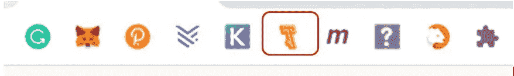

**设置钱包应用程序**

点击浏览器扩展上的 Temple wallet 应用程序图标来设置您的帐户。

该应用程序将为您提供两个钱包设置选项:

*   创建钱包
*   导入/恢复钱包

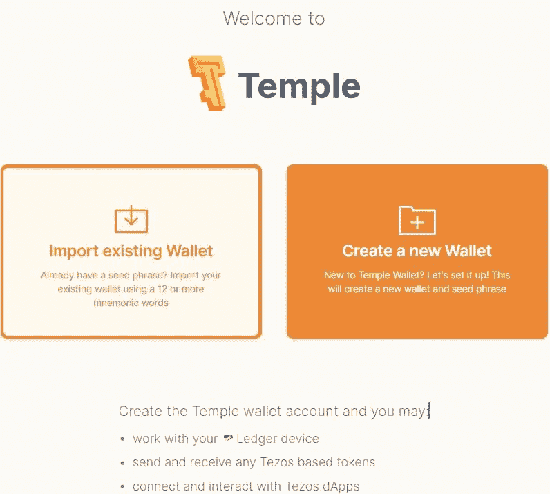

**创建钱包**

如果您是新用户，您可以选择此选项为您的 Tezos 令牌创建新的 Temple wallet。

接下来，应用程序会要求您提供钱包密码，并显示您需要安全存储以备将来使用的备份短语。

完成此步骤后，将会为您成功创建一个空白的 Temple wallet。

你现在可以看到下面的页面。

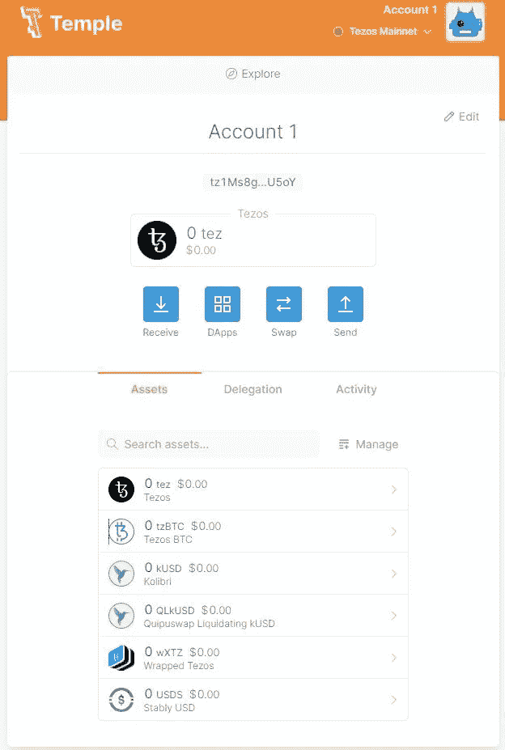

**收货地址**

要获取您的接收地址，只需点击**接收**选项卡，它将显示您的钱包地址和二维码。

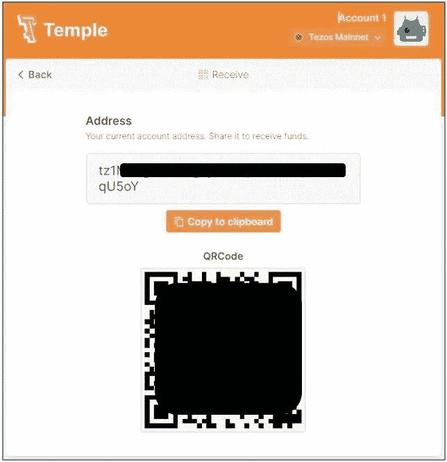

**转移 XTZ**

我们的兑换账户里有一些 XTZ 代币，我们想把它们转到寺庙的钱包里。

要在你的圣殿钱包中获得 **XTZ** 令牌，你需要获取公共地址。按照上面的步骤(收货地址)就可以得到你的收货地址。

现在登录到您的 exchange 帐户，并点击对 **XTZ** 令牌的提款。

在**收件人地址**字段输入您的收件人地址，确认交易。

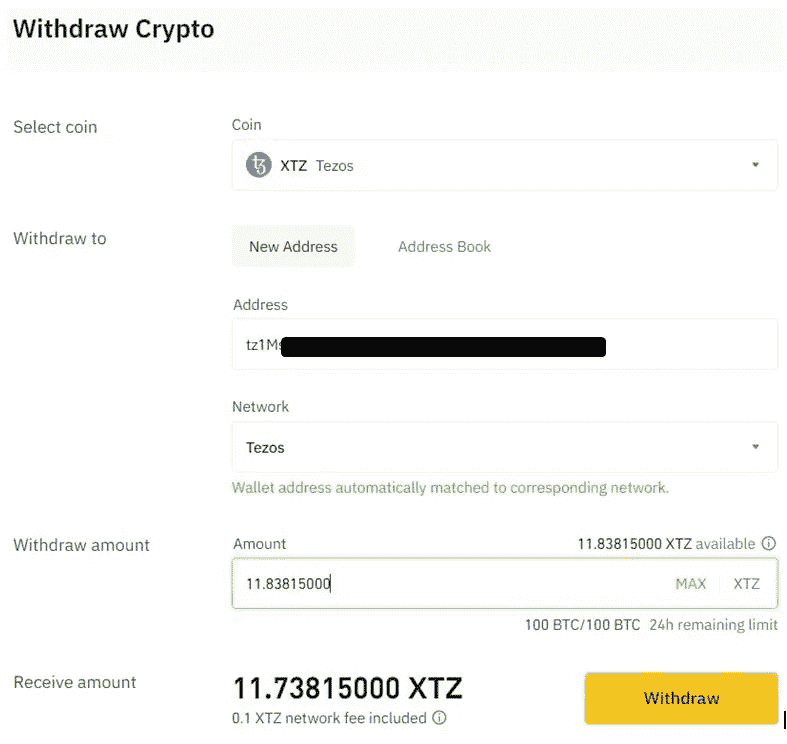

交易成功后，您将在钱包中看到 XTZ 代币。

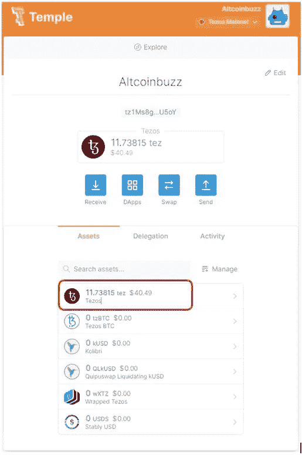

**代表团**

要下注 Tezos，请前往 Temple wallet 中的 **Delegation** 选项卡。你可以看到你可以委托代币的面包师名单。

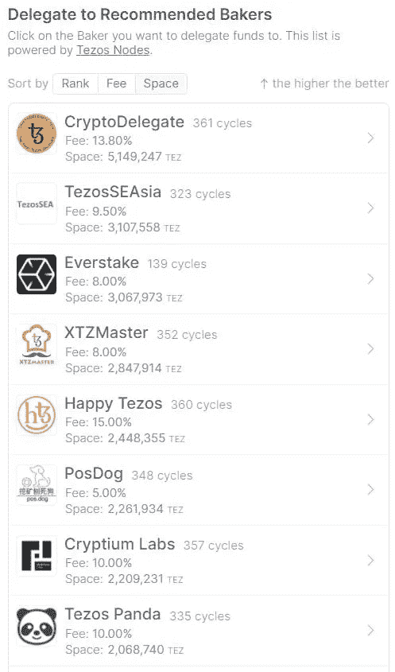

你可以通过这个[链接](https://www.tezos-nodes.com/)查看所有面包师的详细信息。

对于此过程，我们选择了定位。鱼作为我们的面包师，将委托我们的 XTZ 令牌给他们。

点击你想要的面包师。你也可以通过提供一些额外的费用来调整网速。

最后，点击**委托**按钮确认流程。

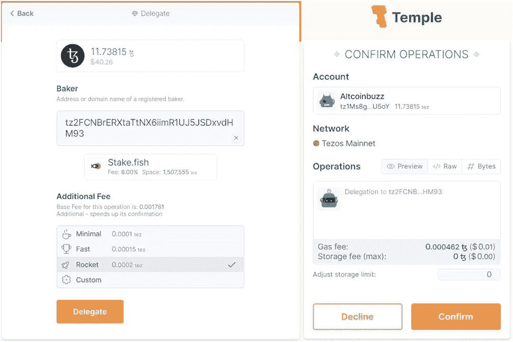

交易完成后，您可以从您的控制面板中看到您的委托令牌详细信息。

**删除委托**

用户可以随时删除他们的委派令牌。

要取消授权，只需登录您的 Tezos Temple 钱包，将 XTZ 代币转移到您想要的帐户地址。

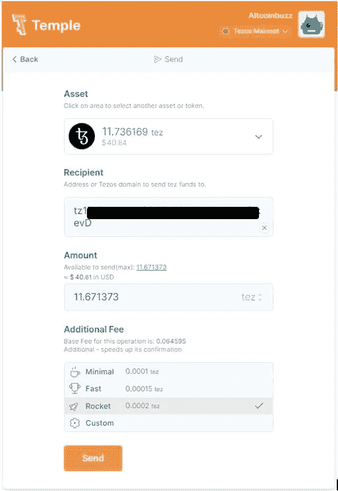

**结论**

赌注或授权为 Tezos (XTZ)用户提供了额外的收入来源。无论用户持有多少数量的代币，都可以获得奖励。对于授权，没有这样的最低令牌持有标准。委托过程非常简单，只需点击几下鼠标即可完成。没有锁定标准。您可以随时灵活地从委托中撤回您的代币。但是，我们建议用户在委托代币之前检查面包师的记录。

**资源:** [Tezos](https://tezos.com/)

**阅读更多:** [什么是 Web 3 经济](https://ruma-das.medium.com/what-is-web-3-economy-116eb2b73cf)

***注:*** *本帖首发* [*此处*](https://www.altcoinbuzz.io/passive-income/staking/how-to-stake-tezos-xtz-token/) *同* [*一个* ltcoinBuzz](https://www.altcoinbuzz.io/) *。*

**通过我的推荐加入**

[Crypto.com](https://binance.com/en/register?ref=E8PCD3AF)——[币安](https://platinum.crypto.com/r/sut3pd9bzn)

**跟我来**

**👉** [推特](https://twitter.com/rumadas123)

**👉**[**Linkedin**](https://www.linkedin.com/in/ruma-das-a1439320/)

> **加入 [Coinmonks 电报频道](https://t.me/coincodecap)，了解加密交易和投资**

## **另外，阅读**

*   **[WazirX vs coin dcx vs bit bns](/coinmonks/wazirx-vs-coindcx-vs-bitbns-149f4f19a2f1)|[block fi vs coin loan vs Nexo](/coinmonks/blockfi-vs-coinloan-vs-nexo-cb624635230d)**
*   **[BlockFi 信用卡](https://blog.coincodecap.com/blockfi-credit-card) | [如何在币安购买比特币](https://blog.coincodecap.com/buy-bitcoin-binance)**
*   **[火币交易机器人](https://blog.coincodecap.com/huobi-trading-bot) | [如何购买 ADA](https://blog.coincodecap.com/buy-ada-cardano) | [Geco。一次审查](https://blog.coincodecap.com/geco-one-review)**
*   **[加密副本交易平台](/coinmonks/top-10-crypto-copy-trading-platforms-for-beginners-d0c37c7d698c) | [五大 BlockFi 替代方案](https://blog.coincodecap.com/blockfi-alternatives)**
*   **[CoinLoan 点评【Crypto.com】|](https://blog.coincodecap.com/coinloan-review)[coin loan 点评](/coinmonks/crypto-com-review-f143dca1f74c) | [火币保证金交易](/coinmonks/huobi-margin-trading-b3b06cdc1519)**
*   **[Bybit vs 币安](https://blog.coincodecap.com/bybit-binance-moonxbt)|[stealth x 回顾](/coinmonks/stealthex-review-396c67309988) | [Probit 回顾](https://blog.coincodecap.com/probit-review)**
*   **[顶级付费加密货币和区块链课程](https://blog.coincodecap.com/blockchain-courses)**
*   **[在美国如何使用 BitMEX？](https://blog.coincodecap.com/use-bitmex-in-usa) | [BitMEX 评论](https://blog.coincodecap.com/bitmex-review)**
*   **[最佳免费加密信号](https://blog.coincodecap.com/free-crypto-signals) | [YoBit 评论](/coinmonks/yobit-review-175464162c62) | [Bitbns 评论](/coinmonks/bitbns-review-38256a07e161)**
*   **[OKEx 回顾](/coinmonks/okex-review-6b369304110f) | [Kucoin 交易机器人](/coinmonks/kucoin-trading-bot-automate-your-trades-8cf0ca2138e0) | [期货交易机器人](/coinmonks/futures-trading-bots-5a282ccee3f5)**
*   **[AscendEx Staking](https://blog.coincodecap.com/ascendex-staking)|[Bot Ocean Review](https://blog.coincodecap.com/bot-ocean-review)|[最佳比特币钱包](https://blog.coincodecap.com/bitcoin-wallets-india)**
*   **[霍比审核](https://blog.coincodecap.com/huobi-review) | [OKEx 保证金交易](https://blog.coincodecap.com/okex-margin-trading) | [期货交易](https://blog.coincodecap.com/futures-trading)**
*   **[比特币基地跑马圈地](https://blog.coincodecap.com/coinbase-staking) | [Hotbit 评论](/coinmonks/hotbit-review-cd5bec41dafb) | [KuCoin 评论](https://blog.coincodecap.com/kucoin-review)**
*   **[最佳加密交易信号电报](/coinmonks/best-crypto-signals-telegram-5785cdbc4b2b) | [MoonXBT 评论](/coinmonks/moonxbt-review-6e4ab26d037)**
*   **[Coinswitch 俱吠罗评论](/coinmonks/coinswitch-kuber-review-1a8dc5c7a739) | [电网交易机器人](https://blog.coincodecap.com/grid-trading) | [比特币基地收费](/coinmonks/coinbase-fees-831e77d4f2c5)**
*   **[Bitget 评论](https://blog.coincodecap.com/bitget-review)|[Gemini vs BlockFi](https://blog.coincodecap.com/gemini-vs-blockfi)|[OKEx 期货交易](https://blog.coincodecap.com/okex-futures-trading)**
*   **[OKEx vs KuCoin](https://blog.coincodecap.com/okex-kucoin) | [摄氏替代品](https://blog.coincodecap.com/celsius-alternatives) | [如何购买 VeChain](https://blog.coincodecap.com/buy-vechain)**
*   **[币安期货交易](https://blog.coincodecap.com/binance-futures-trading)|[3 commas vs Mudrex vs eToro](https://blog.coincodecap.com/mudrex-3commas-etoro)**
*   **[如何购买 Monero](https://blog.coincodecap.com/buy-monero) | [IDEX 评论](https://blog.coincodecap.com/idex-review) | [BitKan 交易机器人](https://blog.coincodecap.com/bitkan-trading-bot)**
*   **[币安 vs Bitstamp](https://blog.coincodecap.com/binance-vs-bitstamp) | [比特熊猫 vs 比特币基地 vs Coinsbit](https://blog.coincodecap.com/bitpanda-coinbase-coinsbit)**
*   **[如何购买 Ripple (XRP)](https://blog.coincodecap.com/buy-ripple-india) | [非洲最好的加密交易所](https://blog.coincodecap.com/crypto-exchange-africa)**
*   **[非洲最佳加密交易所](https://blog.coincodecap.com/crypto-exchange-africa) | [胡交易所评论](https://blog.coincodecap.com/hoo-exchange-review)**
*   **[eToro vs robin hood](https://blog.coincodecap.com/etoro-robinhood)|[MoonXBT vs by bit vs Bityard](https://blog.coincodecap.com/bybit-bityard-moonxbt)**
*   **[Stormgain 回顾](https://blog.coincodecap.com/stormgain-review) | [Bexplus 回顾](https://blog.coincodecap.com/bexplus-review) | [币安 vs Bittrex](https://blog.coincodecap.com/binance-vs-bittrex)**
*   **[Bookmap 评论](https://blog.coincodecap.com/bookmap-review-2021-best-trading-software) | [美国 5 大最佳加密交易所](https://blog.coincodecap.com/crypto-exchange-usa)**
*   **[如何在 FTX 交易所交易期货](https://blog.coincodecap.com/ftx-futures-trading) | [OKEx vs 币安](https://blog.coincodecap.com/okex-vs-binance)**
*   **[如何在无法阻挡的域名上购买域名？](https://blog.coincodecap.com/buy-domain-on-unstoppable-domains)**
*   **[印度的加密税](https://blog.coincodecap.com/crypto-tax-india) | [altFINS 审核](https://blog.coincodecap.com/altfins-review) | [Prokey 审核](/coinmonks/prokey-review-26611173c13c)**
*   **[Blockfi vs 比特币基地](https://blog.coincodecap.com/blockfi-vs-coinbase) | [比特坎评论](https://blog.coincodecap.com/bitkan-review) | [币安评论](/coinmonks/binance-review-ee10d3bf3b6e)**