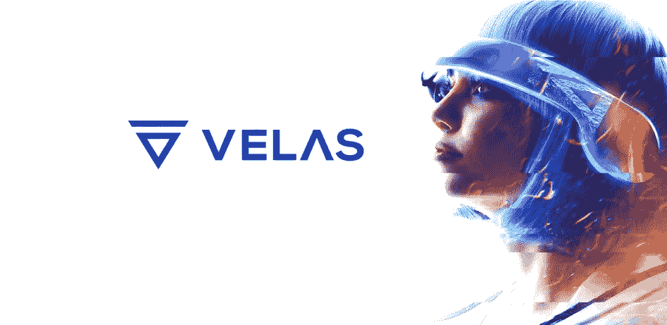
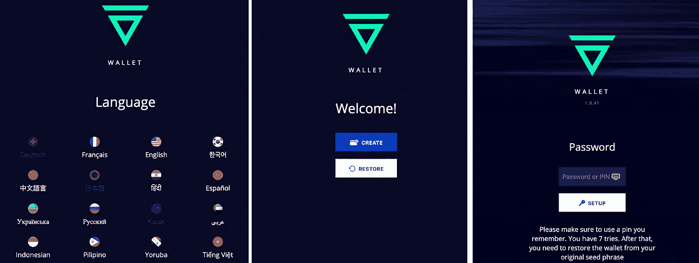
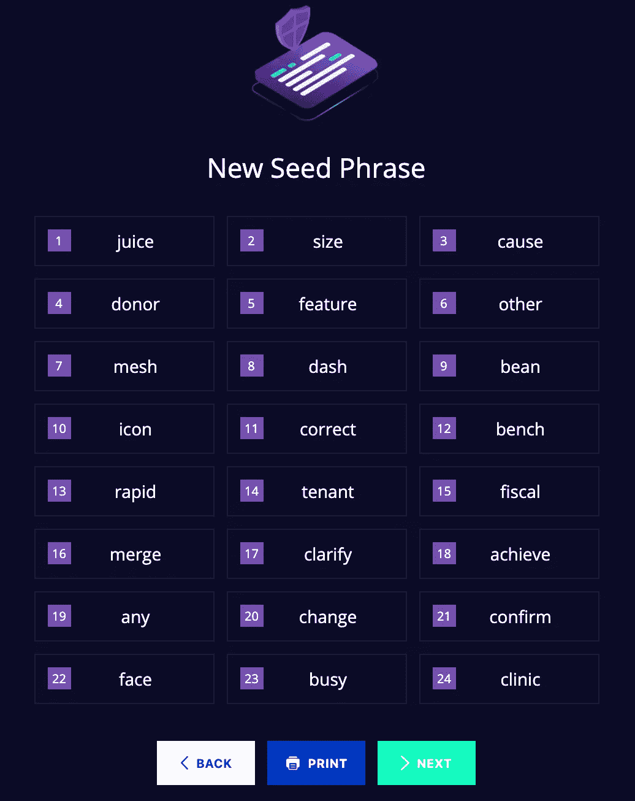
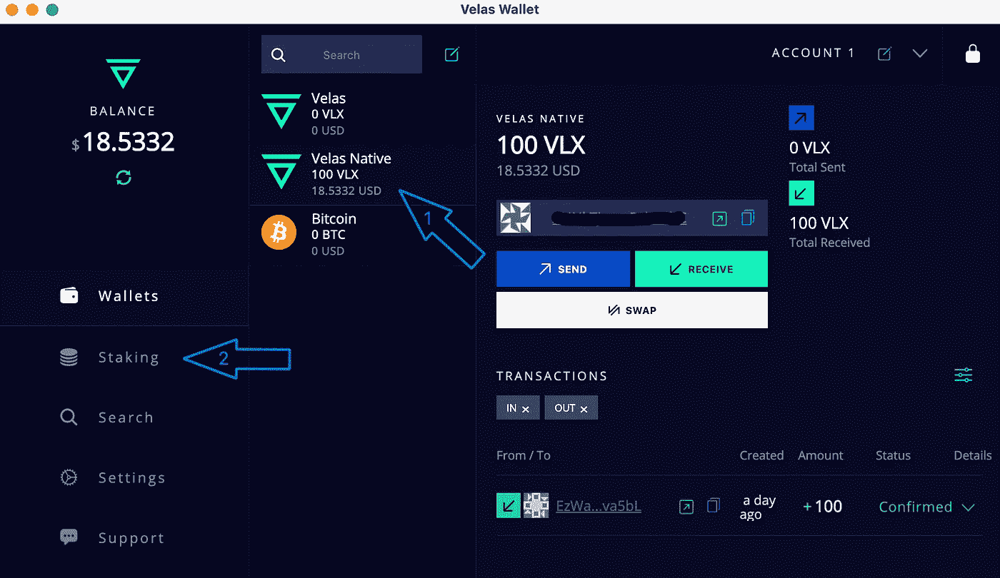
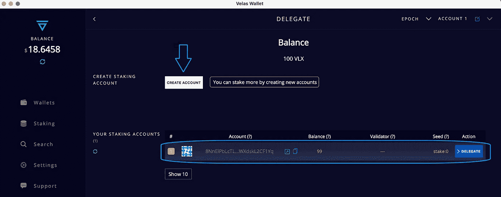
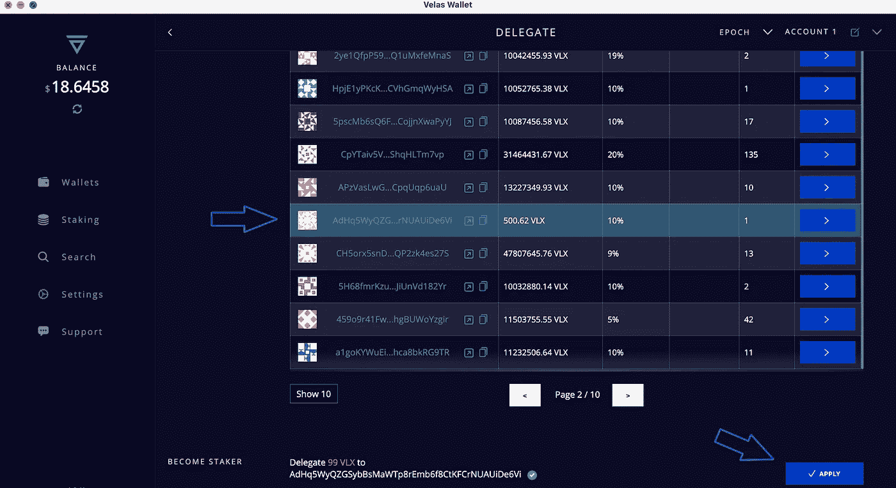
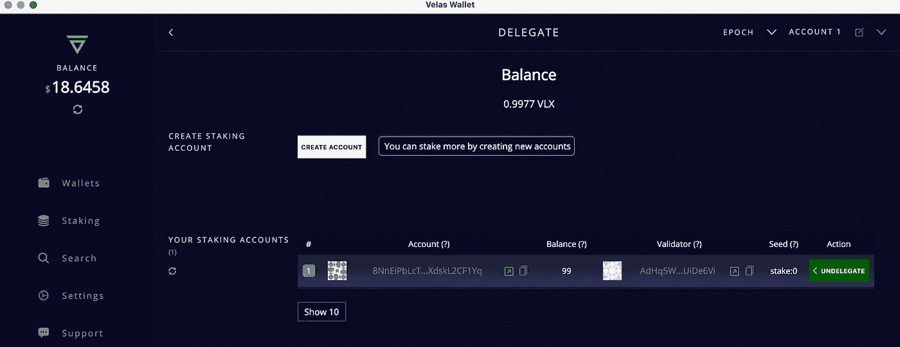

# 如何用 VELAS 桌面钱包下注$VLX (VELAS)代币

> 原文：<https://medium.com/coinmonks/how-to-stake-vlx-velas-tokens-with-velas-desktop-wallet-eee9c4811e35?source=collection_archive---------2----------------------->

首先，我们需要下载一个钱包。

从官方 [VELAS 网站](https://velas.com/)下载钱包发行版:

[MAC OS](https://github.com/velas/JsWalletDesktop/releases/download/v1.0.44/Velas-desktop-wallet-1.0.44.dmg)

[*视窗*](https://github.com/velas/JsWalletDesktop/releases/download/v1.0.44/Velas-desktop-wallet-Setup-1.0.44.exe)

[苹果设备](https://apps.apple.com/us/app/velas-mobile-wallet/id1541032748)

[安卓设备](https://play.google.com/store/apps/details?id=com.velas.mobile_wallet)

[Linux](https://github.com/velas/JsWalletDesktop/releases/download/v1.0.44/Velas-desktop-wallet_1.0.44_amd64.snap)

你可以在这里找到并下载最新版本的 Velas 桌面钱包[。运行安装向导，安装它。](https://velas.com/)

在这个常见问题解答中，我们使用了用于 Mac OS 的 Velas wallet 作为示例

在你的电脑上安装钱包

在第一步，您将被提供选择语言，然后“点击”创建按钮。如果你有一个种子短语，你可以恢复你的旧钱包。

然后为你的钱包 app 输入一个强密码。

在下一步中，您必须保存您的种子短语，然后按照建议的顺序输入每个单词。

钱包将生成一个 24 字的钱包恢复种子。万一您的设备丢失或损坏，您无法使用您的资金，您将需要它。

***记住了！*** *写下你的助记种子短语并安全储存。谁能获得助记符种子，谁就能获得你的资金！*

现在，您可以开始使用您的 Velas 钱包了！

**如何委派代币**

一旦在主屏幕上启动，你需要得到一个地址。为此，只需点击钱包中的$VLX (Velas Native)令牌(步骤 1)。然后你可以在左上角看到你的钱包地址，点击它，然后复制你的钱包地址。

完成资金注入后，您可以进入第 2 步。

**创建股份账户**

在您成功地为您的钱包帐户注资后，是时候创建一个股份帐户了。提示。作为令牌持有者，您有能力通过授权给多个验证者来增强去中心化，从而提高整体安全性，进而提高网络的整体价值。为了成功做到这一点，你需要创建一个以上的股份帐户。将钱包账户中的资金分散到不同的股份账户中，但要确保在钱包账户中留一些 VLX 美元，以支付交易费用。由于这些在 Velas 中是非常低的，所以在你的钱包账户中留下~ 1 VLX 应该是绰绰有余的。

在顶部菜单中的赌注选项卡上，单击创建帐户。在弹出式菜单中选择要从您的 Wallet 帐户转入您的 Stake 帐户的金额，然后单击“下一步”。对您想要创建的每个股份帐户重复此过程。

您会发现您所有的赌注帐户都显示在 Velas wallet 中，现在您可以开始下注了！

**委托你的股份**

在 Velas wallet 上的“赌注”选项卡中，单击相应赌注帐户旁边的“委托”,在下拉菜单中选择您选择的验证器，然后单击“下一步”。输入您的密码，然后单击提交。对你的每一个股票账户重复这个过程。为了促进去中心化和最终 Velas 网络的安全性和价值，最好选择 Halt Power 之外的验证器。停止权力由 [Velas validators](https://velasvalidators.com/) 上的一个条表示:上面的累积股份可以停止网络-改善分散化并委托给下面的验证者。

***我们的验证器投票账号地址是:***

***adhq 5 wyqzgsybbsmawtp 8 remb 6 f 8 ctkfcrnuuide 6 VI***

选择验证器后，按应用按钮。

就是这样！您现在是 Velas 区块链号的代表，祝贺您！

你可以在 Velas wallet 上的 Staking 标签下找到你的股份账户和他们授权的验证者。

***StakeCraft 投票账号地址*****adhq 5 wyqzgsybbsmawtp 8 remb 6 f 8 ctkfcrnuuide 6 VI**

***StakeCraft 身份账号地址*****ezwagw 2 jnwwwvzxvawdxdeiowfyasyeju 9 LFC fava 5 bl**

*你诚挚的，*

木桩队。

您可以找到我们:

*   [推特](https://twitter.com/stakecraft)
*   [不和谐](https://discord.gg/xkYnNYV4qH)
*   [电报](https://t.me/stakecraft)
*   给我们发电子邮件[Support@stakecraft.com](mailto:Support@stakecraft.com)

 [## 可信验证器

### StakeCraft Validator 提供服务，让用户从他们的数字资产中获利，提供高…

stakecraft.com](https://stakecraft.com) 

> 加入 Coinmonks [电报频道](https://t.me/coincodecap)和 [Youtube 频道](https://www.youtube.com/c/coinmonks/videos)了解加密交易和投资

## 另外，阅读

*   [尤霍德勒 vs 科恩洛 vs 霍德诺特](/coinmonks/youhodler-vs-coinloan-vs-hodlnaut-b1050acde55a) | [Cryptohopper vs 哈斯博特](https://blog.coincodecap.com/cryptohopper-vs-haasbot)
*   [币安 vs 北海巨妖](https://blog.coincodecap.com/binance-vs-kraken) | [美元成本平均交易机器人](https://blog.coincodecap.com/pionex-dca-bot)
*   [新加坡十大最佳加密交易所](https://blog.coincodecap.com/crypto-exchange-in-singapore) | [购买 AXS](https://blog.coincodecap.com/buy-axs-token)
*   [投资印度的最佳密码](https://blog.coincodecap.com/best-crypto-to-invest-in-india-in-2021) | [HitBTC 评论](/coinmonks/hitbtc-review-c5143c5d53c2)
*   [加拿大最好的加密交易机器人](https://blog.coincodecap.com/5-best-crypto-trading-bots-in-canada) | [赌注加密](https://blog.coincodecap.com/staking-crypto)
*   [如何在印度购买比特币？](/coinmonks/buy-bitcoin-in-india-feb50ddfef94) | [瓦济克斯审查](/coinmonks/wazirx-review-5c811b074f5b)
*   [比特币主根](https://blog.coincodecap.com/bitcoin-taproot) | [Bitso 评论](https://blog.coincodecap.com/bitso-review) | [排名前 6 的比特币信用卡](/coinmonks/bitcoin-credit-card-bc8ab6f377c6)
*   [最佳免费加密信号](https://blog.coincodecap.com/free-crypto-signals) | [YoBit 评论](/coinmonks/yobit-review-175464162c62) | [Bitbns 评论](/coinmonks/bitbns-review-38256a07e161)
*   [CoinFLEX 评论](https://blog.coincodecap.com/coinflex-review) | [AEX 交易所评论](https://blog.coincodecap.com/aex-exchange-review) | [UPbit 评论](https://blog.coincodecap.com/upbit-review)
*   [AscendEx 保证金交易](https://blog.coincodecap.com/ascendex-margin-trading) | [Bitfinex 赌注](https://blog.coincodecap.com/bitfinex-staking) | [bitFlyer 评论](https://blog.coincodecap.com/bitflyer-review)
*   [麻雀交换评论](https://blog.coincodecap.com/sparrow-exchange-review) | [纳什交换评论](https://blog.coincodecap.com/nash-exchange-review)
*   [加密货币储蓄账户](/coinmonks/cryptocurrency-savings-accounts-be3bc0feffbf) | [加密交易机器人](https://blog.coincodecap.com/best-crypto-trading-bots)
*   [BigONE 交易所评论](/coinmonks/bigone-exchange-review-64705d85a1d4) | [CEX。IO 审查](https://blog.coincodecap.com/cex-io-review) | [交换区审查](/coinmonks/swapzone-review-crypto-exchange-data-aggregator-e0ad78e55ed7)
*   [最佳比特币保证金交易](/coinmonks/bitcoin-margin-trading-exchange-bcbfcbf7b8e3) | [比特币保证金交易](https://blog.coincodecap.com/bityard-margin-trading)
*   [加密保证金交易交易所](/coinmonks/crypto-margin-trading-exchanges-428b1f7ad108) | [赚取比特币](/coinmonks/earn-bitcoin-6e8bd3c592d9) | [Mudrex 投资](https://blog.coincodecap.com/mudrex-invest-review-the-best-way-to-invest-in-crypto)