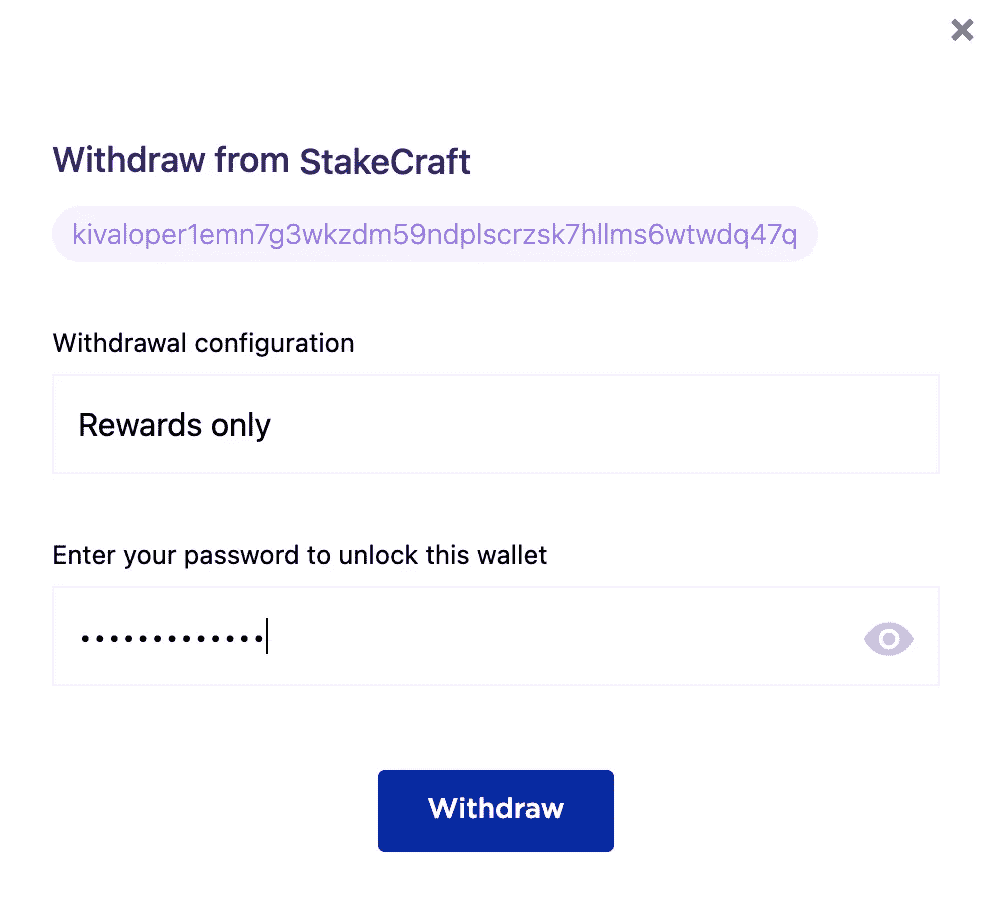

# 如何用 KI 桌面钱包下注$XKI (Ki 链)代币

> 原文：<https://medium.com/coinmonks/how-to-stake-xki-ki-chain-tokens-with-ki-desktop-wallet-eb86e1f80236?source=collection_archive---------4----------------------->

首先，我们需要下载一个钱包。

从官方 Ki 基金会 [GitHub 库](https://github.com/KiFoundation/ki-desktop-wallet/releases)下载钱包发行版，或者通过直接链接下载到您的操作系统:

[MAC OS](https://github.com/KiFoundation/ki-desktop-wallet/releases/download/v0.3.1/ki-desktop-wallet-0.3.1-macos.dmg)

[*视窗*](https://github.com/KiFoundation/ki-desktop-wallet/releases/download/v0.3.1/ki-desktop-wallet-0.3.1-windows.msi)

[*Debian*](https://github.com/KiFoundation/ki-desktop-wallet/releases/download/v0.3.1/ki-desktop-wallet-0.3.1-debian.deb)

在本常见问题解答中，我们以 Ki 桌面钱包 Mac OS 版为例

**在电脑上安装钱包**

你随时可以在这里找到并下载 Ki 桌面钱包[的最新版本。运行安装向导，安装它。](https://github.com/KiFoundation/ki-desktop-wallet/releases)

**推出钱包**

在主屏幕上启动后，选择是要使用种子短语导入现有的 wallet 还是创建新的 wallet。

由于您没有钱包，您需要生成一个新的，因此选择 ***生成新钱包*** 。

为您的钱包选择一个名称，然后单击 ***生成钱包*** 。

**创建钱包备份**

Ki 桌面钱包将生成一个 24 字的钱包恢复种子。万一您的设备丢失或损坏，您无法使用您的资金，您将需要它。

***记住！写下你的助记种子短语并安全地储存起来。谁能获得助记种子，谁就能获得你的资金！***

把单词按顺序写在纸上，放在安全的地方，以免丢失。然后点击 ***进行*** 。

然后填写缺失的单词以确保种子正确并点击 ***验证*** 。

**创建密码**

用强密码保护你的钱包然后点击 ***保存*** 。

**如何委托代币**

当你创建了一个钱包，并向你的钱包发送了一些代币后，你可以下注 XKI。

首先，你需要得到一个地址。为此，只需点击钱包(步骤 1)。然后你可以看到你的钱包地址就在左上角的钱包名称下，点击它进行复制(步骤 2)。

完成资金注入后，您可以进入下一步。

# 打开钱包控制面板(步骤 3)。

要访问控制面板和赌注，请单击钱包。

# 选择验证器

转到 ***委托*** 选项卡，并从列表中选择验证器。要快速找到正确的验证器，例如，在搜索字符串中输入它的名称。然后点击 ***委托*** 。

> **StakeCraft 验证器委托地址:**
> 
> **kivaloper 1 em 7g 3 wkzdm 59 ndplscrzsk 7 hllms 6 wtwdq 47 q**

# 委托令牌

指定您想要下注的 XKI 令牌的数量。您也可以通过移动滑块来手动配置网络费用。佣金越大，交易确认越快。然后点击 ***委托*** 。

***暗示。留下一些代币，这样当你授权、转让代币或领取奖励时，你就有东西支付佣金了。***

您发送了标记，但验证器仍需要确认交易。只需点击该交易，即可在**交易**选项卡中跟踪该交易的状态。通常，一个事务只需要几秒钟就能出现，但是如果你没有看到它，点击顶栏右边的****刷新按钮*** 来加速 UI。*

**

*或者你可以使用 [Ki Chain Explorer](https://blockchain.ki/) 找到它，方法是转到**验证器**部分中你的验证器的**委托**标签，在那里你可以通过你的钱包地址在 [**所有现有委托**](https://blockchain.ki/validator/kivaloper1dm98ttse9xefpgfzvl2wnq6hcrhx8ndxd4stz8/delegations) 中找到它。*

****

*除了 web explorer，要跟踪 XKI 交易和赌注，您可以使用适合您智能手机的应用程序:*

*[应用商店](https://apps.apple.com/app/ki-explorer/id1560914293)*

*[Google play](https://play.google.com/store/apps/details?id=com.kerweb.kiexplorer)*

*如果交易被确认，XKI 令牌已被下注，现在您将在每次验证器提交新块时获得奖励。*

# *如何提取奖励*

*要提取累积的奖励，请转到 ***提取选项卡*** ，然后单击您的验证者名称旁边的 ***提取*** 。在出现的窗口中，输入您的密码，点击*。**

********

**通常，奖励几乎会立即到达你的钱包账户，之后你可以分配这些奖励，从而增加你的收入。**

***你诚挚的，***

***桩工队。***

**您可以找到我们:**

*   **[推特](https://twitter.com/stakecraft)**
*   **[不和](https://discord.gg/xkYnNYV4qH)**
*   **[电报](https://t.me/stakecraft)**
*   **给我们发电子邮件[Support@stakecraft.com](mailto:Support@stakecraft.com)**

** [## 可信验证器

### StakeCraft 是一个在编程、开发和管理数字资产方面拥有丰富经验的极客团队。我们使用顶级…

stakecraft.com](https://stakecraft.com) 

> 加入 [Coinmonks 电报频道](https://t.me/coincodecap)，了解加密交易和投资

## 另外，阅读

*   [尤霍德勒 vs 考尼洛 vs 霍德诺特](/coinmonks/youhodler-vs-coinloan-vs-hodlnaut-b1050acde55a) | [Cryptohopper vs 哈斯博特](https://blog.coincodecap.com/cryptohopper-vs-haasbot)
*   [币安 vs 北海巨妖](https://blog.coincodecap.com/binance-vs-kraken) | [美元成本平均交易机器人](https://blog.coincodecap.com/pionex-dca-bot)
*   [如何在印度购买比特币？](/coinmonks/buy-bitcoin-in-india-feb50ddfef94) | [WazirX 评论](/coinmonks/wazirx-review-5c811b074f5b) | [BitMEX 评论](https://blog.coincodecap.com/bitmex-review)
*   [比特币主根](https://blog.coincodecap.com/bitcoin-taproot) | [Bitso 评论](https://blog.coincodecap.com/bitso-review) | [排名前 6 的比特币信用卡](/coinmonks/bitcoin-credit-card-bc8ab6f377c6)
*   [双子座 vs 比特币基地](https://blog.coincodecap.com/gemini-vs-coinbase) | [比特币基地 vs 北海巨妖](https://blog.coincodecap.com/kraken-vs-coinbase) | [硬币罐 vs 硬币点](https://blog.coincodecap.com/coinspot-vs-coinjar)
*   [印度加密交易所](/coinmonks/bitcoin-exchange-in-india-7f1fe79715c9) | [比特币储蓄账户](/coinmonks/bitcoin-savings-account-e65b13f92451) | [Paxful 审核](/coinmonks/paxful-review-4daf2354ab70)
*   [杠杆令牌](/coinmonks/leveraged-token-3f5257808b22) | [最佳加密交易所](/coinmonks/crypto-exchange-dd2f9d6f3769) | [AscendEX 评论](/coinmonks/ascendex-review-53e829cf75fa)
*   [Godex.io 审核](/coinmonks/godex-io-review-7366086519fb) | [邀请审核](/coinmonks/invity-review-70f3030c0502) | [BitForex 审核](https://blog.coincodecap.com/bitforex-review) | [HitBTC 审核](/coinmonks/hitbtc-review-c5143c5d53c2)
*   [Crypto.com 费用](/coinmonks/binance-fees-8588ec17965) | [僵尸密码审查](/coinmonks/botcrypto-review-2021-build-your-own-trading-bot-coincodecap-6b8332d736c7) | [替代品](https://blog.coincodecap.com/crypto-com-alternatives)
*   [有哪些交易信号？](https://blog.coincodecap.com/trading-signal) | [比特斯坦普 vs 比特币基地](https://blog.coincodecap.com/bitstamp-coinbase)
*   [ProfitFarmers 回顾](https://blog.coincodecap.com/profitfarmers-review) | [如何使用 Cornix Trading Bot](https://blog.coincodecap.com/cornix-trading-bot)
*   [MXC 交易所评论](/coinmonks/mxc-exchange-review-3af0ec1cba8c) | [Pionex vs 币安](https://blog.coincodecap.com/pionex-vs-binance) | [Pionex 套利机器人](https://blog.coincodecap.com/pionex-arbitrage-bot)
*   [印度的秘密税](https://blog.coincodecap.com/crypto-tax-india) | [altFINS 审查](https://blog.coincodecap.com/altfins-review) | [Prokey 审查](/coinmonks/prokey-review-26611173c13c)
*   [区块链 vs 比特币基地](https://blog.coincodecap.com/blockfi-vs-coinbase) | [比特坎评论](https://blog.coincodecap.com/bitkan-review) | [币安评论](/coinmonks/binance-review-ee10d3bf3b6e)**