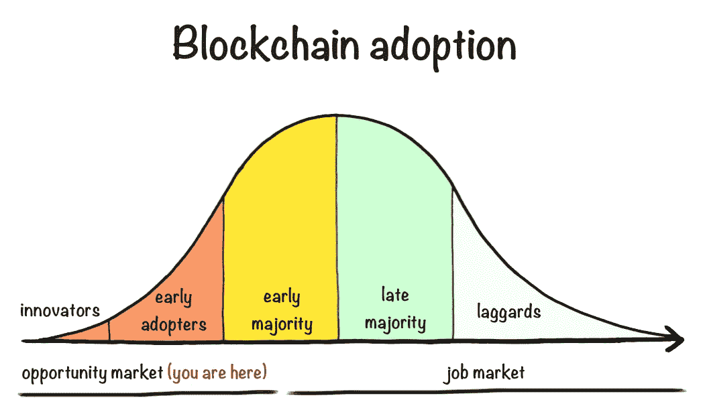
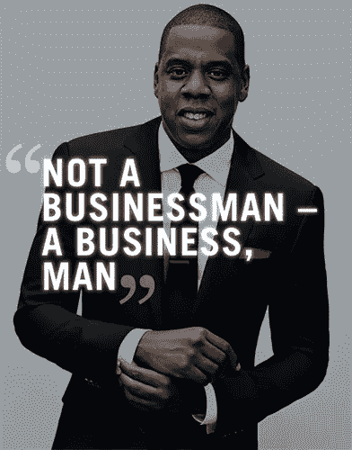
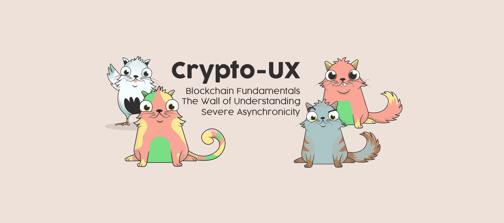
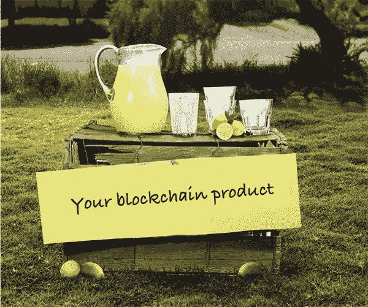

# 如何启动你的区块链职业生涯

> 原文：<https://medium.com/coinmonks/how-to-start-your-blockchain-career-6a01deecc276?source=collection_archive---------1----------------------->

当一种新型产业出现时，我们发现它可能不是在创造一个就业市场，而是一个*机会市场，*主要服务于那些能够帮助自己分享快速增长的馅饼的人。

在这篇文章中，我将概述区块链的一些关键机会领域，以及你如何在这些领域中发挥作用。对于那些从朝九晚五的工作心态中走出来的人来说，准备好投入大量的工作和无偿的努力。**关注长期目标，而不是短期回报**。

我将重点介绍的机会领域有:

*   软件开发
*   用户体验
*   产品管理
*   企业家精神

# 软件开发

在你开始寻找职业机会之前，记住作为一名软件开发人员进入区块链行业需要一些先决条件。例如，你应该很好地理解[区块链是如何工作的](https://www.youtube.com/watch?v=SSo_EIwHSd4)，以及智能合约是如何用 [Solidity](https://en.wikipedia.org/wiki/Solidity) 这样的语言编写的。对分布式系统和对等网络的扎实掌握是加分项。

至于找实际工作，有专门的工作网站，全球 LinkedIn“区块链”工作搜索产生超过 7600 个结果。这当然是你进入一个新行业的传统方法。

**为 ICO 工作**

另一种可能更巧妙的方法是[去 ICOBench 并列出所有完成的 ico 的](https://icobench.com/icos?filterBonus=&filterBounty=&filterMvp=&filterTeam=&filterExpert=&filterSort=&filterCategory=all&filterRating=4&filterStatus=ended&filterPublished=&filterCountry=any&filterRegistration=0&filterExcludeArea=none&filterPlatform=any&filterCurrency=any&filterTrading=any&s=&filterStartAfter=&filterEndBefore=)。收集你感兴趣的项目的联系邮件。然后准备一封介绍性的电子邮件，展示你能在软件开发方面创造什么价值，并把它和你的简历一起发送出去。别忘了附上你的 GitHub 账户的链接。

找到第一份工作的一个更主动的方法是进入你最喜欢的区块链项目的 GitHub 页面，找到标有*【招聘】*或*【好的第一期】*的问题。有一种叫做 [Github-help-wanted](http://github-help-wanted.com/) 的服务可以做到这一点。添加*作为语言，或者*【区块链】*作为标签，瞧，现在只是解决问题和证明自己的问题。*

***传统科技公司的区块链工作***

*最近，人们对区块链的兴趣激增，但与之相伴的就业市场却没有。传统公司采用突破性技术的速度往往比初创公司慢，所以在大公司找区块链的工作有点困难。*

**

*但是如果 Jay-Z 和《拥抱磨砺》教会了我们一件事，那就是你可以努力去做任何事情，甚至是传统公司的区块链工作。*

*有多种方法可以做到这一点，但我会首先列出区块链技术最有意义的行业。其中一些是[保险业](https://www.pwc.com/m1/en/media-centre/articles/blockchain-new-tool-to-cut-costs.html)、[银行业](https://www.accenture.com/sa-en/insight-perspectives-capital-markets-blockchain-numbers)和[供应链管理](https://www.forbes.com/sites/bernardmarr/2018/03/23/how-blockchain-will-transform-the-supply-chain-and-logistics-industry/#76ed49095fec)。*

*假设每个行业中最大的参与者现在可能都有自己的区块链创新中心，那么我会重点安排与较小公司的会议，介绍你的技能组合，以及区块链如何为他们节省成本或提供技术支持。如果你够执着够精明(别忘了穿得像成功！)，机会最终会以咨询工作甚至就业的形式出现。*

# *用户体验*

*在设计领域起步比在软件开发领域更容易，因为许多现有的知识可以“移植”。区块链技术仍然严重依赖传统的设计流程；比如线框图、A/B 测试和老式的视觉设计印章。*

**

*Make sure you have blockchain related work to showcase*

*当然，你应该能够在 [Dribbble](https://dribbble.com/) 上展示你的作品，并了解区块链技术的利弊。也花一些时间设计一个简单的区块链相关的作品，如产品登陆页面或加密货币钱包的概念。这里有一些[灵感](https://dribbble.com/search?q=bitcoin)让你开始。*

*除了在设计方面经验丰富，**钱包、交易、可扩展性等概念也应该是你比较熟悉的**。当你做好准备后，前往 [Blocktribe](https://blocktribe.com/categories/392/ux-designer-blockchain-jobs/) 、 [Blockchainjobz](https://blockchainjobz.com/categories/blockchain-design-jobs/) 或 [Cryptocurrencyjobs](https://cryptocurrencyjobs.co/?q=ux&hPP=100&idx=jobs&p=0) 开始申请工作——别忘了附上你的设计作品集的链接！*

# *产品管理*

*产品管理工作可能是最难找到的。这是因为区块链的企业主要是拥有单一产品的初创公司，已经由公司的首席执行官管理。*

*事实上，相关的[产品管理工作](https://www.indeed.com/jobs?q=Blockchain+manager&l=)正在慢慢增加——但也有充分的理由开创自己的事业。*

***管理自己的产品***

*你正在阅读这篇文章，因为你对区块链技术充满热情。所以问自己一个问题——在一个全新的行业，你有多少机会真正从头开始创造一些东西？*

**

*Blemonade, the first fully transparent and trustless lemonade*

*如果你有产品管理的背景，那么你很可能有管理构建产品的人的经验。那么为什么不自己造呢？*

*找一个和你一样对区块链充满热情，并且和你的技能互补的人。**杀手 kombo 通常是一个产品经理与一个软件开发人员合作**，主要是因为这是创造一个最小可行产品所需要的，这反过来可以提高你的第一轮投资。*

*如果你仍然对整个创业生活方式犹豫不决，请阅读下一部分，了解更多关于在区块链创办公司的实际情况。*

# *企业家精神*

*区块链是一个机会市场——远不止是就业市场。这会吓跑那些意识到申请一份工作比自己创造一份工作容易得多的人。但我认为，在区块链创业仍有许多合理的理由。*

**

*Everything in neon makes more sense*

***为区块链社区创业***

*你的产品需要解决区块链社区的问题和需求，无论是在商业方面还是在消费者方面。例如，您可以输入以下字段:*

*   *分散应用的可用性*
*   *智能合同开发人员工具*
*   *面向区块链技术的软件即服务解决方案*

*许多人可能仍然不知所措，但是试着用[保罗·格拉厄姆](http://paulgraham.com/startupideas.html)的话来想一想；*

> *获得创业想法的方法是不要试图去想创业想法。而是寻找问题，最好是你自己有问题。*

*这句话很好地总结了如何找到你的区块链创意。只要确保你不是一个寻找钉子的锤子。专注于为区块链科技做点什么，而不是区块链科技。*

***在区块链创业***

*一些人被区块链技术的独创性所吸引，喜欢使用分布式账本来处理基本上所有的事情。这确实限制了你的商业想法，所以让我们后退一步，了解一下区块链能带来什么。*

*区块链技术可以，除了别的以外；*

*   *保证唯一性([示例，cryptostriker](/cryptostrikers/why-were-putting-sports-cards-on-the-blockchain-c00112150033))*
*   *消除信任中间人的需要(例如[沃尔玛](https://www.youtube.com/watch?v=SV0KXBxSoio))*
*   *允许更高的透明度([示例，赌注](https://www.wagerr.com/))*

*如你所见，有许多现实世界的应用是有意义的。请记住，创业最难的不是找到一个想法，而是习惯于创造自己的机会。*

# *结论*

*不管你的背景如何，我希望你已经对如何在区块链开创自己的道路有了一些了解。这个行业仍然充满机遇——但主要是对那些更受激情而非薪酬激励的人而言。*

*所以把你自己放在那里；写一篇文章，创建一个加密播客，在业余时间编写一个项目代码，或者建立自己的事业。任何为区块链社会创造价值的事情，最终都会为你创造机会。*