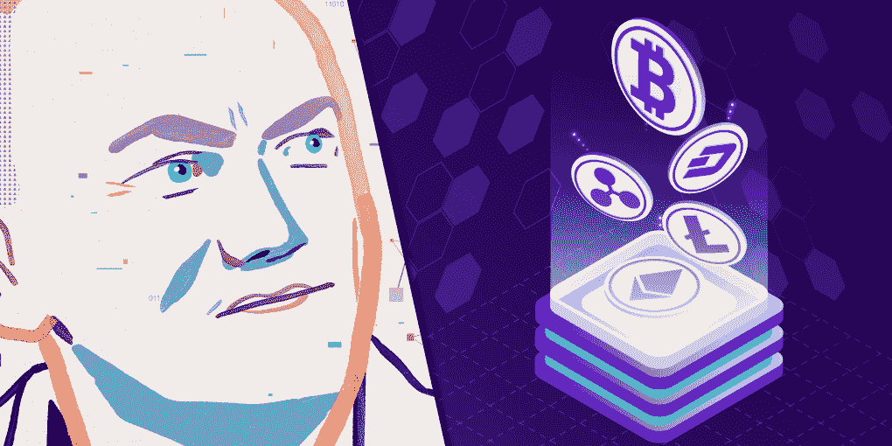
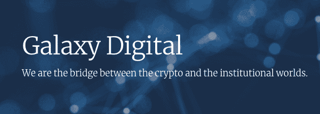
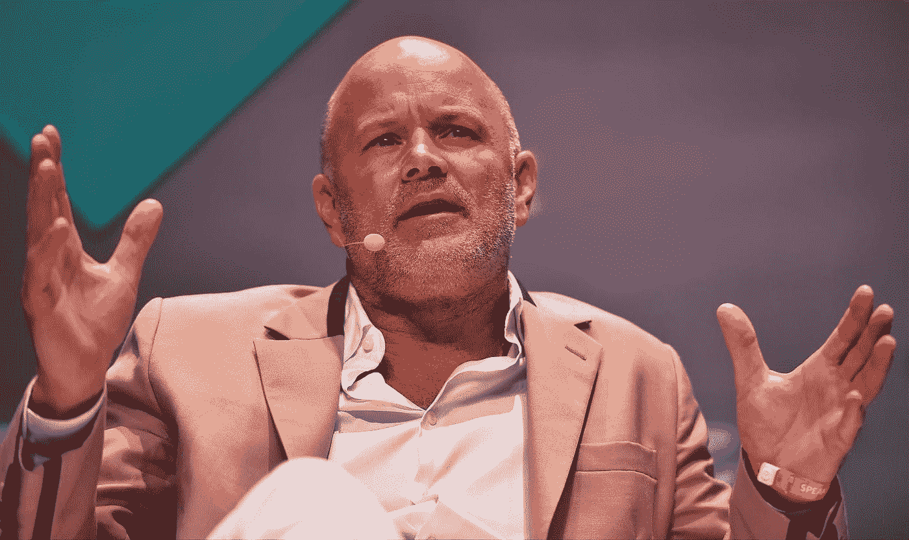
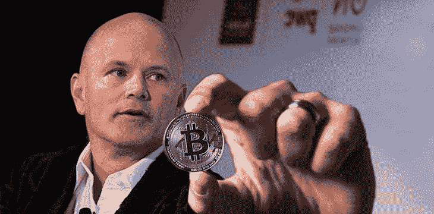

# 如何在密码市场崩溃时保持乐观:来自迈克·诺沃格拉茨的教训

> 原文：<https://medium.com/coinmonks/how-to-stay-optimistic-when-the-crypto-market-collapses-lessons-from-mike-novogratz-6a45a29ba0e5?source=collection_archive---------2----------------------->

你现在对加密的未来感到紧张吗？如果是这样，我们很容易理解——因为我们也是。比特币在 5 月份达到 60，000 美元后，我们看到了所有加密货币的熊市，目前还不清楚这一趋势何时会逆转。

在这种情况下，将主要投资组合放在加密货币上的大型投资者可能会血本无归。但是，尽管市场崩溃，他们中的一些人仍然对数字资产的未来持乐观态度——比如亿万富翁、银河投资伙伴公司首席执行官迈克·诺沃格拉茨。他仍然相信比特币的长期价值，并声称加密是金融的未来。让我们看看诺沃格拉茨是如何在熊市中保持如此乐观的。

# 迈克·诺沃格拉茨:来自传统金融的密码爱好者

许多比特币乐观主义者来自加密社区——如开发者、早期投资者等。迈克·诺沃格拉茨(Mike Novogratz)在传统金融领域工作了几十年，以经常轻视加密货币而闻名。但与他的同事不同，迈克在对冲基金和机构投资方面的丰富经验帮助他看到了加密的潜力。

诺沃格拉茨开始于 1989 年的美好时光，他在高盛的债券交易中发了第一笔财。亚洲“小虎经济”的繁荣帮助他创造了丰厚的回报，这使他在 1998 年成为合伙人。他继续走这条路，加入 Fortress Investments 并帮助其应对 2007-2008 年的危机。

那时，诺沃格拉茨已经成为亿万富翁。动荡严重挑战了他的地位，但加密货币帮助他再次达到这一地位。2017 年，迈克 20%的净资产是加密货币，到 2021 年，他报告说他的投资组合中有 85%是数字资产。Novogratz 在 2018 年创立的 Galaxy Investment Partners 公司拥有数轮成功的投资，包括 Bitfury crypto infrastructure 公司。

# “这不是我们在寻找名字有趣的硬币”

2021 年 5 月 12 日，比特币开始大幅崩盘。5 月 18 日，这枚硬币在 24 小时内价格下跌了 25%，与上个月的历史高点相比总共下跌了 50%。然而，这看起来不像 2018 年坠毁到诺沃格拉茨。

在下跌后的采访中，Mike [说](https://www.cnbc.com/2021/05/19/crypto-bull-mike-novogratz-says-morning-plunge-felt-like-capitulation.html)这是一个“清算事件”和“钱包和投资者基础的挫折”人们损失了很多钱，但这就是市场自我调节的方式:当人们觉得资产超买时，他们就会套现并获利。根据 Novogratz 的说法，挫折是由改变趋势的“各种事件的汇合——税收日、埃隆·马斯克的推特等等”造成的。

诺沃格拉茨对这场熊市的最后阶段持乐观态度。“加密革命已经发生”，目前的下降不会改变这一点。“这个故事没有任何进展，”—迈克说。

尽管诺沃格拉茨对某些人来说过于乐观，但他仍然生活在现实中。他没有等待增长的立即恢复:“矮胖子永远不会在两天内恢复原状…当他崩溃时。”这位投资者承诺，比特币的市场将在 36，000 美元至 38，000 美元左右的水平盘整。正如我们在 2 个月后看到的，第一种加密货币在 32K 美元左右浮动，没有更剧烈的崩溃。

根据 Novogratz 的说法，5 月份的市场崩溃只是证明了数字资产生态系统的概念。他预计比特币将在未来几年取代黄金，并认为比特币更像是一种避险资产，而不是一种日常支付手段。至于一般的加密货币，Novogratz 认为“这不是我们在寻找名字有趣的硬币。这是一种重建全球金融架构的严肃方法。”

# 长期乐观:机构投资者的追逐

为什么诺沃格拉茨如此看好加密货币的未来？正如我们已经看到的，他不是那些为数字货币的早期发展做出贡献的比特币最大化主义者之一，只是被它们的可能性迷住了。相反，迈克直接与成为 2021 年秋季比特币增长驱动力之一的人合作——机构投资者。

大银行、对冲基金、华尔街的投资者是 Novogratz 的 Galaxy Digital 正在劝说投资加密货币的人。该公司将自己定位为“密码和机构世界之间的桥梁”，它似乎名副其实。

Galaxy 管理着 16 亿美元的资产，投资了数百家公司，其中包括对高速增长的初创公司的 2.95 亿美元投资。该公司有 300 个机构交易对手，它帮助交易，管理资产，投资和采矿。根据银河向投资者的[陈述，其净收入从 2020 年第四季度的 3.36 亿美元增长到 2021 年 Q1 的 8.6 亿美元。与华尔街相比，这是相当可观的收益。](https://investor.galaxydigital.io/overview/default.aspx)

诺沃格拉茨亲眼目睹了一切是如何向前发展的，这一定是他乐观的源泉。Mike 的愿景得到了他的优秀团队的认同:来自高盛、贝莱德、富达和谷歌的专业人士认为，91%的机构投资者将在 5 年内拥有“数字资产敞口”。也就是说，大型投资公司、对冲基金和养老基金将自己投资于 crypto，或者为他们的客户创造工具来这样做。

银河数码开辟了道路，向机构投资者展示如何在加密中分配资金，吸引了许多人参与这项活动。如今，华尔街很难忽视这件事。

# 迈克·诺沃格拉茨的工作

每个人都有按照自己喜欢的方式思考的自由。如果你对当前的加密趋势感到悲观，这篇文章几乎不会改变你的想法。它的目的只是为了表明:加密货币不仅能激发被 100-1000 美元的高收益和快速收益所吸引的小投资者。这也是那些冒着数百万和数十亿风险的人的焦点，此外，还是那些思维模式在传统金融时代形成的人的焦点。Mike Novogratz 就是其中之一，他不仅相信加密货币的未来，还用这一愿景感染了数百名客户。“在地球上每个人都拥有比特币钱包之前，我们的工作还没有完成，”他表示。

***

你在寻找合适的投资工具吗？访问 [ChangeNOW](http://changenow.io) 。在我们的即时加密交换服务中，您可以交换 200 多种最受欢迎的加密货币，无需 KYC 和注册。我们提供合理的价格，交易直接从你的钱包里。我们在 Trustpilot 上从 3900 多条评论中发现了 [4.6 starts](https://www.trustpilot.com/review/changenow.io) 。

*ChangeNOW 不提供投资建议，也不对任何交易者的决定或行为负责。加密货币交易涉及高风险，我们敦促您在做出投资决定之前做好自己的研究。*

## 另外，阅读

 [## 2021 年 17 款最佳加密交易机器人(免费和付费)

### 2021 年币安、比特币基地、库币和其他密码交易所的最佳密码交易机器人。四进制，位间隙…

medium.com](/coinmonks/crypto-trading-bot-c2ffce8acb2a)