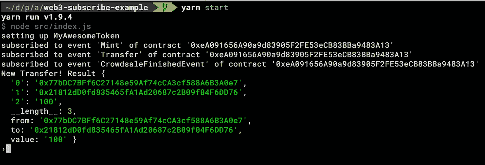

# 如何使用 Web3 1.0 订阅智能合约事件？

> 原文：<https://medium.com/coinmonks/how-to-subscribe-smart-contract-events-using-web3-1-0-93e996c06af2?source=collection_archive---------1----------------------->

您可能已经听说过，现在可以用 websocket 连接以太坊节点。Web3.js 有一个叫做`web.eth.subscribe.`的新方法，使用它，你可以订阅 4 种不同类型的事件(pendingTransactions，newBlockHeaders，syncing，logs)。在本文中，我们将关注日志。所以让我们开始吧！

首先，我们需要连接到一个 websocket 提供者。

```
const Web3 = require('web3')const web3 = new Web3('ws://localhost:8545')
```

**重要提示** : Subscribe 方法只适用于 websocket 提供者！

设置我们的合同实例:

在这一点上，我假设你使用 [Truffle 框架](https://truffleframework.com/)来构建你的智能合约。

```
const tokenInterface = require('../build/contracts/myToken.json')const deployedAddress = tokenInterface.networks[networkId].addresstoken = new web3.eth.Contract(tokenInterface.abi,deployedAddress)
```

很好！现在是时候设置我们的 subcribe 函数了。

```
// a list for saving subscribed event instances
const subscribedEvents = {}// Subscriber methodconst subscribeLogEvent = (contract, eventName) => { const eventJsonInterface = web3.utils._.find( contract._jsonInterface, o => o.name === eventName && o.type === 'event', ) const subscription = web3.eth.subscribe('logs', { address: contract.options.address, topics: [eventJsonInterface.signature] }, (error, result) => { if (!error) { const eventObj = web3.eth.abi.decodeLog( eventJsonInterface.inputs, result.data, result.topics.slice(1) ) console.log(`New ${eventName}!`, eventObj) } }) subscribedEvents[eventName] = subscription}
```

我们几乎准备好了！我们所要做的就是调用“subscribeLogEvent”函数进行订阅。一些鹰眼可能已经注意到我从主题数组(`result.topics.slice(1)`)中删除了第一个主题。当我们使用非匿名事件时，这是一个需求。详细信息见 [web3.js 文档](https://web3js.readthedocs.io/en/1.0/web3-eth-abi.html#decodelog)。

你现在可以称之为:

```
subscribeLogEvent(myContractInstance, 'Transfer')
```

你可以猜到`Transfer`是这个事件的名字。

现在，每当一个事件触发时，您应该能够在控制台上看到它，并显示正确的参数名称。



你可以在这里找到完整的工作示例[。](https://github.com/vbilici/web3-subscribe-example)

编码快乐！

参考资料:

[Web3 文档](https://web3js.readthedocs.io/en/1.0/web3-eth-subscribe.html)

> 加入 Coinmonks [电报频道](https://t.me/coincodecap)和 [Youtube 频道](https://www.youtube.com/c/coinmonks/videos)获取每日[加密新闻](http://coincodecap.com/)

## 另外，阅读

*   [复制交易](/coinmonks/top-10-crypto-copy-trading-platforms-for-beginners-d0c37c7d698c) | [加密税务软件](/coinmonks/crypto-tax-software-ed4b4810e338)
*   [网格交易](https://coincodecap.com/grid-trading) | [加密硬件钱包](/coinmonks/the-best-cryptocurrency-hardware-wallets-of-2020-e28b1c124069)
*   [密码电报信号](http://Top 4 Telegram Channels for Crypto Traders) | [密码交易机器人](/coinmonks/crypto-trading-bot-c2ffce8acb2a)
*   [最佳加密交易所](/coinmonks/crypto-exchange-dd2f9d6f3769) | [印度最佳加密交易所](/coinmonks/bitcoin-exchange-in-india-7f1fe79715c9)
*   [币安 vs Bitstamp](https://coincodecap.com/binance-vs-bitstamp) | [Bitpanda vs 比特币基地 vs Coinsbit](https://coincodecap.com/bitpanda-coinbase-coinsbit)
*   [如何购买 Ripple (XRP)](https://coincodecap.com/buy-ripple-india) | [非洲最好的加密交易所](https://coincodecap.com/crypto-exchange-africa)
*   [非洲最佳加密交易所](https://coincodecap.com/crypto-exchange-africa) | [胡交易所评论](https://coincodecap.com/hoo-exchange-review)
*   [eToro vs 罗宾汉](https://coincodecap.com/etoro-robinhood)|[MoonXBT vs by bit vs Bityard](https://coincodecap.com/bybit-bityard-moonxbt)
*   开发人员的最佳加密 API
*   最佳[密码借贷平台](/coinmonks/top-5-crypto-lending-platforms-in-2020-that-you-need-to-know-a1b675cec3fa)
*   [免费加密信号](/coinmonks/free-crypto-signals-48b25e61a8da) | [加密交易机器人](/coinmonks/crypto-trading-bot-c2ffce8acb2a)
*   [杠杆代币](/coinmonks/leveraged-token-3f5257808b22)终极指南