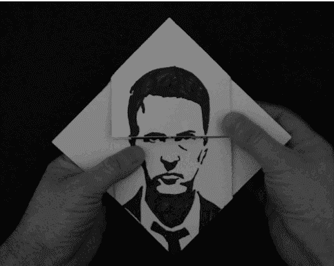

# 如何在交易中生存:技巧和交易工具

> 原文：<https://medium.com/coinmonks/how-to-survive-while-trading-tips-trading-tools-22c5977cece8?source=collection_archive---------11----------------------->

[提示&招数](https://tradermake.money/blog/tag/tips-tricks/)

*“我从来不害怕加密货币。但是现在我为她担心。市场让我害怕。而这种恐惧让我无法过正常的生活:我睡眠不好，几乎不吃饭，生产力低下……我一团糟……卖还是持有？”*

你认出你自己了吗？😄

每隔 15 分钟，你脑海中就会响起一个声音:“检查图表”？显然，自上次检查以来，几乎没有什么变化。而且也可以理解，不会让你更容易看到同样的数字。但你还是检查了。因为钱危在旦夕。很多钱。

如果你应用了下面所有的建议，这篇文章可以彻底改变你的交易。你可以在任何市场应用它们，但是在熊市，你不能没有它们。拿出你的笔记本和笔，因为我们已经收集了最酷的加密交易专业人士的经验，告诉你如何在一切着火时保持冷静，并拿出你的利润。

# 秘密交易者俱乐部的第一条规则:你必须有一个计划

看起来是如此简单和明显。但这一点击倒了大部分交易者。因为光在脑子里想象运动的大致矢量是不够的。这不是计划。计划是一个清晰的、一步一步的指南(最好是写下来),让你在任何情绪和环境下都能遵循。

有计划和坚持计划之间有着巨大的区别。看起来，你们中的大多数人对他们想要什么以及如何搬到那里有一个粗略的想法，但在一分钟内(例如，在阅读一些“紧急新闻”后)，你决定改变计划，结果，你卖得太早或太晚。

📌你需要设定一系列标准。当市场以某种方式运行时，你要遵守的明确的规则。**每个专业人士都有交易计划，并严格遵守。**

是时候像专业人士一样思考了。写下你的交易计划，放在你交易的地方的眼前。当市场触及任何一个门槛时，你需要做的就是检查你的计划，并采取计划中指出的行动。如果策略被写下来，并不断出现在你的眼前，忽略它就困难得多。

***行动指南:*** *有时候问问自己，“如果市场现在崩盘，我失去了一切，我会好吗？”-如果答案是“是”，请继续努力。然而，如果答案是“不”，考虑重新考虑你的方法。*

# 第二条规则:加强你的投资组合

📌检查你的投资组合，把有长期潜力的硬币和没有长期潜力的硬币分开。如果市场崩溃，它会帮助你。

在牛市中，你投资什么并不重要——它会增长，每个人都会赢，有人多，有人少。

熊市是另一回事。这艘船可能还没有沉没，但它肯定正在经历一段艰难时期。任何压舱物都会把你拖垮。所以帮助你自己——减少你的负担。分析你的投资，考虑硬币——并且要节俭。

以这种方式迅速果断地行动是很重要的。记住，这是真金白银的赌注。

仔细评估甚至硬币有你认为长期的潜力。问问你自己:值得冒这个险吗？当你有疑问时，把你的钱投资到一个你认为绝对可以度过下跌的更稳定的硬币上。

***行动指南:*** *在你的计划中加入这一点:按重要性顺序列出你所有的硬币，从而确定如果市场崩盘，你应该按什么顺序处理掉它们。*

# 降低噪音

你可能已经听过这个建议很多次了，但是尽管如此，你还是订阅了另一个“有经验的”交易者的下一个(第 37 个)电报频道，一天之内第七次查看 Twitter 你就是无法抗拒在评论中讨论另一个“热门”新闻或者给那个傻瓜提建议的诱惑。

📌但是长期盈利总是把自己定位在人群的前面或后面，而不是人群中。**远离讨论**。这些聊天里的每个人都别有用心。

太多的人在 Telegram / Slack / Twitter / Reddit /脸书/ Discord 上花费了太多的时间进行无休止的讨论……(这个列表还在继续)。你能做的最好的事情是不要访问所有这些社交网络，因为有太多的错误信息在那里传播，这将迫使你做出轻率的决定并过早出售。

作为交易者，你主要的(也是唯一的)任务是看图表，做预测。而要做出准确的预测，你不需要收集你脑子里能装下的那么多数据。我们只是在谈论高质量的信息，不应该有太多的信息——只需要合适就行了。

如果你想接收有用的信息，而不必花大量时间阅读、讨论，最重要的是过滤，有一个很好的机会——加入私人(通常是付费的)聊天。

***行动指南:*** *审核你关注的所有来源，清理干净，要批判！问问你自己——这里真的有有用的信息吗？它对我的交易有帮助吗？如果没有，退订。*

# 找到你的梦之队

这项技术是由一位瑞典商人发明的。他想在家庭和工作之间合理分配时间。他发现了一个简单而巧妙的解决方案，使他的效率提高了 5 倍！

📌他将 5 名交易员组成一个团队，每个成员的目标是每天研究 2-3 个主要信息来源，筛选有用的数据并传输给团队。因此，他的团队总是有相关的并且只有 100%有用的信息。

***行动指南:*** *找到志同道合的人(重要！)你可以信任的人，(更重要！)应该不多。在您使用的任何 messenger 中创建群聊。一起选择十几个有用的资源，并平均分配给团队成员(这样一个人的资源不超过 2 或 3 个)。每一天，每个团队成员都必须研究“他们的”来源，只给团队发送对交易决策重要的信息。*

# 专业工具

孔子说:“你给一个穷人一条鱼，你喂他一天。你教他捕鱼，你给他一份可以养活他一辈子的职业”。但是如果你不给一个人鱼竿，钓鱼就不会很有效。

因此，我们将列出一些很酷(也很有用)的工具，它们可以显著提高你的交易效率*(但没有一个工具向我们支付广告费用*😊 *)* 。

我想大多数(专业)交易者都会同意，使用交易所界面交易极其不方便。交易终端来了。它们促进并加速了交易过程。今天有大量的密码交易终端。首先，它们分为网络终端和安装在你的 PC 或智能手机上的软件，以及“手动”(用于手动交易)和自动化。有许多标准可以帮助您选择最适合自己的产品:

1.  终端必须没有技术故障。这个问题对于 web 终端来说更为普遍。如果多头交易者对此没有意见，但对于黄牛党来说，这是第一个也是最重要的特征。
2.  详细技术和计算机分析工具。重要的功能是能够调整输入参数、图表的几个时间段、使用几个金融工具等。
3.  自定义界面。交易过程对交易者来说应该是舒适的，这就是为什么一个方便的终端应该提供改变指标颜色、背景和图表本身的能力。
4.  及时和可获得的技术支持，以及交易终端的成本，也是使您的交易舒适和划算的重要因素。😆

几乎满足上述所有要求的终端有 **Capico** 、 **Finandy** (web 界面)和 **CSCALP** (PC 软件)。

加密交易者最重要的特征之一是同时监控大量图表的能力。cryptowatch.net 在这方面做得最好。该网站**在一个屏幕**中显示多个交易视图图表，您可以分别管理它们，也可以选择您需要的图表并保存您的图表集。最酷的是它是免费的！😉

错过提醒你分析的必要性，甚至是这个过程的自动化的机会是愚蠢的。Tradermake.money 是**最好的交易日志，允许你将所有账户的 api 密钥添加到一个日志中，并快速(交易被即时加载)在一个地方监控所有统计数据**。此外，您可以随意定制界面(数百个指标、数十个图表和过滤器)。所有的数据都很容易理解，你可以立即应用它。

**你的交易不应该被情绪和流言所驱动，而应该是数字！**

# 总而言之…

交易是有压力的(你知道)，但是正确分配权力，控制情绪，遵守规则，你会成功的。

希望这些提示和交易工具对你有所帮助。

*爱，TMM 战队！* 🧡

*最初发布于 2021 年 10 月 1 日*[*https://trader make . money*](https://tradermake.money/blog/advice-and-trading-tools/)*。*

> 加入 Coinmonks [电报频道](https://t.me/coincodecap)和 [Youtube 频道](https://www.youtube.com/c/coinmonks/videos)了解加密交易和投资

# 另外，阅读

*   [加密货币储蓄账户](/coinmonks/cryptocurrency-savings-accounts-be3bc0feffbf) | [YoBit 评论](/coinmonks/yobit-review-175464162c62)
*   [Botsfolio vs nap bots vs Mudrex](/coinmonks/botsfolio-vs-napbots-vs-mudrex-c81344970c02)|[gate . io 交流回顾](/coinmonks/gate-io-exchange-review-61bf87b7078f)
*   [CoinFLEX 评论](https://coincodecap.com/coinflex-review) | [AEX 交易所评论](https://coincodecap.com/aex-exchange-review) | [UPbit 评论](https://coincodecap.com/upbit-review)
*   [AscendEx 保证金交易](https://coincodecap.com/ascendex-margin-trading) | [Bitfinex 赌注](https://coincodecap.com/bitfinex-staking) | [bitFlyer 点评](https://coincodecap.com/bitflyer-review)
*   [Bitget 回顾](https://coincodecap.com/bitget-review)|[Gemini vs block fi](https://coincodecap.com/gemini-vs-blockfi)cmd |[OKEx 期货交易](https://coincodecap.com/okex-futures-trading)
*   [AscendEx Staking](https://coincodecap.com/ascendex-staking)|[Bot Ocean Review](https://coincodecap.com/bot-ocean-review)|[最佳比特币钱包](https://coincodecap.com/bitcoin-wallets-india)