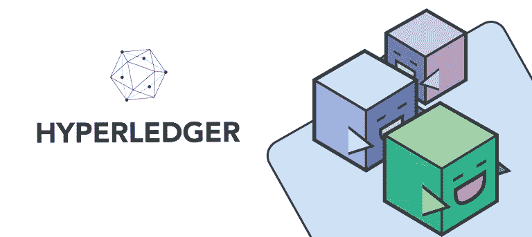

# 如何备份您的 Hyperledger Fabric 网络

> 原文：<https://medium.com/coinmonks/how-to-take-a-backup-for-your-hyperledger-fabric-network-d42f1a4eb6d0?source=collection_archive---------1----------------------->

本文将演示为您的光纤网络获取备份的不同方法。将先前提交的数据部署到不同主机中的相同 hyperledger 结构网络。两种方法，第一种是从结构 docker 容器中进行备份。第二个是复制所有事务并配置`docker-compose`文件来绑定我们的 docker 容器卷。



# Docker 备份方法(简单的一种)

所有 hyperledger fabric 组件都在运行 throw docker 容器。因此，您可以通过以下步骤保存正在运行的容器并将它们放在您想要的任何地方。我不推荐这种方式，因为这是一种变通方法，但如果您是 DevOps 开发人员，这可能会更容易。对区块链没有太多经验。

您可能面临的一些问题

1-保存容器体积并再次关联它们可能很复杂。尤其是使用 hyperledger fabric，您可能需要管理二十多个容器。

2-丢失最近的交易。假设您在处理某个事务时停止了容器。

3-你无法再有效地管理你的网络。现在你需要抛出 docker 容器命令。

# 保存所有交易和网络组件

下面这个方法比第一个好。它将为您提供复制和重新部署区块链的最佳方式。第一步是创建备份文件夹。

```
mkdir backup
cd backup
```

现在我们需要复制三样东西:

单通道伪影

2-系统-成因-地块

3-组织。

```
 sudo cp -aR ~/<Your-Project-Location>/channel-artifacts/ .
 sudo cp -aR ~/<Your-Project-Location>/system-genesis-block/ .
 sudo cp -aR ~/<Your-Project-Location>/organizations/  .
```

然后复制 docker 容器用于对等和订购。

```
mkdir orderer peer0.org1 peer0.org2docker cp peer0.org1.example.com:/var/hyperledger/production/ peer0.org1/docker cp peer0.org2.example.com:/var/hyperledger/production/ peer0.org2/docker cp orderer.example.com:/var/hyperledger/production/orderer/ .
```

假设您想将备份文件从远程主机复制到本地主机。您可能会遇到一些问题，因为有些文件具有安全的根用户访问权限。

```
sudo find . -type f -exec chmod 644 {} \;
sudo find . -type d -exec chmod 755 {} \;
```

使用 secure copy 命令下载备份目录。

```
scp -i ../<FILE>.pem -r ubuntu@<ipAddress>:<location>/backup/ .
```

就这样，现在您已经成功备份了您的区块链。接下来的步骤是恢复你的区块链。

Rest 脚本权限

```
chmod 774 organizations/ccp-* organizations/fabric-ca/registerEnroll.sh organizations/cryptogen/*
```

将备份内容复制到您的 hyperledger fabric 网络目录中。

```
cd <network-location>/
sudo cp -Ra <backup location>/backup/* .
```

现在最重要的部分是从我们的备份文件绑定卷。得到文件 docker-compose-test-net.yaml

对于订购量，请更换

```
orderer.example.com:/var/hyperledger/production/orderer
```

随着

```
../orderer/:/var/hyperledger/production/orderer
```

对于 peer1 卷，请更换

```
peer0.org1.example.com:/var/hyperledger/production
```

随着

```
.../peer0.org1/:/var/hyperledger
```

当然，如果您有多个对等体，您将为所有对等体绑定卷。就我而言，我有两个同事

对于 peer2，更换

```
peer0.org2.example.com:/var/hyperledger/production
```

随着

```
.../peer0.org2/:/var/hyperledger
```

现在，您已经准备好启动结构网络。

```
./network.sh up
```

或者如果您正在使用数据库。

```
./network.sh up -s couchdb
```

对等端将需要几分钟时间来与信道同步；那么所有的链代码都将启动并使用以前的数据运行。您可以使用对等日志来检查它们

```
docker logs peer0.org1.example.com -f
```

为了确保一切正常，你可以检查对等容器中最后提交的块。

```
peer channel getinfo -c <channel-Name>
```

谢谢！

> 加入 Coinmonks [Telegram group](https://t.me/joinchat/EPmjKpNYwRMsBI4p) ，了解加密交易和投资

## 另外，阅读

*   [学习以太坊和 Web3 开发](http://blog.coincodecap.com/go/learn)
*   最好的[密码交易机器人](/coinmonks/crypto-trading-bot-c2ffce8acb2a)
*   了解比特币的[最佳书籍有哪些？](/coinmonks/what-are-the-best-books-to-learn-bitcoin-409aeb9aff4b)

> [在您的收件箱中直接获得最佳软件交易](/coinmonks/newsletters/coinmonks)

[](https://medium.com/coinmonks/newsletters/coinmonks)