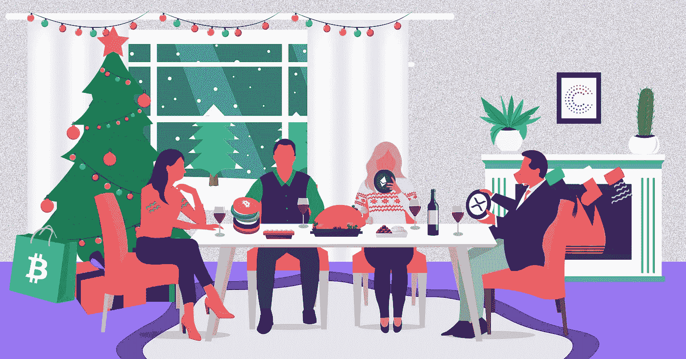

# 如何在圣诞餐桌上谈论加密

> 原文：<https://medium.com/coinmonks/how-to-talk-about-crypto-at-the-christmas-dinner-table-9bcae7cacd9d?source=collection_archive---------7----------------------->

圣诞节可能是一个让你的家人和朋友参与你热衷的事情的好机会，比如加密货币。不幸的是，对于人们来说，这可能是一个令人困惑的概念。在流行文化中，它经常被误认为是一种时尚，甚至是一种阴谋论。对于那些试图让家人和爱人对 crypto 感兴趣并参与其中的人来说，这可能是一个主要障碍。有一个刻板的印象，一个极客技术奇才试图搞垮银行，社区必须克服。

以下是可能导致人们厌倦加密货币的三大阻碍因素:

1.  他们很难理解
2.  **他们得到了太多负面新闻**
3.  **它们很难访问和使用**

如果你想在这个圣诞节让你的家人接触加密，这里有一些方法可以克服这三个障碍:

# 给奶奶教区块链

完全披露:加密货币并不是一种完全不同的货币使用方式。如果说有什么不同的话，那就是它的工作原理和旧货币一样。它们具有稀缺性、安全性、可交换性和可替代性的共同特征。区别实际上归结于有形性和跟踪数字硬币的方法，与传统货币(在密码界被称为 *fiat* )通常被跟踪的方式不同。集中式分类帐用于跟踪当前的货币，而 crypto 提供实现分散式分类帐。这就是众所周知的区块链账本。

作为过去使用过加密货币的人，这些概念似乎微不足道。然而，向一个可能甚至不会使用下一代智能手机的人解释这一点仍然很困难。为了向奶奶，甚至向你五岁的侄女或侄子解释区块链，你可以使用著名的苹果密码类比。这是解释加密货币的一种简单方式，大概是这样的:

> 苹果类比
> 
> 想象一下，如果我给你一个苹果。我只是亲手交给你的。现在我没有能力把苹果给别人，但是你可以选择自己留着苹果，也可以把苹果给别人，也许可以换来你想要的东西。 ***钱就是这么来的。***
> 
> 现在想象一下，如果我给你的苹果是数码的。你没办法检查我有没有把同一个苹果发给彼得或者其他人。这意味着苹果不再有足够的价值来交换你想要的东西。这就是所谓的 ***数字货币的双重支出问题。***
> 
> 我们可以用一个会计账簿的别称“T1”***分类账****’，来记录你或彼得交易数字苹果的任何时间。我将是银行。我的工作是确保追踪苹果数码产品的交易时间。我也是唯一一个可以分发全新数码苹果的人。这样，我就永远知道谁有它。*
> 
> *但如果我不擅长做银行，那么账本就不再可信。*
> 
> 那么，如果你和彼得也有账本的副本呢？ *在这种情况下，如果你选择给彼得一个苹果来换取冰淇淋，我们都可以查看我们的账本，看看你是否有苹果可以给。然后每个人都会在他们的账本上记录一笔新的交易，显示你有冰淇淋，彼得有一个苹果。* ***加密货币就是这么运作的！***

# 摘下隐喻的锡箔帽子

奶奶可能不是餐桌上最难说服的人。那些听说过 crypto 的小道消息但并不完全理解它的人可能是最难说服的。尤其是在最近几个月，媒体对价格大幅波动、交易所遭黑客攻击和比特币触底反弹的恐惧蔓延，难怪他们可能会有所保留。我们都有一个喜欢唱反调的叔叔，所以这里有一些对他尖锐问题的反驳:

> 问:为什么价格一直上下波动？

**答**:加密货币的价格波动有很多因素，比如缺乏监管。然而，更普遍的答案与采用的 S 曲线有关，这是随着新技术的出现而观察到的一种模式。本质上，S 曲线表明，当一项新技术被采用时，有一个滞后阶段，随后是早期采用阶段，然后是后期采用阶段，随后是后期滞后阶段。加密货币也显示出同样的模式，并且仍然处于早期采用的开始阶段，这可以与 1993 年 9 月的互联网相比，当时 AOL 正在大规模分发免费试用其服务的传单。因此，很明显，易变性只是任何重大技术突破生命周期的一部分。

> 问:为什么交易所会遭到黑客攻击？这真的安全吗？

**答** : **如今，加密货币本身甚至比货币更安全**。很少有机会在别人不知道的情况下从他们那里“偷”到这笔钱。这与区块链技术和权力下放有关。简单地说，区块链技术公司向每个参与者提供一个特定硬币的所有交易的副本。然后，在进行新的交易时，可以得到所有人的确认。因此，如果黑客想破坏这个账本，他们必须同时愚弄数千名参与者。至于黑客攻击，这是加密货币缺乏监管的结果。寻找具有严格安全协议、新客户入职时强大的身份验证流程和冷存储选项的交换非常重要。你也可以通过对你投资的硬币、你决定使用的交易所和整个行业进行自我教育来保护你的资产。一般来说，黑客与实际技术本身的安全性无关。

> 问:为什么不规范？

**答**:加拿大政府已经表示了对加密货币公司的支持，并且[计划监管](https://www.loc.gov/law/help/cryptocurrency/canada.php)这个市场以帮助其发展。目前，加拿大是这一新兴产业的领导者之一。对非常新的技术实施监管需要时间，尤其是在技术不断发展的情况下。监管的另一个棘手之处在于，它们可能是一把双刃剑。一方面，引入严格的监管将使市场更加稳定，并有助于大规模采用，然而，这也可能抑制这一新技术的创造潜力。就监管监督而言，试图实现这种平衡是导致拖延的原因。

# 向他们展示它是如何工作的！

谈论不容易被形象化的概念可能是一项艰巨的任务，尤其是如果你所爱的人不是很懂技术的话。打破你的圣诞餐桌周围的人对 crypto 的冷漠状态可能很难。在这种情况下，谈论加密和散列算法真的会被置若罔闻，所以最好的策略是根本不要谈论！为什么不给他们看呢？

# **-区块链探索者**

区块链探索者可以成为一个伟大的工具，帮助好奇的家庭成员实际可视化加密货币背后的区块链账本。这些分类账包括人们参与的交易的钱包地址的细节。即使执行一个事务也有助于向仅仅听说过的人解释公钥、块高度、事务 ID 和矿工的概念。技术术语本身就能让这些想法难以理解。

以下是一些流行货币的区块链探索网站:

1.  比特币(BTC)——[https://www.blockchain.com/explorer](https://www.blockchain.com/explorer)
2.  以太坊(ETH)——【https://etherscan.io/ 
3.  涟漪(https://bithomp.com/explorer/)——
4.  莱特币(LTC)——[https://chainz.cryptoid.info/ltc/](https://chainz.cryptoid.info/ltc/)
5.  比特币现金(BCH)——[https://explorer.bitcoin.com/bch](https://explorer.bitcoin.com/bch)
6.  破折号—[https://chainz.cryptoid.info/dash/](https://chainz.cryptoid.info/dash/)

# -加密货币交易所

另一个介绍加密货币的好方法是帮助爱人在加密货币交易所(如 CoinSmart)开设账户。这可能是一个更广泛地观察和使用该技术的好机会。它有助于解释硬币的不同特征，以及哪些硬币比其他硬币更占优势。该交易所也有交易工具和复杂的图表，以帮助一个对加密好奇的人从投资的角度了解更多的市场。此外，这也是一个很好的机会，让他们了解行业的监管环境，通常需要的验证步骤，以及法定货币(如加元)和加密货币(如 Ripple)之间的重要差异。

# -使用 Crypto 在线购物！

归根结底，大多数人都以一种非常特定的方式看待金钱；它是用来买卖东西的。这是加密货币在短期内必须克服的一个主要障碍，因为并非所有企业都接受数字硬币。然而，使用加密货币有很多方法可以获得你想要的物品。假期可以是一个极好的机会，通过向他们展示如何使用这些硬币购买他们想要的任何东西，向家庭成员灌输密码世界。

这里有一篇来自 GetSmart Hub 的关于如何使用 crypto 在现实世界中购物的有用文章:[终极圣诞购物指南。](https://getsmart.coinsmart.com/the-ultimate-guide-for-holiday-shopping-what-gifts-to-buy-for-the-crypto-anarchist/)

# 结论

总而言之，加密货币的转型性质真的可以激发人们相信它的未来潜力。自然地，人们喜欢与他们的朋友和家人分享他们发现的开创性的东西。如果你所爱的人不是很懂技术，或者他们已经订阅了一个关于这项技术的负面叙述，这可能会很麻烦。幸运的是，有办法克服这些障碍。所以是时候点燃烟囱，让这成为一个秘密的圣诞节了！大家节日快乐！

最初发布于 [GetSmart Hub](https://getsmart.coinsmart.com/how-to-talk-about-crypto-at-the-christmas-dinner-table/) 。

[👆 **Click to read today’s top story** 👆](http://bit.ly/2G71Sp7)

> [在您的收件箱中直接获得最佳软件交易](https://coincodecap.com/?utm_source=coinmonks)

