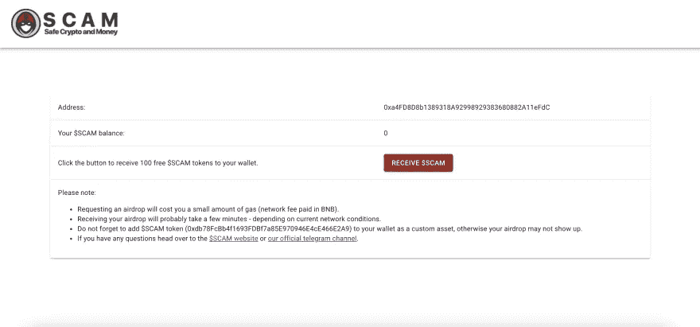

# 如何用 Hardhat 测试 BEP20 令牌而不被骗

> 原文：<https://medium.com/coinmonks/how-to-test-a-bep20-token-with-hardhat-and-not-get-scammed-ea655774b006?source=collection_archive---------2----------------------->


在这篇文章中，你将学习如何使用 [Hardhat](https://hardhat.org/) 和 [ethers.js](https://docs.ethers.io/v5/) NPM 包测试一个定制的 BEP20 令牌。

我们今天要测试的 BEP20 令牌是$SCAM 令牌。

SCAM 是在币安智能链上创建的 BEP20 令牌。$SCAM 目前的市值为 10 万英镑(its/BNB ATH 的市值为 35 万英镑)，限量供应 1 亿枚代币，其中许多代币通过 reddit 上的多次免费空投分发，帮助该社区在 telegram 上发展到 200 多名成员，在 [reddit](https://www.reddit.com/r/scam_coin/) 上发展到 700 多名成员。

$SCAM 遵循了部署在 BSC Mainnet 上的基本 ERC20 令牌实现，基本上没有管理功能或集中控制，没有黑名单、烧录或冻结功能，也不能铸造额外的令牌。

通过这篇文章了解更多信息。

你也可以访问他们的网站。

我希望你已经在你的机器上准备好了 solidity 开发环境。

否则请参考我之前的帖子[如何用 React、Hardhat 和 ethers.js 制作 full stack dapp](https://dev.to/steadylearner/how-to-make-a-fullstack-dapp-with-react-hardhat-and-ether-js-with-examples-4fi2/)并附例子。

# 目录

1.  为什么这个帖子选择了 SCAM token？
2.  检查诈骗合同源代码
3.  为它准备测试
4.  结论

你可以在这里找到这篇文章的全部代码。

# 1.为什么这个帖子选择了 SCAM token？


我在 dev.to 网站上通过[开发者的故事](https://dev.to/otter/a-deep-dive-into-creating-a-shitcoin-1af5)偶然发现了 Safe Crypto and Money ($SCAM ),这个故事讲述了学习 ERC20 令牌和 Solidity 上的编程实践是如何成为一个导致这个硬币的热情项目的。

我刚刚重新开始区块链开发，我发现作者的故事非常有趣。

从名字本身就可以理解，最初的 meme token 有机地演变成了一个非常友好的社区，初学者和开发人员都可以在这里了解更多关于加密货币和 DeFi 的信息。

他们已经推出了一个网站，并实施了一个完全分散的流动性奖励合同，目前正在进行分散治理和资金以及水龙头的工作。

社区本身已经成为一个健康对话、讨论和构思的场所，也是一个由成员发起的各种自愿项目的平台，如硬币列表网站、NFTs、商品和营销活动。

起初，我以为这只是一个玩笑，但我被这个帖子吸引住了。我觉得这个项目很有趣，想更多地参与到这个项目中来，还为[找到了它的电报组](https://t.me/SCAM_Coin_Community)。

与我最初的期望不同，这个小组的成员非常乐于助人。我可以找到[设置和部署智能合同代码](https://testnet.bscscan.com/address/0xF26c1f9Ac029629d8e1dD0D15738EB0929CF2D04#code)的线索，我的一个客户想要测试这个代码。

我还通过参加小组激发自己编写了[如何用 React、Hardhat 和 ethers.js 制作 fullstack dapp 的例子](https://dev.to/steadylearner/how-to-make-a-fullstack-dapp-with-react-hardhat-and-ether-js-with-examples-4fi2)。

我认为它对我进一步接触区块链的东西和找到有用的信息帮助很大。

有人帮助你熟悉加密货币及其相关技术是很重要的。否则非常容易被骗，赔钱。

如果你想在这篇帖子之后了解更多关于骗局的知识，可以参加 [its 电报群](https://t.me/SCAM_Coin_Community)。

目前，[免费获取 SCAM 的水龙头合同](https://bscscan.com/address/0xfcf2774cd61743ff7c34607fadf3c84fc4762029#code)也在起作用，所以你可以免费持有。我认为这是一个很好的机会来拥有你的第一种加密货币。

更多细节，你也可以阅读这篇关于水龙头的文章。

它的网站也准备在[https://faucet.scam-coin.org/](https://faucet.scam-coin.org/)页面。


您可以使用以下列表中的任何钱包。


然后，将其连接到网站。


最后，按照它的指示，以获得您的第一个$诈骗令牌。



如果你有任何疑问，请加入这个小组，向里面的成员寻求帮助。他们将帮助你了解骗局，加密货币，智能合同和 DeFi 一般和其他区块链相关的东西。

# 2.检查诈骗合同源代码


在开始之前，BEP20 令牌规范等同于 ERC20，所以如果你不熟悉，请先阅读[它的文档](https://docs.openzeppelin.com/contracts/2.x/api/token/erc20)。

[您可以看到，bscscan 使用与此类似的代码片段验证了该骗局。](https://bscscan.com/address/0xdb78fcbb4f1693fdbf7a85e970946e4ce466e2a9#code)我使用 js 扩展而不是 sol 来轻松阅读带有要点的代码片段。

我们将检查它的每一部分。这将帮助您找到这个契约的作用，并在下一部分编写测试来确认这一点。

**1。**合同的所有者可以在这里定义 BEP20 令牌的名称、符号和小数。它只是遵循 ERC20 标准。

**2。**这里，定义了令牌的总供应量。骗局没有薄荷或燃烧功能。你可以看到有一个固定金额的诈骗令牌(100000000)。

然后，合同的所有者将拿走其中的 2000 万，100 万将用于`airdropTokens`功能。

**3。**这些功能直到 **4。**只是 [IERC20 标准功能](https://docs.openzeppelin.com/contracts/2.x/api/token/erc20#IERC20)的一部分。这是其作者的意图。

**4。**这是诈骗令牌空投发生的地方，你可以看到它是从合同发送到接收者的。(在构造函数部分，100000000–20000000 = 80000000)

**5。**此部分与骗局令牌逻辑无关。这只是一个从合同中提取 BNB 余额的后备功能。

我与作者交谈，他告诉我，他把它包括在内是为了接受合同捐赠。

它与诈骗令牌逻辑无关。但是，我们将在下一部分包括测试，看看它是否会影响骗局持有人的平衡。

**6。这些是来自 [SafeMath OpenZeppelin 库](https://github.com/OpenZeppelin/openzeppelin-contracts/blob/master/contracts/utils/math/SafeMath.sol)代码的一些函数。**

您可以阅读他们的文档以获取更多信息。

# 3.为它准备测试


在上一部分中，我们检查了 SCAM 的合同代码，并查看了它的每个部分都做了什么。

我们将为它编写简单的测试，以发现它们都工作正常。

我假设你使用的是我在这篇文章开头分享的源代码链接。

在您更新项目之前，请编辑您的 **hardhat.config.js** 并使用您喜欢的`>=0.4.22 <0.6.0`之间的 solidity 编译器版本。

```
module.exports = {
  defaultNetwork: "hardhat",
  paths: {
    artifacts: './src/artifacts',
  },
  networks: {
    // $npx hardhat run scripts/deploy.js --network localhost
    // https://hardhat.org/config/
    hardhat: {
      chainId: 1337,
    },
  },
  solidity: "0.5.6", // This is where you should edit.
};
```

使用`$yarn compile` (npx hardhat compile)查看契约代码是否真的编译了，它应该显示类似于下面的结果。

```
Creating Typechain artifacts in directory typechain for target ethers-v5
Successfully generated Typechain artifacts!
```

在控制台中使用`$yarn serve` (npx hardhat 节点)设置带有 hardhat 的本地实体开发环境。

然后，验证您的 **scripts/deploy.js** 文件是否一切正常。

如果你能做到这一步，我们就能最终为诈骗合同编写测试了。

您可以在存储库中看到与此类似的 **test/scam-test.js** 文件。

SCAM 的智能合约代码非常简单，我们也不需要很多行代码来测试它。

**1。BEP20 令牌合同涉及的数字非常大。我们需要它们的十六进制值来用 hardhat 和 ethers.js 包测试它们。**

因此，我手动将它们包含在内。为此，您可以使用带有**十六进制**函数的 Python 控制台。

```
$python
>>> hex(1000000000000000000000000)
'0xd3c21bcecceda1000000'
>>> hex(1000000000000000000000000000000)
'0xc9f2c9cd04674edea40000000'
>>> hex(1000000000000000000000000000000000)
'0x314dc6448d9338c15b0a00000000'
>>> hex(1000000000000000000000000)
'0xd3c21bcecceda1000000'
>>> 10 ** 26
100000000000000000000000000
>>> hex(_)
'0x52b7d2dcc80cd2e4000000'
```

你也可以参考[如何在 JavaScript 中使用 Python 和示例](https://dev.to/steadylearner/how-to-use-python-in-javascript-4bnm)帖子，将它们包含到你的 JavaScript 代码中。

否则，您可以找到一个 JavaScript 函数来查找大数字的十六进制值。但是，如果你也知道如何使用 Python，那就没有必要了。

**2。**我们在此进行测试，以查看部署合同时合同名称、符号和小数设置是否正确。您还可以验证是否设置了令牌的总供应量，以及溢价金额是否正确保存到合同所有者的地址。

**3。**在这一部分中，我们首先检查其他用户(不是所有者)是否可以调用 airdropTokens。

你可以看到呼叫者是第一个来的还是第二个来的(不是所有者)，合同不应该允许使用`airdropTokens`功能。在契约中，没有错误消息集，所以我们使用来自**@ open zeppelin/test-helpers**包的`unspecified` api 来测试它们。

您还可以看到接收器有 airDropSize 数量的令牌“10000000000000000000”之后。与智能合同部分相比，这可能会令人困惑，但您可以看到十进制值是“18”。如果我们考虑到这一点，大量的将是 1000000 个诈骗令牌并发送给接收者。

**4。以下测试将有助于您了解本合同中的一些 ERC20 标准功能是如何工作的。**

你可以看到转移，批准，津贴，转移来源将与他们一起工作。

**5。**捐赠合同代码中有 fallback 函数和 releaseBNB。

```
function releaseBNB() external {
  require(msg.sender == owner_);
  owner_.transfer(address(this).balance);
}// Fallback function
function() external payable {}
```

我们可以测试调用这个函数对非所有者没有任何影响。

在测试中调用`releaseBNB`函数后，您可以看到第一个人的余额相等。

如果你愿意，你可以在这里写更多的测试。

用`$yarn test` (npx hardhat 测试)测试它们在你的机器上是否真的能工作，你会看到每个测试都通过了，结果和这个相似。

```
$yarn test
Creating Typechain artifacts in directory typechain for target ethers-v5
Successfully generated Typechain artifacts!SCAMToken state and transactions
    ✓ Should test 'totalSupply' and other default values.
    ✓ Should test 'airdropTokens' and the contract and receiver balance change.
    ✓ Should test 'transfer' from the owner to firstComer.
    ✓ Should test 'approve' and 'allowance' from the owner to firstComer.
    ✓ Should test 'approve', 'allowance' and 'transferFrom'.
    ✓ Should test 'releaseBNB' and it shouldn't affect the balance of other users (not owners)
```

希望你能通过所有的测试。

# 4.结论

在这篇文章中，我们学习了如何用[骗局](https://scam-coin.org/)测试一个定制的 BEP20 令牌。我介绍它是因为我发现它的社区非常有帮助。我希望这里使用的代码片段可以成为在您购买其他 BEP20 或 ERC20 令牌之前测试它们的起点。

ERC20 和 BEP20 令牌几乎完全相同，您也可以使用这里用于前者的代码片段。

如果你喜欢这篇文章，请与他人分享。我打算分享更多与区块链相关的东西。我对 ETH 和 POLKADOT 感兴趣。

[如果需要聘请开发人员，可以联系我。](https://t.me/steadylearner)

[我可以写满栈 dapp。](https://dev.to/steadylearner/how-to-make-a-fullstack-dapp-with-react-hardhat-and-ether-js-with-examples-4fi2)

如果你愿意，我还可以克隆、设置、更新和部署另一个区块链项目。

谢了。

> 加入 [Coinmonks 电报频道](https://t.me/coincodecap)，了解加密交易和投资

## 另外，阅读

*   [什么是保证金交易](https://blog.coincodecap.com/margin-trading) | [美元成本平均法](https://blog.coincodecap.com/dca)
*   [BigONE 交易所评论](/coinmonks/bigone-exchange-review-64705d85a1d4) | [电网交易机器人](https://blog.coincodecap.com/grid-trading)
*   [3 商业评论](/coinmonks/3commas-review-an-excellent-crypto-trading-bot-2020-1313a58bec92) | [Pionex 评论](/coinmonks/pionex-review-exchange-with-crypto-trading-bot-1e459d0191ea) | [Coinrule 评论](/coinmonks/coinrule-review-2021-a-beginner-friendly-crypto-trading-bot-daf0504848ba)
*   [莱杰 vs Ngrave](/coinmonks/ledger-vs-ngrave-zero-7e40f0c1d694) | [莱杰 nano s vs x](/coinmonks/ledger-nano-s-vs-x-battery-hardware-price-storage-59a6663fe3b0) | [币安评论](/coinmonks/binance-review-ee10d3bf3b6e)
*   [Bybit Exchange 审查](/coinmonks/bybit-exchange-review-dbd570019b71) | [Bityard 审查](/coinmonks/bityard-review-7d104239be35) | [CoinSpot 审查](https://blog.coincodecap.com/coinspot-review)
*   [3 commas vs crypto hopper](/coinmonks/3commas-vs-pionex-vs-cryptohopper-best-crypto-bot-6a98d2baa203)|[赚取加密利息](/coinmonks/earn-crypto-interest-b10b810fdda3)
*   最好的比特币[硬件钱包](/coinmonks/the-best-cryptocurrency-hardware-wallets-of-2020-e28b1c124069?source=friends_link&sk=324dd9ff8556ab578d71e7ad7658ad7c) | [BitBox02 回顾](/coinmonks/bitbox02-review-your-swiss-bitcoin-hardware-wallet-c36c88fff29)
*   [BlockFi vs 摄氏](/coinmonks/blockfi-vs-celsius-vs-hodlnaut-8a1cc8c26630) | [Hodlnaut 点评](/coinmonks/hodlnaut-review-best-way-to-hodl-is-to-earn-interest-on-your-bitcoin-6658a8c19edf) | [KuCoin 点评](https://blog.coincodecap.com/kucoin-review)