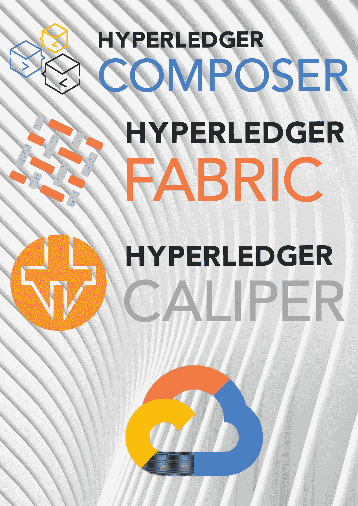
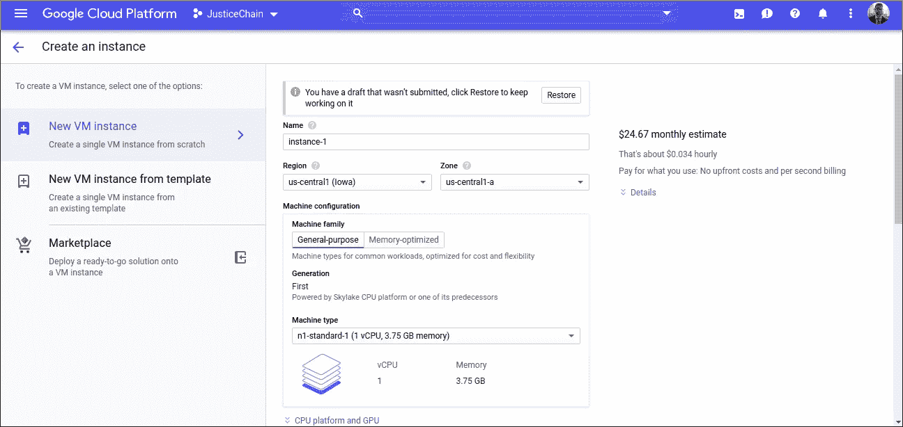
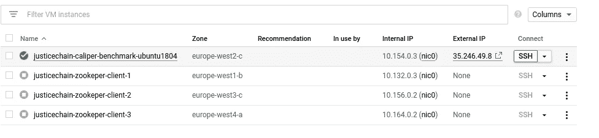

# 如何使用 Hyperledger Caliper 在 Google Cloud 上测试您的区块链

> 原文：<https://medium.com/coinmonks/how-to-test-your-blockchain-on-google-cloud-using-hyperledger-caliper-1b1b3713d057?source=collection_archive---------0----------------------->



测试⛓️的区块链应用程序可能会很麻烦，主要是因为它们是复杂的、需要大量资源的分布式系统。在云上测试你的区块链应用程序可能会提高测试过程的效率，以及实现更真实的测试环境。

*这篇文章提供了如何使用 Hyperledger Caliper 的 101 指南(commit*302665)*on*[*Google Cloud*](https://medium.com/u/4f3f4ee0f977?source=post_page-----1b1b3713d057--------------------------------)*，解决了测试一个*[*Hyperledger Composer*](https://hyperledger.github.io/composer/latest/)*应用程序的场景，这是一个区块链框架，它促进了*[*Hyperledger Fabric*](https://www.hyperledger.org/projects/fabric)*应用程序的开发。尽管如此，这个测试过程*将*应用于所有由* [*Hyperledger 卡钳*](https://hyperledger.github.io/caliper/)*(*[Hyperledger 钻地](https://github.com/hyperledger/burrow)， [Hyperledger Fabric](https://github.com/hyperledger/fabric) ， [Hyperledger Iroha](https://github.com/hyperledger/iroha) ， [Hyperledger 锯齿](https://github.com/hyperledger/sawtooth-core)以及更多*)支持的区块链。*

# 设置测试环境

1.  创建一个私有存储库(例如在 Github 上)。
2.  将 Hyperledger Caliper 项目转移到您的私人回购中:

3.克隆您的私人回购:

```
git clone https://github.com/USERNAME/CALIPER-PRIVATE-REPO.git
```

4.在*CALIPER-PRIVATE-REPO/packages/CALIPER-samples/benchmark/composer*上，用您的应用程序的名称创建一个文件夹，例如 **my-network** 。

5.在 **my-network** 文件夹中，粘贴来自该库的[配置和测试文件的内容。在以后的文章中，我将解释如何编写测试( *my-network.js* )和基准配置( *config.yaml* )。](https://github.com/BlockChain4Students/hyperledger_caliper-google_cloud)

6.你应该有一个发达的商业网络使用作曲家(BNA 档案馆)。如果您没有开发业务网络，您仍然可以配置 Caliper 来测试默认的业务网络。

在*CALIPER-PRIVATE-REPO-justice chain/packages/CALIPER-samples/src/contract/composer*上，创建一个名为 **my-network** 的文件夹。将您的业务网络存档文件(**解压后的** BNA 文件)粘贴到文件夹内。您应该有一个 lib 文件夹、一个 models 文件夹和 package.json、permission.acl 文件，还可以有一个 README.md 文件。

请注意，在 package.json 上，网络的名称和版本必须与 composer.json 上的名称和版本一致。例如 package.json:

7.你有必要的文件来测试你的应用程序。将它们推送到您的存储库:

```
git add *
git commit -m"add benchmark files"
git push origin master
```

# 设置谷歌云

1.  在 Google Cloud 上创建一个帐户。新账户可以申请免费试用。创建一个项目，并激活计算实例 API。
2.  在计算引擎->虚拟机实例，点击**创建一个新实例**。



3.启动您的实例。



4.单击连接— SSH。

5.安装 Hyperledger 卡尺的先决条件(感谢 [Daz Wilkin](https://medium.com/u/5e4c7deea497?source=post_page-----1b1b3713d057--------------------------------) ):

**Docker-CE**

```
sudo apt-get updatesudo apt-get install \
    linux-image-extra-$(uname -r) \
    linux-image-extra-virtualsudo apt-get updatesudo apt-get install \
    apt-transport-https \
    ca-certificates \
    curl \
    software-properties-commoncurl -fsSL [https://download.docker.com/linux/ubuntu/gpg](https://download.docker.com/linux/ubuntu/gpg) | sudo apt-key add -sudo add-apt-repository \
   "deb [arch=amd64] [https://download.docker.com/linux/ubuntu](https://download.docker.com/linux/ubuntu) \
   $(lsb_release -cs) \
   stable"sudo apt-get updatesudo apt-get install docker-cesudo usermod -aG docker $USERsudo systemctl enable dockerdocker --version
```

**docker-compose**

```
sudo curl -L [https://github.com/docker/compose/releases/download/1.16.1/docker-compose-`uname](https://github.com/docker/compose/releases/download/1.16.1/docker-compose-%60uname) -s`-`uname -m` -o /usr/local/bin/docker-composesudo chmod +x /usr/local/bin/docker-compose**Golang (optional)**VERSION=1.9.1
OS=linux
ARCH=amd64
sudo curl \
--location [https://golang.org/dl/go$VERSION.$OS-$ARCH.tar.gz](https://golang.org/dl/go$VERSION.$OS-$ARCH.tar.gz) \
--output go$VERSION.$OS-$ARCH.tar.gzsudo tar -C /usr/local -xzf go$VERSION.$OS-$ARCH.tar.gzexport PATH=$PATH:/usr/local/go/bingo version
```

6.用 Caliper 克隆你的私有库，将你的区块链应用程序克隆到你的谷歌计算实例中。

# 测试应用程序

要运行您的基准测试，请导航至*卡尺/封装/卡尺-样本。*

使用 **CouchDB** run 对您的应用进行基准测试:
caliper benchmark run-w ./-c benchmark/composer/justice/config . YAML-n benchmark/composer/justice/composer . JSON

使用 **LevelDB** run 对您的应用进行基准测试:
caliper benchmark run-w ./-c benchmark/composer/justice/config . YAML-n benchmark/composer/justice/composer-level . JSON

基准测试的结果将在终端上报告。

完成实验后，不要忘记在谷歌云中停止你的机器，否则💸。

# 后续步骤:

如果你对学习区块链技术充满热情，欢迎加入我正在启动的项目😃我们的目标是教授学生区块链技术。

如果有任何不清楚的地方，欢迎在评论区留下你的评论。

**就这样，恭喜你！干杯，继续摇摆💪**

> [直接在您的收件箱中获得最佳软件交易](https://coincodecap.com/?utm_source=coinmonks)

[](https://coincodecap.com/?utm_source=coinmonks)