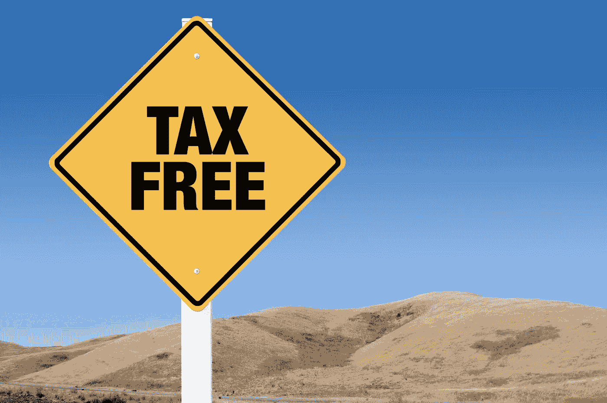

# 如何免税交易比特币

> 原文：<https://medium.com/coinmonks/how-to-trade-bitcoin-tax-free-f142ce3e63f?source=collection_archive---------1----------------------->

## 美国纳税人的简单方法

> 我觉得我可能不小心毁了我的生活，因为我不知道税——Reddit 用户

据报道，2017 年的加密货币交易给一名 Reddit 用户留下了一笔欠 IRS 的**5 万美元债务，根据他在[3 月 14 日](https://www.reddit.com/r/personalfinance/comments/84huks/i_just_discovered_that_i_owe_the_irs_50k_that_i/) Reddit 上的帖子，他说他无法支付这笔债务。**