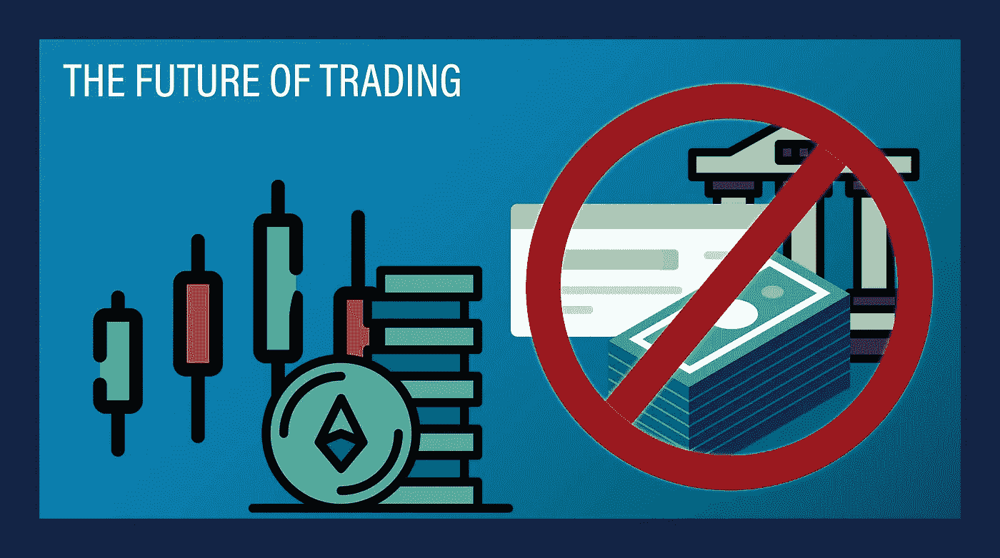

# 如何在分散的交易所交易|交易的未来

> 原文：<https://medium.com/coinmonks/how-to-trade-on-a-decentralized-exchange-the-future-of-trading-967a6dd85722?source=collection_archive---------1----------------------->

人们赚钱最常见的方式之一是通过网上交易。你付出 X 的钱来获得 Y 的东西，从而得到更多的钱。这些渠道可以是股票，外汇，甚至商品。有致力于在线市场交易的银行、公司、应用程序和整个社区。为了进入其中的一个…