# 如何交易链上交换流

> 原文：<https://medium.com/coinmonks/how-to-trade-on-chain-exchange-flows-ccd1fff47b31?source=collection_archive---------1----------------------->

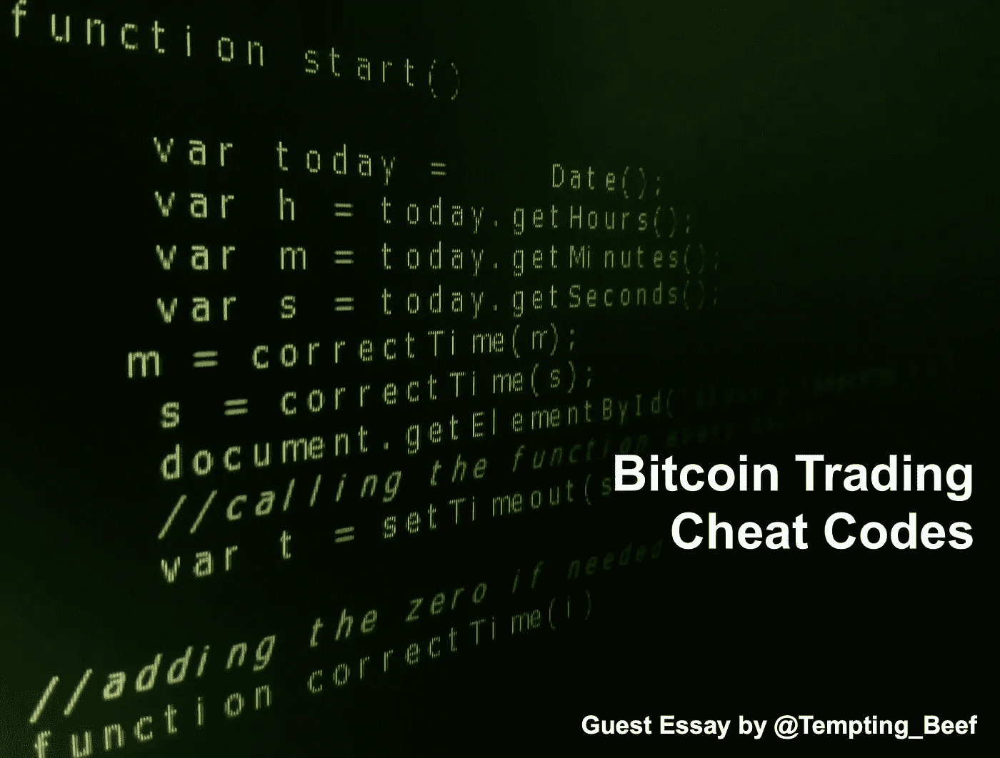

今天我们有一位非常特殊的客人。在 substack 写硬币地穴的是@诱人 _ 牛肉。

他今天和我们一起谈论他是如何进入市场的。我们认为这篇文章很好地解释了如何使用技术分析(TA)来提高你的交易。就当它是一本不错的入门书吧。

享受吧。

本·莉莉，浓缩咖啡的编辑。

我觉得很脏。

每天五点钟，我都会从当今大数据经济的黑暗地带走出来。

我与数字分析系统合作，为谷歌和脸书等公司在网站上收集你的数据。

数据令人吃惊。

我可以看到你的 ip 地址，你访问了什么网页，你在搜索栏里输入了什么。

我将这些数据发送到集中的广告系统，这些系统从许多不同的网站收集您的信息，并建立您的在线活动档案。这相当于万亿字节，甚至千兆字节的数据，每分钟都需要处理，唯一的目的就是最大化广告收入。

公司为这项服务支付大笔费用。在去新冠肺炎之前，我会参加一些颓废的会议，和世界各地的公司闲聊，住在最豪华的度假胜地。

坦白地说，这不是我进入数据和分析领域的原因。我不想让组织收集你的数据，这样他们就可以用“更相关”的广告轰炸你。这最终让我接触到了比特币。

透明度被接受了。对于像我这样的分析专家来说，我能够提出一系列的见解。

目前，比特币区块链约为 330gb，每个区块包含 2500-3000 笔交易。块大小限制确保了这一点永远不会改变。而且由于比特币的设计和难度等级，大致每 10 分钟总会加一块。

所以，实际上，从数据的角度来看，我们面临的问题是:

1.  分析 300gb 的历史数据，当数据科学家定期处理万亿字节的数据时，这只是一个小数目。
2.  每 10 分钟分析 3000 个事务—此时，数据科学家开始大笑，因为这又是一个小数目。

尽管与广告和数字分析相比，我们正在处理的数据规模相对较大，但链上数据和跟踪仍然非常强大。事实上，它非常强大，有助于追踪和抓捕罪犯。

对我们的目的更重要的是，它可以用来预测价格。这就是我今天要讲的。为此，让我们来看几个例子，看看链上分析和跟踪如何帮助你预测下一次价格变动。

# 知道流程

对于新来者来说，分析交换流是一个很好的起点。

这是因为你可以通过技术分析了解供求关系，并了解它与支撑和阻力的关系。

那么首先，我们来看看价格是什么时候在 30k 以上爆发的。你可能还记得，价格上涨的速度几乎是任何人都跟不上的。

有趣的是，这种价格行为的信号在突破之前和之后都可以看到。为了找到它，我将使用 exchange netflow 调出一个图表。这是流入和流出的区别。负数表明交易所的比特币或稳定币比以前少。

在下面的图表中，我在下半部分添加了总净流量，然后应用 30 天移动平均线来平滑它。白线是价格。

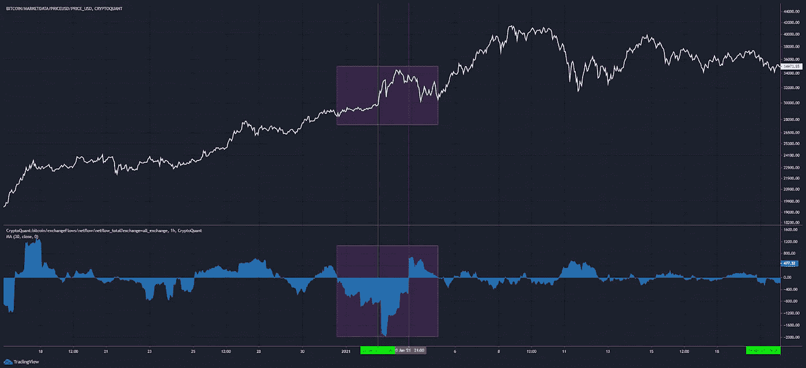

在突破之前，netflow 已经相当负面，这用绿色垂直线突出显示。比特币被转移出交易所，很可能被冷藏起来。这是乐观的，因为它将比特币从市场上带走，不再出售——造成稀缺。

转到技术分析，除了价格是一个心理阻力之外，在 30k 还形成了一个阻力位。

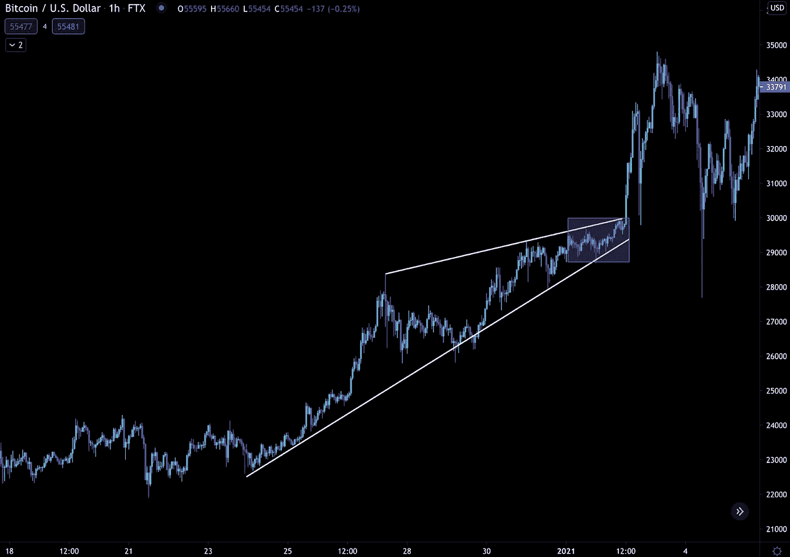

因此，当我们将技术指标与净流量趋势配对时，我们能够更清楚地看到价格突破阻力的机会正在增加。

我们不会就此止步。

我们可以不仅仅看比特币。Stablecoins 可以说是交易所流量方面第二好的统计数据，也是我经常在我的简讯中提到的一个数据: [The Coin Crypt 简讯](https://coincrypt.substack.com/)。

这是因为随着更多稳定的硬币进入交易所，这可能会转化为更大的购买压力。如果稳定的玉米正在离开，这意味着推高价格的弹药变少了。不严格地说，更多稳定的资本是看涨的。不太稳定的股票是熊市。

在同一时期，稳定的资本流入远远高于平均水平。事实上，在突破之前，它们正以创纪录的速度流入交易所。你可以在下图下半部分的绿色竖线和蓝色条形图中看到它。

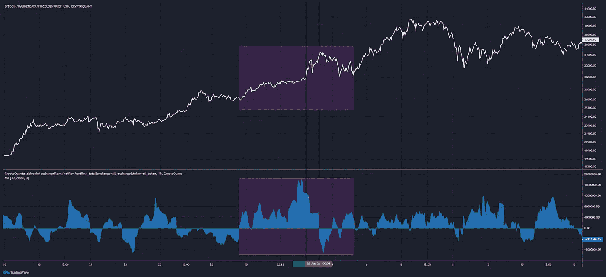

所以，把这个归结为供给和需求:

*   供应正在减少——比特币正在离开交易所。
*   需求在增加——稳定的硬币正在进入交易所。

敷设在 TA 上:

*   价格正在逼近顶部阻力。

随着这些维度的增加，情况变得更加清晰。在一个利益点——阻力点上，需求超过了供给。这就是导致我们今年早些时候看到的价格快速上涨的原因。

# 电流的变化

好的，所以你知道什么时候买入，但是什么时候卖出使用链上信号呢？

这就是上图中红线出现的地方，因为我们看到两个指标的净流量都向另一个方向翻转。

换句话说，供给开始超过需求。

看下面的价格图表，我们正在积极测试最初突破时新形成的高点的阻力。

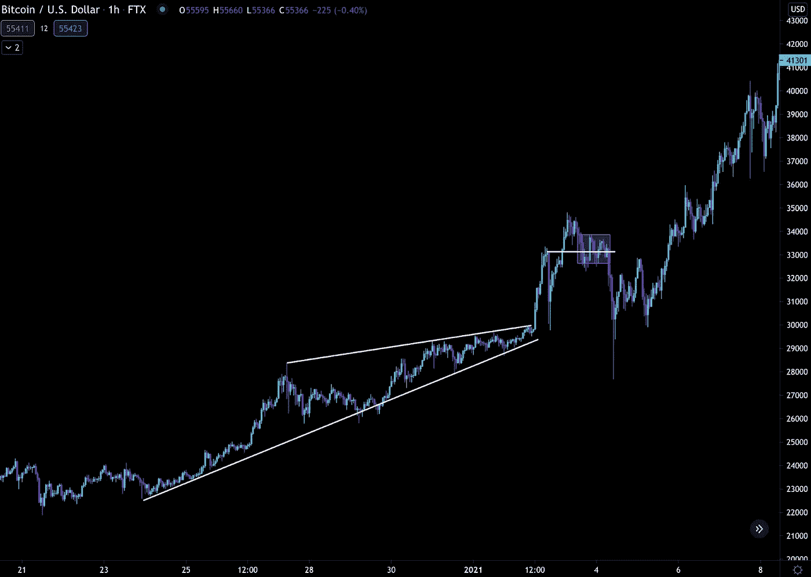

在我们测试该系列时，我们有:

*   供应增加——进入交易所的比特币比离开的多。
*   需求下降——离开交易所的稳定债券比进入交易所的多。

TA 中的分层:

*   价格正在测试支撑。

这就是网上购物如何给你带来优势。由于价格测试支持，供应超过需求。这是结束你的多头的卖出信号。

那些错过信号的人成为了当时牛市中最大的清算事件的附带损害。你可以在下图的红线中看到清算数字。

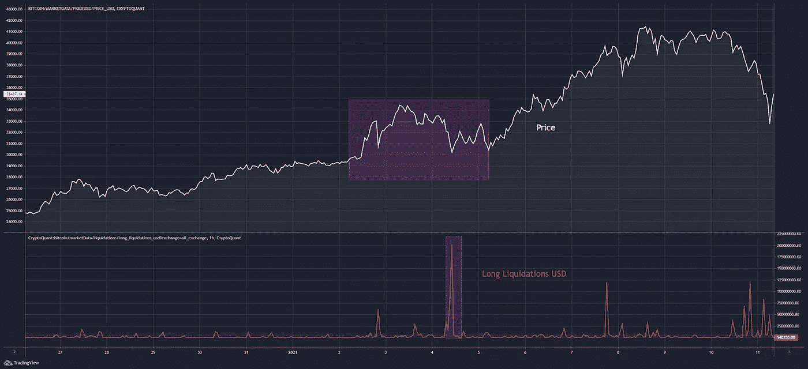

这就是链上如何给我们一个信号，可以与技术分析配对。这是我们在预测价格下一步走势时获得优势的方法。

现在，在我们总结之前，让我们用同样的一组指标快速看一下市场上目前的情况。

# 流量预测

比特币最近试图在上周比特币基地上市前后爆发。遭到拒绝，随后跌停。在 53k 附近找到支撑。

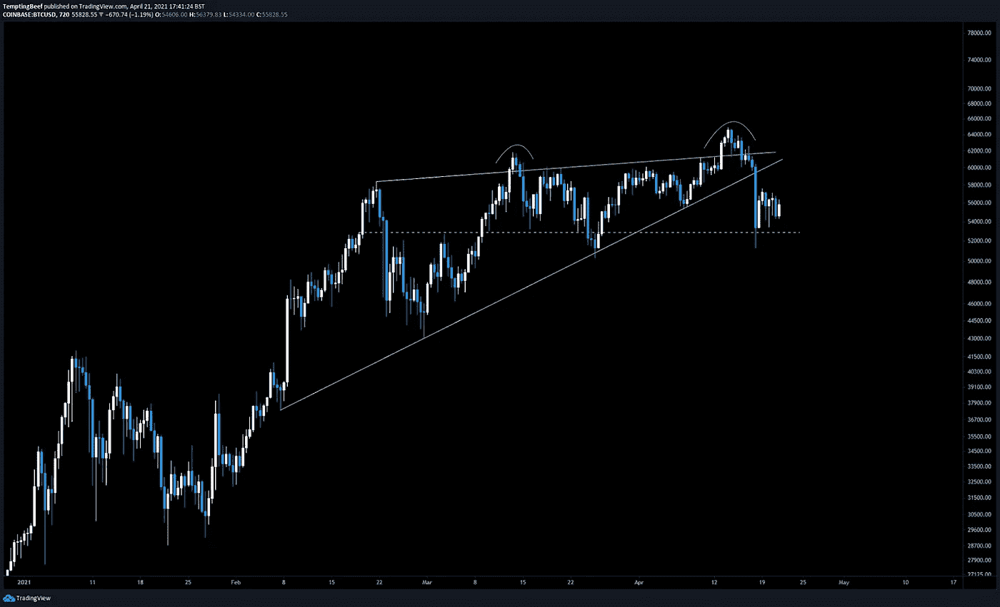

这一下跌导致了另一项创纪录的清算金额，在 24 小时内接近 100 亿美元。

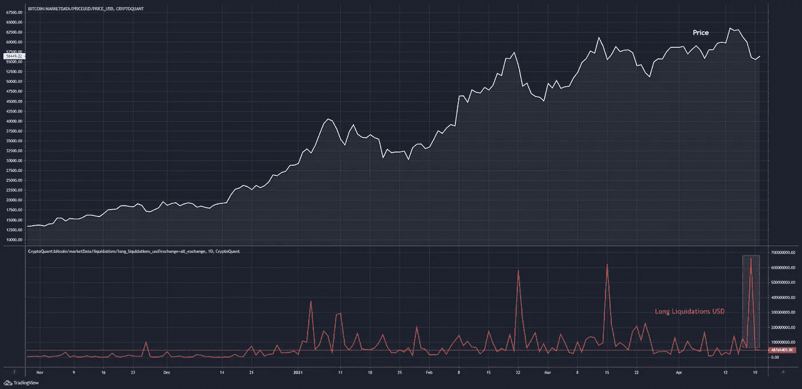

尽管如此，比特币的净流量还是看涨的。事实上，我们正在目睹近几个月来比特币从交易所的最大流出。你可以在下面的图表中看到蓝色指示器的主要读数。

带有绿线的蓝色大读数可以被解读为看涨。正如你所看到的，比特币出现了大规模外流，这表明规模较大的玩家在逢低买入。

根据之前的数据，就影响价格而言，这些大规模外流是滞后的。价格反转不是弹指一挥间就能发生的。

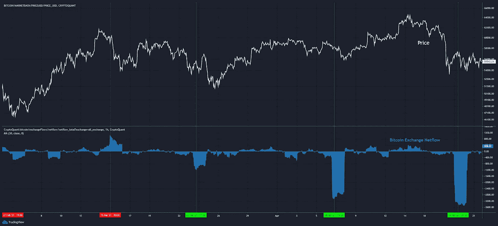

如果我们回顾一下，看看这些净流量在外汇储备方面的表现。储量正在垂直增长…

垂直向下。

这说明了这些外流对大局的影响有多大。

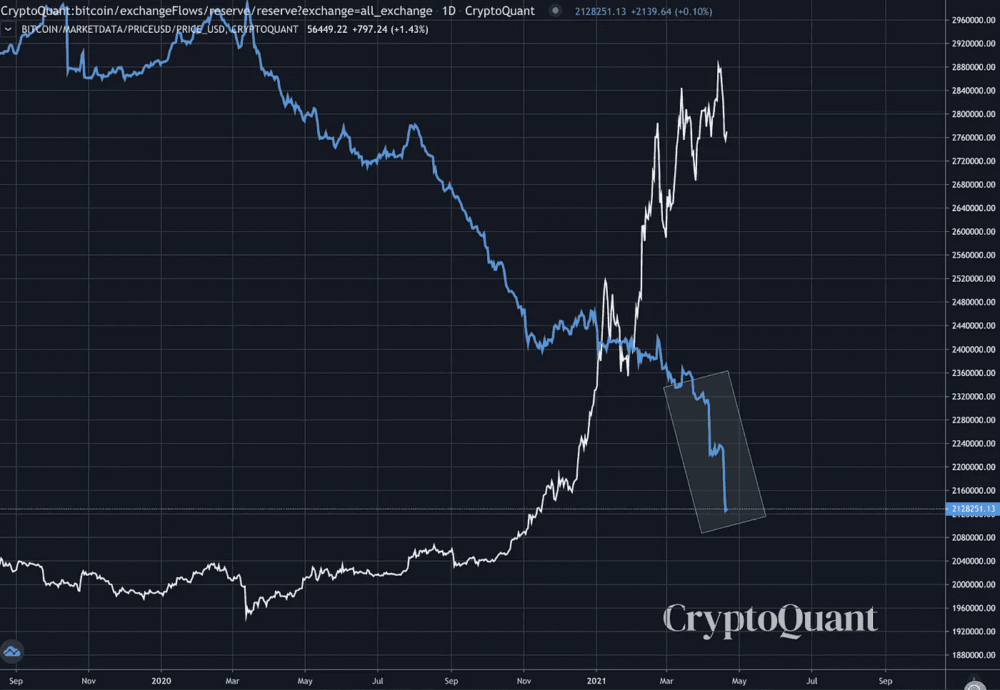

稳定的币网流也很有趣。

我们目前看到 stablecoins 振荡了一下。稳定的铜币在下跌期间进入交易所，最近尘埃落定。这意味着有足够的流动性来购买资产。

这也是一个好迹象，因为我们继续横盘，因为我们没有看到过度获利回吐。

从稳定的货币流量来看……稳定的货币储备再次快速增长。这通常是需求增长的信号。

当我们将这些信息与 TA 配对时，我们就可以开始形成一个要注意什么的路线图。

价格下跌后正在巩固。随着这种模式的发展，交易所的 BTC 供应量在下降，而稳定的流入的需求在增长。从长期来看，这是价格上涨的好迹象。

但老实说，这还不足以在短期内画出清晰的交易。

如果价格获得动力并测试上行阻力，我希望看到另一波比特币外流或稳定的比特币流入激增，以获得信心。或者，等着看支撑位附近会发生什么，如果净流量看起来是熊市，可能考虑做空。

***最后一刻更新:*** *(本在此)——比特币在发布前跌至 51k 美元。这篇文章大约写于三天前。这是比特币在支撑上的净流量，注意红圈。比特币正在流入交易所，因为价格受到了支撑——看跌。*

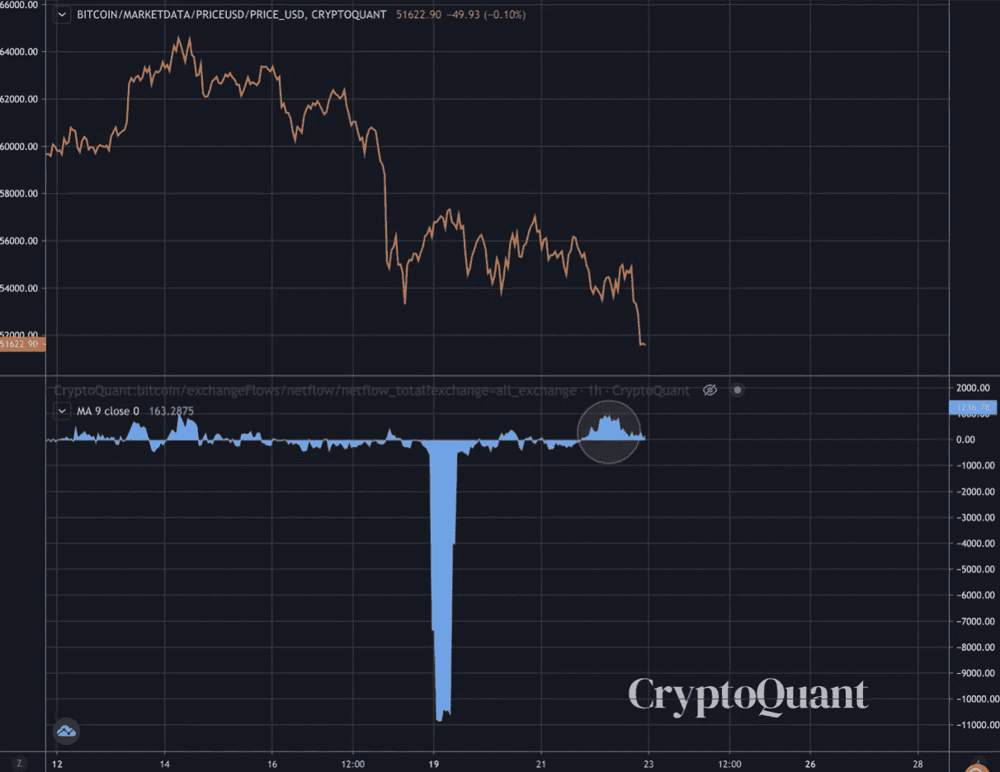

在抛售前一点点，稳定的股票也转为看跌。

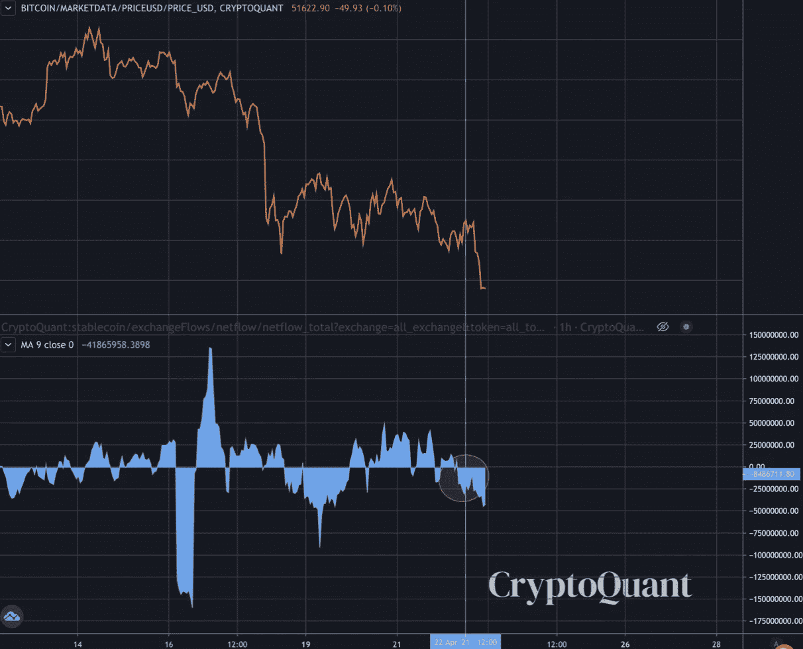

*在撰写本文时(世界协调时 4 月 22 日 23:30)，ChainPulse 获得了 7.53 万 BTC，正发送至交易所。还有，571k 链接搬进来了。还有大约 1800 万稳定的硬币流出。看跌流，不是所有的时间去做多。*

这就是了。

希望这篇文章能帮助你理解为什么 netflows 是决定潜在价格方向的有用工具，以及如何将它与 TA 配对。

一定要在 twitter 上关注我的@诱人的牛肉，我会让你了解我的最新想法和分析。

提供链上切割，

@诱人 _ 牛肉

附:我是本。我注意到很多人从韩国进来(@naver.com)。如果你是这些读者中的一员，并希望进行翻译，请通过 ben.lilly@jarvis-labs.xyz 或 telegram @ben_lilly 联系我，谢谢！

> 加入 coin monks[Telegram group](https://t.me/joinchat/PmKOYQ9NNKZlZGNl)学习加密交易和投资

## 另外，阅读

*   最好的[加密交易机器人](/coinmonks/crypto-trading-bot-c2ffce8acb2a) | [网格交易机器人](https://blog.coincodecap.com/grid-trading)
*   [加密复制交易平台](/coinmonks/top-10-crypto-copy-trading-platforms-for-beginners-d0c37c7d698c) | [如何在 WazirX 上购买比特币](/coinmonks/buy-bitcoin-on-wazirx-2d12b7989af1)
*   [CoinLoan 点评【Crypto.com】|](/coinmonks/coinloan-review-18128b9badc4)[coin loan 点评](/coinmonks/crypto-com-review-f143dca1f74c) | [火币保证金交易](/coinmonks/huobi-margin-trading-b3b06cdc1519)
*   [尤霍德勒 vs 考尼洛 vs 霍德诺特](/coinmonks/youhodler-vs-coinloan-vs-hodlnaut-b1050acde55a) | [Cryptohopper vs 哈斯博特](https://blog.coincodecap.com/cryptohopper-vs-haasbot)
*   [杠杆令牌](/coinmonks/leveraged-token-3f5257808b22) | [最佳密码交易所](/coinmonks/crypto-exchange-dd2f9d6f3769) | [Paxful 点评](/coinmonks/paxful-review-4daf2354ab70)
*   [如何在印度购买比特币？](/coinmonks/buy-bitcoin-in-india-feb50ddfef94) | [WazirX 评论](/coinmonks/wazirx-review-5c811b074f5b) | [BitMEX 评论](https://blog.coincodecap.com/bitmex-review)
*   [双子座 vs 比特币基地](https://blog.coincodecap.com/gemini-vs-coinbase) | [比特币基地 vs 北海巨妖](https://blog.coincodecap.com/kraken-vs-coinbase) | [CoinJar vs CoinSpot](https://blog.coincodecap.com/coinspot-vs-coinjar)
*   [币安 vs 北海巨妖](https://blog.coincodecap.com/binance-vs-kraken) | [美元成本平均交易机器人](https://blog.coincodecap.com/pionex-dca-bot)
*   [印度比特币交易所](/coinmonks/bitcoin-exchange-in-india-7f1fe79715c9) | [比特币储蓄账户](/coinmonks/bitcoin-savings-account-e65b13f92451)
*   [币安费](/coinmonks/binance-fees-8588ec17965) | [Botcrypto 评论](/coinmonks/botcrypto-review-2021-build-your-own-trading-bot-coincodecap-6b8332d736c7) | [Hotbit 评论](/coinmonks/hotbit-review-cd5bec41dafb) | [KuCoin 评论](https://blog.coincodecap.com/kucoin-review)
*   [我的密码副本交易经验](/coinmonks/my-experience-with-crypto-copy-trading-d6feb2ce3ac5) | [购买硬币评论](https://blog.coincodecap.com/buycoins-review)
*   [加密货币储蓄账户](/coinmonks/cryptocurrency-savings-accounts-be3bc0feffbf) | [YoBit 审核](/coinmonks/yobit-review-175464162c62) | [Bitbns 审核](/coinmonks/bitbns-review-38256a07e161)
*   [最佳比特币保证金交易](/coinmonks/bitcoin-margin-trading-exchange-bcbfcbf7b8e3) | [萝莉点评](/coinmonks/lolli-review-e6ddc7895ad8) | [比特币保证金交易](https://blog.coincodecap.com/bityard-margin-trading)
*   [加密保证金交易交易所](/coinmonks/crypto-margin-trading-exchanges-428b1f7ad108) | [赚取比特币](/coinmonks/earn-bitcoin-6e8bd3c592d9) | [Mudrex 投资](https://blog.coincodecap.com/mudrex-invest-review-the-best-way-to-invest-in-crypto)
*   [如何在印度购买以太坊？](https://blog.coincodecap.com/buy-ethereum-in-india) | [如何在币安购买比特币](https://blog.coincodecap.com/buy-bitcoin-binance)
*   [顶级付费加密货币和区块链课程](https://blog.coincodecap.com/blockchain-courses) | [币安评论](/coinmonks/binance-review-ee10d3bf3b6e)
*   [MXC 交易所评论](/coinmonks/mxc-exchange-review-3af0ec1cba8c) | [Pionex vs 币安](https://blog.coincodecap.com/pionex-vs-binance) | [Pionex 套利机器人](https://blog.coincodecap.com/pionex-arbitrage-bot)
*   [在美国如何使用 BitMEX？](https://blog.coincodecap.com/use-bitmex-in-usa) | [BitMEX 回顾](https://blog.coincodecap.com/bitmex-review) | [币安 vs Bittrex](https://blog.coincodecap.com/binance-vs-bittrex)