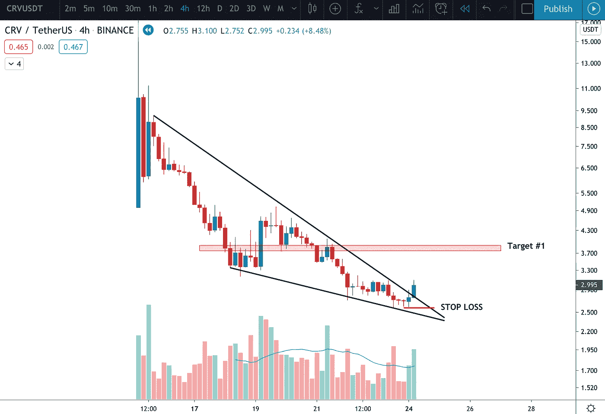
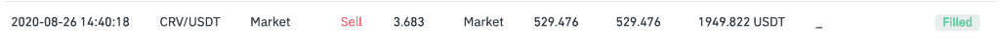

# 如何在币安交易最近上市的硬币

> 原文：<https://medium.com/coinmonks/how-to-trade-recently-listed-coins-on-binance-15e36b5f8ec7?source=collection_archive---------4----------------------->

## 克里斯·梅德|卢克龙专业交易员

**警告**:极易波动。你需要对此有一个强大的胃，你必须非常清楚你的风险管理——如果你不这样做，结果可能会很糟糕。然而，如果你能确定正确的设置，确定流动性池，并管理你的风险，回报可以超过风险。

在本文中，我将向您展示:

1.  如何在币安找到最近上市的硬币
2.  逐步贸易设置

**我们开始吧。**

我们想做的第一件事是了解币安的新上市公司。要做到这一点，去这里:【https://www.binance.com/en/support/announcement】T4

币安将在他们的公告页面上更新他们所有的新列表，所以一定要把上面的链接加入书签。

2020 年 8 月 15 日，币安将 CRV/USDT 上市。第一天的图表是这样的:

As we can see, it ran up to around $24 and then closed at $6.90.

你一定在想，你到底是怎么交易的！我给你看！

## **第一步:识别下落的楔子**

接下来的一周，我们监控了 4 小时时间框架的图表，注意到我们最喜欢的模式开始形成了——下降楔形**。**

Falling wedge on the 4hr time-frame

值得注意的一点是，在最后两根蜡烛线中，空头交易量在下降。这立即引起了我的注意，我知道一个潜在的突破即将来临。

## **第二步:等待突破**

Breakout candle on the 4hr with increasing volume

在过于兴奋和过早进场之前，等待蜡烛线在趋势线上方收盘。此外，确保有越来越多的牛市，以避免假出局。

蜡烛一熄灭，我就买进了:

随着价格朝着正确的方向移动，我又买了一些:

## **第三步:确定你的止损(你愿意冒多大的风险)**

Stop loss was placed below the previous pivot point

在这个特殊的例子中，我决定把止损点放在前一个支点的下方。这会给它足够的空间来呼吸，如果因为任何原因交易打破了这个水平——这不再是一个有效的设置，我想退出交易。此外，明确你能减掉多少真的是一种解放。仅此一点就能帮助你带着最少的情绪交易，这是在这个舞台上成功的关键。

## **第四步:确定你的利润目标**

当交易这种模式时，我总是寻找第一个即时阻力位来获利。这个水平通常是一个区域，而不是一个确切的价格。在这种情况下，范围是从 3.70 美元到 4.10 美元。我们可以看到，这个区域多次充当支撑和阻力——所以我们可以有把握地说，它是一个有效的区域。

This level acted as resistance & support multiple times

既然我们已经确定了进场、止损和获利，我们就耐心等待，让交易结束。如上所述，我注意到交易成功了，所以我又增加了一层仓位。平时都是一次买完，但这次我控制不住自己了:)

**第五步:结果**

Target hit within 24 hours

幸运的是，交易进行得很顺利。我非常支持在更长的时间框架内进行波动交易，因为这种情况下出现的假交易会更少。这种精确的设置可以在较低的时间框架内实现，但要小心——假出局确实更经常发生，所以更严格的止损是必要的。

以下是我的限价销售证明:

我在 24 小时内赚了 2041.15 美元。对于一天的工作来说还不错。

## **结论**

交易不应该过于复杂。事实上，任何成功的交易者都会告诉你，他们的过程非常机械，老实说，有点无聊。最难的部分是足够自律地一遍又一遍地这样做。当你偏离计划时，事情就会变得一团糟。

像机器人一样交易:系统而无情。

希望这有所帮助，给你带来价值。如果你想让我做更多这样的交易分析，请在评论中告诉我。

干杯。

## 另外，阅读

*   最好的[密码交易机器人](/coinmonks/crypto-trading-bot-c2ffce8acb2a)
*   [Deribit 审查](/coinmonks/deribit-review-options-fees-apis-and-testnet-2ca16c4bbdb2) |选项、费用、API 和 Testnet
*   [FTX 密码交易所评论](/coinmonks/ftx-crypto-exchange-review-53664ac1198f)
*   最好的比特币[硬件钱包](/coinmonks/the-best-cryptocurrency-hardware-wallets-of-2020-e28b1c124069?source=friends_link&sk=324dd9ff8556ab578d71e7ad7658ad7c)
*   [密码本交易平台](/coinmonks/top-10-crypto-copy-trading-platforms-for-beginners-d0c37c7d698c)
*   最好的[加密税务软件](/coinmonks/best-crypto-tax-tool-for-my-money-72d4b430816b)
*   [最佳加密交易平台](/coinmonks/the-best-crypto-trading-platforms-in-2020-the-definitive-guide-updated-c72f8b874555)
*   最佳[加密贷款平台](/coinmonks/top-5-crypto-lending-platforms-in-2020-that-you-need-to-know-a1b675cec3fa)
*   [block fi vs Celsius](/coinmonks/blockfi-vs-celsius-vs-hodlnaut-8a1cc8c26630)vs Hodlnaut
*   [莱杰 vs 特雷佐](/coinmonks/ledger-vs-trezor-best-hardware-wallet-to-secure-cryptocurrency-22c7a3fd391e)
*   Bitsgap 评论——一个轻松赚钱的加密交易机器人
*   为专业人士设计的加密交易机器人
*   [3 商业评论](https://blog.coincodecap.com/3commas-review-an-excellent-crypto-trading-bot) |一款优秀的密码交易机器人
*   [PrimeXBT 评论](/coinmonks/primexbt-review-88e0815be858) |杠杆交易、费用和交易
*   Bitmex 的[保证金交易指南](/coinmonks/the-idiots-guide-to-margin-trading-on-bitmex-dbbd7742c6fc?source=friends_link&sk=7bfa99d2a181142510c8442c8ddb0786)
*   [加密摇摆交易权威指南](/coinmonks/the-definitive-guide-to-crypto-swing-trading-7e4af6496d4d?source=friends_link&sk=70448050bd9323b42f63bfc0bb1e60d1)
*   [Bitmex 高级保证金交易指南](/coinmonks/bitmex-advanced-margin-trading-guide-2270c195ce25?source=friends_link&sk=1d986cca731f5084b9a2db4a4bc4a7ad)
*   [面向开发人员的最佳加密 API](/coinmonks/best-crypto-apis-for-developers-5efe3a597a9f)
*   [加密套利](/coinmonks/crypto-arbitrage-guide-how-to-make-money-as-a-beginner-62bfe5c868f6)指南:新手如何赚钱
*   顶级[比特币节点](https://blog.coincodecap.com/bitcoin-node-solutions)提供商
*   最佳[加密制图工具](/coinmonks/what-are-the-best-charting-platforms-for-cryptocurrency-trading-85aade584d80)
*   了解比特币的[最佳书籍有哪些？](/coinmonks/what-are-the-best-books-to-learn-bitcoin-409aeb9aff4b)

> [直接在您的收件箱中获得最佳软件交易](https://coincodecap.com?utm_source=coinmonks)

