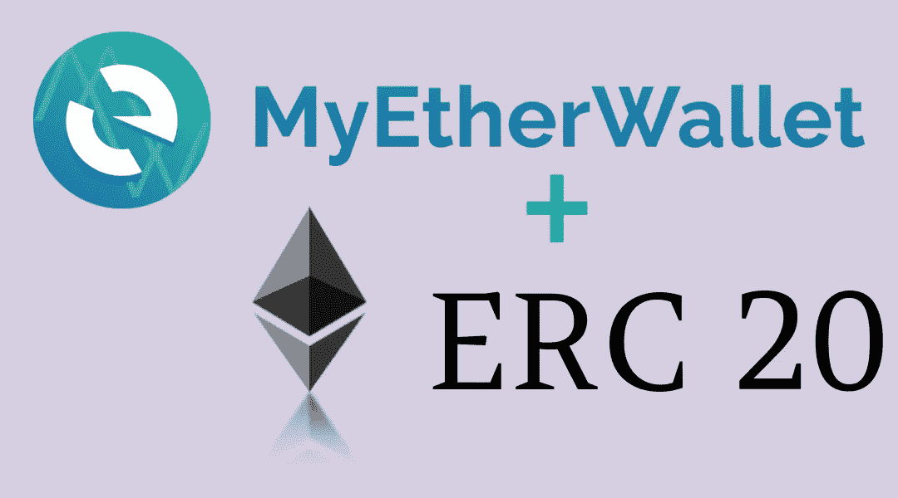
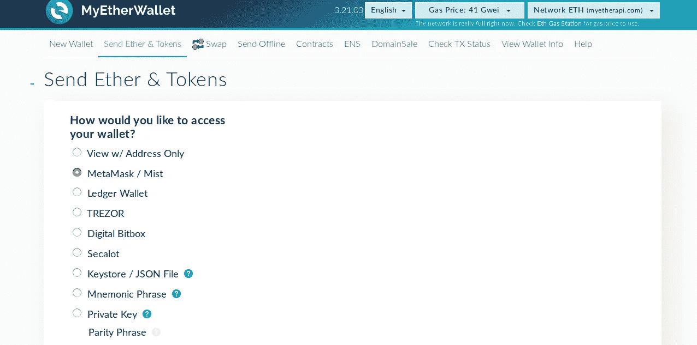
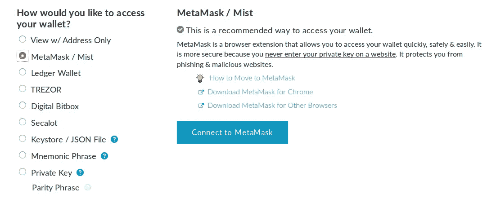
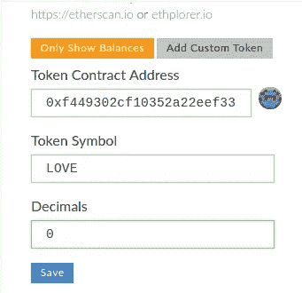
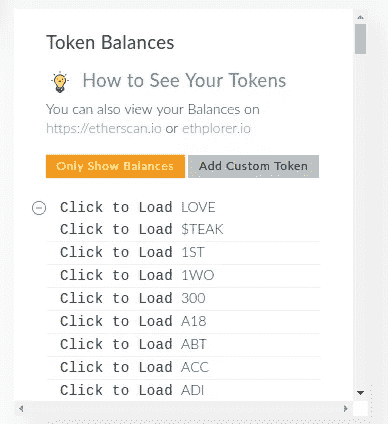
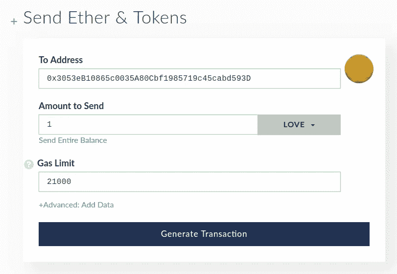
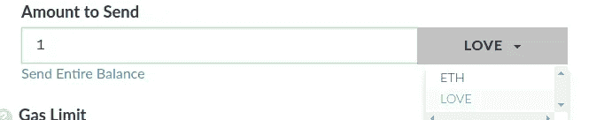

# 如何使用 MyEtherWallet 转移任何 ERC20 或任何 ERC 代币？

> 原文：<https://medium.com/coinmonks/how-to-transfer-any-erc20-or-any-erc-tokens-using-myetherwallet-18dd623ed05b?source=collection_archive---------0----------------------->

ERC 20 代币是 ICO 和代币销售中最常用的代币。您将从任何 ICO 或任何交易所获得令牌到您的以太坊钱包中。可以用以太购买代币，存放在自己的以太坊钱包里。在这里，我试图解释如何将 ECR20 代币从我们的以太坊钱包转移到另一个以太坊钱包。

> 首先，我们需要去 [myetherwallet](http://go%20to%20https//www.myetherwallet.com) 网站。

然后使用列出的方法之一加载我们的钱包帐户

*   仅查看地址
*   元面膜/薄雾
*   分类帐钱包
*   特雷佐
*   数字位盒
*   塞卡洛
*   密钥库/ JSON 文件
*   助记短语
*   私人密钥

> [发现并回顾最佳加密钱包](https://coincodecap.com/category/wallets)

我只是使用 MetaMask 来导入我的帐户。

Connect to MetaMask

解锁元掩码并单击“连接到元掩码”按钮。过程很简单。

有一个添加令牌的选项。

Add ERC Tokens

给出合同地址的任意符号，加上符号和小数。

Tokens to load

或者点击加载其他著名的令牌。

Send ETH or Tokens here.

“收件人地址”——添加收件人以太坊钱包地址

“要发送的数量”—给出需要发送的令牌数量。

Select ETH or Token

选择 ETH 或需要发送哪个令牌。也设置气体限制。然后点击“生成交易”按钮。

**是的，您成功地将令牌转移到了您朋友的钱包中。该方法可以使用任何 ERC 令牌标准。**

> 加入 Coinmonks [电报频道](https://t.me/coincodecap)和 [Youtube 频道](https://www.youtube.com/c/coinmonks/videos)获取每日[加密新闻](http://coincodecap.com/)

## 另外，阅读

*   [复制交易](/coinmonks/top-10-crypto-copy-trading-platforms-for-beginners-d0c37c7d698c) | [加密税务软件](/coinmonks/crypto-tax-software-ed4b4810e338)
*   [网格交易](https://coincodecap.com/grid-trading) | [加密硬件钱包](/coinmonks/the-best-cryptocurrency-hardware-wallets-of-2020-e28b1c124069)
*   [密码电报信号](http://Top 4 Telegram Channels for Crypto Traders) | [密码交易机器人](/coinmonks/crypto-trading-bot-c2ffce8acb2a)
*   [Pionex 双投](https://coincodecap.com/pionex-dual-investment) | [AdvCash 审核](https://coincodecap.com/advcash-review) | [秉持审核](https://coincodecap.com/uphold-review)
*   [面向开发者的 8 个最佳加密货币 APIs】](https://coincodecap.com/best-cryptocurrency-apis)
*   [支持卡审核](https://coincodecap.com/uphold-card-review) | [信任钱包 vs 元掩码](https://coincodecap.com/trust-wallet-vs-metamask)
*   [赢取注册奖金——10 大最佳加密平台](https://coincodecap.com/earn-sign-up-bonus)
*   [最佳加密交易所](/coinmonks/crypto-exchange-dd2f9d6f3769) | [印度最佳加密交易所](/coinmonks/bitcoin-exchange-in-india-7f1fe79715c9)
*   [开发人员的最佳加密 API](/coinmonks/best-crypto-apis-for-developers-5efe3a597a9f)
*   最佳[密码借贷平台](/coinmonks/top-5-crypto-lending-platforms-in-2020-that-you-need-to-know-a1b675cec3fa)
*   杠杆代币的终极指南