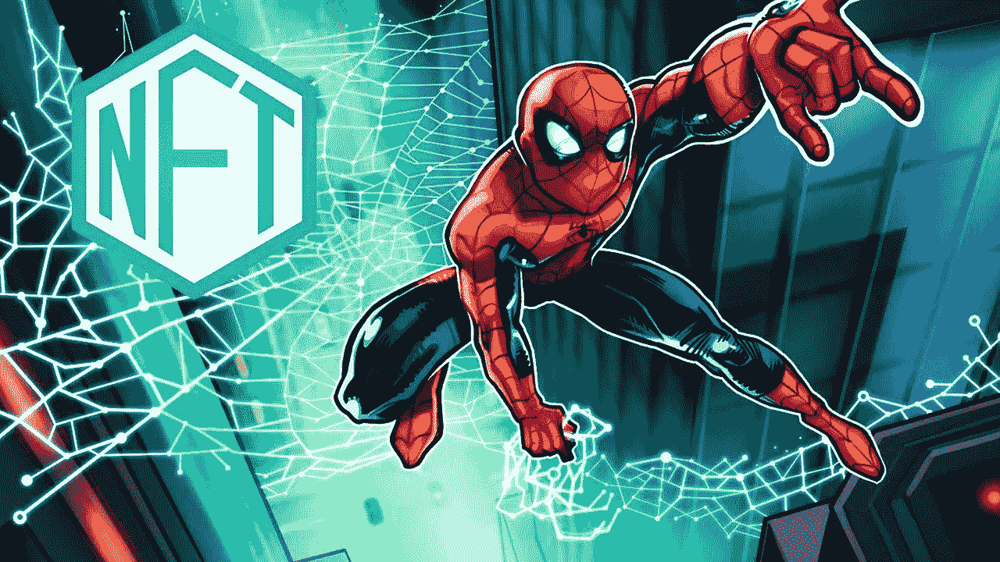

# 如何把漫画变成真正的 NFT？

> 原文：<https://medium.com/coinmonks/how-to-turn-comics-into-a-genuine-nft-7de3a076ad6c?source=collection_archive---------6----------------------->

区块链技术赋予漫画和动漫文化新的商业价值，将插图变成真正的不可替代的令牌(NFT)，为漫画出版商筹集资金，并促进市场和相关业务的增长。

最近兴起的不可替代令牌(NFT)有助于验证数字艺术的来源和有效性，这在以前是有问题的，因为数字作品很容易被复制。新的企业涌现出来，创造出向购买者承诺他们的商品是真实的，可以被安全监控的系统。

# **把漫画变成 NFT 代币**

术语“不可替换令牌”指的是不可替换令牌。这是个人之间最近的狂热。这些代币在世界各地被买卖。迈克·温克尔曼(又名 T2 人)以 6900 万美元的价格卖出了一辆 NFT。这里概述了整个过程。然而，你如何制作你自己的 NFT 令牌呢？这些阶段很简单；阅读它们，你会很熟悉这个过程:

## **第一步:选择你的漫画**

NFT 可以代表任何东西——歌曲、绘画、视频，甚至漫画书。所以，首先，选择漫画书。但是，它不一定是你最喜欢的。相反，它可以享受地区第一的地位，就像斯坦·李的查克拉无敌 NFTs 享有印度“有史以来第一超级英雄”的地位。

你是一个想通过你的作品赚钱的漫画出版商吗？你可以让你的作品成为 NFT。假设你有一个漫画人物，你想把他变成一个 NFT，一套书里的衣服，或者类似动画视频的东西；你可以标记任何东西(在几周内)。

## **第二步:选择一个区块链**

在将漫画转换成 NFT 之前，选择一个合适的区块链平台是至关重要的。现在有许多区块链平台，每个论坛都有自己的 NFT 令牌标准、兼容的钱包和市场。这意味着在一个区块链平台上创造的 NFT 代币只能在那个区块链平台上买卖。

由于以太坊是 NFT 包的领导者，你可以在它上面建立你的令牌。或者，你可以从 polkadot、polygon (matic)、tezos、币安智能链等可用选项中选择你最喜欢或负担得起的选项。

## **第三步:与 NFT 制片厂合作**

购买 Etherium 后，是时候选择一个合适的 NFT 制作工作室来报名 NFT 了。对于初学者来说，最好选择一家理想的 NFT 开发公司，因为它的设置简单明了，最适合他们。选择公司后，只需设置一个钱包来完成发送/接收菲亚特/加密资金。

一旦钱包准备好使用，就该把漫画书转换成 NFT 了。要做到这一点，你只需要在任何平台上注册自己为创作者。请始终记住，不同公司和不同地点的流程可能会有所不同。

## **第四步:创建 NFT**

现在到了实际转换的时候了。向 NFT 工作室(公司)传达你的要求，让他们在 NFT 注入这些，铸造你的分类漫画 NFT，并把它们出售。这结束了创造 NFT 的过程。确保你简化了购买 NFT 的过程，就像 [**在几天内获得斯坦·李的查克拉**](https://chakra.beyondlife.club/?fsz=home) 是多么容易。

成功生成漫画 NFT 后，您可以在第三方市场或您的专用市场上进行销售。之后，将会打开一个定价页面，用户可以在其中定义销售条件。您可以部署拍卖或以固定价格出售 NFT。

# **结论**

NFT 有很多令人兴奋的机会冲击漫画书领域。但是，为了产生真正的影响，需要克服一些障碍和限制。

我们仍处于早期阶段，关于机会，只有天空的限制。在接下来的几年里，NFT 将会颠覆哪些行业，还有待观察。

> 加入 Coinmonks [电报频道](https://t.me/coincodecap)和 [Youtube 频道](https://www.youtube.com/c/coinmonks/videos)了解加密交易和投资

## 另外，阅读

*   最佳[密码交易机器人](https://blog.coincodecap.com/best-crypto-trading-bots) | [购买索拉纳](https://blog.coincodecap.com/buy-solana) | [矩阵导出评论](https://blog.coincodecap.com/matrixport-review)
*   [Coldcard 评论](https://blog.coincodecap.com/coldcard-review) | [BOXtradEX 评论](https://blog.coincodecap.com/boxtradex-review)|[uni swap 指南](https://blog.coincodecap.com/uniswap)
*   [阿联酋 5 大最佳加密交易所](https://blog.coincodecap.com/best-crypto-exchanges-in-uae) | [SimpleSwap 评论](https://blog.coincodecap.com/simpleswap-review)
*   [购买 Dogecoin 的 7 种最佳方式](https://blog.coincodecap.com/ways-to-buy-dogecoin) | [ZebPay 评论](https://blog.coincodecap.com/zebpay-review)
*   [最佳期货交易信号](https://blog.coincodecap.com/futures-trading-signals) | [流动性交易所评论](https://blog.coincodecap.com/liquid-exchange-review)
*   [3 商业评论](/coinmonks/3commas-review-an-excellent-crypto-trading-bot-2020-1313a58bec92) | [Pionex 评论](https://blog.coincodecap.com/pionex-review-exchange-with-crypto-trading-bot) | [Coinrule 评论](/coinmonks/coinrule-review-2021-a-beginner-friendly-crypto-trading-bot-daf0504848ba)
*   [莱杰 vs Ngrave](/coinmonks/ledger-vs-ngrave-zero-7e40f0c1d694) | [莱杰 nano s vs x](/coinmonks/ledger-nano-s-vs-x-battery-hardware-price-storage-59a6663fe3b0) | [币安评论](/coinmonks/binance-review-ee10d3bf3b6e)
*   [Bybit Exchange 审查](/coinmonks/bybit-exchange-review-dbd570019b71) | [Bityard 审查](https://blog.coincodecap.com/bityard-reivew) | [CoinSpot 审查](https://blog.coincodecap.com/coinspot-review)
*   [3 commas vs crypto hopper](/coinmonks/3commas-vs-pionex-vs-cryptohopper-best-crypto-bot-6a98d2baa203)|[赚取加密利息](/coinmonks/earn-crypto-interest-b10b810fdda3)
*   最好的比特币[硬件钱包](/coinmonks/hardware-wallets-dfa1211730c6) | [BitBox02 回顾](/coinmonks/bitbox02-review-your-swiss-bitcoin-hardware-wallet-c36c88fff29)
*   [BlockFi vs Celsius](/coinmonks/blockfi-vs-celsius-vs-hodlnaut-8a1cc8c26630)|[Hodlnaut 点评](/coinmonks/hodlnaut-review-best-way-to-hodl-is-to-earn-interest-on-your-bitcoin-6658a8c19edf) | [KuCoin 点评](https://blog.coincodecap.com/kucoin-review)
*   [Bitsgap 评审](/coinmonks/bitsgap-review-a-crypto-trading-bot-that-makes-easy-money-a5d88a336df2) | [Quadency 评审](/coinmonks/quadency-review-a-crypto-trading-automation-platform-3068eaa374e1) | [Bitbns 评审](/coinmonks/bitbns-review-38256a07e161)