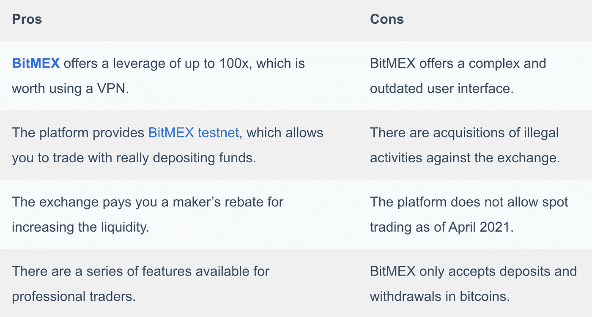

# 在美国如何使用 BitMEX？[2021]

> 原文：<https://medium.com/coinmonks/how-to-use-bitmex-in-the-usa-3c3e01adcac9?source=collection_archive---------0----------------------->

在本文中，我们将讨论如何在美国使用 [**BitMEX**](https://blog.coincodecap.com/go/bitmex) 。由于美国对密码交易有严格的监管措施，美国交易商通常不能使用 [BitMEX](https://blog.coincodecap.com/go/bitmex) 。

# 总结(TL；博士)

*   [**BitMEX**](https://blog.coincodecap.com/go/bitmex) 是最受欢迎的[杠杆交易平台](https://blog.coincodecap.com/bitcoin-margin-trading-exchange)之一。
*   在 [BitMEX](https://blog.coincodecap.com/go/bitmex) 的交易选项包括[杠杆交易](https://blog.coincodecap.com/margin-trading)，永久合约和期货合约交易。
*   由于美国严格的监管措施，您不能在美国使用 [BitMEX](https://blog.coincodecap.com/go/bitmex) 。
*   VPN 帮助你改变你的 IP 地址到一个不同的国家，以保护你免受黑客，企业，甚至政府的攻击。
*   [Hola VPN](https://blog.coincodecap.com/go/holavpn) 、 [Tunnelbear](https://blog.coincodecap.com/go/tunnelbear) 、 [Nord VPN](https://blog.coincodecap.com/go/nordvpn) 等。，是一些最好的 VPN 服务提供商。
*   您可以在连接到互联网的所有设备上使用 VPN。
*   要打开 VPN，只需从 VPN 扩展/应用程序中单击连接按钮。
*   当 VPN 处于活动模式时，您可以在 BitMEX 上创建一个帐户并开始交易。

# 什么是 BitMEX？

BitMEX 代表比特币商业交易所，是市场上[最好的杠杆交易](https://blog.coincodecap.com/bitcoin-margin-trading-exchange)平台之一。 [**BitMEX**](https://blog.coincodecap.com/go/bitmex) 提供永续合约和期货合约产品。该交易所只允许使用比特币进行交易，因此你只能存入/取出比特币。

BitMEX 提供了一个复杂的用户界面，不适合初学者。因此，作为一个初学者，你可以在 [BitMEX testnet](https://testnet.bitmex.com/) 上交易，而无需存入任何资金，并了解 BitMEX 提供的所有功能。

# 在美国如何使用 BitMEX？

如果你是美国公民，你可能无法访问 BitMEX。这是因为美国政府监管密码交易。您可以使用各种 VPN 从美国访问 [**BitMEX**](https://blog.coincodecap.com/go/bitmex) 。

不过在经历在美国使用 [**BitMEX**](https://blog.coincodecap.com/go/bitmex) 的步骤之前，我们先来了解一下为什么在美国不能使用 BitMEX。同样，让我们从了解 BitMEX 的交易选项开始。

# BitMEX 的交易期权

[**BitMEX**](https://blog.coincodecap.com/go/bitmex) 不提供现货交易服务，但提供一系列高杠杆产品。该交易所对特定资产提供最大 100 倍的杠杆，并广泛提供以下合约选项。

## BitMEX 杠杆交易

该交易所允许你对几乎所有流行的加密货币进行杠杆交易。你可以用比特币作为保证金，在市场波动的两个方向上建仓。你可以在交叉和单独的保证金交易中做多或做空。

## BitMEX 永久合约

BitMEX 永久合约永不到期或结算，与传统期货不同。在永久合同中，基础资产的价格指数与现货市场资产的价格指数大致相同。

永久合同有两种类型:

*   [反向永续合约](https://www.bitmex.com/app/inversePerpetualsGuide)
*   [Quanto 永久合约](https://www.bitmex.com/app/quantoPerpetualsGuide)

## BitMEX 期货合约

BitMEX 期货合约允许交易者拥有基础商品的权利，而无需实际购买基础商品。交易者可以在不久的将来以预定的价格购买/出售商品。

BitMEX 提供三种不同类型的期货交易:

*   [全托合同](https://www.bitmex.com/app/quantoFuturesGuide)
*   [线性合同](https://www.bitmex.com/app/linearFuturesGuide)
*   [逆合同](https://www.bitmex.com/app/inverseFuturesGuide)

# 为什么 BitMEX 在美国被禁？

自 2017 年中期以来，加密货币成为人们关注的焦点，美国通过法律来监管期货交易。众所周知[比特币](https://blog.coincodecap.com/a-candid-explanation-of-bitcoin)是一种不受监管的资产，因此 [**BitMEX**](https://blog.coincodecap.com/go/bitmex) 被迫关闭其在美国的服务。

在美国运营的交易平台必须获得经纪人执照并在 CFTC 注册。

现在你知道为什么你不能在美国使用 BitMEX 了。您可以使用 VPN 服务绕过此限制。

# 什么是 VPN？

VPN 或虚拟专用网络有助于您在公共互联网连接中保持匿名。VPN 还可以帮助您防止黑客或网络钓鱼者窃取您的隐私。使用 VPN，您可以轻松使用居住地不允许的服务。

例如，假设你生活在一个还没有 Spotify 的国家。如果你想使用这个应用程序，你只需打开 VPN，然后在 Spotify 上创建一个帐户，你就可以听所有你想听的音乐了。我们将使用美国的 [**BitMEX**](https://blog.coincodecap.com/go/bitmex) 做类似的事情。

# VPN 是如何工作的？

当您打开 VPN 时，您的数据会通过您选取的 VPN 服务器传递，而不是通过您的服务提供商。这意味着，现在，您的 IP 地址将自动成为您的 VPN 服务提供商的 IP 地址。

然后数据被加密以保护它免受黑客、企业甚至政府的攻击。VPN 服务提供商创建一个隧道，确保您的数据从您的计算机安全地传输到您所寻求的服务提供商的服务器。

# 5 项最佳 VPN 服务

为自己选择最好的 VPN 可能是一项繁琐的任务，因此我们准备了一份名单，列出了五个最好的 VPN 提供商。其中一些服务提供商为付费订阅提供了更好的服务:

*   [Hola VPN](https://blog.coincodecap.com/go/holavpn)
*   [隧道熊](https://blog.coincodecap.com/go/tunnelbear)
*   [ExpressVPN](https://blog.coincodecap.com/go/expressvpn)
*   [诺德虚拟专用网](https://blog.coincodecap.com/go/nordvpn)
*   [1ClickVPN](https://blog.coincodecap.com/go/1clickvpn)

可以使用以上任意一种 VPNs 然而，我们将使用 [Hola VPN](https://blog.coincodecap.com/go/holavpn) 进行以下两部分的逐步指导。

# 什么是 Hola VPN？

[Hola](https://blog.coincodecap.com/go/holavpn) 是一家免费的 VPN 服务提供商。它是第一批社区驱动的 VPN 提供商之一，对互联网上的任何人都是免费的。然而，hola 确实提供付费年度/月度订阅的高级服务。

# 如何使用 VPN？

如果我们简单地说，那么 [Hola VPN](https://blog.coincodecap.com/go/holavpn) 允许你改变你的 IP 地址，这样互联网上的任何人都无法知道你的位置。你可以在笔记本电脑、电脑、手机甚至智能电视上使用 [Hola VPN](https://blog.coincodecap.com/go/holavpn) 。

# 如何在笔记本电脑上使用 VPN？

在你的笔记本电脑或台式机上使用 Hola VPN 相当简单。所有的 VPN 服务提供商都有类似的功能。您所需要做的就是为特定的提供商安装浏览器扩展。

# 安装 VPN 作为 chrome 扩展

你可以按照以下步骤[安装 Hola VPN 作为 chrome 扩展](https://chrome.google.com/webstore/detail/hola-free-vpn-proxy-unblo/gkojfkhlekighikafcpjkiklfbnlmeio?hl=en)。但是，对于其他浏览器或 VPN 服务提供商，您也可以遵循类似的步骤:

1.  访问 [Hola VPN](https://blog.coincodecap.com/go/holavpn) 的官方网站或您选择的服务提供商。
2.  现在点击安装 chrome 扩展按钮。
3.  您将被重定向到 google 扩展页面。
4.  在那里，点击“添加到 chrome 按钮。”
5.  等待扩展下载并安装到您的浏览器中。
6.  现在点击拼图图标，并锁定扩展，以便更快地访问。

## 创建帐户

在您的 VPN 提供商的网站上创建一个帐户并不是强制性的，您仍然可以使用他们的免费服务。但是，创建帐户可以为您提供完整而安全的浏览体验。您可以按照下面的步骤来做同样的事情:

1.  访问 [Hola VPN](https://blog.coincodecap.com/go/holavpn) 的网站，点击加入按钮。
2.  您可以使用您的电子邮件 ID 手动注册。
3.  Hola VPN 还为您提供了使用谷歌、脸书和苹果账户加入的选项。

## 激活您的 Hola VPN

使用 VPN 保护您的连接非常简单。但是，您仍然可以按照下面的步骤来做同样的事情:

1.  点击扩展选项卡中的 Hola 注册图标。
2.  现在点击“解锁按钮”，一切都准备好了。
3.  然后，您可以根据自己的选择从下拉菜单中设置您的国家。

# 如何在 android 上使用 VPN？

VPN 在你使用它们的所有设备上的功能是相似的；但是，您需要在手机上安装该应用程序才能使用 VPN。您可以按照以下步骤在手机上使用 VPN，我们将使用 [SecureVPN](https://play.google.com/store/apps/details?id=com.fast.free.unblock.secure.vpn&hl=en_IN&gl=US) 来帮助您完成基本步骤:

# 安装 SecureVPN

您可以按照以下步骤成功下载并安装 [SecureVPN](https://play.google.com/store/apps/details?id=com.fast.free.unblock.secure.vpn&hl=en_IN&gl=US) :

1.  访问 play store 并搜索 SecureVPN 或[点击此处](https://play.google.com/store/apps/details?id=com.fast.free.unblock.secure.vpn&hl=en_IN&gl=US)。
2.  现在点击 install 按钮，等待应用程序被下载。

## 创建帐户

您无需在 [SecureVPN](https://play.google.com/store/apps/details?id=com.fast.free.unblock.secure.vpn&hl=en_IN&gl=US) 上创建帐户即可使用他们的服务；但是在基础版的 app 里，你会被限制在一堆地方的 IP。而且，你会因为大量的广告而遭受损失。

## 激活 VPN

要打开 [SecureVPN](https://play.google.com/store/apps/details?id=com.fast.free.unblock.secure.vpn&hl=en_IN&gl=US) ，您可以遵循以下步骤:

1.  现在打开应用程序，只需点击连接按钮。
2.  该应用程序会自动将您连接到最强大的可用网络。
3.  如果你想改变你的位置，只需点击右上角的灯图标；并选择可用选项。

激活 VPN 后，您可以创建一个 [**BitMEX**](https://blog.coincodecap.com/go/bitmex) 账户，或者登录您现有的账户开始在 BitMEX 交易。

# 如何使用 BitMEX？

现在你已经成功激活了 VPN，你需要在 [**BitMEX**](https://blog.coincodecap.com/go/bitmex) 上创建一个账户来启动你的交易之旅。您可以按照以下步骤开始在 BitMEX 交易:

1.  在 VPN 处于开启模式的情况下，访问 BitMEX 的官方网站。
2.  现在点击注册按钮，在下一个窗口，输入你的电子邮件，密码，点击注册按钮。
3.  然后验证您的电子邮件地址，并登录您的帐户。
4.  转到交易选项卡并完成验证过程。不要忘记使用您的设备的位置作为地址证明。
5.  现在去账户区，将资金存入你的 [**BitMEX**](https://blog.coincodecap.com/go/bitmex) 钱包。
6.  一旦你的钱包里有了钱，你就可以在交易标签里开仓和平仓。

你可以通过阅读我们在 BitMEX 上的[指南来浏览在 BitMEX 交易的详细步骤。](https://blog.coincodecap.com/bitmex-review)

# 如何关闭 VPN？

如果你认为你已经完成了一天的工作，并希望关闭 VPN，那么你所要做的就是点击断开按钮。在 [Hola VPN](https://blog.coincodecap.com/go/holavpn) 的情况下，你必须点击扩展窗口右上角的电源按钮。

# 如何绕过一个 VPN 块？

如果某个网站屏蔽了你的 VPN，你需要一个不断更新 IP 地址的高级 VPN 服务提供商。

# 为什么你应该使用 VPN 在 BitMEX 交易？

[**BitMEX**](https://blog.coincodecap.com/go/bitmex) 是杠杆交易的最佳服务提供商之一。它有很多好处，比如计算器、[交易机器人](https://blog.coincodecap.com/best-crypto-trading-bots)、 [BitMEX testnet](https://testnet.bitmex.com/) 等等。

现在你知道如何在美国使用 BitMEX，你可以很容易地在交易平台上创建一个账户，开始你的交易之旅。然而，如果你希望了解更多关于交易交易所的信息，并希望获得使用该平台的详细指南，那么你可以在这里阅读我们的 [BitMEX 评论](https://blog.coincodecap.com/bitmex-review)。

BitMEX 向其用户提供杠杆交易。要了解更多关于 BitMEX 的杠杆交易或期货交易，你可以阅读我们的 [BitMEX 保证金交易](https://blog.coincodecap.com/bitmex-margin-trading)文章。

# 在美国使用 BitMEX:利弊

# 如何在美国使用 BitMEX:结论

使用交易所很简单，即使你的政府由于一些监管措施而禁止它。很多 VPN 服务提供商，比如 [Hola VPN](https://blog.coincodecap.com/go/holavpn) ，都为你提供了这个机会。 [**BitMEX**](https://blog.coincodecap.com/go/bitmex) 是一个[杠杆交易](https://blog.coincodecap.com/margin-trading)平台，提供市场上最高的杠杆之一。然而，它在美国是被禁止的，你仍然可以通过使用 VPN 来访问这个平台的所有功能。

但是，请记住，在使用 VPN 之前仍然是非法的，在使用 VPN 之后仍然是非法的。

# 常见问题

**我可以用 VPN 做什么？**

VPN 允许您将 IP 地址更改为您选择的国家。您可以使用您所在国家/地区目前尚未提供的平台服务。

**VPN 合法吗？**

VPN 在大多数国家是合法的，包括美国。然而，不使用 VPN 的非法事情在你使用 VPN 时仍然是非法的。

**如何在 BitMEX 上做空？**

通过做空，你预测了资产价格的下跌。简而言之，你借入并出售带有抵押品的交易所资产，然后在它们的价格下跌时再将其回购。你可以通过点击交易标签上的红色/卖出/做空按钮来做空 BitMEX。

**什么是 BitMEX testnet？**

BitMEX 是专门为专业交易者设计的交易所。因此，当初学者试图使用交换机时，他们会发现很难通过。因此，BitMEX 推出了一个 [BitMEX testnet](https://testnet.bitmex.com/) ，它允许你使用所有的平台功能，而不需要在原始市场下订单。

*   [BitMEX 保证金交易|新手指南 2021](https://blog.coincodecap.com/?p=7452)
*   [bit MEX 2021 年回顾—保证金交易、费用、测试网和计算器](https://blog.coincodecap.com/?p=7566)
*   [5 家最佳比特币保证金交易交易所【2021】](https://blog.coincodecap.com/bitcoin-margin-trading-exchange)
*   [最佳加密交易所| 2021 年十大加密货币交易所](https://blog.coincodecap.com/crypto-exchange)
*   [萝莉点评:一边购物一边赚比特币](https://blog.coincodecap.com/lolli-review)

> 加入 Coinmonks [Telegram group](https://t.me/joinchat/Trz8jaxd6xEsBI4p) 学习加密交易和投资

## 另外，阅读

*   [什么是融资融券交易](https://blog.coincodecap.com/margin-trading)
*   最好的[密码交易机器人](/coinmonks/crypto-trading-bot-c2ffce8acb2a) | [网格交易](https://blog.coincodecap.com/grid-trading)
*   [3 商业评论](/coinmonks/3commas-review-an-excellent-crypto-trading-bot-2020-1313a58bec92) | [Pionex 评论](/coinmonks/pionex-review-exchange-with-crypto-trading-bot-1e459d0191ea) | [Coinrule 评论](/coinmonks/coinrule-review-2021-a-beginner-friendly-crypto-trading-bot-daf0504848ba)
*   [AAX 交易所评论](/coinmonks/aax-exchange-review-2021-67c5ea09330c) | [德里比特评论](/coinmonks/deribit-review-options-fees-apis-and-testnet-2ca16c4bbdb2) | [FTX 交易所评论](/coinmonks/ftx-crypto-exchange-review-53664ac1198f)
*   [n 零复习](/coinmonks/ngrave-zero-review-c465cf8307fc) | [Phemex 复习](/coinmonks/phemex-review-4cfba0b49e28) | [PrimeXBT 复习](/coinmonks/primexbt-review-88e0815be858)
*   [Bybit Exchange 审查](/coinmonks/bybit-exchange-review-dbd570019b71) | [Bityard 审查](/coinmonks/bityard-review-7d104239be35) | [CoinSpot 审查](https://blog.coincodecap.com/coinspot-review)
*   [3 commas vs crypto hopper](/coinmonks/3commas-vs-pionex-vs-cryptohopper-best-crypto-bot-6a98d2baa203)|[赚取加密利息](/coinmonks/earn-crypto-interest-b10b810fdda3)
*   最好的比特币[硬件钱包](/coinmonks/the-best-cryptocurrency-hardware-wallets-of-2020-e28b1c124069?source=friends_link&sk=324dd9ff8556ab578d71e7ad7658ad7c) | [BitBox02 回顾](/coinmonks/bitbox02-review-your-swiss-bitcoin-hardware-wallet-c36c88fff29)
*   [莱杰 vs n rave](/coinmonks/ledger-vs-ngrave-zero-7e40f0c1d694)|[莱杰 nano s vs x](/coinmonks/ledger-nano-s-vs-x-battery-hardware-price-storage-59a6663fe3b0)
*   [加密复制交易平台](/coinmonks/top-10-crypto-copy-trading-platforms-for-beginners-d0c37c7d698c) | [Coinmama 评论](/coinmonks/coinmama-review-ace5641bde6e)
*   [CoinLoan 审查](/coinmonks/coinloan-review-18128b9badc4) | [YouHodler 审查](/coinmonks/youhodler-4-easy-ways-to-make-money-98969b9689f2) | [BlockFi 审查](/coinmonks/blockfi-review-53096053c097)
*   最好的[加密税务软件](/coinmonks/best-crypto-tax-tool-for-my-money-72d4b430816b) | [硬币追踪评论](/coinmonks/cointracking-review-a-reliable-cryptocurrency-tax-software-5114e3eb5737)
*   最佳[加密借贷平台](/coinmonks/top-5-crypto-lending-platforms-in-2020-that-you-need-to-know-a1b675cec3fa) | [杠杆代币](/coinmonks/leveraged-token-3f5257808b22)
*   [block fi vs Celsius](/coinmonks/blockfi-vs-celsius-vs-hodlnaut-8a1cc8c26630)|[Hodlnaut Review](/coinmonks/hodlnaut-review-best-way-to-hodl-is-to-earn-interest-on-your-bitcoin-6658a8c19edf)
*   [Bitsgap 审查](/coinmonks/bitsgap-review-a-crypto-trading-bot-that-makes-easy-money-a5d88a336df2) | [Quadency 审查](/coinmonks/quadency-review-a-crypto-trading-automation-platform-3068eaa374e1) | [Bitbns 审查](/coinmonks/bitbns-review-38256a07e161)
*   [埃利帕尔泰坦评论](/coinmonks/ellipal-titan-review-85e9071dd029) | [赛克斯斯通评论](/coinmonks/secux-stone-hardware-wallet-review-15-discount-coupon-2020-7577032faa6e)
*   [本地比特币评论](/coinmonks/localbitcoins-review-6cc001c6ed56) | [加密货币储蓄账户](https://blog.coincodecap.com/cryptocurrency-savings-accounts)
*   最佳[区块链分析](https://bitquery.io/blog/best-blockchain-analysis-tools-and-software)工具| [赚比特币](/coinmonks/earn-bitcoin-6e8bd3c592d9)
*   [加密套利](/coinmonks/crypto-arbitrage-guide-how-to-make-money-as-a-beginner-62bfe5c868f6)指南| [如何做空比特币](/coinmonks/how-to-short-bitcoin-568a2d0b4ae5)
*   最佳[加密制图工具](/coinmonks/what-are-the-best-charting-platforms-for-cryptocurrency-trading-85aade584d80) | [最佳加密交易所](/coinmonks/crypto-exchange-dd2f9d6f3769)
*   [如何在印度购买比特币？](/coinmonks/buy-bitcoin-in-india-feb50ddfef94) | [WazirX 审查](/coinmonks/wazirx-review-5c811b074f5b)
*   [印度比特币交易所](/coinmonks/bitcoin-exchange-in-india-7f1fe79715c9) | [比特币储蓄账户](/coinmonks/bitcoin-savings-account-e65b13f92451)
*   [CoinDCX 评论](/coinmonks/coindcx-review-8444db3621a2) | [加密保证金交易交易所](https://blog.coincodecap.com/crypto-margin-trading-exchanges)

*原载于 2021 年 4 月 8 日 https://blog.coincodecap.com***。**