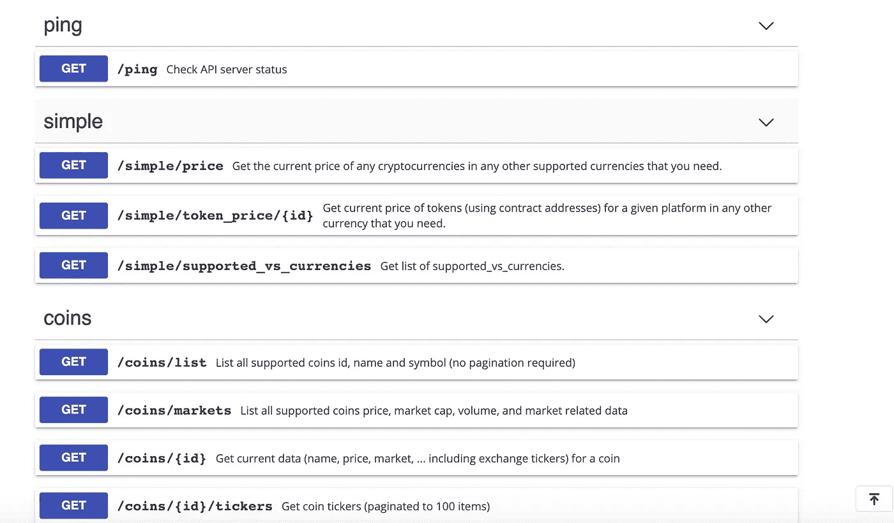
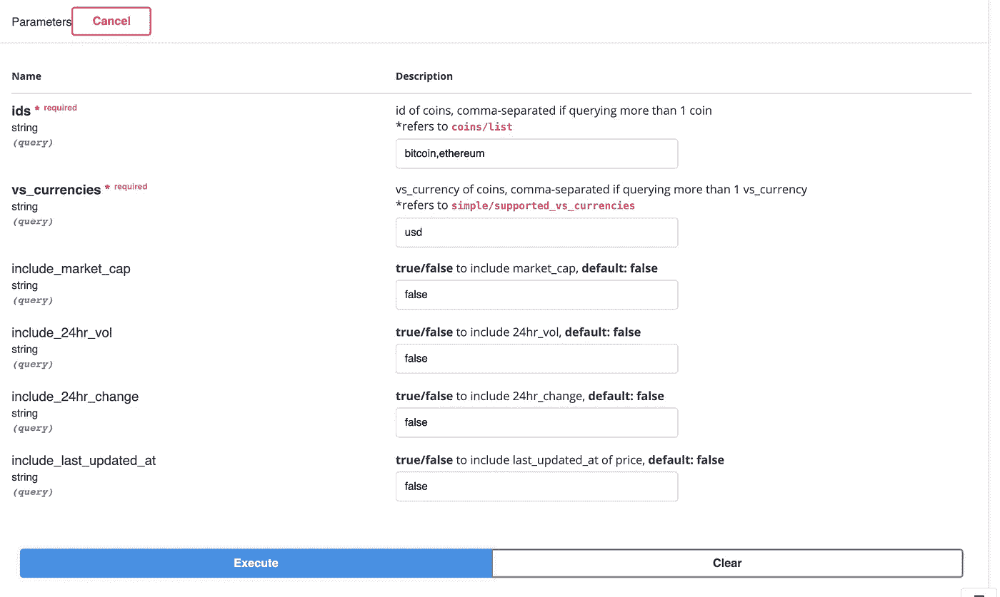
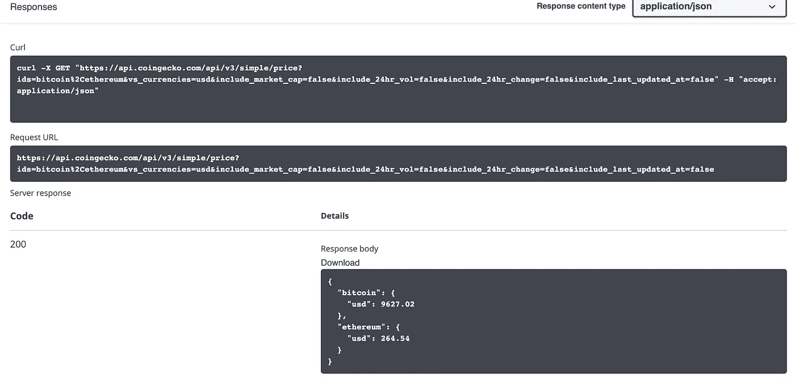
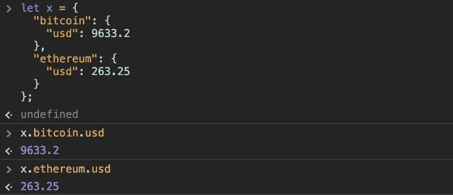

# 如何使用 CoinGecko 的免费 API 获取数字资产数据:只是基础

> 原文：<https://medium.com/coinmonks/how-to-use-coingeckos-free-api-to-get-digital-asset-data-just-the-basics-d46f232926cb?source=collection_archive---------0----------------------->

软件开发人员经常谈论 API。什么是 API？API 代表应用程序编程接口。我想为我正在从事的一个 JavaScript 项目收集比特币、以太坊和其他数字资产的具体市场数据。我的第一站是 CoinGecko。


CoinGecko is free to use and allows up to 100 requests per minute.

我选择 CoinGecko 的 API 是因为另一个主要的数字资产信息网站 CoinMarketCap 因在硬币上发布[虚假的交易量数据而臭名昭著。](https://www.coindesk.com/for-15k-hell-fake-your-exchange-volume-youll-get-on-coinmarketcap)

1.  决定你想要得到什么数据。我的应用程序需要给定硬币的当前市场价格、某个历史日期硬币的市场价格以及当前市场的快照。

**a.** 到[https://www.coingecko.com/en/api](https://www.coingecko.com/en/api)滚动到一半左右。在那里，您将看到您可以提出的请求类型。因为我的应用程序需要从 CoinGecko 引入一些数据，所以我想发出一个 GET 请求。这正是 CoinGecko 所能做到的。邪恶。



**b.** 我将使用 **/simple/price** 来获取硬币 X、Y 和 Z **的当前市场价格。**我将使用 **/coins/{id}/history** 来获取某个先前日期的硬币价格。

2.测试数据将如何发送到您的应用程序。CoinGecko 上的测试环境非常好。它给出了一个例子，说明当我发出请求时，信息将如何传递给我的应用程序。假设我想获得当前[比特币](https://blog.coincodecap.com/tag/bitcoin/)和以太的市场价格。我可以在浏览器中输入这些参数。一定要用逗号分隔硬币的 id，不要用空格，否则你会遇到问题。



点击**执行。**

当您的应用程序发出同样的请求时，CoinGecko 会给出它将发送的响应。



太好了，所以现在我们知道了[比特币](https://blog.coincodecap.com/tag/bitcoin/)。usd 将从该对象中得出一个数字 9627.02。通过访问 API，复制该数据结构，将其粘贴到您的控制台中，并测试如何获得您需要的信息。



3.在 JavaScript 中导入依赖项

您只需要从终端运行:

```
npm install 'coingecko-api'
```

您可能需要仔细检查 package.json 文件中的这个 lands，如下所示:

```
"coingecko-api": "^1.0.10"
```

很好很容易！

您只需要依赖项来使用 node.js 包装器，否则您可以直接点击 URL。(参见下面的实现。)

4.提出你的要求。

经验教训#1:如果你需要获得多个硬币的数据，在发送获取数据的请求时，把它们放在一个数组中。

经验教训#2:如果 fetch 请求在历史查询中抛出错误，可能是因为数据只在 CoinGecko 开始跟踪硬币的时候提供。

经验教训#3:不要忘记 await 函数(比如这个 API 查询)必须在异步函数中执行。下面是一个在 React 类组件中使用 node.js 包装器的实现:

```
**async** componentDidMount() {await this.CoinGeckoClient.coins.markets(
{ vs_currency: "usd",
  order: "market_cap_desc",
  per_page: 100,
  page: 1,
  sparkline: false,
  price_change_percentage: "24h"})
.then(data **=>** console.log(data))}
```

经验教训#4:在一个独立于应用程序的 JS 文件中运行你的请求可以帮助避免麻烦。只需使用该环境来练习如何使用数据，以及将数据发送到哪里。我花了半天时间在一个 coin-gecko-api.js 文件中练习请求，并在一个简单的 react 应用程序中呈现它们，只是为了感受一下如何发出不同的请求。时间用得其所。

历史请求的实现可能是这样的:

```
**const** getHistoricalPrice **= async** event => {**let** currency1API= "bitcoin";
**let** indexDate="01-01-2020"; **let** string = "https://api.coingecko.com/api/v3/coins/" + currency1API +"/history?date="+indexDate+"&localization=false";await fetch(string)
.then(resp **=>** resp.json())
.then(data **=>** console.log(data.market_data.current_price.usd))}//=> 7195.15 
```

5.对数据做你想做的事！

现在你已经准备好了所有的数据。谁敢赢！

> **也可阅读:开发者的 10 个最佳加密 API**[](/coinmonks/best-crypto-apis-for-developers-5efe3a597a9f)

> ****加入 Coinmonks [电报频道](https://t.me/coincodecap)和 [Youtube 频道](https://www.youtube.com/c/coinmonks/videos)获取每日[加密新闻](http://coincodecap.com/)****

## ****另外，阅读****

*   ****[复制交易](/coinmonks/top-10-crypto-copy-trading-platforms-for-beginners-d0c37c7d698c) | [加密税务软件](/coinmonks/crypto-tax-software-ed4b4810e338)****
*   ****[网格交易](https://coincodecap.com/grid-trading) | [加密硬件钱包](/coinmonks/the-best-cryptocurrency-hardware-wallets-of-2020-e28b1c124069)****
*   ****[密码电报信号](http://Top 4 Telegram Channels for Crypto Traders) | [密码交易机器人](/coinmonks/crypto-trading-bot-c2ffce8acb2a)****
*   ****[最佳加密交易所](/coinmonks/crypto-exchange-dd2f9d6f3769) | [印度最佳加密交易所](/coinmonks/bitcoin-exchange-in-india-7f1fe79715c9)****
*   ****[面向开发人员的最佳加密 API](/coinmonks/best-crypto-apis-for-developers-5efe3a597a9f)****
*   ****最佳[密码借贷平台](/coinmonks/top-5-crypto-lending-platforms-in-2020-that-you-need-to-know-a1b675cec3fa)****
*   ****杠杆代币的终极指南****
*   ****[AscendEx Staking](https://coincodecap.com/ascendex-staking)|[Bot Ocean Review](https://coincodecap.com/bot-ocean-review)|[最佳比特币钱包](https://coincodecap.com/bitcoin-wallets-india)****
*   ****[Bitget 回顾](https://coincodecap.com/bitget-review)|[Gemini vs block fi](https://coincodecap.com/gemini-vs-blockfi)|[OKEx 期货交易](https://coincodecap.com/okex-futures-trading)****
*   ****[美国最佳加密交易机器人](https://coincodecap.com/crypto-trading-bots-in-the-us) | [经常性回顾](https://coincodecap.com/changelly-review)****
*   ****[在印度利用加密套利赚取被动收入](https://coincodecap.com/crypto-arbitrage-in-india)****
*   ****[霍比评论](https://coincodecap.com/huobi-review) | [OKEx 保证金交易](https://coincodecap.com/okex-margin-trading) | [期货交易](https://coincodecap.com/futures-trading)****
*   ****[麻雀交换评论](https://coincodecap.com/sparrow-exchange-review) | [纳什交换评论](https://coincodecap.com/nash-exchange-review)****