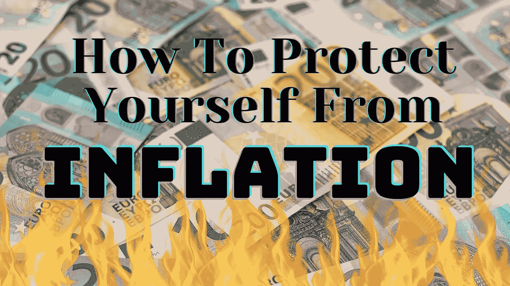
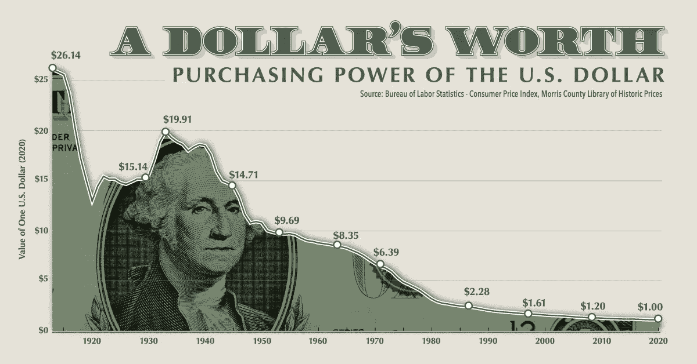
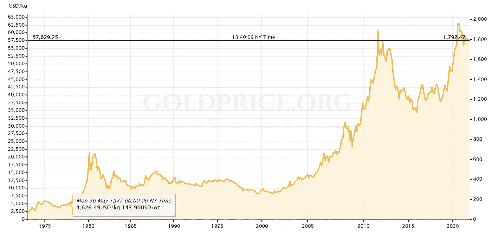

# 通货膨胀背后的原因&它对投资意味着什么

> 原文：<https://medium.com/coinmonks/how-to-use-crypto-other-assets-as-inflation-hedge-de6379b31e78?source=collection_archive---------1----------------------->

## 时局艰难时保护你的财富。

汽油↗️ + 43%
二手车↗️ +39%
房屋↗️ +15%
食品↗️ + 5%

这些只是显示过去 12 个月美国物价上涨的几个数字。其他国家也有类似的发展。

通货膨胀现在对人们的财富构成了重大风险。

毫无疑问，通货膨胀将会持续。

在这篇文章中，我将向你解释以下两件事:

1.  为什么我们现在在所有领域都看到高通胀。
2.  **如何通过投资加密货币和其他资产来保护自己免受通货膨胀的负面影响**。

我们走吧！

# **什么是通货膨胀？**

通货膨胀意味着商品和服务的价格在一段时间内不断上涨。这是一个正常的过程。然而，如果价格上涨过快，就会出现问题。高通货膨胀降低了你的购买力，意味着你的钱贬值了，你可以用同样多的钱买更少的东西。换句话说:通货膨胀让你更穷。

Purchasing Power of the US Dollar 1913–2020, Source: visualcapitalist.com

# **今天为什么会出现高通胀？**

最近几个月，我们看到通胀飙升有两个主要原因。

*   通货膨胀是 T21 政府强制封锁的后果。
*   通货膨胀是无限制印钞的后果。

它们都是相互关联的，但是为了不超出这个范围，我将保持事情简单。

让我们仔细看看。

## 1.**政府强制封锁导致的通货膨胀**

世界各国政府抗击新冠肺炎最激烈的行动是强制封锁。关于医疗方面的好处，我不想对这一步作出赞成或反对的判断。

但是有一点是清楚的:封锁对经济造成了持久的损害。

在病毒爆发之前，全球经济就已经很糟糕了。因此，封锁带来的是已经存在的问题的加速和恶化。

当世界经济关闭时，发生了很多事情。原材料生产商削减了产量。公司裁员。工厂停止生产商品。供应链断裂了。

这很糟糕。

因为当经济在几个月后再次启动时，一些不愉快的事情变得清晰起来:

*   🛢️原材料短缺。
*   👷在许多行业，没有足够的工人来做事。
*   🏭一些生产商已经倒闭，而另一些则无力填补缺口。
*   🚢断裂的供应链尚未修复。

所有这些都使得生产和运输货物变得更加困难。在我们这个过于复杂的即时世界里，一个地方的失败也会导致其他地方的失败。一旦开始，这个过程就不能轻易停止。

我们最终得到的是商品和服务的价格上涨。

到目前为止还说得通，对吧？

Click me.

## 2.**无限制印钞导致的通货膨胀**

我们今天看到高通胀的第二个原因更加复杂。简单地说，价格上涨的另一个原因是**政府印了太多的钱。**

但是他们为什么要这么做呢？

原因是能量。或者更好地说，**缺乏廉价能源**。

让我解释一下。

如上所述，当危机袭来时，原材料的生产被削减。能源生产也是如此。

但是能源不像水龙头。

**当你关闭油井或气井时，一旦你需要它们，你不能简单地再次打开它们。这需要时间。**

结果，高密度能源(化石燃料)的缺乏导致能源价格上涨。当能源成本上涨时，其他所有东西的价格也会上涨。这是因为我们需要石油、天然气和煤炭(占全球能源组合的 80%)来运转。没有廉价的化石燃料，像重型运输、食品生产和制造业这样的必需品变得更加昂贵。

这是关于能源如何影响经济以及新冠肺炎危机如何影响系统的短期观点。

但是，当我们着眼于更长的时间框架时，还有另一个问题。

当没有足够的廉价高密度能源时，经济增长就会停滞。虽然封锁使我们的能源状况变得更糟，但这个问题其实并不新鲜。总的来说，在过去的二三十年里，发达国家的常规石油产量一直在下降。与此同时，发达国家在同一时期只有最低限度的增长。

为了说明这一点，让我们看看下面的图表。

2000 年后(美国和英国的传统石油产量开始下降)，主要发达国家的官方 GDP 增长率从未超过 4%。事实上，数字可能只有一半。

这是一个问题，因为我们的整个经济体系依赖于持续增长。

没有增长，资本主义制度就会萎缩和死亡。

那么我们的领导人是怎么解决这个问题的呢？

为了对抗逐渐消失的增长，政府试图通过向金融系统注入越来越多的资金来刺激经济。他们通过允许家庭和企业获得廉价债务做到了这一点。在过去的几十年里，政府印制了数万亿美元、欧元、日元等。

这产生了一个新问题。

停滞或萎缩的经济无法吸收所有新创造的货币。金融泡沫开始在各地形成。正如你在下面的图表中看到的，在过去的 20 到 30 年中，这些价格上涨主要影响了基本的东西，如住房、教育和医疗保健。直到新冠肺炎出现。

再加上本已疲软的经济因封锁而导致的短缺，所有领域的价格都会大幅上涨。

准确地说，**我们今天看到的是所谓的滞胀**(停滞+通胀)。这是一种价格膨胀，而经济却停滞不前或越来越小。

我们有大麻烦了。

## **接下来事情会如何发展？**

请注意在过去的几十年里，尽管政府向系统注入了大量资金，经济增长却没有恢复。如果没有足够的廉价高密度能源，这种方法是行不通的。同时，没有迹象表明货币政策会改变。

综合考虑新冠肺炎封锁带来的影响，这意味着通货膨胀将会持续。这并不像美联储和其他央行宣称的那样是“暂时的”。

了解了这一切，投资者应该怎么做？

# 用这些资产来对冲通货膨胀

通货膨胀的答案很简单。你需要做的就是把你的钱换成保值的资产或者升值的资产。

有几个选项可供您选择:

## 加密货币

加密是一种对冲通胀的工具，因为与法定货币相比，加密货币的价值大幅上升。

举个例子。尽管美元自 2019 年以来贬值了约 10%，但 T12 比特币在同一时间框架内上涨了 800–900%。

为什么？

那里**永远不会超过 2100 万 BTC** 。但是政府可以印多少钱是没有限制的。

但是也有实际的原因。

虽然对公司和土地等许多传统资产的投资存在监管障碍，但任何人都可以相对轻松地投资加密货币和加密项目。对许多人来说，把他们的钱存进密码是最简单的投资方式。

反对加密货币作为通胀保护的一个方面是它们的高波动性。然而，这是越来越多的投资者正在接受的风险。

Gold Price Chart 1970–2021, Source: goldprice.org

## 黄金和其他贵金属

在通货膨胀阶段或经济危机发生时，贵金属通常被视为一种良好的投资。

众所周知的例子是 20 世纪 70 年代末和 80 年代初由于能源短缺导致上一次通货膨胀危机时黄金和白银的价格上涨。

在金融大危机期间，黄金价格上涨了两倍。在经历了 2010 年代中期的暴跌之后，黄金在 2019 年经历了**又一次大幅涨价，目前处于盘整阶段。看起来很有希望突破。**

我预计贵金属将在未来几年发挥重要作用。

## 土地和财产

正如上面关于通货膨胀的图表所示，在过去的 30 年里，房价和地价只知道一个方向:上涨。

对此不要有任何误解。**房地产行业存在泡沫。**但这并不意味着某些土地和某些种类的房产不能很好地对冲通货膨胀。

归根到底是质量问题。或者，正如这个领域的投资者喜欢说的:**位置，位置，位置！**

 [## 奥地利住房市场存在泡沫吗？

### 这篇文章是我在 2019 年 9 月写的上一篇文章的更新版本:维也纳呼叫-对…

ren-heinrich.medium.com](https://ren-heinrich.medium.com/is-the-austrian-housing-market-in-a-bubble-c0ff813ef2dc) 

虽然我对这一资产类别的长期表现有所怀疑，但我认为地段好的土地和房产是非常好的投资。

例如，靠近人口中心的农田和森林将会一直处于高需求状态。相比之下，你可能应该远离郊区新开发的房产，那里没有公共交通、购物中心、学校和其他重要设施。

根据经验，**任何需要大量精力来维持现状的事情，很可能都不是好的投资**。

## 干脆买了就忘了？

这是不是意味着你只需要买密码就可以了？

嗯，没有。

因为在整个“通货膨胀！！!"叙述是你财富的另一个威胁。我所说的是市场崩溃。

# 短期和长期观点:通货膨胀，崩溃，更多的通货膨胀

我认为在接下来的几个月里，大多数资产将会经历一轮强劲的牛市。加密将会飙升到令人难以置信的高度。股票市场也是如此。

但是要小心！

如上所述，实体经济状况不佳。如果没有中央银行的持续干预，金融市场将会崩溃。裂缝已经到处出现，最终，这个系统将会崩溃。

这不是会不会发生的问题。但是当。

接下来将是一次大规模的调整。

这种向下的强劲走势将影响大多数资产。**不要认为加密不会受此影响。**作为参考，看看 2020 年 3 月因 COVID-crisis 爆发而发生的事情。我们当时看到的是所有市场的重大调整。

我认为，在这次强有力的通货紧缩之后，我们将会看到几个月的价格低迷。

然而。

导致通货膨胀的潜在问题不会消失。这意味着**价格的强劲增长最终将再次回升**。

你对这些发展的反应是你自己的决定。就我个人而言，我正在遵循一个 4 步计划:

1.  **让我的加密货币和其他资产在持续的牛市中升值**，我预计牛市将持续几周到几个月。
2.  **将我持有的很大一部分密码转换成现金**，然后等待崩盘发生。
3.  **拾取资产**(加密货币、土地等。当调整发生时，以便宜的价格。
4.  在通货膨胀再次推高价格之前，把大部分现金拿出来。

我不知道会不会这样。但我相信很有可能。

# 最后的话

我知道这篇文章中有很多东西需要解开。我计划在未来的出版物中更详细地阐述我提出的某些观点。

正如我所说，通货膨胀将伴随我们几年甚至几十年。这就是为什么将一部分法定货币投资于密码和其他资产是一个不错的选择。

但正确的时机至关重要。最终，市场将出现大幅调整。**你应该提前知道你是想袖手旁观，还是想先套现，以便以后再进场。**

请在评论中告诉我你的想法，以及你打算如何保护自己免受通货膨胀的影响。

干杯！

*如需更多我写的关于经济和通货膨胀的文章，请查看我的列表:*

[*https://ren-Heinrich . medium . com/list/economics-and-inflation-9eb 971 c 3d a2 e*](https://ren-heinrich.medium.com/list/economics-and-inflation-9eb971c3da2e)

！！！请不要与世卫组织自称是我的人互动，也不要在评论区分享 WHATSAPP 号码/电报号码。永远都是骗局，我永远不会让你给我寄钱。！！！

# 来源

Dmitry Orlov -石油峰值已成历史，[http://cluborlov . blogspot . com/2010/11/Peak-Oil-Is-History . html](http://cluborlov.blogspot.com/2010/11/peak-oil-is-history.html)

蒂姆·摩根-need:一款新型开罐器，[https://surplus energy economics . WordPress . com/2021/10/21/214-need-A-New-Model-Opener/](https://surplusenergyeconomics.wordpress.com/2021/10/21/214-needed-a-new-model-tin-opener/)

盖尔·特维尔伯格-能源就是经济。能源供应减少导致冲突，[https://ourfiniteworld . com/2020/11/09/Energy-is-the-economy-Energy-In-contraction-Leads-To-Conflict/](https://ourfiniteworld.com/2020/11/09/energy-is-the-economy-shrinkage-in-energy-supply-leads-to-conflict/)

蒂姆·沃特金斯(Tim Watkins)-如果增长无法恢复怎么办，[https://consciousness of sheep . co . uk/2021/03/03/What-If-Growth-can-Return/](https://consciousnessofsheep.co.uk/2021/03/03/what-if-growth-cannot-return/)