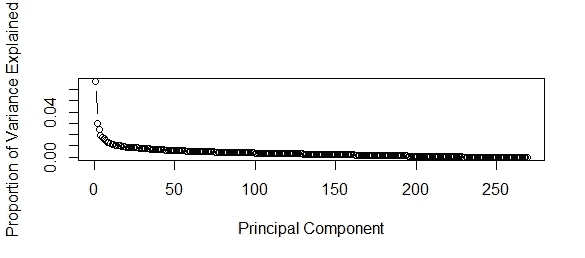
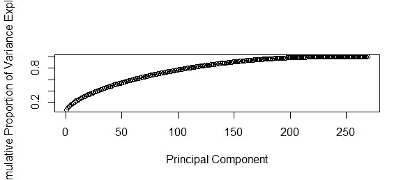

# 如何在 r 中使用 Caret 包使用不同的算法？

> 原文：<https://medium.com/coinmonks/how-to-use-different-algorithms-using-caret-package-in-r-for-house-price-dataset-fcd177b08c3c?source=collection_archive---------2----------------------->

# **入门简介:**

亲爱的读者们，这是我的第一篇文章，请多包涵。将有语法错误(不是代码)，所以提前道歉。因此，我将在[房价数据集](https://www.kaggle.com/c/house-prices-advanced-regression-techniques)上工作，这是 kaggle 中的一个竞赛，并在 R 中应用 caret 包以应用不同的算法而不是不同的包，同时应用超参数调整。

# **比赛描述:**

数据集上的 kaggle 描述如下:

> 请购房者描述他们梦想中的房子，他们可能不会从地下室天花板的高度或靠近东西向铁路开始。但是这个游乐场竞赛的数据集证明，影响价格谈判的远不止卧室的数量或白色尖桩栅栏。有 79 个解释变量描述了(几乎)爱荷华州埃姆斯住宅的每个方面，这个比赛挑战你预测每个家庭的最终价格。

# **问题介绍:**

因此，本次比赛的数据集有大约 76 列，分别有缺失值，因为让我们面对它，没有缺失值的数据集就像没有灵魂的生命。我们要解决的问题是预测爱荷华州艾姆斯的住宅销售价格。我们必须使用回归技术来预测房产的销售价格。这是一个[监督回归机器学习问题](https://machinelearningmastery.com/supervised-and-unsupervised-machine-learning-algorithms/)。它是受监督的，因为我们有我们想要预测的特征(房价数据)和目标(销售价格)。
现在，对于回归问题，我们可以使用各种算法，如线性回归、随机森林、kNN 等。在 R 中，我们为所有这些算法提供了不同的包。
这篇文章的大意是“当你有一个通用的包时，为什么要为不同的算法使用不同的包？”。包中包含了超过 175 种算法。现在，caret 允许你使用一个简单的函数来创建所有的算法，而不是试图记住不同算法的不同包。听起来很简单，是吧？没那么简单。但是我们以后会调查的。

# **路线图:**

在直接进入编码之前。让我们就如何处理问题陈述保留一些指导原则。
1。陈述问题陈述。
2。获取可访问状态的数据。
3。识别缺失值和异常。
4。为机器学习算法准备数据。
5。在 caret 中为不同的算法训练模型。
6。用各自的模型预测产量。
7。在 kaggle 中提交输出。；p
第一步打勾。我们有一个问题“根据给定的数据预测房产的销售价格”。

# **数据采集:**

从这个问题开始，我们确实需要数据。一般来说，大部分时间花在清理数据和探索数据上，以获得列之间的关系，以及我们是否需要从现有的列中创建新的列。
我们将 ***而不是*** 深入探索部分，因为这篇文章的主题是关于如何实现 caret 包。但是如果你们需要如何探索数据集的基础，我会发表一篇新文章。有需要就评论。
回到正题。数据是 [**可用**](https://www.kaggle.com/c/house-prices-advanced-regression-techniques/data) 在 kaggle 下载。文件格式为 csv(逗号分隔值)。这是处理数据时的常规文件格式。
以下代码加载 RStudio 中的数据，并显示数据的结构。

```
# Set the working directory (where you have saved the file)
setwd("E:/Kaggle/Housing Price/")# Read the train and test data
train <- read.csv("train.csv")
test <- read.csv("test.csv")
```

# **数据描述:**

以下是您将在数据描述文件中找到的内容的简要版本。

*   销售价格——以美元为单位的房产销售价格。这是你试图预测的目标变量。
*   ms subclass:building 类
*   MSZoning:一般分区分类
*   地段临街面:与物业相连的街道的直线英尺数
*   LotArea:以平方英尺为单位的批量
*   街道:道路通道的类型
*   小巷:小巷通道的类型
*   LotShape:属性的一般形状
*   土地等高线:地产的平整度
*   实用程序:可用的实用程序类型
*   批次配置:批次配置
*   土地坡度:地产的坡度
*   邻近地区:埃姆斯市范围内的物理位置
*   条件 1:靠近主干道或铁路
*   条件 2:靠近主干道或铁路(如果有第二条)
*   建筑类型:住宅的类型
*   家居风格:居住的风格
*   总体质量:整体材料和表面质量
*   OverallCond:整体条件评级
*   年份:原始建造日期
*   YearRemodAdd:改造日期
*   屋顶样式:屋顶的类型
*   屋顶材料:屋顶材料
*   外部 1:房屋的外部覆盖物
*   外部 2:房屋的外部覆盖物(如果不止一种材料)
*   MasVnrType:砖石饰面类型
*   MasVnrArea:以平方英尺为单位的砌体饰面面积
*   外部质量:外部材料质量
*   外部:外部材料的现状
*   基础:基础的类型
*   BsmtQual:地下室的高度
*   第二:地下室的一般情况
*   bsmt 暴露:步行区或花园层地下室墙
*   BsmtFinType1:地下室完工面积质量
*   BsmtFinSF1:类型 1 完工平方英尺
*   BsmtFinType2:第二个完工区域的质量(如果存在)
*   BsmtFinSF2:类型 2 完工平方英尺
*   BsmtUnfSF:未完工的地下室面积平方英尺
*   TotalBsmtSF:地下室面积的总平方英尺
*   加热:加热类型
*   加热质量控制:加热质量和条件
*   中央空调
*   电气:电气系统
*   1stFlrSF:一楼平方英尺
*   2ndFlrSF:二楼平方英尺
*   低质量成品平方英尺(所有楼层)
*   GrLivArea:地面以上居住面积平方英尺
*   BsmtFullBath:地下室全浴室
*   半浴室:地下室半浴室
*   全浴室:地面以上的全浴室
*   半浴室:地面以上的半浴室
*   卧室:地下室标高以上的卧室数量
*   厨房:厨房数量
*   厨房质量
*   TotRmsAbvGrd:地上客房总数(不包括浴室)
*   功能:家庭功能评级
*   壁炉:壁炉的数量
*   壁炉质量
*   车库类型:车库位置
*   车库建造年份
*   车库饰面:车库的内部饰面
*   车库汽车:车库在汽车容量中的大小
*   车库面积:车库的面积，以平方英尺为单位
*   GarageQual:车库质量
*   车库状况
*   铺面车道:铺面车道
*   木板面积:以平方英尺为单位的木板面积
*   OpenPorchSF:以平方英尺为单位的开放式门廊面积
*   封闭门廊:以平方英尺为单位的封闭门廊面积
*   3 三季门廊面积(平方英尺)
*   纱窗门廊:以平方英尺为单位的纱窗门廊面积
*   游泳池面积:以平方英尺为单位的游泳池面积
*   泳池质量控制:泳池质量
*   围栏:围栏质量
*   杂项功能:其他类别中不包含的杂项功能
*   误算:$杂项特征的值
*   销售月
*   售出年份:售出年份
*   销售类型:销售的类型
*   销售条件:销售的条件

是的，我知道这是一个很长的名单。但是别担心，我告诉过你我们不会做数据探索。实际上我们不会做任何形式的探索。我们将简单地让 PCA 处理困难的工作。

PCA？阅读马特·布雷姆斯的这篇 文章。它涵盖了 PCA 的理论方面。我来做编码部分。

# **识别异常/缺失数据:**

训练数据的尺寸是 1460x81，测试数据的尺寸是 1459x80。在浏览房价数据时(我没有仔细浏览数据，只是写了一堆无聊的代码)，我意识到几乎没有丢失的数据，这很好地提醒了我们这个世界上没有什么是完美的。
缺失的数据会极大地影响你的分析和机器学习模型。关于如何处理缺失值的介绍，请阅读这篇 [**文章**](https://www.r-bloggers.com/missing-value-treatment/) 。

```
# Getting the columns with more than 20% of missing values.
miss <- colSums(is.na(train))
miss_prec <- miss/nrow(train)*100
print(miss_prec[miss_prec > 20])col_miss <- names(miss_prec[miss_prec>20])
```

我们看到有 5 列:“Alley”、“FireplaceQu”、“PoolQC”、“Fence”、“MiscFeature”有超过 20%的缺失数据。
现在，缺失值的问题是，用合理的值估算它们是一种好的做法，但如果我们明确估算我们选择的值，我们可能会根据我们的偏好操纵数据，并且必然会得到错误的模型。我们应该采取删除包含超过某个阈值的丢失值的列的方法。我留到 20%。

```
# Removing the columns with more than 20% missing value in both train and test data.
train[,c(col_miss)] <- NULL
test[,c(col_miss)] <- NULL
```

现在我们已经删除了包含超过 20%缺失值的列，是时候为其他列估算值了。

还注意到训练和测试数据集中的实用程序有一个非常独特的特征。显然，火车数据集中的效用有两个值:AllPub 和 NoSeWa。但是当我们在测试数据中寻找实用程序的独特性时，我们发现:AllPub。

```
sd <- names(which(sapply(test,is.factor)))
f <- c()
for(i in sd){
  f <- c(f, length(levels(test[,i])))
}
print(sd[which(f == 1)])train$Utilities <- NULL
test$Utilities <- NULL
```

我将在 [mice](https://cran.r-project.org/web/packages/mice/mice.pdf) 包的帮助下使用[随机森林](https://towardsdatascience.com/the-random-forest-algorithm-d457d499ffcd)方法估算缺失值。

```
# Importing the library
library(mice)temptrain <- mice(train, m = 5, method = "rf", maxit = 10)
trainnew <- complete(temptrain, 1)temptest <- mice(test, m = 5, method = "rf", maxit = 10)
testnew <- complete(temptest, 1)
```

# **数据准备:**

**一个热编码:**

既然我们已经处理了缺失值，我们将合并两个数据集以创建[虚拟变量](https://socialresearchmethods.net/kb/dummyvar.php)。
为什么这么说？你看，这毕竟是一个回归问题，如果我们的数据集中没有连续或离散的值，就会产生一点问题。我们不需要把事情复杂化，不是吗？

```
housedum <- rbind(trainnew %>% select(-SalePrice), testnew)
```

现在数据集已经合并，让我们创建虚拟变量。在 r 中并没有那么难。我们将使用插入符号包的 [dummyVars](https://www.rdocumentation.org/packages/caret/versions/6.0-80/topics/dummyVars) 方法。

```
library(caret)housedumnew <-  dummyVars(~., data = housedum)
housedumpred <- predict(housedumnew,housedum)
```

现在，在创建虚拟变量之后，分离训练和测试数据集。

```
trainnewpred <- housedumpred[1:nrow(trainnew),]
testnewpred <- housedumpred[-(1:nrow(trainnew)),]
```

**PCA:**

希望你对 PCA 的工作原理有一个大致的了解。即使你不知道，也可以在这里查找 PCA 的理论方面。

```
prin_train <- prcomp(trainnewpred, scale. = T)
std_dev <- prin_train$sdev
pr_var <- std_dev^2prop_varex <- pr_var/sum(pr_var)
```

让我们画出图来理解我们应该为模型的创建取多少变量。

```
# Simple plot b/w Principal Components and Variance.
plot(prop_varex, xlab = "Principal Component", ylab = "Proportion of Variance Explained",
     type = "b")
```



```
plot(cumsum(prop_varex), xlab = "Principal Component", 
     ylab = "Cumulative Proportion of Variance Explained", type = "b")
```



我们看到前 150 个主成分占方差的 80%以上。
对数据帧中的前 150 个变量进行子集化。

```
# Train data set
housetrain <- data.frame(SalePrice = train$SalePrice, prin_train$x)
housetrain <- housetrain[,1:151]# Test data set
housetest <- predict(prin_train, newdata = testnewpred)
housetest <- as.data.frame(housetest)
housetest <- housetest[,1:150]
```

# **脱字包概述:**

机器学习初学者面临的最大挑战之一是学习和专注于哪些算法。在 R 的情况下，由于各种算法将具有不同的语法、不同的要调整的参数以及对数据格式的不同要求，这个问题变得更加突出。这对初学者来说可能太难了。

那么，你如何从一个初学者转变为一个数据科学家，构建数百个模型并将它们堆叠在一起呢？当然没有任何捷径，但我今天要告诉你的将使你能够应用数百个机器学习模型，而不必:

*   记住每个算法不同的包名。
*   应用每种算法的语法。
*   为每个算法调整的参数。

所有这些都是经过多年的努力才成为可能的，这可能是 r 中最大的项目。这个包是你解决几乎任何监督机器学习问题所需要知道的全部。它为几种机器学习算法提供了统一的接口，并标准化了各种其他任务，如数据分割、预处理、特征选择、变量重要性估计等。

跟随 [**这篇**](https://www.machinelearningplus.com/machine-learning/caret-package/) 文章可以很好地了解 caret 包是如何工作的。

现在我们已经完成了数据处理部分，让我们将注意力集中在创建用于预测测试数据集的训练模型上。

```
library(caret)
```

caret 包最大的优点是它允许我们在一个包中使用超过 175 种算法。我们来谈谈过度杀戮。
点击 [**此处**](http://topepo.github.io/caret/available-models.html) 了解脱字包遵循的算法。

```
# See available algorithms in caret
modelnames <- paste(names(getModelInfo()), collapse=',  ')
modelnames
```

如果你想知道更多细节，比如超参数，如果它可以用于回归或分类问题，那么做一个

```
modelLookup(algo)
```

> `**train()**`:该函数为多个分类和回归例程建立一个调整参数网格，拟合每个模型并计算基于重采样的性能测量。
> 除了构建模型之外`train()`还做其他事情，如:
> 
> 1.交叉验证模型
> 
> 2.调整超级参数以获得最佳模型性能
> 
> 3.根据给定的评估指标选择最佳模型
> 
> 4.预处理预测器(我们目前使用`preProcess()`所做的)
> 
> `trainControl():``train()`函数采用接受`trainControl()`输出的`trControl`参数。
> 
> 在`trainControl()`内部，你可以控制`train()`如何:
> 
> 1.要使用的交叉验证方法。
> 
> 2.如何使用汇总函数对结果进行汇总
> 
> 交叉验证`method`可以是以下之一:
> 
> “引导”:引导取样
> 
> “boot632”:应用 63.2%偏置校正的自举采样
> 
> “乐观 boot”:乐观自助估计量
> 
> ' boot_all ':所有引导方法。
> 
> cv': k 重交叉验证
> 
> “重复的 cv”:重复的 k 重交叉验证
> 
> oob ':袋外交叉验证
> 
> LOOCV:漏掉一个交叉验证
> 
> “LGOCV”:不进行组交叉验证
> 
> 如果 Y 是二进制类，则`summaryFunction`可以是`twoClassSummary`，如果 Y 有两个以上的类别，则可以是`multiClassSummary`。
> 
> 通过设置`classProbs=T`,生成概率分数，而不是基于 0.5 的预定截止值直接预测类别。

# **培训模式:**

为我们的算法如何工作创建 trControl 参数。我们将使用 repeatedCV。CV 代表 [**交叉验证技术**](https://machinelearningmastery.com/k-fold-cross-validation/) 。
RepeatedCV 说明了我们将重复交叉验证的次数。为了更好地理解数据，可以把它看作一个 for 循环。

```
control <- trainControl(method = "repeatedcv", repeats = 3)
```

很简单，是吧？随着你对脱字符号包的深入研究，你将需要更多的参数来帮助你。但是现在我们将坚持最基本的。

让我们为不同的算法创建不同的模型:

```
# Decision Tree:
model_dt <- train(SalePrice~., data=housetrain, trControl = control, method = "rpart",tuneLength = 15)# Random Forest:
model_rf <- train(SalePrice~., data=housetrain, trControl = control, method = "rf", tuneLength = 15)# kNN
model_knn <- train(SalePrice~., housetrain, trControl = control, method = "knn", tuneLength = 15)
```

请注意，这将需要大量的时间来计算。好像花了很多时间。尤其是随机森林。你会发现所有的算法都有几乎相同类型的语法。这就是 caret 套装的额外津贴。不需要记住不同包的所有参数。
虽然这也是 caret package 的失败之处，因为为了根据您的特定需求调整模型，它并没有多大帮助，因为它没有考虑所有的参数。

# **预测测试数据集:**

我们的模型现在已经被训练来学习特征和目标之间的关系。下一步就是搞清楚模型有多好！为此，我们对测试特征进行预测(永远不允许模型看到测试答案)。

```
# Decision Tree
pred_dt <- predict(model_dt, housetest)# Random Forest
pred_rf <- predict(model_rf, housetest)# kNN
pred_knn <- predict(model_knn, housetest)
```

瞧啊。我们有测试数据集的输出。
现在我们需要以一种有组织的形式保存这些预测数据，以便在 kaggle 中提交。

```
# Decision Tree
dt_df <- data.frame(ID = row.names(housetest), SalePrice = pred_dt)
write.csv(dt_df, file = "DecisionTree.csv", row.names = F)# Random Forest
rf_df <- data.frame(ID = row.names(housetest), SalePrice = pred_rf)
write.csv(rf_df, file = "RandomForest.csv", row.names = F)# kNN
knn_df <- data.frame(ID = row.names(housetest), SalePrice = pred_knn)
write.csv(knn_df, file = "kNN.csv", row.names = F)
```

现在你要做的就是在这个 [**链接**](https://www.kaggle.com/c/house-prices-advanced-regression-techniques/submit) **中提交创建好的 csv 文件。**

# **结论:**

有了这些代码，我们来到了本文的结尾部分。此时，如果您想改进代码，我们可以尝试在不同的算法集上进行超参数调整。也许更多的是探索数据集以获得变量的一般概念。
此外，可用数据越多，预测数据越好。如果有人能够不使用不同的算法，而是通过处理数据来提高模型的性能，那将是令人鼓舞的。
对于那些真正有兴趣了解 caret 包的来龙去脉的人，我强烈推荐 [**这篇**](https://www.machinelearningplus.com/machine-learning/caret-package/) 文章，它是我偶然发现的，对我帮助很大。此外，我希望每一个通过考试的人都已经看到机器学习变得多么容易，并准备好加入欢迎和有益的机器学习社区。

一如既往，我欢迎反馈和建设性的批评！我的电子邮件是 mervyn.akash10@gmail.com。

编码快乐！！