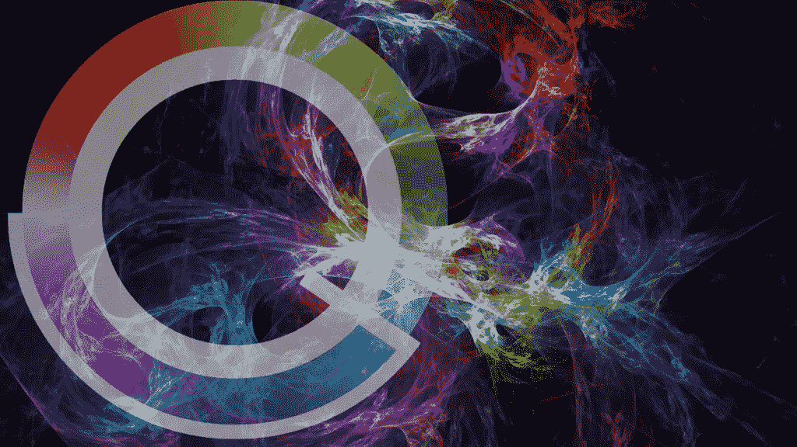
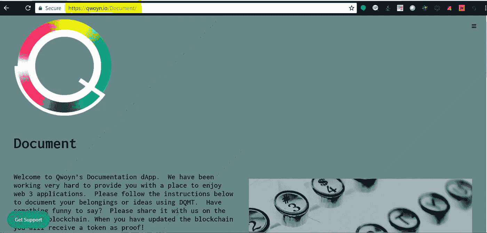
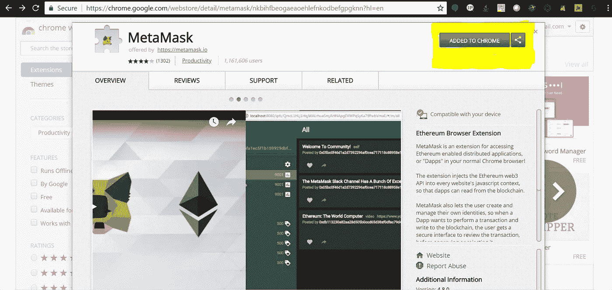
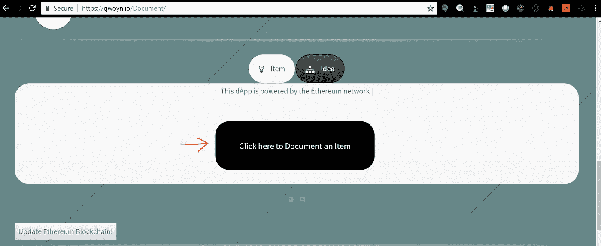
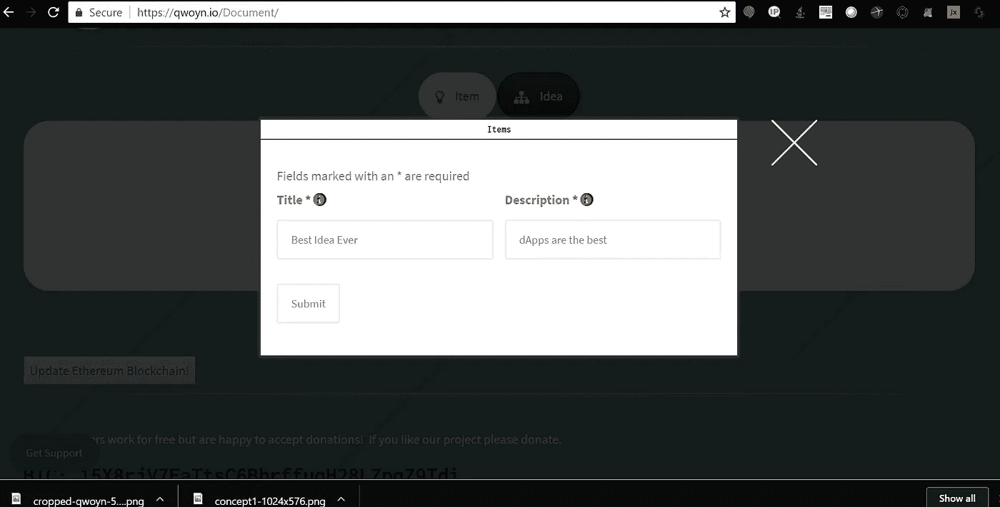
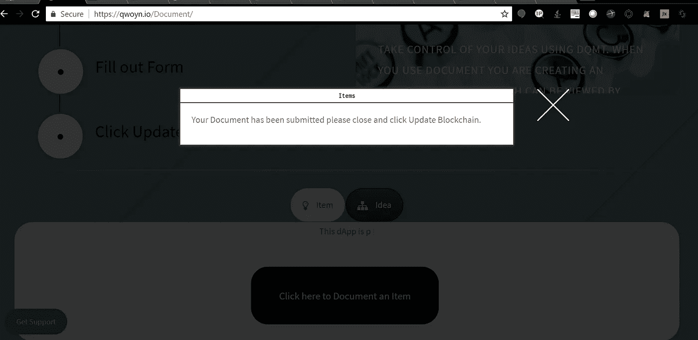
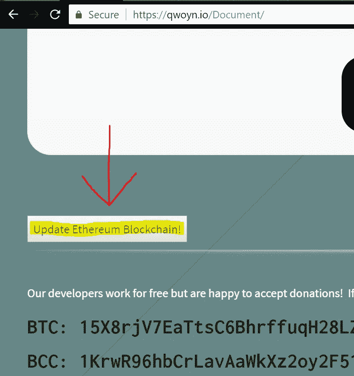
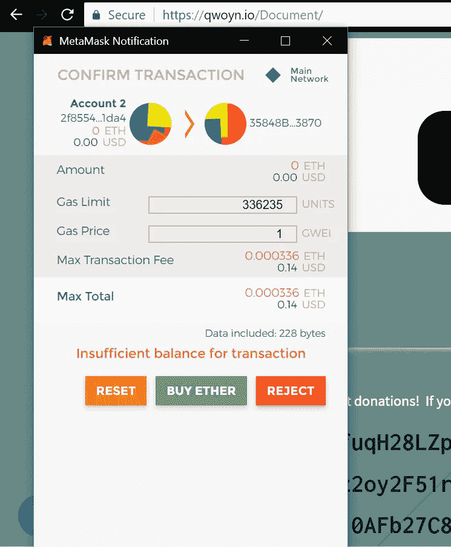
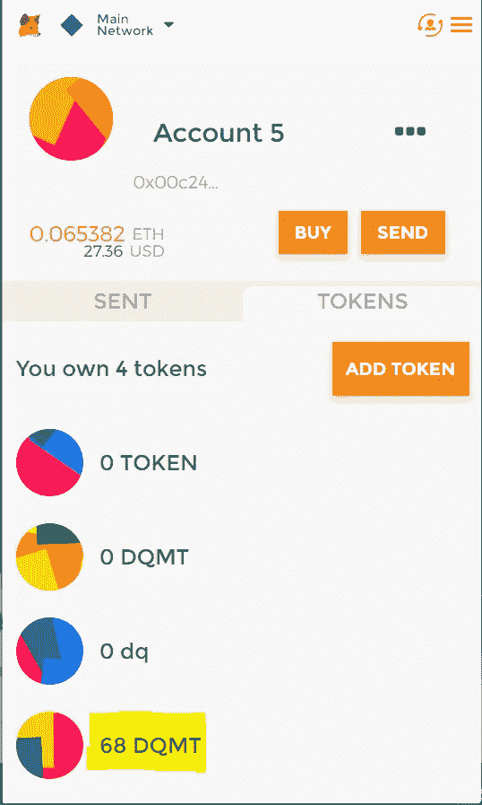

# 如何使用 Document(DQMT)——ERC 721 不可替代的令牌生成器和区块链文档工具。

> 原文：<https://medium.com/coinmonks/how-to-use-document-dqmt-an-erc721-non-fungible-token-generator-and-blockchain-documentation-6a9122764b3b?source=collection_archive---------11----------------------->

丹·皮特曼

大家好，我的 [dApp](http://qwoyn.io/document) 在 [www.etherscan.io](http://etherscan.io) 上获得 erc721 代币排名世界第 10。以太网上不可替换令牌的概念非常新，在区块链上像我这样的 dApps 并不多见。

被验证并且在 etherscan 前 10 是什么意思？Etherscan.io 是人们探索区块链、与应用程序互动、查看 dApp 信息和寻找项目价值等的主要场所。如果有人在这个名单上，他们基本上是保证宣传和活跃用户。这是一件大事，可以让任何人更上一层楼。

我知道所有这些 web3，区块链，分散应用程序的东西对你们大多数人来说是陌生的，但它正日益成为主流，在我的朋友和读者的帮助下，也许我可以创建一个成功的软件公司。

想帮忙吗？如果我能让一些朋友/读者创建令牌并互相发送，我们可以将文档移动到 etherscan.io 上的前 3 名。我对令牌不收取任何费用，以太坊虚拟机(EVM)只要求少量的“汽油”，每个令牌大约 13 美分。

它是如何工作的？你需要使用装有谷歌浏览器的笔记本电脑或台式机。

1.  当你使用浏览器进入[https://www.qwoyn.io/Document](https://qwoyn.io/Document)时，你会收到一条错误信息。此消息要求您安装 metamask chrome 扩展。(Metamask 是一个以太坊钱包，它会将 web3 注入到你的浏览器中，并允许你与所有以太坊 dApps 进行交互)。
    请安装 metamask 扩展，安装后点击它，然后按照步骤创建一个新帐户。一旦您创建了一个帐户，您就可以使用该应用程序。
2.  接下来重新加载网页并向下滚动。您将看到一个带有“记录项目”按钮的框。当你点击这个按钮时，一个表格将会打开。
3.  只需填写表单，单击提交并关闭成功消息。这将带您回到 dApp 页面。
4.  在您按下打开表格的按钮下方，您会看到另一个按钮“更新区块链理工大学”。当您点击此按钮时，metamask 将打开并询问您是否要提交。
5.  如果您选择提交，交易将被签署并发送到区块链。如果您想在 [www.etherescan.io.](https://l.facebook.com/l.php?u=http%3A%2F%2Fwww.etherescan.io%2F&h=AT379wc3Qe32R-EGPI9Nuvsd8QpxvRfb5tVajGkZ_ucVJ_lJV5FCoYrLcO3Sl2dLFTD9RhldfidyE2swDS8wzpwnGFb9F5YOFDjhHXYpAw9yaFyHkgJxMgT9F3Kny9R5SYgblgeZCvCuTmJ-NMVcbxBtiFO5ErRG6hY) 上查看进度，您还会收到一个交易 ID
6.  几分钟后，交易通过验证后，您将收到一个令牌，其中包含您在表格中提供的信息。

我知道这些说明看起来很长，但实际上这是非常容易使用的，除了元蒙版部分的大部分应该是熟悉的。这里有一些这个过程的照片。

Visit [https://qwoyn.io/Document](http://qwoyn.io/Document)

Install [Metamask](https://chrome.google.com/webstore/detail/metamask/nkbihfbeogaeaoehlefnkodbefgpgknn?hl=en)

[Click to Document an Item](https://qwoyn.io/Document/)

Fill out Form and click submit

Close this message

Update blockchain

Submit or Reject Transaction

DQMT in Wallet, add token button on right if you don’t see your token.

如果一切顺利，您应该在 metamask 中看到类似的内容。不要忘记添加地址为 0x 35848 B4 eab 8 f 946 ca 7774 C5 a5e 2c 14 ceae 5c 3870 的令牌

基本上，你 1)访问我的网站，2)点击一个按钮填写表格，然后 3)点击另一个按钮提交信息，这是每个人每天都在做的事情。

同样，如果我能让我的朋友和读者创建一些令牌并四处发送，给这篇文章很多掌声，在 twitter，facebook 等上分享它…也许我能在加密世界上升到一个新的水平。感谢阅读。向我提问吧！

我们的开发人员免费工作，但很高兴接受捐赠！如果你喜欢我们的项目，请捐赠。

# BTC:15 x8 rjv 7 eatts C6 bhrffuqh 28 lzpqz 9 TDI

# 密件抄送:1 krwr 96 hbcrlavaawkxz 2 oy 2f 51 ryohme 1

# ETH:0x 00c 24 b 3346 AFC 5c 3710 AFB 27 c 86431 ebb 5 ce 8163