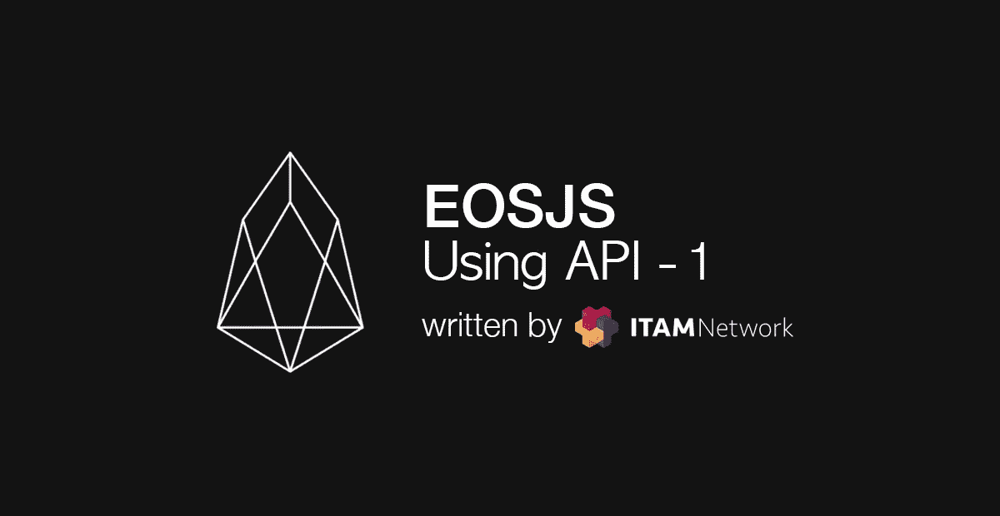
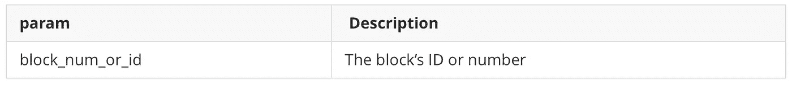
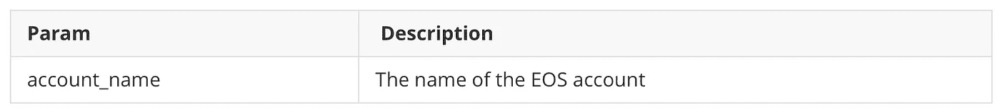
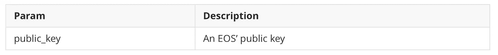
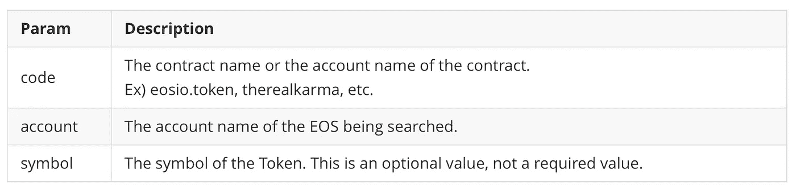
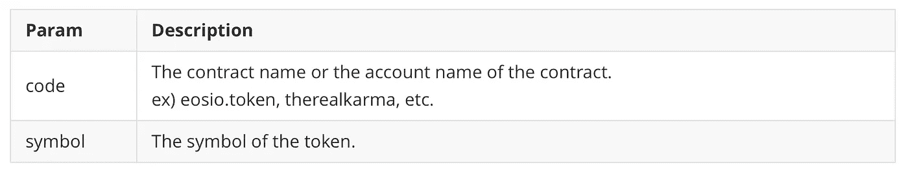

# 如何使用 EOSJS API (1)

> 原文：<https://medium.com/coinmonks/how-to-use-eosjs-api-1-770b037b22ad?source=collection_archive---------5----------------------->

## 通过 5 个常用 API 学习 EOSJS



你好，我是 ITAM 电视网的董军·权。在之前一篇关于“EOSJS 入门”的文章中，我们讨论了如何使用 EOSJS。在本帖中，我们将回顾 EOSJS 上常用的 API，并对它们进行测试。

> 点击[此处](https://github.com/EOSIO/eosjs-api/blob/master/docs/api.md#eos--object)查看 API 列表

# **准备**

我们将提供所有代码供使用。为了使其可用，需要进行准备。准备工作如下:

1.  节点. js
2.  EOSJS

请安装以上两个，并将以下内容放在 javascript 文件的顶部。

完成这些之后，编写下面的 api 示例，并使用 node.js 运行 javascript 来获取值。

> 因为每个 BP 端点具有不同的速度和/或可靠性，我们建议您使用最适合您的 BP。

# getBlock(blockNumOrId)

用于携带适用块的信息。

## 参数



## 密码

## 结果

```
{ timestamp: '2018-06-08T08:08:08.500',
  producer: '',
  confirmed: 1,
  previous:
   '0000000000000000000000000000000000000000000000000000000000000000',
  transaction_mroot:
   '0000000000000000000000000000000000000000000000000000000000000000',
  action_mroot:
   'aca376f206b8fc25a6ed44dbdc66547c36c6c33e3a119ffbeaef943642f0e906',
  schedule_version: 0,
  new_producers: null,
  header_extensions: [],
  producer_signature:
   'SIG_K1_111111111111111111111111111111111111111111111111111111111111111116uk5ne',
  transactions: [],
  block_extensions: [],
  id:
   '00000001405147477ab2f5f51cda427b638191c66d2c59aa392d5c2c98076cb0',
  block_num: 1,
  ref_block_prefix: 4126519930 }
```

要查看适用块中发生的活动，请查看事务。要查看事务，请执行以下操作:

如果您使用上面的值来查看事务，就会看到一些操作。通过查看行动，您可以更深入地了解发生的活动。

# getAccount(accountName)

用于获取 EOS 帐户的信息。

## 参数



## 密码

## 结果

```
{ account_name: 'itamnetwork1',
  head_block_num: 8516805,
  head_block_time: '2018-07-30T07:34:52.500',
  privileged: false,
  last_code_update: '1970-01-01T00:00:00.000',
  created: '2018-07-09T02:24:58.500',
  core_liquid_balance: '12.6131 EOS',
  ram_quota: 14976,
  net_weight: 201000,
  cpu_weight: 10401000,
  net_limit: { used: 1679786, available: 11108657, max: 12788443 },
  cpu_limit: { used: 7950353, available: 6356380, max: 14306733 },
  ram_usage: 10934,
  permissions:
   [ { perm_name: 'active', parent: 'owner', required_auth: [Object] },
     { perm_name: 'owner', parent: '', required_auth: [Object] } ],
  total_resources:
   { owner: 'itamnetwork1',
     net_weight: '20.1000 EOS',
     cpu_weight: '1040.1000 EOS',
     ram_bytes: 14976 },
  self_delegated_bandwidth:
   { from: 'itamnetwork1',
     to: 'itamnetwork1',
     net_weight: '0.1000 EOS',
     cpu_weight: '0.1000 EOS' },
  refund_request: null,
  voter_info:
   { owner: 'itamnetwork1',
     proxy: '',
     producers: [],
     staked: 4000,
     last_vote_weight: '0.00000000000000000',
     proxied_vote_weight: '0.00000000000000000',
     is_proxy: 0 } }
```

我来解释一下上面的一些结果值。

1.  **account_name:** 大家可能都已经知道了，这是 EOS 账户名。
2.  **ram_quota:** 我持有的 ram 的数量，以字节为单位。
3.  **net_limit:** 一个账户的净值、可用净值、已用净值的总量，以字节为单位。
4.  **cpu_limit:** 一个账户的 cpu 总量，可用 CPU，已用 CPU，以美制计量。
5.  **ram_usage:** 账户使用的 ram 量，以字节为单位。
6.  **total_resources:** 分配给我的资源 EOS。
7.  **self _ delegated _ bandwidth:**我委托给自己的信息。
8.  **voter_info:** 关于投票的信息。请注意“下注”部分，它显示了我下注的金额。更确切地说，是包括我委托给自己的和别人委托给自己的价值。

# getKeyAccounts(publicKey)

获取公钥的帐户。

## 参数



## 密码

## 结果

```
{ account_names: [ 'itamnetwork1' ] }
```

使用一个 EOS 公钥可以创建多个帐户。这就是 account_name 的值是字符串形式的数组的原因。

# getCurrencyBalance(代码、帐户、符号)

获取对应于代码符号的标记。

## 参数



## 密码

## 结果

```
[ '12.6131 EOS' ]
```

如果您查看结果值，您可以看到一个字符串形式的数组。这是因为帐户中可能有许多不同符号的代币。在 EOS testnet，Jungle Net 上，如果你搜索 eosio.token 不包括 symbol，你可以看到 2 个 token。

# getCurrencyStats(代码，符号)

获取符号的令牌信息。

## 参数



## 密码

## 结果

```
{ EOS:
   { supply: '1006148640.3388 EOS',
     max_supply: '10000000000.0000 EOS',
     issuer: 'eosio' } }
```

以下是结果值的描述。

1.  **供给:**当前供给的令牌数。
2.  **max_supply:** 代币总数。
3.  **发行人:**发行人

# **结论**

我们讨论了 5 个最常用的 EOSJS APIs。还有很多 API 我们还没有介绍，我计划在以后的文章中介绍这些。谢谢你。

订阅 ITAM 网络，接收最新信息。

访问 ITAM 网络电讯，就 ITAM 网络和区块链进行交流。点击下面的链接加入！

网址:**[https://itam . games](https://itam.games/en)电报:[https://t.me/itamgames](https://t.me/itamgames)**