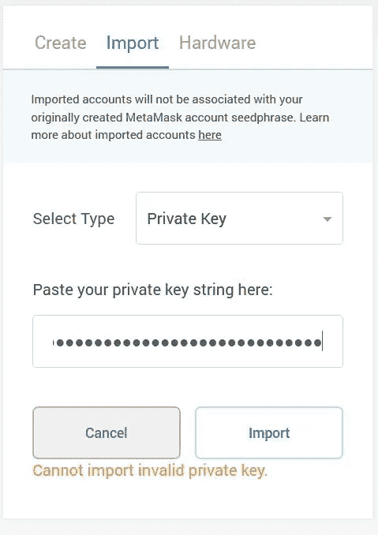

# 如何为 Uniswap 使用元掩码-第一部分

> 原文：<https://medium.com/coinmonks/how-to-use-metamask-for-uniswap-part-i-175db7000233?source=collection_archive---------2----------------------->

MetaMask 是一个浏览器插件，被用作以太坊钱包。在这个三篇文章系列的第一篇文章中，我们将关注 MetaMask 的安装、将钱包导入 MetaMask 以及您可以使用这个平台完成的各种活动。

MetaMask 是一个浏览器扩展，允许用户运行 [dApps](https://blog.coincodecap.com/what-are-dapps-an-ultimate-guide) ，而不作为以太坊节点成为以太坊网络的一部分。很多浏览器都支持 MetaMask，比如 Google Chrome 和 Firefox。它现在也适用于 Android 和 iOS 手机。

MetaMask 管理您的以太坊钱包。您可以在 MetaMask 钱包中存储以太和其他 ERC-20 令牌，并可以与分散式应用程序(dApps)进行交互。

## **安装指南(火狐浏览器)**

从下载页面下载应用程序。

我们正在 Firefox 浏览器上安装[元掩码](https://metamask.io/)。

点击**为 Firefox 安装 meta mask**选项。您将被重定向到一个新的[页面](https://addons.mozilla.org/en-US/firefox/addon/ether-metamask/)，允许您将 MetaMask 插件嵌入 Firefox 浏览器。

点击**添加到 Firefox** 。然后它会显示一条警告消息。

选择**添加**按钮。现在你可以在 Firefox 扩展上看到一个 MetaMask 图标。

## **创建钱包**

选择**创建钱包**选项卡。应用程序现在会要求您设置密码。

一旦密码设置完成，它将显示您的 12 字备份短语。记下备份短语并妥善保管。

应用程序将要求您验证备份短语，验证成功后，您的钱包设置就完成了。

**进口钱包**

有两种方法可以导入元掩码 wallet。

*   通过提供关键细节来启动应用程序。
*   从**我的账户**导入账户选项。

它会要求您提供私钥。提供正确的细节，你就可以进去了。

钱包现已连接。您可以在登录页面(“资产”选项卡)上查看您的令牌详细信息。**活动标签**包含您交易状态的详细信息。

## **购买**

购买选项可以让你在钱包里存放乙醚。您会发现三种不同的存款方法:

## **1。直接存放乙醚**

可以分享自己的公众号或二维码领取乙醚。

1.  **与 Wyre 一起购买 ETH**

Wyre 允许用户使用借记卡或信用卡购买任何代币。

## **2。在 CoinSwitch 上购买**

CoinSwitch 允许您兑换 300 多种加密货币。只需选择输入和输出令牌类型以及输入令牌数量。然后将自动显示输出代币金额。

**发送**

您可以使用此选项向其他用户发送令牌。您也可以将代币转移到您的其他帐户中。

## **添加令牌**

通过转到此选项卡，您可以添加任何 ERC-20 令牌或自定义令牌。只需搜索所需的令牌并点击**添加令牌。**

您可以通过提供令牌的**契约地址**来添加任何**自定义令牌**。你可以从[以太扫描](https://etherscan.io/)获得一个令牌合约地址。

请看下面我们如何添加 TOMOE 令牌的截图。

您现在可以在帐户中看到这两个令牌(DAI，TOMOE)。

**账户明细**

在该选项卡中，您可以检查以下内容:

*   你的公开演讲
*   私人密钥
*   来自以太网扫描的交易详情

您也可以从该选项卡重命名您的帐户名。

**连接硬件钱包**

您可以将您的分类帐或 Trezor wallet 连接到 MetaMask wallet。

## **网络**

您可以通过 MetaMask 连接不同的网络。如您所见，不同的网络显示在您的 MetaMask 钱包中。默认情况下，选择主以太网。

部署最近的代码变更(dApps、项目等)需要这个测试网。)在主以太坊网络上启动它之前。Testnet ETH 不涉及任何真金白银。因此，它有助于发展中社区在金钱介入之前纠正问题，如果有的话。

让我们来看看元掩码钱包中的这些网络:

1.  Ropsten 测试网

Ropsten 是唯一一个非常类似以太坊的工作验证测试网区块链。它允许区块链开发公司在现场测试他们的工作，但不需要真实的 ETH 和 main-net 2KEY 令牌。

**2。科万测试网**

这是一个权威证明网络。它仅在奇偶校验客户端上运行，具有 4 秒的数据块时间。

**3。林克比测试网**

Rinkeby 是以太坊的一个公共测试网，它使用授权证明。它是由 Geth 团队发起的，有 15 秒的阻塞时间。(id=4)

**4。格利测试网**

Goerli 是以太坊的 POA 公共测试网。它与 Geth 和奇偶校验客户端兼容，具有 15 秒的块时间。(id=6)

**5。本地主机 8545**

Localhost 8545 允许您连接私有以太网。在专用网络中，节点不连接到主网络节点或测试网络节点。

专用网络需要非常少的本地磁盘存储，并且可以在不实际用真金白银购买 ETH 的情况下运行。这对于即时测试非常有用。

**6。自定义 RPC**

在所有这些网络中，从普通用户的角度来看，自定义 RPC 非常重要，因为它允许您与其他链连接。

元掩码允许用户通过提供少量细节来设置自定义 RPC。

**示例**:您可以通过 MetaMask 按照以下步骤连接币安智能链。

选择**自定义 RPC** 选项，将会打开**设置选项卡**并要求您提供一些详细信息。

点击**保存**。现在您可以在网络列表中看到币安智能链。

## **设置**

“设置”选项卡允许您执行各种与设置相关的任务，如货币和语言选择、元掩码版本、种子短语详细信息、网络详细信息等。

在本文中，我们已经详细解释了 MetaMask 平台。我们将在下一篇文章中继续探讨如何将 MetaMask 与 Uniswap 链接起来并执行事务。

**资源:** Metamask 官方[网站](https://metamask.io/)

***注:*** *本帖首发* [*这里*](https://www.altcoinbuzz.io/bitcoin-and-crypto-guide/how-to-use-metamask-for-uniswap-part-i/) *上*[***altcoinbuzz . io***](http://www.altcoinbuzz.io/)*。*

**通过我的推荐加入**

[Crypto.com](https://binance.com/en/register?ref=E8PCD3AF)——[币安](https://platinum.crypto.com/r/sut3pd9bzn)

**跟我来**

**👉** [推特](https://twitter.com/rumadas123)

**👉**[**Linkedin**](https://www.linkedin.com/in/ruma-das-a1439320/)