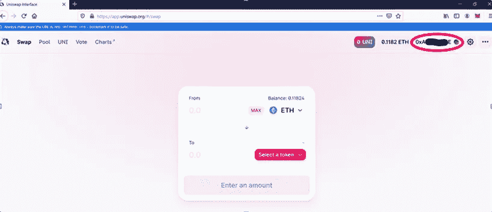

# 如何为 Uniswap 使用元掩码—第二部分

> 原文：<https://medium.com/coinmonks/how-to-use-metamask-for-uniswap-part-ii-c6bd712696bf?source=collection_archive---------1----------------------->

MetaMask 是一个浏览器插件，被用作以太坊钱包。在这三篇文章系列的第二篇文章中，我们将重点讨论如何将元掩码与 Uniswap 集成并执行令牌交换。

在我们的上一篇文章中([本系列的第一部分](https://ruma-das.medium.com/how-to-use-metamask-for-uniswap-part-i-175db7000233))，我们已经解释了如何安装 MetaMask、创建和导入钱包，并提供了所支持特性的细节。在本文中，我们将解释如何将 MetaMask 钱包与 Uniswap 连接并执行交易。

Uniswap 是一个分散的交易所，允许用户使用任何加密对进行交易。许多新项目现在直接在 Uniswap 上启动。Uniswap(与 MetaMask 配对)是一个强大的去中心化交换。

## **MetaMask 钱包与 Uniswap 的连接设置**

访问 Uniswap 网站。

点击**启动应用**按钮。您将被重定向到另一个[页面](https://app.uniswap.org/#/swap)。

在开始任何过程之前，你必须连接你的钱包。点击**连接到钱包**按钮。

它会给你一个要连接的钱包列表。选择**元掩码**。MetaMask 应用程序将会出现，并要求您提供钱包凭据。请提供正确的详细信息。

**注意:**我们已经在之前的[文章](https://ruma-das.medium.com/how-to-use-metamask-for-uniswap-part-i-175db7000233)中解释了如何设置元掩码钱包。如果您尚未设置元掩码 wallet，请参考它。

一旦连接成功，您将能够看到您的帐户详情。

现在，该应用程序将请求您允许将您的帐户连接到 Uniswap 网站。

点击**连接**建立连接。

然后，您的钱包将连接到 Uniswap 网站。

Uniswap 主要支持两个主要功能:

*   互换
*   泳池

在本文中，我们将只关注交换特性。

## **互换**

默认情况下，您位于交换页面。顾名思义，你可以在这里交换代币。只需选择输入和输出令牌以及输入令牌值。 **Max 按钮**允许您交换您的全部代币价值。系统将自动计算结果输出令牌值。

**注意:**如果你在交易一个新的对，系统会先批准这个对，然后让你互换。

您还可以通过**编辑选项卡**自定义燃气费，加快交易处理速度。

调整您的交易参数后，选择**确认按钮**。系统已提交您的交换对进行审批。可以看到**待定状态图标**和**批准按钮**。请看下面的截图。

如果您想检查您的交换操作的状态，只需点击**未决按钮**，一个包含您的交易的窗口将会出现。

如果您点击交易，即点击 **Approve BAT** ，您将被重定向至 etherscan，在此您可以检查您的交换对批准状态。

系统已批准交换对。您现在可以继续进行**交换**。

点击**交换按钮**，它会要求您确认。

一旦您点击 Uniswap 上的**确认交换**按钮，MetaMask 应用程序将打开并显示交易所需的油费。点击**确认**并提交您的交易。

## **滑移公差**

如果在交易过程中价格发生变化，Uniswap 让用户有权预先选择他们可以处理的价格波动。这种价格波动被称为滑点公差。Uniswap 用百分比表示。

在本系列的第三部分中，我们将介绍池特性和 UNI 令牌的效用。

***注:*** *本帖首发* [*此处*](https://www.altcoinbuzz.io/bitcoin-and-crypto-guide/how-to-use-metamask-for-uniswap-part-ii/) *上*[***altcoinbuzz . io***](http://www.altcoinbuzz.io/)*。*

**通过我的推荐加入**

Crypto.com——[T42](https://platinum.crypto.com/r/sut3pd9bzn)

跟我来

**👉** [推特](https://twitter.com/rumadas123)

**👉**[**Linkedin**](https://www.linkedin.com/in/ruma-das-a1439320/)