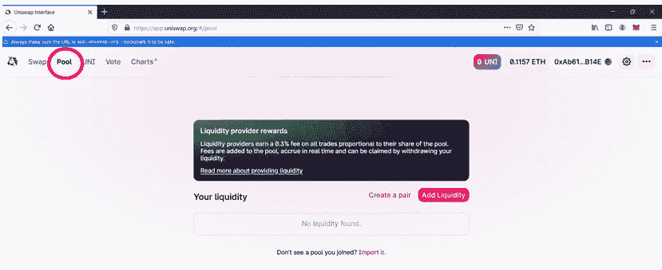
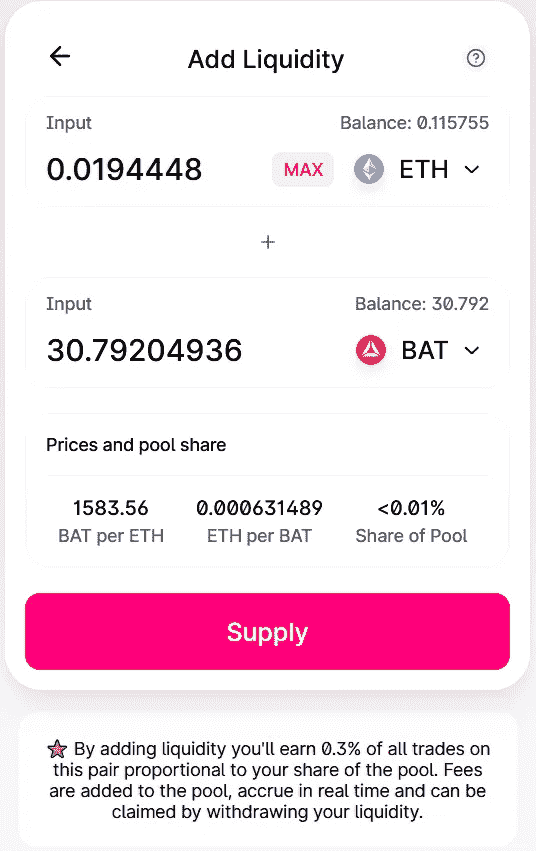
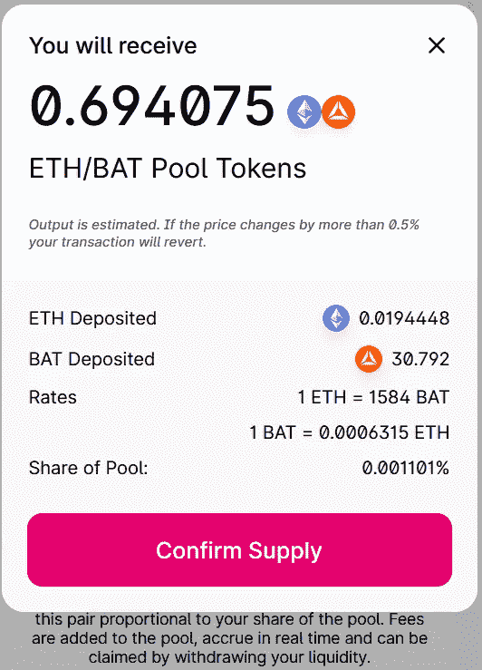
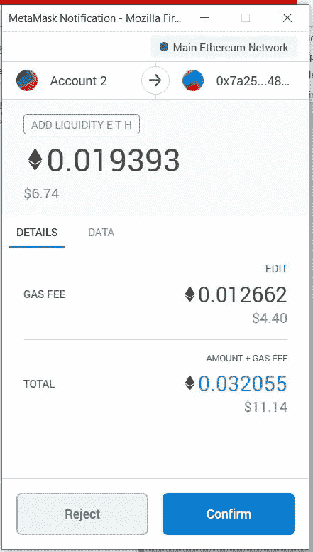
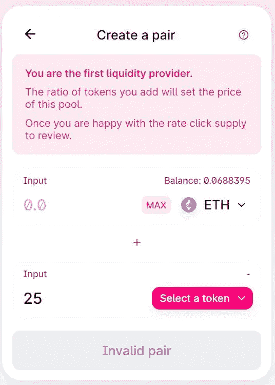
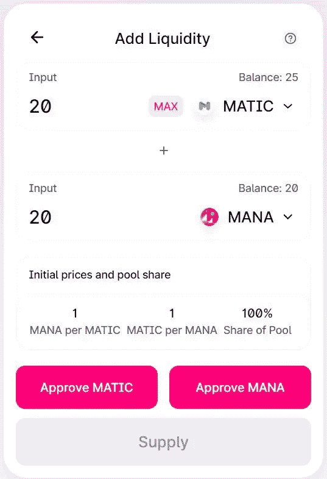
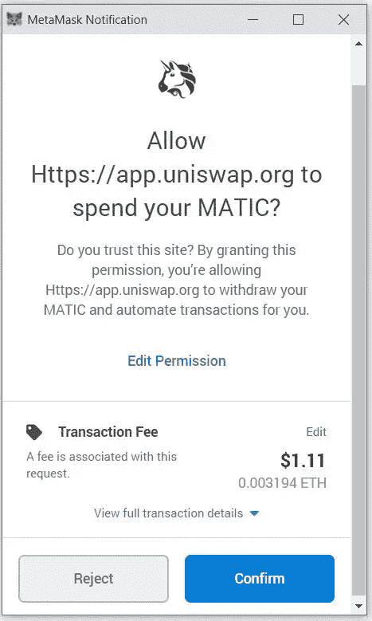
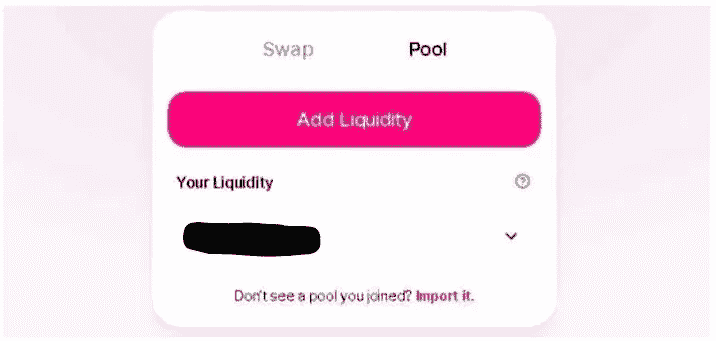
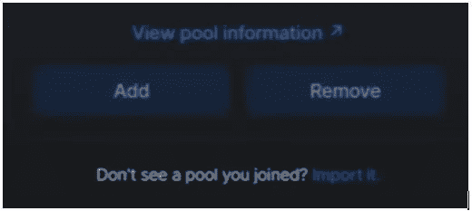
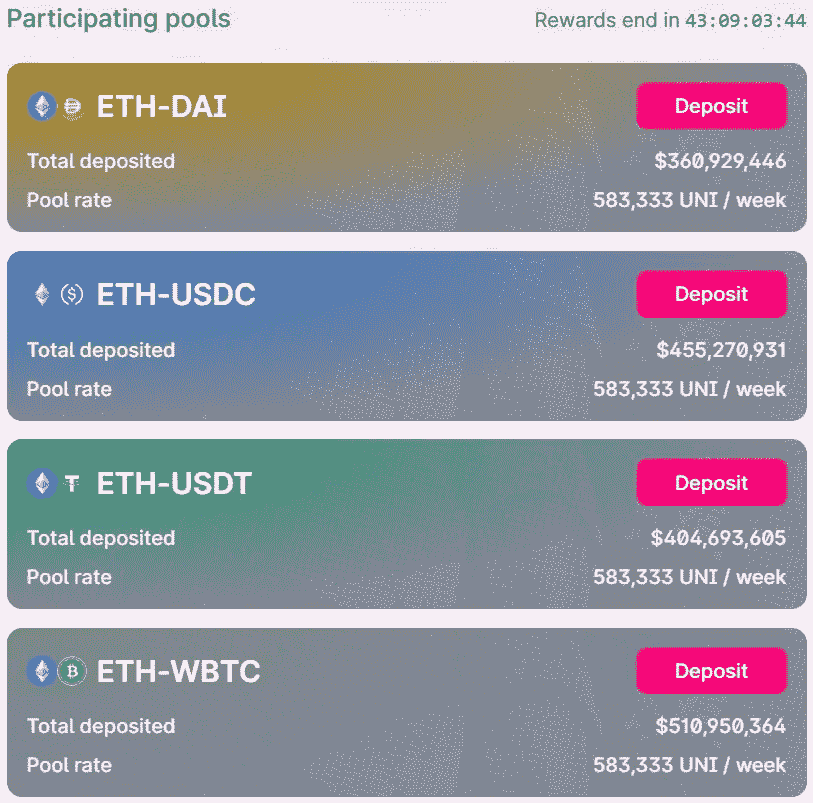

# 如何在 Uniswap 中使用元掩码—第三部分

> 原文：<https://medium.com/coinmonks/how-to-use-metamask-with-uniswap-part-iii-b819263b88f7?source=collection_archive---------0----------------------->

Uniswap 是最成功的 Defi 协议。它采用一种叫做“恒定产品做市商”的设计，而不是订单簿。在本文中，我们将重点介绍平台的池特性。

在本系列的前几篇文章中，我们已经解释了如何安装元掩码并进行整个平台演练([第一部分](https://ruma-das.medium.com/how-to-use-metamask-for-uniswap-part-i-175db7000233))，以及如何将元掩码与 Uniswap 连接并交换令牌([第二部分](https://ruma-das.medium.com/how-to-use-metamask-for-uniswap-part-ii-c6bd712696bf))。在本文中，我们将解释如何使用 Uniswap 的池和信息功能。

## **什么是流动性池？**

流动性池是由流动性提供商在 Uniswap 中创建的令牌池。作为回报，流动性提供者以交易费的形式获得回报。交易员利用这些资金池进行交易。

Uniswap 支持以太坊和其他 ERC20 令牌的智能合约。与依赖于订单簿的集中式交易所不同，Uniswap 基于一种叫做“恒定产品做市商”的设计。因此，当用户交易令牌时，令牌会立即从池中发送。因此，你不必等待买方/卖方，而不必担心价格波动。

您可以在新的代币流动性池中创建新的兑换对。Uniswap 不收取任何费用(以太坊燃气费除外)来创建新的一对。

## **如何添加流动性**

访问 Uniswap 网站并连接您的 MetaMask 钱包。现在点击**池**，一个新的[页面](https://app.uniswap.org/#/pool)将会打开。

点击**添加流动性按钮。**它会要求您选择令牌对。我们随机选择了 ETH 和 BAT 对。用户需要支付他们想要共享的两个令牌的等值。

因此，只需将您想要的值与一个令牌相对照，另一个令牌的值就会自动显示出来。

**重要提示:**uni swap 流动性池的两个令牌可以是 ETH 和 ERC20，也可以都是 ERC20 令牌。

Uniswap 还会显示您在池中的份额百分比。Uniswap 将按该比例分配奖励。

**重要提示:**如果手术过程中这双鞋的价格发生变化，Uniswap 会以新的价格向您展示一个亮点。

如果您点击**供应**，下一页将显示您的池令牌份额，并要求您**确认供应。**

**重要提示:**您将获得与池份额成比例的池令牌。而且你还会按你的份额比例赚取手续费。此外，你可以随时移除你的流动资金。

一旦确认，MetaMask 应用程序将打开，提到您的交易和所需的汽油费。

如果您对燃气费满意，那么点击**确认**。您的交易将被提交，您可以在 etherscan 上查看状态。

一旦您的交易成功，您将成为流动性提供者，并将从该流动性池中的每笔交易中获得流动性费用。

Uniswap 向交易商收取 0.3%的费用。该协议将其中一部分分配给流动性提供者。

## **创造一对**

如果您的配对不在现有 Uniswap 池列表中，您可以创建它。每当用户创建新的池对并向 Uniswap 流动性池捐款时，他们都会收到一个池令牌(ERC20 令牌)。

点击**创建一对**按钮。

它将要求您选择令牌对。

你必须批准魔法和魔法交易。在 MetaMask 中批准交易以给出最终确认。

**重要:**谨慎选择配对比例，平衡市场价格。

## **去除流动性**

您可以随时(部分或全部)移除您的流动性并释放您的代币。用户将收到一笔费用以及他们在此期间获得的代币。

要移除您现有的流动资金，请转到**池**选项卡，然后转到**您的流动资金**。选择您要移除的流动性。

点击**移除流动性**。然后确认移除和交易。

**重要提示:**您将无法获得与最初存款相同数量的代币。系统根据存款比率结算代币。

## 统一令牌

UNI 令牌是 UNI WAP 协议的本机治理令牌。它于 2020 年 9 月启动。UNI WAP 已经向任何在 9 月 1 日之前使用 UNI WAP 协议的用户空投了 400 个 UNI 令牌。

UNI 持有者可以参与 Uniswap 协议的治理，即任何更改、升级和改进。

用户还可以从 Uniswap liquidity mining 获得 UNI。Uniswap 目前支持四个流动性挖掘池，您可以参与其中，并且您将收到 UNI 令牌中的费用，而不是基础令牌对中的费用。

*   以太戴
*   USDC 联邦理工学院
*   USDT 联邦理工学院
*   WBTC 联邦理工学院

目前，UNI 令牌还没有合适的实用程序，但随着 Uniswap v3 的发布，我们可以期待在不久的将来会有一些额外的流动性挖掘池和令牌实用程序。

## **Uniswap 功能**

## **结论**

Uniswap 是一个强大的交换平台。我们已经看到了一种趋势，那就是人们从集中式交换转向 Uniswap。它提供了在任何 ERC20 对上交易的好处，还允许用户创建池。池已经开始取代 ico。Uniswap 目前面临的唯一大问题是可变的汽油费。此外，以太坊网络费用仍然是一个问题。

**资源:** Uniswap [网站](https://uniswap.org/)

***注:*** *本帖首发* [*此处*](https://www.altcoinbuzz.io/bitcoin-and-crypto-guide/how-to-use-metamask-with-uniswap-part-iii/) *上*[***altcoinbuzz . io***](http://www.altcoinbuzz.io/)*。*

**通过我的推荐加入**

[Crypto.com](https://binance.com/en/register?ref=E8PCD3AF)——[币安](https://platinum.crypto.com/r/sut3pd9bzn)

跟我来吧

**👉** [推特](https://twitter.com/rumadas123)

**👉**[**Linkedin**](https://www.linkedin.com/in/ruma-das-a1439320/)

> **加入 Coinmonks [电报频道](https://t.me/coincodecap)和 [Youtube 频道](https://www.youtube.com/c/coinmonks/videos)获取每日[加密新闻](http://coincodecap.com/)**

## **另外，阅读**

*   **[复制交易](/coinmonks/top-10-crypto-copy-trading-platforms-for-beginners-d0c37c7d698c) | [加密税务软件](/coinmonks/crypto-tax-software-ed4b4810e338)**
*   **[网格交易](https://coincodecap.com/grid-trading) | [加密硬件钱包](/coinmonks/the-best-cryptocurrency-hardware-wallets-of-2020-e28b1c124069)**
*   **[密码电报信号](http://Top 4 Telegram Channels for Crypto Traders) | [密码交易机器人](/coinmonks/crypto-trading-bot-c2ffce8acb2a)**
*   **[最佳加密交易所](/coinmonks/crypto-exchange-dd2f9d6f3769) | [印度最佳加密交易所](/coinmonks/bitcoin-exchange-in-india-7f1fe79715c9)**
*   **[开发者最佳加密 API](/coinmonks/best-crypto-apis-for-developers-5efe3a597a9f)**
*   **[最佳期货交易信号](https://coincodecap.com/futures-trading-signals) | [流动性交易所评论](https://coincodecap.com/liquid-exchange-review)**
*   **[火币加密交易信号](https://coincodecap.com/huobi-crypto-trading-signals) | [Swapzone 审查](/coinmonks/swapzone-review-crypto-exchange-data-aggregator-e0ad78e55ed7)**
*   **[最佳加密交易机器人](/coinmonks/crypto-trading-bot-c2ffce8acb2a) | [购买索拉纳](https://coincodecap.com/buy-solana) | [矩阵导出评论](https://coincodecap.com/matrixport-review)**
*   **[Coldcard 评论](https://coincodecap.com/coldcard-review) | [BOXtradEX 评论](https://coincodecap.com/boxtradex-review)|[uni swap 指南](https://coincodecap.com/uniswap)**
*   **[比特币基地评论](/coinmonks/coinbase-review-6ef4e0f56064) | [德里比特评论](/coinmonks/deribit-review-options-fees-apis-and-testnet-2ca16c4bbdb2) | [FTX 评论](/coinmonks/ftx-crypto-exchange-review-53664ac1198f)**
*   **[Coinmetro 评论](https://coincodecap.com/coinmetro-review) | [VirgoCX 评论](https://coincodecap.com/virgocx-review)**
*   **最佳[密码借贷平台](/coinmonks/top-5-crypto-lending-platforms-in-2020-that-you-need-to-know-a1b675cec3fa)**
*   **[免费加密信号](/coinmonks/free-crypto-signals-48b25e61a8da) |加密交易机器人**
*   **[杠杆代币](/coinmonks/leveraged-token-3f5257808b22)终极指南**