# 如何使用 StormX

> 原文：<https://medium.com/coinmonks/how-to-use-stormx-ca32c4e09b78?source=collection_archive---------0----------------------->

## StormX 是一个加密货币平台，为完成游戏化微任务的用户提供奖励。在本文中，我们将解释如何安装该应用程序并探索其各种功能。

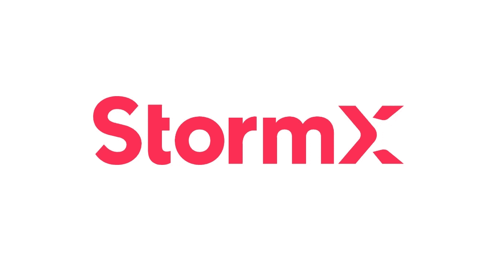

许多加密货币平台为其用户提供了额外的被动收入来源。如果你对区块链或加密货币完全陌生，不想拿你的血汗钱冒险，那么有一些平台可以让你赚到密码，并学习这个新世界的基础知识。更好的是，所有这些你都可以在日常购物中完成。

StormX 是一个平台，你可以通过完成简单的额外任务来赚取加密货币。

## **关于 StormX**

[StormX](https://stormx.io/) 是一家成立于 2014 年的加密货币公司。

该公司旨在通过创建一个广告市场来利用数字广告世界，该市场通过游戏化的微任务从任何地方、任何时间和任何设备上奖励用户。这些任务可以是简短的调查、尝试新产品和完成微观任务。

目前，该平台支持 500 多个顶级品牌。

## **StormX App**

StormX 平台提供了一个移动友好的应用程序，用户可以下载(Android 和 iOS)。

该应用程序使用一种称为 Bolts 的货币，用户可以在完成平台提供的任务后赚取该货币。螺栓可以用来提现风暴，比特币，或者以太坊，莱特币等。

用户可以通过以下任何方法使用应用程序并获得加密:

*   商店
*   玩
*   奖励

## **安装指南(手机版)**

在手机上下载[应用](https://play.google.com/store/apps/details?id=com.cakecodes.bitmaker)。

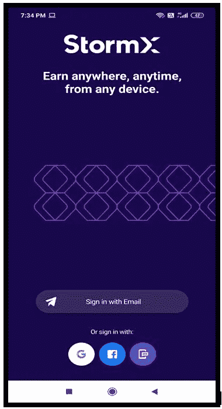

该应用程序将为您提供各种登录选项。

点击**使用电子邮件**登录，一封带有代码的验证电子邮件将发送到您的电子邮件地址。电子邮件验证后，该应用程序将被启动。登录页面将如下所示。

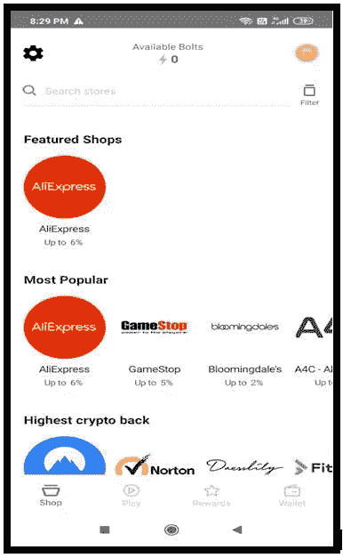

## **轮廓验证**

在继续之前，您必须通过提供您的名字、姓氏、昵称和电话号码等详细信息来验证您的个人资料。

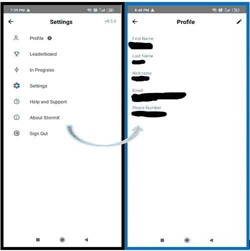

一旦你的个人资料得到验证，你就可以访问该平台。

现在让我们看看该应用程序提供了哪些不同的功能:

## **1。商店**

商店选项列出了平台支持的许多商店。还可以看到从这些列出的店铺购物后可以获得的返现/奖励。您可以更详细地查看应用于商店中不同类别产品的奖励分配。它还将列出所选网站的不同产品部分，这些奖励将不适用。

StormX 已经与数千家在线商店合作，并设计了一个浏览器扩展，让用户可以轻松获得加密奖励。

目前，StormShop 仅支持基于 Chromium 的浏览器，即 Chrome、Brave、Edge 等。该公司还计划在不久的将来发布其他浏览器的版本。

StormX 用户可以在网上购物时使用该选项**激活 crypto back** 或 Chrome 按钮。该按钮在后台运行，根据用户的会员级别和商店提供的优惠，用户奖励从 0.5%到 85%以上不等。

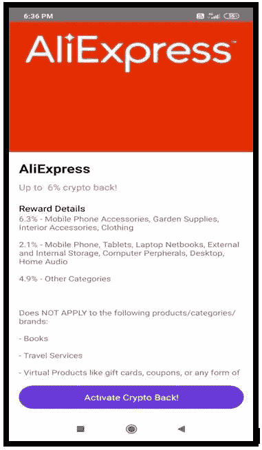

> 用户在 STORMX 中完成一项任务所获得的奖励积分被称为 BOLTS。可以用来提现 STORMX (STMX)、比特币(BTC)、以太坊(ETH)、莱特币(LTC)、戴(DAI)、向往。金融(YFI)。

**更新:**StormX 平台增加了大量的应用，你可以从**最近增加的**部分查看。它目前支持 74 种不同的产品类别。

## **2。播放**

游戏选项会给你各种各样的任务，你可以从中赚取螺栓。这些任务中的每一个都有一定数量的螺栓，在下面会提到。用户可以轻松完成这些活动，赚取。一个人可以很容易地将他获得的代币(螺栓)兑换成风暴币(STMX)、以太币(T8)、比特币(BTC)或莱特币(LTC)。

**更新:**用户现在可以看到他们从执行这些任务中可以赚取的最大金额。这些任务中的大多数都与安装应用程序有关，并且还需要其他先决条件，比如为新用户订阅。

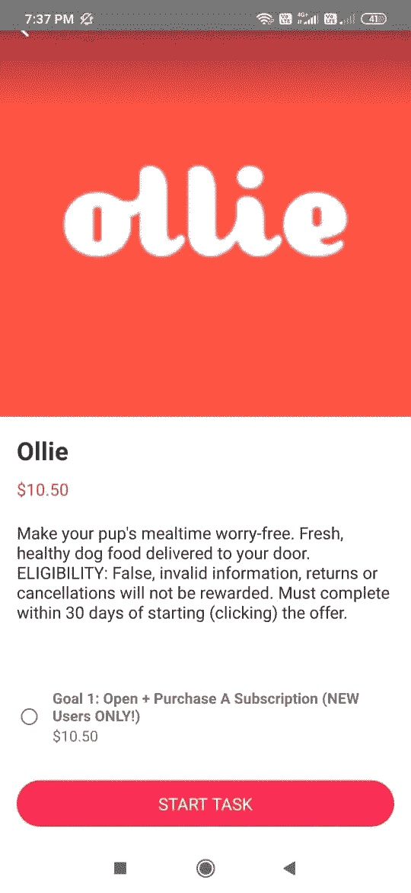

## **奖励**

奖励功能可以帮助您赚取更多，并提供某些其他好处。

要解锁更多奖励，您必须**成为会员**。

会员结构分为几个级别，每个级别都有不同的诱人的加密奖励和好处。

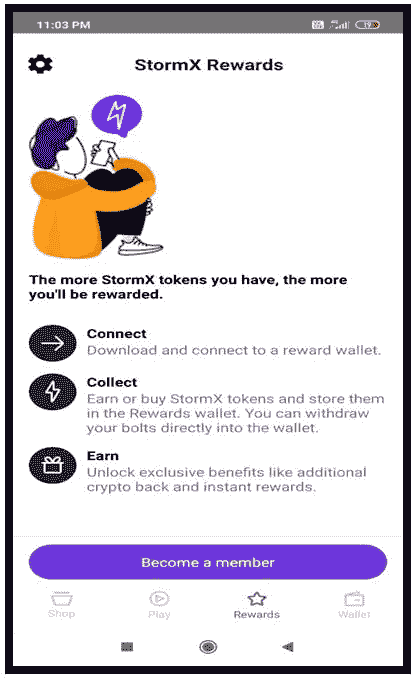

如果你想**成为会员**，你必须将你的钱包连接到 StormX 应用。

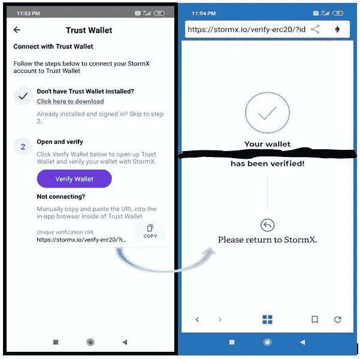

用户一旦链接钱包，就自动进入**紫色等级**。有不同的等级，每个等级都有不同的好处。

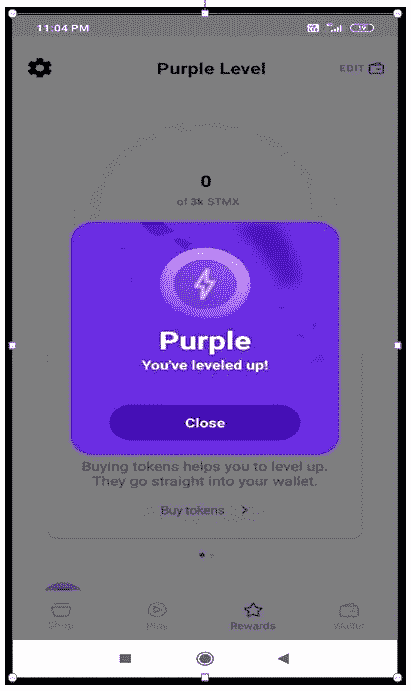

加密回馈奖励的百分比会随着时间和级别的增加而增加。

在更高的级别，如钻石和白金，该级别提供了奖励时间减少的好处。这一优势将减少用户接收奖励的等待时间。

## **购买(更新)**

一个主要的应用程序更新是，它现在支持以下平台，StormX 用户可以使用这些平台来购买/交换/存储 STMX 令牌:

*   加密交换(币安、UpBit、Bittrex)
*   钱包(信任钱包)
*   Swap (UniSwap、KyberSwap)
*   月供(维萨卡、万事达卡)

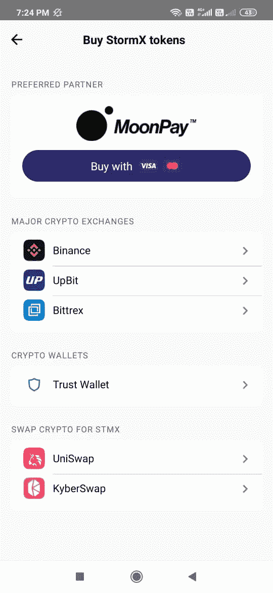

## **奖励等级和福利**

查看不同级别及其相关优势:

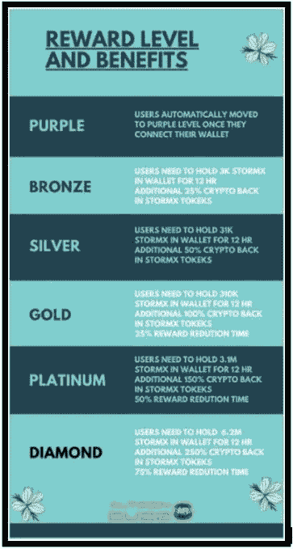

**更新:**每个会员阶段的奖励和福利，即每个级别的最低持有量和相关的时间表仍然相同。

但是，每个级别的返现更改为以下百分比:

*   **铜牌—** 5%加密返现。
*   **白银级—** 9%加密返现。
*   **黄金级—** 12%加密返现。
*   **白金卡—** 15%加密返现。
*   **钻石** — 21%加密返现。

## **钱包**

**钱包标签**显示用户的投资组合，包含以下详细信息:

*   保持平衡

您可以将赢取的代币转入比特币基地或其他电子钱包地址。只需点击**添加钱包**选项。目前，该平台支持任何 ERC20 兼容钱包。但对于比特币、以太坊和莱特币代币，只能向 CoinBase 账户支付。钱包地址将是用户的比特币基地帐户电子邮件。

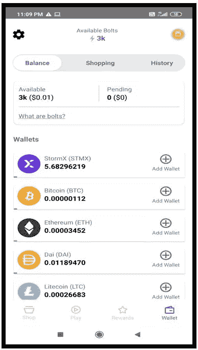

**更新:**通过最近的更新，您现在可以看到可用的美元余额，而不是螺栓，并且您通过完成这些调查获得的螺栓现在已替换为等量的美元。

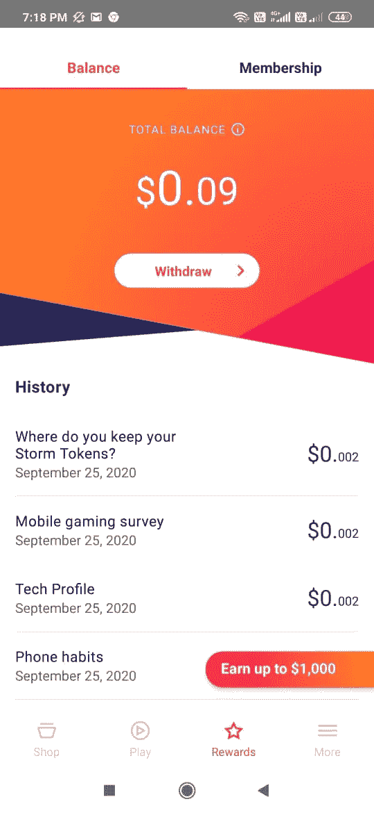

## **撤回(更新)**

“提取”选项卡允许您提取您赢得的代币。用户需要至少 0.80 美元才能在 StormX 中取款。

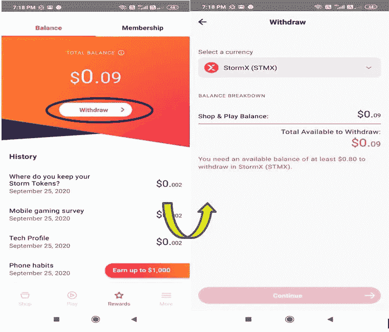

## **购物**

用户可以从该选项卡查看他们的购物历史。

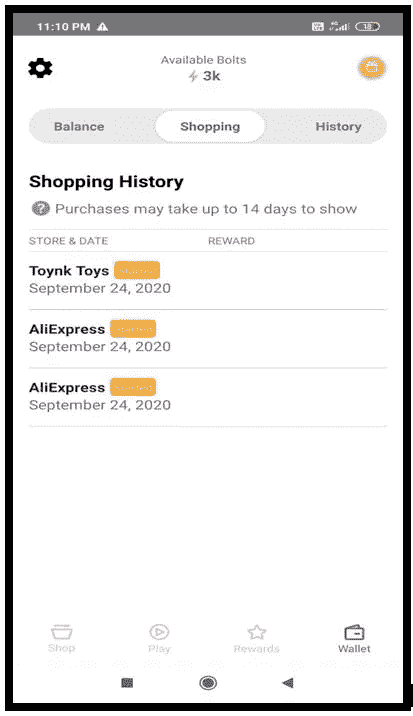

## **历史**

**历史选项卡**包含不同微任务获得的螺栓的详细信息。

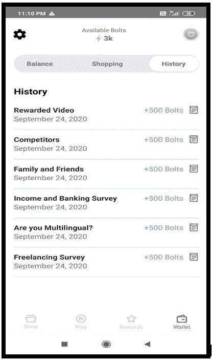

**更新:**更新后，购物和历史记录选项卡不存在。

## **断开钱包**

任何时候，用户都可以通过进入**编辑选项卡**来断开他们的钱包。

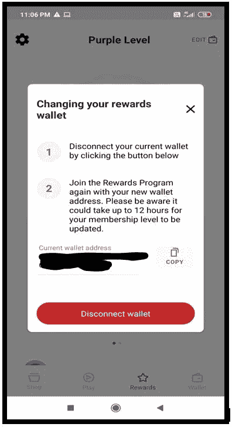

## **邀请好友**

你也可以从推荐中获得奖励。与您的朋友分享您的推荐代码，让他们加入 StormX 应用程序。

如果您想邀请您的朋友，只需点击**分享邀请代码**按钮。这将为你提供许多共享代码的选择，比如 WhatsApp、电子邮件、短信、Twitter、脸书等等。

而一旦你的朋友通过玩任务赚到 24K Bolts，你也会赚到 6000。

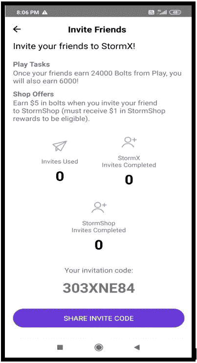

**重要:** *只有当你的朋友通过任务获得了 6000 弩箭，你才能获得。如果他/她通过推荐获得了 Bolts，则不会计入 24k。*

**更新:**用户现在邀请朋友加入平台，就可以赚钱，而不是螺栓。每个会员级别都提供不同的推荐奖励。

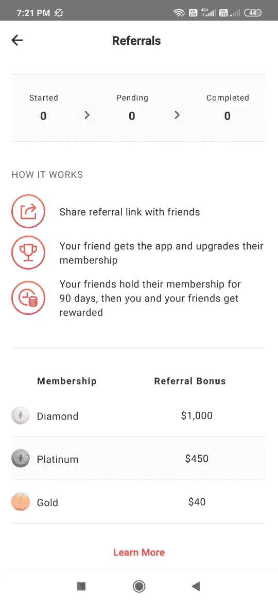

## **设置**

使用**设置选项卡**您无能为力。它只提供两个设置选项。

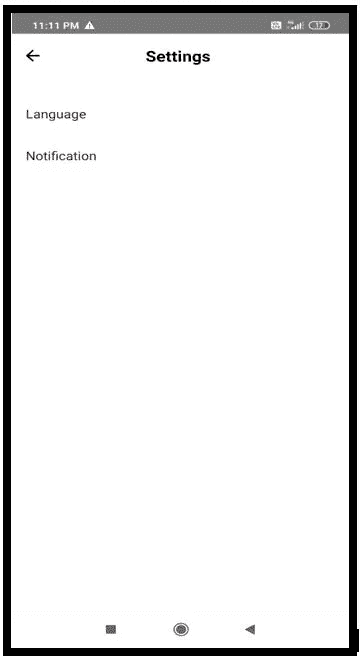

**社交场合**

[推特](https://twitter.com/stormxio)

[脸书](https://www.facebook.com/stormxio)

[网站](https://stormx.io/)

[电报](https://t.me/stormxapp)

[Reddit](https://www.reddit.com/r/stormxio/)

[YouTube](https://www.youtube.com/stormxio)

## **结论**

StormX 展示了一个基本但强大的用例——奖励。这对于第一次使用 crypto 并且不喜欢进入 crypto 的技术和复杂部分的大众来说是非常有吸引力的。该应用程序很容易理解，有很多选项。然而，我们觉得玩游戏和安装应用程序需要大量的努力，但回报与努力的比率相当低。这个应用程序对初学者来说很好。

**请注意，本文于 2020 年 10 月 11 日更新，包含了平台支持的最新功能。**

**资源:** [StormX 白皮书](https://assets.stormx.io/storm-token-whitepaper.pdf)

***注:*** *本帖首发* [*此处*](https://www.altcoinbuzz.io/bitcoin-and-crypto-guide/how-to-use-stormx/) *上*[***altcoinbuzz . io***](http://www.altcoinbuzz.io/)*。*

**通过我的推荐加入**

Crypto.com[币安](https://binance.com/en/register?ref=E8PCD3AF)——

跟我来

**👉** [推特](https://twitter.com/rumadas123)

**👉** [Linkedin](https://www.linkedin.com/in/ruma-das-a1439320/)

*   **包含附属链接**

> 加入 [Coinmonks 电报频道](https://t.me/coincodecap)，了解加密交易和投资

## 另外，阅读

*   [什么是融资融券交易](https://blog.coincodecap.com/margin-trading) | [成本平均法](https://blog.coincodecap.com/dca)
*   [3 商业评论](/coinmonks/3commas-review-an-excellent-crypto-trading-bot-2020-1313a58bec92) | [Pionex 评论](/coinmonks/pionex-review-exchange-with-crypto-trading-bot-1e459d0191ea) | [Coinrule 评论](/coinmonks/coinrule-review-2021-a-beginner-friendly-crypto-trading-bot-daf0504848ba)
*   [莱杰 vs n 格拉夫](/coinmonks/ledger-vs-ngrave-zero-7e40f0c1d694) | [莱杰纳诺 s vs x](/coinmonks/ledger-nano-s-vs-x-battery-hardware-price-storage-59a6663fe3b0) | [币安评论](/coinmonks/binance-review-ee10d3bf3b6e)
*   [Bybit Exchange 审查](/coinmonks/bybit-exchange-review-dbd570019b71) | [Bityard 审查](/coinmonks/bityard-review-7d104239be35) | [CoinSpot 审查](https://blog.coincodecap.com/coinspot-review)
*   [3 commas vs crypto hopper](/coinmonks/3commas-vs-pionex-vs-cryptohopper-best-crypto-bot-6a98d2baa203)|[赚取加密利息](/coinmonks/earn-crypto-interest-b10b810fdda3) | [网格交易机器人](https://blog.coincodecap.com/grid-trading)
*   最好的比特币[硬件钱包](/coinmonks/the-best-cryptocurrency-hardware-wallets-of-2020-e28b1c124069?source=friends_link&sk=324dd9ff8556ab578d71e7ad7658ad7c) | [BitBox02 回顾](/coinmonks/bitbox02-review-your-swiss-bitcoin-hardware-wallet-c36c88fff29)
*   [BlockFi vs 摄氏度](/coinmonks/blockfi-vs-celsius-vs-hodlnaut-8a1cc8c26630) | [Hodlnaut 点评](/coinmonks/hodlnaut-review-best-way-to-hodl-is-to-earn-interest-on-your-bitcoin-6658a8c19edf) | [KuCoin 点评](https://blog.coincodecap.com/kucoin-review)
*   [Bitsgap 评审](/coinmonks/bitsgap-review-a-crypto-trading-bot-that-makes-easy-money-a5d88a336df2) | [Quadency 评审](/coinmonks/quadency-review-a-crypto-trading-automation-platform-3068eaa374e1) | [Bitbns 评审](/coinmonks/bitbns-review-38256a07e161)
*   [加密复制交易平台](/coinmonks/top-10-crypto-copy-trading-platforms-for-beginners-d0c37c7d698c) | [Coinmama 审核](/coinmonks/coinmama-review-ace5641bde6e)
*   [印度比特币交易所](/coinmonks/bitcoin-exchange-in-india-7f1fe79715c9) | [比特币储蓄账户](/coinmonks/bitcoin-savings-account-e65b13f92451)
*   [CoinDCX 评论](/coinmonks/coindcx-review-8444db3621a2) | [加密保证金交易交易所](https://blog.coincodecap.com/crypto-margin-trading-exchanges)
*   [CoinLoan 评论](/coinmonks/coinloan-review-18128b9badc4) | [YouHodler 评论](/coinmonks/youhodler-4-easy-ways-to-make-money-98969b9689f2) | [BlockFi 评论](/coinmonks/blockfi-review-53096053c097)
*   最好的[加密税务软件](/coinmonks/best-crypto-tax-tool-for-my-money-72d4b430816b) | [硬币追踪评论](/coinmonks/cointracking-review-a-reliable-cryptocurrency-tax-software-5114e3eb5737)
*   最佳[加密借贷平台](/coinmonks/top-5-crypto-lending-platforms-in-2020-that-you-need-to-know-a1b675cec3fa) | [杠杆令牌](/coinmonks/leveraged-token-3f5257808b22)
*   最佳[加密制图工具](/coinmonks/what-are-the-best-charting-platforms-for-cryptocurrency-trading-85aade584d80) | [最佳加密交易所](/coinmonks/crypto-exchange-dd2f9d6f3769)
*   [如何在印度购买比特币？](/coinmonks/buy-bitcoin-in-india-feb50ddfef94) | [WazirX 审查](/coinmonks/wazirx-review-5c811b074f5b) | [HitBTC 审查](/coinmonks/hitbtc-review-c5143c5d53c2)
*   [WazirX vs coin dcx vs bit bns](/coinmonks/wazirx-vs-coindcx-vs-bitbns-149f4f19a2f1)|[block fi vs coin loan vs Nexo](/coinmonks/blockfi-vs-coinloan-vs-nexo-cb624635230d)
*   [本地比特币审核](/coinmonks/localbitcoins-review-6cc001c6ed56) | [加密货币储蓄账户](https://blog.coincodecap.com/cryptocurrency-savings-accounts)
*   [比特币基地评论](/coinmonks/coinbase-review-6ef4e0f56064) | [德里比特评论](/coinmonks/deribit-review-options-fees-apis-and-testnet-2ca16c4bbdb2) | [FTX 评论](/coinmonks/ftx-crypto-exchange-review-53664ac1198f)
*   [n 平均零点评审](/coinmonks/ngrave-zero-review-c465cf8307fc) | [Phemex 评审](/coinmonks/phemex-review-4cfba0b49e28) | [PrimeXBT 评审](/coinmonks/primexbt-review-88e0815be858)
*   最佳[区块链分析](https://bitquery.io/blog/best-blockchain-analysis-tools-and-software)工具| [赚比特币](/coinmonks/earn-bitcoin-6e8bd3c592d9) | [期货交易机器人](/coinmonks/futures-trading-bots-5a282ccee3f5)
*   [加密套利](/coinmonks/crypto-arbitrage-guide-how-to-make-money-as-a-beginner-62bfe5c868f6)指南| [如何做空比特币](/coinmonks/how-to-short-bitcoin-568a2d0b4ae5) | [Prokey 回顾](/coinmonks/prokey-review-26611173c13c)
*   [最佳加密交易信号电报](/coinmonks/best-crypto-signals-telegram-5785cdbc4b2b) | [MoonXBT 评论](/coinmonks/moonxbt-review-6e4ab26d037)
*   [Godex.io 审核](/coinmonks/godex-io-review-7366086519fb) | [邀请审核](/coinmonks/invity-review-70f3030c0502) | [BitForex 审核](/coinmonks/bitforex-review-c4bb28d9e271) | [OKEx 审核](/coinmonks/okex-review-6b369304110f)