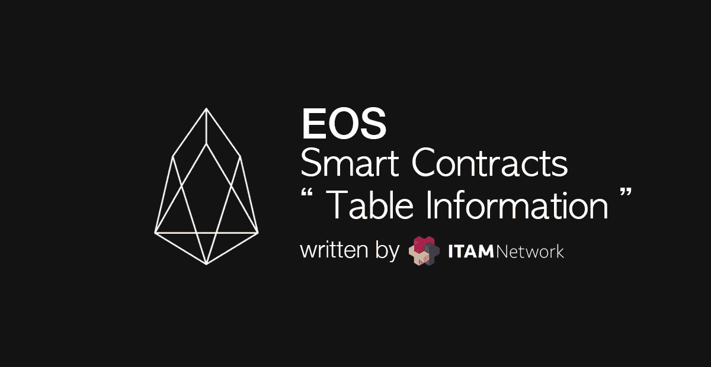
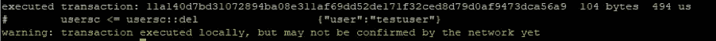
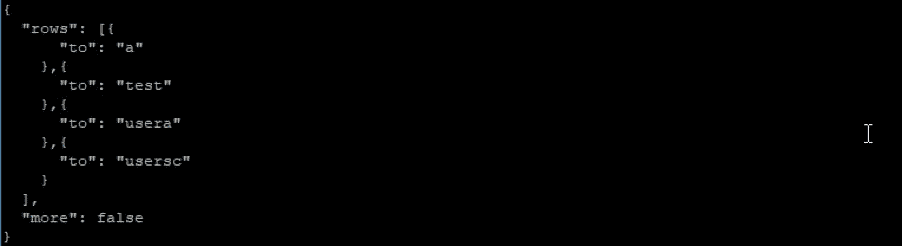
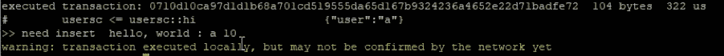

# 如何在 EOS 智能合同中使用表格信息

> 原文：<https://medium.com/coinmonks/how-to-use-table-information-on-eos-smart-contracts-de68f7231b62?source=collection_archive---------2----------------------->



在表中存储和处理信息的基本操作通常被称为“CRUD”，代表“创建”、“读取”、“更新”和“删除”。在 [**上一篇**](/coinmonks/using-table-on-eos-smart-contract-291f98312b80) 中，我们讨论了“创建”部分，所以我们将在这篇文章中讨论“读取”、“更新”和“删除”部分。一般来说，您需要为每个函数配置单独的表，但是我们将只使用上一个示例中的 *ttab* 表，这样我们就可以用最少的配置轻松地处理内容。

```
 auto iter=ttabs.find(user);
            if(iter==ttabs.end())
            {
                print("need insert\t"); 
                ttabs.emplace(_self,[&](auto& ttab)
                {
                    ttab.to = user;
                });
            }
            else
            {
                uint64_t getuser;
                getuser=iter->to;
                print("data already exist ",name{getuser}," \t");
            }
```

在前一个示例中，在 action hi 部分的 else 中添加了一个代码。在上面代码的第一行中搜索传递给 action hi 的用户名，如果没有检索到数据(意味着上面的代码为真)，则创建新数据。如果有检索到的数据，将该数据行的 to 字段。(else 语句上面的两行)。除此之外，还有 get()函数作为持久性 api，但是在你理解了这篇文章的整个流程之后，最好通过逐个扩展来了解它们。

如果您编译并上传合同，则按如下方式执行。

```
#cleos push action usersc hi ‘[“testuser”]’ -p usersc
```


因为 testuser 在上面的表中，所以要打印的是表中的 testuser，而不是动作数据中传递的数据。

若要删除数据，请添加一个操作。

```
void del(account_name user)
{}
```

该方法与前面示例中添加动作的方法相同。因为我们需要需要删除的用户名，所以获取一个帐户名作为参数。为了方便起见，我们将不检查从动作数据接收的用户名是否有效。

```
void del(account_name user)
{
    _ttab ttabs(_self,_self);
    auto iter=ttabs.find(user);
    if(iter!=ttabs.end())
    {
        ttabs.erase(iter);
    }
}
```

实现删除操作。

类似于我们使用 *create* 所做的，为第一行和第二行创建一个表的 *multi_index* 实例，找到接收到的用户信息，并将其分配给迭代器。

如果*的结果在第三行找到*的“if(iter！=ttabs.end())"不是最后一个，意味着有数据通过动作传递，

用“ttabs.erase(iter)”删除数据。使用 multi_index 实例的 erase()函数，通过传递要删除的迭代器来删除表中的信息。

如果在编译和运行合同之前查看该表，

```
# cleos get table usersc usersc ttab
```


您可以看到表中存在 testuser。

```
# cleos push action usersc del ‘[“testuser”]’ -p usersc
```

尝试运行协定并删除 testuser。



因为没有用于调试的打印语句，所以它结束时没有任何打印。



修改数据需要修改表。这是因为当前配置的表仅由一个字段组成，而该字段由一个主键组成，因此不能修改。

```
/// [@abi](http://twitter.com/abi) table edittab i64
struct edittab
{
    account_name to;
    string tstr;
    uint64_t primary_key() const {return to;}EOSLIB_SERIALIZE(edittab,(to)(tstr))
};typedef multi_index<N(edittab),edittab> _etab;
```

在上面创建的表信息下创建新的表信息。新表是一个名为 *edittab* 的表，它具有字符串信息 *tstr* ，并以账户信息*到*作为主键。因为我们将创建的表中没有任何信息，所以修改可以创建数据行的 *hi 动作*。

```
void hi(account_name user)
{
    _etab etabs(_self,_self);

    auto iter=etabs.find(user);
    if(iter==etabs.end())
    {
        print("need insert\t"); 
        etabs.emplace(_self,[&](auto& edittab)
        {
            edittab.to = user;
            edittab.tstr = "test";
        });
    }
    else
    {
        uint64_t getuser;
        getuser=iter->to;
        print("data already exist ",name{getuser}," \t");
    }
    print("hello, world : ", name{user});
}
```

只有上一个示例中的表的引用变量名发生了变化，如果表中没有接收到作为操作数据的帐户信息，则将“test”字符串保存在帐户信息和 tstr 部分中。

```
void edit(account_name org)
{
    _etab etabs(_self,_self);
    auto iter=etabs.find(org);
    if(iter!=etabs.end())
    {
        etabs.modify(iter,_self,[&](auto& a)
        {
            a.tstr="tested";
        });
    }
}
```

现在添加*编辑*动作。到检索给定帐户信息为止，编辑操作与上面的其他示例相同。如果找到相同的帐户，使用*修改*功能将字符串“test”修改为“tested”。

接下来，编译并上传合同。

由于当前表格的*编辑选项卡*没有任何信息，

```
# cleos push action usersc hi ‘[“a”]’ -p usersc
```

使用 hi 操作插入表格。



```
# cleos get table usersc usersc edittab
```

使用上面的命令来检查表格。


请注意，“a”用户包含字符串“test”。

```
# cleos push action usersc edit ‘[“a”]’ -p usersc
```

调用编辑操作进行修改。

```
# cleos get table usersc usersc edittab
```

使用上面的命令来检查表格。


您可以看到表中的信息已经更改。

这使得在 EOS 中通过 CRUD 处理信息成为可能。虽然这是一个简单的例子，但是如果你现在看看官方文件的其他例子，就会比以前更容易理解。

尽管在修改时表的设计有一点小问题，尽管这个例子没有完全清楚地展示一个契约如何被用来使用多个表，我们仍然继续进行。

下面是我们在这篇文章中使用的代码。

```
#include <eosiolib/eosio.hpp>
#include <eosiolib/print.hpp>using namespace eosio;
using namespace std;class hello : public eosio::contract 
{
    public:
        using contract::contract;/// [@abi](http://twitter.com/abi) table ttab i64
        struct ttab
        {
            account_name to;
            uint64_t primary_key() const {return to;}EOSLIB_SERIALIZE(ttab,(to))
        };typedef multi_index<N(ttab),ttab> _ttab;/// [@abi](http://twitter.com/abi) table edittab i64
        struct edittab
        {
            account_name to;
            string tstr;
            uint64_t primary_key() const {return to;}EOSLIB_SERIALIZE(edittab,(to)(tstr))
        };typedef multi_index<N(edittab),edittab> _etab;/// [@abi](http://twitter.com/abi) action
        void hi(account_name user)
        {
             _etab etabs(_self,_self);

            auto iter=etabs.find(user);
            if(iter==etabs.end())
            {
                print("need insert\t"); 
                etabs.emplace(_self,[&](auto& edittab)
                {
                    edittab.to = user;
                    edittab.tstr = "test";
                });
            }
            else
            {
                uint64_t getuser;
                getuser=iter->to;
                print("data already exist ",name{getuser}," \t");
            }
            print("hello, world : ", name{user}, " 10");
        }void del(account_name user)
        {
            _etab etabs(_self,_self);
            auto iter=etabs.find(user);
            if(iter!=etabs.end())
            {
                etabs.erase(iter);
            }
        }void edit(account_name org)
        {
             _etab etabs(_self,_self);
            auto iter=etabs.find(org);
            if(iter!=etabs.end())
            {
                etabs.modify(iter,_self,[&](auto& a)
                {
                    a.tstr="tested";
                });
            }
        }
};EOSIO_ABI(hello,(hi)(del)(edit))
```

继上一篇文章之后，我们讨论了如何使用智能合同的表格信息。

## ITAM 游戏是一个透明的游戏生态系统的区块链平台

订阅 ITAM 游戏并接收最新信息。

访问 ITAM 游戏电讯，就 ITAM 游戏和区块链进行交流。点击下面的链接加入！👫

网址:**[https://itam . games](https://itam.games)电报:【https://t.me/itamgames】T21**