# 如何使用原子钱包

> 原文：<https://medium.com/coinmonks/how-to-use-the-atomic-wallet-d9363c107bda?source=collection_archive---------0----------------------->

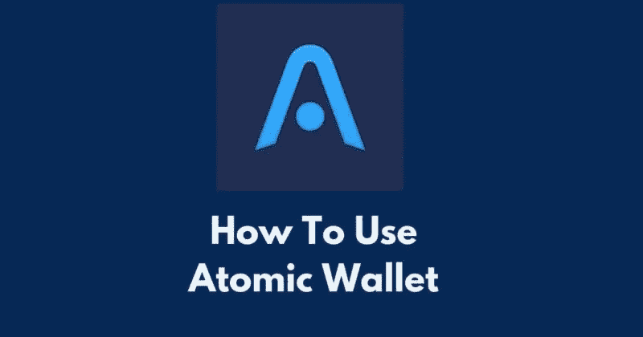

原子钱包是一个分散的多货币，非保管钱包。它支持 500 多种令牌，包括所有顶级区块链。这是第一款支持跨链技术(即原子交换)的钱包。

加密货币的发展导致了许多应用程序/接口的开发。此类应用程序致力于创建一个环境，致力于提供比传统交易系统更友好的用户平台。

加密钱包是这类应用的基础。这些是普通的应用程序，用户可以安装在他们的智能手机/电脑上，以存储、发送和接收他们的加密货币。

原子钱包就是这样一个应用。该平台为用户提供了一个安全的界面来管理、交换、入股和购买他们的加密资产。

> ***原子互换(atomic swap)是一种智能合约技术，允许用户在不使用任何交易所或集中中介的情况下，将一种加密货币与另一种加密货币进行交换。***

**支持的操作系统**

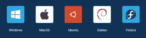

## **安装指南(Windows 平台)**

人们可以从[网站](https://atomicwallet.io/)和谷歌 Playstore(移动)下载原子钱包应用程序。

用户只需点击下载按钮，就可以轻松地从网站下载软件。

当你打开应用程序时，它会给你两个选项:

1.  创建新钱包
2.  从备份恢复

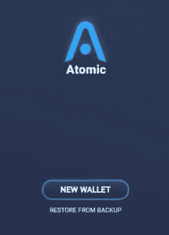

如果您是新用户，选择**选项 1** 。它会提示您设置密码。

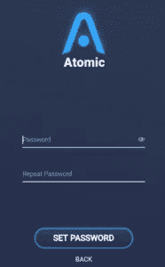

密码设置完成。

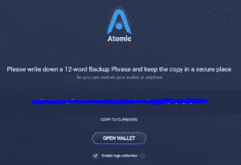

之后，它会给你一个 12 个字的短语码，需要安全保存。

钱包现在已成功**设置**。

***重要提示:*** *请注意，* ***从备份中恢复*** *选项将帮助您在丢失手机或获得新手机的情况下获取钱包资金。如果他们安全地保留了 12 个字的备份阶段，就可以很容易地取回他/她的所有数字资产。*

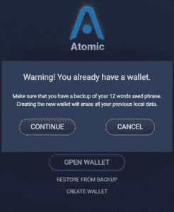

它会要求您提供 12 个字的独特备份阶段。

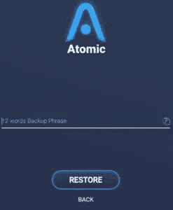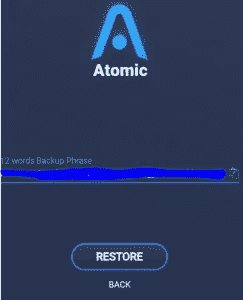

如果您提供正确的 12 个单词的备份短语，它将提示您输入密码。密码设置成功后，您就可以。

**重要:** *原子钱包使用加密技术在用户设备上本地存储私钥、备份短语和密码。12 个字的备份短语是唯一的，并且在用户创建钱包时随机生成。没有中间应用程序、平台或原子钱包团队存储您的信息。*

因此，如果您丢失了备份短语和电子设备，您将永远无法找回您的资产。此外，如果有人获得了你的备份短语，他们可以窃取你的资金。

*因此，总是建议离线存储备份短语。*

## **平台导航**

成功登录后，用户将被重定向到应用程序的登录页面。

登录页面包含平台支持的各种功能。

让我们逐一了解不同的功能:

*   **Wallet:**Wallet 包含用户持有的数字资产的详细信息(令牌名称、持有量、价值、当前市场价值和 24 小时亏损/盈利%)。

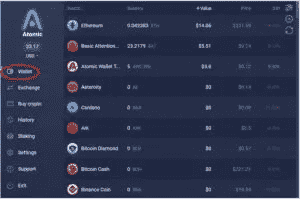

*   **兑换:**兑换窗格允许你将一枚硬币兑换成另一枚。

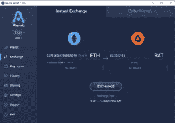

***注意:*** *桌面钱包有时会不显示下拉列表中的硬币列表，如上图截图所示。*

然后，我们尝试在手机钱包中验证同样的问题，发现它工作正常。见下文。

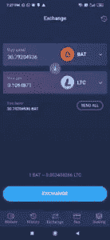

*   **购买密码:**你可以通过这个标签购买数字资产。原子钱包支持多种货币。你需要提到金额和货币类型，以及你想购买的代币。

*   **历史:**历史选项卡包含过去交易的详细信息。

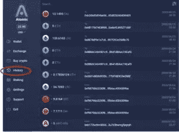

*   **赌注:**原子钱包允许用户零赌注下他们的密码。参与赌注的用户可以直接从验证者那里获得奖励。人们可以很容易地从不同的硬币赌注中看出大约每年的收益。

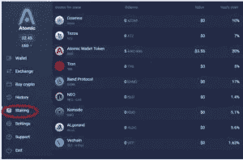

点击了解更多关于赌注[的详情。](https://atomicwallet.io/staking)

**设置:**设置选项卡允许您执行两个最重要的任务:

*   钱包密码更改。
*   私钥详细信息。

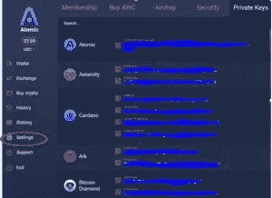

***重要:*** *如果你忘记了你的 12 字备份短语，你可以很容易地从这个选项中得到。见上面截图。*

**支持:**该选项卡包含有关他们各种支持论坛(电子邮件、聊天)的详细信息，包括他们的社交网站，如脸书、Twitter 等。

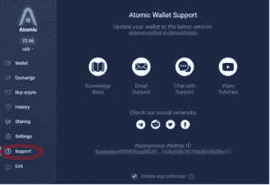

**特性**

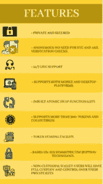

*   私密又安全。
*   匿名—无需 KYC 和反洗钱验证检查。
*   全天候实时支持。
*   支持移动和桌面平台。
*   内置原子交换功能。
*   支持超过 500+代币和收藏品。
*   代币赌注设施。
*   基于 AES 对称加密技术。
*   非保管钱包-用户将完全保管和控制他们的私人钥匙。

## **弊端**

*   没有在大型密码交易所上市。
*   循环供应量比总供应量少得多(不到 10%)。因此，当剩余的供应可以利用时，价格就有可能下降。
*   不支持硬件钱包。
*   信用卡购物的高额费用。

## **费用**

[Simplex](https://www.simplex.com/) 是一家原子钱包合作伙伴和持牌金融机构，支持所有加密货币购买，以确保在线无欺诈支付处理解决方案。他们还为用户提供用信用卡购买任何顶级加密货币的便利。他们接受美元、欧元和世界各地的当地货币。

该流程涉及 2 组费用:

*   原子钱包收取 2%的费用，每次操作最少 10 美元。
*   信用卡/借记卡银行手续费。由于涉及高风险操作，这个费用可以相当高(5%左右)。

***重要提示:用户需要支付网费才能包含您在区块链上的交易。这种网络费用像任何其他加密交易一样支付给矿工。***

点击了解更多有关交易费用[的详情。](https://support.atomicwallet.io/article/62-what-is-the-fee-to-buy-cryptocurrencies)

## **社交场合**

[网站](https://atomicwallet.io/)
[Youtube](https://www.youtube.com/channel/UCLMnUt6BBtA67eic1vRGF3g?sub_confirmation=1)
[媒体](https://medium.com/atomic-wallet)
[推特](https://twitter.com/atomicwallet)
[Reddit](https://reddit.com/r/atomicwallet)
[脸书](https://facebook.com/atomicwallet)
[电报](https://t.me/atomicwalletchat)

## **结论**

原子钱包是一个多重加密钱包，它向用户提供原子交换、信用卡购买和交易选项的功能。如果我们看一下他们的产品开发增长图表，就会发现他们一直在努力用最新的版本来迎合用户，这样就可以满足最终用户的期望，将他们的资产和数据安全作为主要的组成部分。

***注:*** *本帖首发* [*此处*](https://www.altcoinbuzz.io/bitcoin-and-crypto-guide/how-to-use-the-atomic-wallet/) *上*[***altcoinbuzz . io***](http://www.altcoinbuzz.io/)*。*

使用我的推荐加入

[Crypto.com](https://binance.com/en/register?ref=E8PCD3AF)——[币安](https://platinum.crypto.com/r/sut3pd9bzn)

跟我来

**👉** [推特](https://twitter.com/rumadas123)

**👉**[**Linkedin**](https://www.linkedin.com/in/ruma-das-a1439320/)

> **加入 [Coinmonks 电报小组](https://t.me/joinchat/uiLERCQL1fQ5ZjA1)并了解加密交易和投资**

## **另外，阅读**

*   **[什么是融资融券交易](https://blog.coincodecap.com/margin-trading) | [美元成本平均法](https://blog.coincodecap.com/dca)**
*   **最好的[密码交易机器人](/coinmonks/crypto-trading-bot-c2ffce8acb2a) | [网格交易机器人](https://blog.coincodecap.com/grid-trading)**
*   **[3 商业评论](/coinmonks/3commas-review-an-excellent-crypto-trading-bot-2020-1313a58bec92) | [Pionex 评论](/coinmonks/pionex-review-exchange-with-crypto-trading-bot-1e459d0191ea) | [Coinrule 评论](/coinmonks/coinrule-review-2021-a-beginner-friendly-crypto-trading-bot-daf0504848ba)**
*   **[AAX 交易所评论](/coinmonks/aax-exchange-review-2021-67c5ea09330c) | [德里比特评论](/coinmonks/deribit-review-options-fees-apis-and-testnet-2ca16c4bbdb2) | [FTX 交易所评论](/coinmonks/ftx-crypto-exchange-review-53664ac1198f)**
*   **[n rave ZERO Review](/coinmonks/ngrave-zero-review-c465cf8307fc)|[phe MEX Review](/coinmonks/phemex-review-4cfba0b49e28)|[PrimeXBT Review](/coinmonks/primexbt-review-88e0815be858)**
*   **[Bybit 交易所评论](/coinmonks/bybit-exchange-review-dbd570019b71) | [Bityard 评论](/coinmonks/bityard-review-7d104239be35) | [CoinSpot 评论](https://blog.coincodecap.com/coinspot-review)**
*   **[3 commas vs crypto hopper](/coinmonks/3commas-vs-pionex-vs-cryptohopper-best-crypto-bot-6a98d2baa203)|[赚取加密利息](/coinmonks/earn-crypto-interest-b10b810fdda3)**
*   **最好的比特币[硬件钱包](/coinmonks/the-best-cryptocurrency-hardware-wallets-of-2020-e28b1c124069?source=friends_link&sk=324dd9ff8556ab578d71e7ad7658ad7c) | [BitBox02 回顾](/coinmonks/bitbox02-review-your-swiss-bitcoin-hardware-wallet-c36c88fff29)**
*   **[莱杰 vs n rave](/coinmonks/ledger-vs-ngrave-zero-7e40f0c1d694)|[莱杰 nano s vs x](/coinmonks/ledger-nano-s-vs-x-battery-hardware-price-storage-59a6663fe3b0) | [币安评论](/coinmonks/binance-review-ee10d3bf3b6e)**
*   **[加密复制交易平台](/coinmonks/top-10-crypto-copy-trading-platforms-for-beginners-d0c37c7d698c) | [Coinmama 评论](/coinmonks/coinmama-review-ace5641bde6e)**
*   **[CoinLoan 评论](/coinmonks/coinloan-review-18128b9badc4) | [YouHodler 评论](/coinmonks/youhodler-4-easy-ways-to-make-money-98969b9689f2) | [BlockFi 评论](/coinmonks/blockfi-review-53096053c097)**
*   **最好的[加密税务软件](/coinmonks/best-crypto-tax-tool-for-my-money-72d4b430816b) | [硬币追踪评论](/coinmonks/cointracking-review-a-reliable-cryptocurrency-tax-software-5114e3eb5737)**
*   **最佳[加密借贷平台](/coinmonks/top-5-crypto-lending-platforms-in-2020-that-you-need-to-know-a1b675cec3fa) | [杠杆令牌](/coinmonks/leveraged-token-3f5257808b22)**
*   **[BlockFi vs Celsius](/coinmonks/blockfi-vs-celsius-vs-hodlnaut-8a1cc8c26630)|[Hodlnaut 点评](/coinmonks/hodlnaut-review-best-way-to-hodl-is-to-earn-interest-on-your-bitcoin-6658a8c19edf) | [KuCoin 点评](https://blog.coincodecap.com/kucoin-review)**
*   **[Bitsgap 评审](/coinmonks/bitsgap-review-a-crypto-trading-bot-that-makes-easy-money-a5d88a336df2) | [Quadency 评审](/coinmonks/quadency-review-a-crypto-trading-automation-platform-3068eaa374e1) | [Bitbns 评审](/coinmonks/bitbns-review-38256a07e161)**
*   **[埃利帕尔泰坦评论](/coinmonks/ellipal-titan-review-85e9071dd029) | [赛克斯斯通评论](/coinmonks/secux-stone-hardware-wallet-review-15-discount-coupon-2020-7577032faa6e)**
*   **[本地比特币评论](/coinmonks/localbitcoins-review-6cc001c6ed56) | [加密货币储蓄账户](https://blog.coincodecap.com/cryptocurrency-savings-accounts)**
*   **最佳[区块链分析](https://bitquery.io/blog/best-blockchain-analysis-tools-and-software)工具| [赚比特币](/coinmonks/earn-bitcoin-6e8bd3c592d9)**
*   **[加密套利](/coinmonks/crypto-arbitrage-guide-how-to-make-money-as-a-beginner-62bfe5c868f6)指南| [如何做空比特币](/coinmonks/how-to-short-bitcoin-568a2d0b4ae5)**
*   **最佳[加密制图工具](/coinmonks/what-are-the-best-charting-platforms-for-cryptocurrency-trading-85aade584d80) | [最佳加密交易所](/coinmonks/crypto-exchange-dd2f9d6f3769)**
*   **[如何在印度购买比特币？](/coinmonks/buy-bitcoin-in-india-feb50ddfef94) | [瓦济克斯审查](/coinmonks/wazirx-review-5c811b074f5b)**
*   **[印度比特币交易所](/coinmonks/bitcoin-exchange-in-india-7f1fe79715c9) | [比特币储蓄账户](/coinmonks/bitcoin-savings-account-e65b13f92451)**
*   **[CoinDCX 评论](/coinmonks/coindcx-review-8444db3621a2) | [加密保证金交易交易所](https://blog.coincodecap.com/crypto-margin-trading-exchanges)**