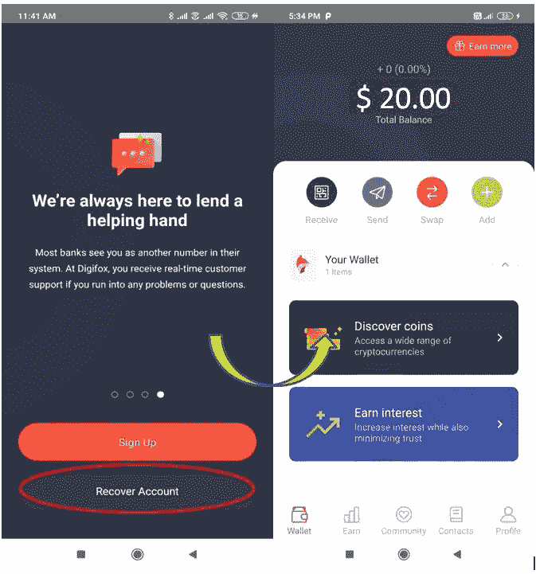

# 如何使用 Digifox 钱包

> 原文：<https://medium.com/coinmonks/how-to-use-the-digifox-wallet-ec8d3146eb8f?source=collection_archive---------5----------------------->

## Digifox 是一个全方位的金融平台。在本文中，我们将解释如何使用该平台支持的各种特性。

Digifox 是由著名的加密交易商和 YouTuber，Nicholas Merten，也就是 DataDash 发起的。该平台允许用户通过投资他们的加密货币来赚取利息。

Digifox 钱包是一款非托管智能合约钱包，兼具 CeFi 和 DeFi 元素的优点。该钱包适用于 iOS 和 Android 移动用户。

由 Kyber 支持的 Digifox 允许用户直接在应用程序中交换加密货币。该平台还计划激活“多因素认证”，这将为你的电话和电子邮件创建另一层安全保障。

**安装指南(安卓手机)**

用户可以从谷歌 Play 商店(Android)下载 Digifox 钱包移动应用程序。

安装后，将出现一个弹出窗口，让您执行与 wallet 安装相关的两个不同活动。

*   注册(创建钱包)
*   恢复帐户(导入钱包)

**打造钱包**

如果你是新用户，选择**注册**。

**它会要求您提供一些详细信息来设置您的个人资料，如用户名、电话号码、电子邮件 ID、钱包 pin 码等。它还通过发送您的电话号码和电子邮件 ID 中的 OTP 来验证您的详细信息。**

完成档案验证后，您将被引导至钱包登录页面。

**重要提示:**您不能在一个钱包应用程序中访问多个账户。用户在给定时间只能访问一个钱包中的一个帐户。

请注意，用户需要将钱包升级到 Pro 版本(一次性付费)，才能解锁该平台的全部优势。

**导入钱包**

我们已经提到，Digifox 不允许在一个应用程序中有多个钱包。因此，如果您需要导入一个钱包，您必须先从现有的钱包中注销。

**接收**

通过此选项，您可以共享您的公共地址和二维码来接收令牌。

**发送**

发送选项允许您向另一个帐户发送令牌。您只需在搜索栏中输入收件人的钱包地址或用户名。也可以使用右上角的二维码扫描仪，用手机扫描收件人的二维码，获取地址。

**互换**

顾名思义，你可以在这里兑换代币**。**你也可以通过借记卡或银行账户存钱来购买硬币。您也可以从您的其他钱包/兑换处发送代币。

**增加**

此选项允许您将资金存入 Digifox。您可以通过借记卡、银行账户或其他钱包存款。

如果用户选择通过银行或借记卡存款，他们需要进行 KYC 检查。KYC 和入职手续由 MoonPay 和 Transak 等第三方提供商提供支持。

用户从银行账户或通过卡存入 Digifox 平台的钱将以 USDC 的形式存入，这是一种与美元挂钩的加密货币。

**赚取**

Digifox 钱包允许您通过投资您的密码来赚取利息。

该平台允许您通过以下方式进行投资:

**摄氏度**

*   集中保管
*   提供高利率
*   支持 11 个市场

但是在投资 Celsius 之前，你需要通过提供你的 KYC 文件来申请。钱包应用程序将验证您的详细信息，通过验证后，您将能够存入资金。

Celsius 支持以下市场:

正如我们所见，Celsius 在不同的硬币上提供了一些高利率。你可以存款并从投资中获利。

**大院**

*   分散监护
*   提供低利率
*   支持 10 个市场

用户既不需要注册，也不需要 KYC 过程来开始赚取复合利息。

**社区**

“社区”选项卡显示当前的挑战和推荐优势。

用户分为不同的级别:

*   白银状态
*   黄金状态
*   白金地位

您可以通过 Twitter、电子邮件等分享您的邀请链接。根据级别的不同，用户获得上述福利的百分比也不同。

**联系人**

通过此选项，您可以添加联系信息，或者通过提供钱包 ID、用户名或扫描二维码来搜索联系人。

**简介**

此选项卡包含各种与配置文件相关的设置。您可以在这里看到您注册的电子邮件 ID 和用户名。它还允许您管理钱包安全性，即您可以在此处更改钱包 PIN 并启用 TouchID。

**社交场合**

[**推特**](https://twitter.com/digifox_finance)

[**YouTube**](https://www.youtube.com/channel/UCFTiA4ydFQPqu3hc3HhWflA)

[**脸书**](https://www.facebook.com/digifox.finance/)

**结论**

Digifox 通过创建一个一体化的金融应用程序来满足每个普通用户的当前需求。它允许用户投资各种加密货币并赚取利息，与传统银行利率相比，利息相当高。此外，为了确保高安全性，第三方专业人员会定期对平台进行代码审核。但是，该应用程序对钱包创建收费(考虑到汽油费)。app 也比较慢。总的来说，这款应用潜力巨大，但仍有一段路要走。

**资源:** Digifox 官方[网站](https://www.digifox.finance/post/i-downloaded-digifox-now-what)

***注:*** *本帖首发* [*此处*](https://www.altcoinbuzz.io/bitcoin-and-crypto-guide/how-to-use-the-digifox-wallet/) *上*[***altcoinbuzz . io***](http://www.altcoinbuzz.io/)*。*

**通过我的推荐加入**

[Crypto.com](https://binance.com/en/register?ref=E8PCD3AF)——[币安](https://platinum.crypto.com/r/sut3pd9bzn)

跟我来吧

**👉** [推特](https://twitter.com/rumadas123)

**👉**[**Linkedin**](https://www.linkedin.com/in/ruma-das-a1439320/)

*   ****附属链接包括****

> **加入 [Coinmonks 电报频道](https://t.me/coincodecap)，了解加密交易和投资**

## **也阅读**

** [## 最佳加密交易所| 2021 年十大加密货币交易所

### 加密货币交易所的加密交易需要了解市场，这可以帮助你获得利润…

blog.coincodecap.com](https://blog.coincodecap.com/crypto-exchange)  [## 2021 年 9 大最佳加密借贷平台

### 当谈到加密货币贷款时，大量因素等同于良好的收入状况。此外，借款的一部分…

blog.coincodecap.com](https://blog.coincodecap.com/crypto-lending)  [## 2021 年最佳加密交易机器人(免费和付费)

### 2021 年币安、比特币基地、库币和其他密码交易所的最佳密码交易机器人。四进制，位间隙…

medium.com](/coinmonks/crypto-trading-bot-c2ffce8acb2a)  [## 最佳 4 个加密交易信号电报通道

### 这是乏味的找到正确的加密交易信号提供商。因此，在本文中，我们将讨论最好的…

medium.com](/coinmonks/best-crypto-signals-telegram-5785cdbc4b2b)  [## BlockFi 评论 2021:利弊和利率

### 今天，我们提出了一个全面的 BlockFi 评论，这是一个成立于 2017 年的加密贷款平台，拥有其…

blog.coincodecap.com](https://blog.coincodecap.com/blockfi-review)  [## 如何在印度购买比特币？2021 年购买比特币的 7 款最佳应用[手机版]

### 如何使用移动应用程序购买比特币印度

medium.com](/coinmonks/buy-bitcoin-in-india-feb50ddfef94)  [## 加密税务软件——五大最佳比特币税务计算器[2021]

### 不管你是刚接触加密还是已经在这个领域呆了一段时间，你都需要交税。

medium.com](/coinmonks/best-crypto-tax-tool-for-my-money-72d4b430816b)  [## Pionex 评论 2021 |免费加密交易机器人和交换

### Pionex 是为交易自动化提供工具的后起之秀。Pionex 上提供了 9 个加密交易机器人…

medium.com](/coinmonks/pionex-review-exchange-with-crypto-trading-bot-1e459d0191ea)  [## 存储比特币的最佳加密硬件钱包[2021]

### 保管您的数字资产很容易，但找到正确的存储方式却是一项繁琐的任务。在线钱包有一个风险…

blog.coincodecap.com](https://blog.coincodecap.com/best-hardware-wallet-bitcoin)**