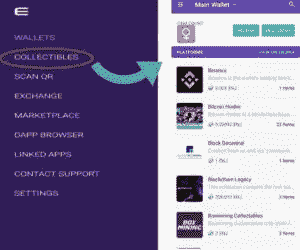
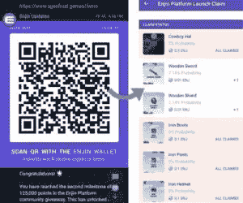
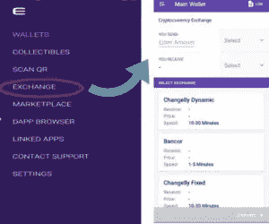
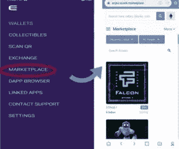
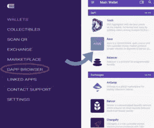
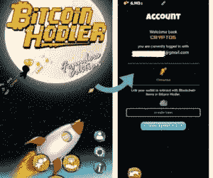
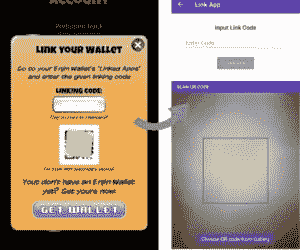
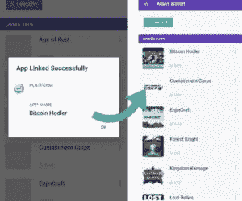
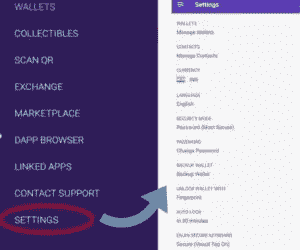

# 如何使用金恩钱包——第二部分

> 原文：<https://medium.com/coinmonks/how-to-use-the-enjin-wallet-part-2-6327d8066e4c?source=collection_archive---------4----------------------->

金恩钱包是一款面向加密货币用户的多币种移动钱包。它向其钱包用户提供各种有吸引力的特征和服务。在本文中，我们将解释收藏品、扫描 QR、交换、市场、dApp 浏览器、链接应用程序和设置等功能。

在我们关于金恩钱包的[上一篇文章(第一部分)](https://ruma-das.medium.com/how-to-use-the-enjin-wallet-part-i-fc728681a5e3)中，我们已经解释了如何创建、导入和查看钱包。在本文中，我们将重点关注该平台为其用户提供的不同特性。

## **收藏品**

金恩有自己的 ERC-1155 数字令牌标准，您可以使用它来创建以下内容:

*   可替代(货币)资产
*   不可替代(NFT)(数字卡、宠物和游戏内资产)资产

使用金恩钱包，你可以发送，接收，或融化这些非功能性交易。

该钱包还支持向其他用户多次发送这些收藏品的选项。

## **扫描 QR**

此选项允许您扫描任何二维码来领取免费收藏品。使用此功能，您可以立即接收 ERC-20 空投，替代硬币，或有价值的 ERC-721 和 ERC-1155 数字资产。

这款钱包还支持一项名为金恩光束的功能，这是一项由 QR 码驱动的区块链资产分配服务。通过**扫描 QR** 功能，您可以申领金恩钱包上的赠品。你可以很容易地在各种网站、游戏和促销活动中获得这些赠品。

## **交换**

此功能允许您将一个令牌换成另一个令牌。用户需要填写令牌对并输入令牌值。您将收到的金额和交易详情将自动计算并显示给您。

但是，交换设施由第三方平台(金恩合作伙伴)支持，如 Changelly Dynamic、Bancor、Kyber Network 等。每个平台都有不同的交换速度和交换费用。

## **市场**

用户可以从金恩钱包直接访问金恩市场。金恩市场是一个允许用户交易数字收藏品(ERC-1155 代币)的平台。用户可以浏览和购买所有可用的 NFT，并可以直接从钱包中支付。

## **dApp 浏览器**

该选项允许您与平台支持的不同的分散式应用程序进行交互。如果你浏览 dApp 浏览器，你可以很容易地看到大量的应用程序，它们被分为五个不同的主要部分:

*   挑战
*   交换
*   游戏和收藏品
*   市场
*   其他人

## **关联应用**

此选项允许您将任何游戏或应用程序链接到金恩钱包。

现在假设你要链接一个类似 [**比特币霍德勒**](https://www.bitcoin-hodler.info/) **的游戏。**你首先从谷歌 Play 商店下载游戏。要将游戏链接到您的金恩钱包，请获取链接代码或二维码。需要将此代码嵌入到钱包中，以便通过您的金恩钱包访问游戏。

## **设置**

**设置**选项卡允许您进行各种设置和管理相关的工作，如密码更改、管理钱包和联系人、钱包备份、语言偏好、安全模式等。

## **结论**

金恩钱包是一个功能齐全的钱包。它最重要的优势是集成 ERC 1155 令牌的能力。用户可以在多个游戏中使用相同的代币。令牌是唯一的。钱包使直接 NFT 销售成为可能。我们相信钱包是超前的。此外，与 ERC 721 代币相比，ERC 1155 代币具有巨大的优势。然而，有一个重要的问题需要解决。金恩是建立在以太坊上的，速度如此之慢，金恩很难集成需要即时令牌链接的游戏。为了解决这一问题，金恩推出了其扩展解决方案 Efinity。一旦 Efinity 推出，金恩钱包的全部功能将真正解锁。

**资源:** [金恩白皮书](https://cdn.enjin.io/downloads/whitepapers/enjin-coin/en.pdf)

**阅读更多:** [如何使用信托钱包——第二部分](/coinmonks/how-to-use-trust-wallet-part-ii-68fde550c69)

***注:*** *本帖首发* [*此处*](https://www.altcoinbuzz.io/bitcoin-and-crypto-guide/how-to-use-the-enjin-wallet-part-2/) *上*[***altcoinbuzz . io***](http://www.altcoinbuzz.io/)*。*

**通过我的推荐加入**

Crypto.com——[T42](https://platinum.crypto.com/r/sut3pd9bzn)

跟我来

**👉** [推特](https://twitter.com/rumadas123)

**👉**[**Linkedin**](https://www.linkedin.com/in/ruma-das-a1439320/)

*   **[莱杰 vs Ngrave](/coinmonks/ledger-vs-ngrave-zero-7e40f0c1d694) | [莱杰 nano s vs x](/coinmonks/ledger-nano-s-vs-x-battery-hardware-price-storage-59a6663fe3b0) | [币安评论](/coinmonks/binance-review-ee10d3bf3b6e)**
*   **[Bybit Exchange 审查](/coinmonks/bybit-exchange-review-dbd570019b71) | [Bityard 审查](/coinmonks/bityard-review-7d104239be35) | [CoinSpot 审查](https://blog.coincodecap.com/coinspot-review)**